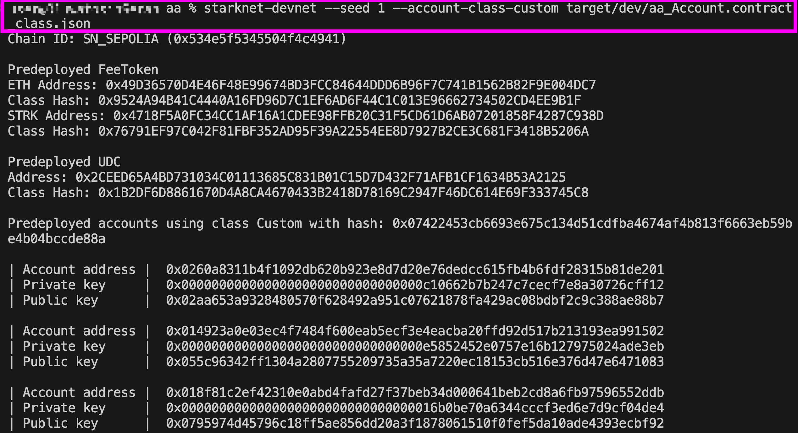
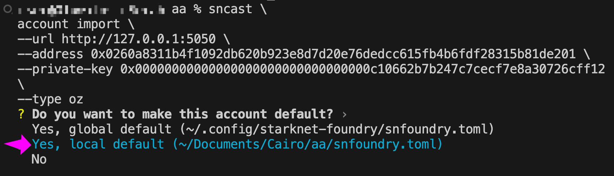
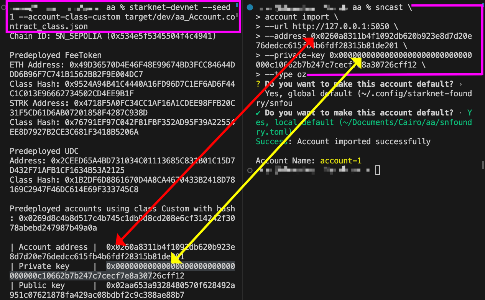
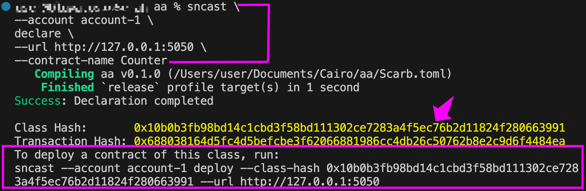
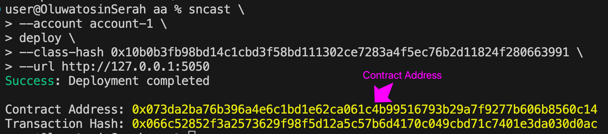
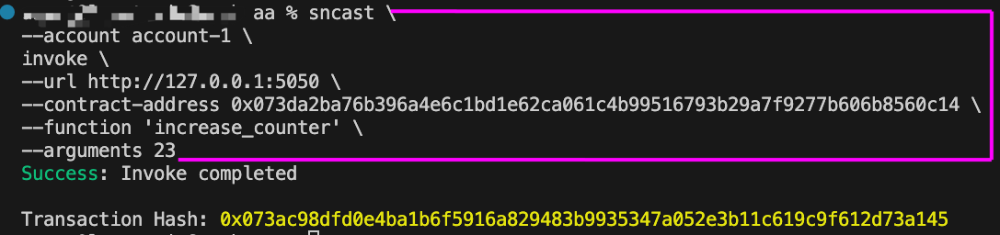
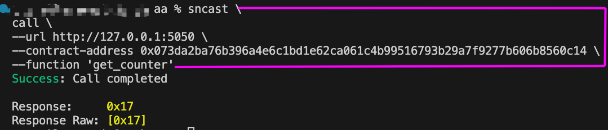

# Account Abstraction

On Ethereum, accounts are Externally Owned Accounts (EOAs) by default. Each account is controlled by a private key, and if it's compromised, there's no way to limit the damage or revoke access. If the key is lost, the account is gone forever.

EOAs are also rigid in how they operate. There's no native support for bundling multiple operations into a single transaction. Users must hold the native gas token to pay for fees regardless of what token they are actually using. And there's no built-in way to add rules like multi-party approval, key recovery, and so on.

Starknet has no EOAs. Every account is a smart contract, known as an account contract.

Making every account a smart contract is Account Abstraction (AA), and it solves the limitations above by making account logic programmable.

In this article, we will learn what Account Abstraction is, how Starknet's approach compares to Ethereum's, what features it enables, and how an account contract is constructed on Starknet.

## What is Account Abstraction?

Account Abstraction (AA) is a blockchain design pattern that makes accounts programmable. Instead of the protocol dictating how transactions are validated and executed, the account itself defines that logic. On Starknet, this means all transactions must pass through an account contract for validation before execution.

Because the account logic is programmable, features like recovery options, transaction batching, gas payment in any token, and fine-grained permissions all become possible.

Account Abstraction is considered native when the programmable account is implemented directly at the protocol level. Alternatively, it can be layered on top of existing protocols, but such implementations do not offer all the benefits of native Account Abstraction. Starknet takes the native approach, built into the protocol from the ground up.

### How Account Abstraction differs from EOAs

With EOAs, **the private key (signer) and the account are tightly coupled**. The account address is derived from the private key, and that same key is the only way to sign transactions. The private key is the account.

With Account Abstraction, **the signer and the account contract are decoupled**. This separation is what makes the account programmable: because the account is no longer tied to the private key, the logic for who can authorize transactions and how they are executed can be customized. On Starknet, this works as follows:

- The signer is the private key, held by the wallet software on the user's device, used to sign transactions when the user approves them.
- The account contract is a smart contract deployed onchain that holds the user's assets and defines the logic for validating and executing transactions.

When a user initiates an action, the wallet uses the private key to sign the transaction details off-chain and produces a signature which proves the user authorized the transaction. The transaction along with this signature is then sent to the sequencer (the node that orders transactions and builds blocks on Starknet), which forwards it to the user's account contract. The account contract verifies the signature against the transaction details and, if valid, executes the transaction.

Because the validation logic lives inside the account contract and not at the protocol level, the account owner is free to define what "valid" means. The account contract could require a single key signature, multiple keys signatures, or any custom verification logic the developer chooses to implement.

## Ethereum also has Account Abstraction

Account Abstraction isn’t new. As early as 2017, Vitalik Buterin proposed [light account contracts](https://eips.ethereum.org/EIPS/eip-86), that accounts could be contracts with their own validation logic instead of relying solely on protocol-level signature checks.

Since then, it has gained traction in the Ethereum ecosystem. The most mature implementation today is [EIP-4337](https://eips.ethereum.org/EIPS/eip-4337), which introduces smart contract wallets without requiring changes to the Ethereum protocol itself. EIP-4337 is deployed on mainnet, with several production-ready implementations.

More recently, [EIP-7702](https://eips.ethereum.org/EIPS/eip-7702), introduced as part of the Pectra upgrade, brought Account Abstraction closer to the protocol level. It allows EOAs to point to an already deployed smart contract, giving them smart account capabilities like transaction batching and gas abstraction without needing to migrate to a new address. This process, known as delegation, is optional and persists until the user removes it by delegating to the zero address.

## What happens when you create a Starknet account

Whenever you create a new account with your wallet software, a new account contract is deployed by the wallet. As we covered in the "Understanding Starknet’s Contract Deployment Model" chapter, multiple contract instances can be created from the same class, sharing the same code but each with its own address and storage. Wallet providers declare their account class once on Starknet, and every new wallet created is simply a new instance of that class.

The account contract's constructor is initialized with parameters such as the user’s public key, and the resulting account address is deterministic: it is derived from several inputs including the class hash, a salt, the deployer address, and the constructor calldata.

Recall that the account can receive assets even before deployment because its address is deterministic, but it cannot execute any transactions until the account contract is deployed.

Once deployed, the account contract is bound to its logic, and switching to a different account contract means creating a new account entirely.

### Switching between account contracts

In theory, anyone is free to implement their own account contract. At the protocol level, the requirements are to:

- Implement `__validate__` and `__execute__`, the entrypoints the protocol calls during the transaction lifecycle
- Implement `__validate_declare__` or `__validate_deploy__`, depending on intended capabilities
- Follow the [SNIP-6 standard](https://github.com/starknet-io/SNIPs/blob/main/SNIPS/snip-6.md), which adds the `is_valid_signature` function for interoperability with dApps and off-chain signature verification

We will explain each of these functions in the next section.

However, in practice, it is difficult to use a custom account contract implementation. Even if you follow the standard and everything works technically, you still have to use the account contract through some wallet software.

Since anyone is free to add functionality on top of the minimum Account Abstraction requirements, most popular wallets (such as Ready) have their own account contract implementations. These are not interchangeable. This makes it difficult to switch between them or to use your own implementation.

## Anatomy of an account contract

Let's look at a very minimal account contract implementation. It is deliberately simplified and **highly insecure,** it approves all transactions and signatures without any checks. The goal is to illustrate the minimal structure required for a Starknet account contract, and it is provided **for demonstration purposes only, not for production use**.

Create a new Scarb project and navigate into it:

```bash
scarb new aa
cd aa
```

First, we import the `Call` struct into `src/lib.cairo`. This struct represents a single operation in a transaction. Each `Call` contains a target contract address, a function selector, and the calldata to pass. Our account contract will use it to know which contract to call and with what data.

```rust
use starknet::account::Call;
```

Next, we define the SNIP-6 interface (ISRC6) that every account contract is expected to implement. It has three functions:

- `__validate__` for transaction validation,
- `__execute__` for transaction execution, and
- `is_valid_signature` for off-chain signature verification:

```rust
use starknet::account::Call;

//////NEWLY ADDED///////
#[starknet::interface]
trait ISRC6<T> {
    fn __validate__(self: @T, calls: Array<Call>) -> felt252;
    fn __execute__(ref self: T, calls: Array<Call>) -> Array<Span<felt252>>;
    fn is_valid_signature(self: @T, hash: felt252, signature: Array<felt252>) -> felt252;
}
```

Now let’s define the account contract itself. The `#[starknet::contract(account)]` attribute tells the compiler this is an account contract, which enables the protocol to call its `__validate__` and `__execute__` entrypoints during transaction processing. Without this attribute, the contract would be treated as a regular smart contract and could not be used as an account. We also import `call_contract_syscall` which we'll use in `__execute__` to make calls to other contracts, and `SyscallResultTrait` to handle the result of those calls:

```rust
use starknet::account::Call;

#[starknet::interface]
trait ISRC6<T> {
    fn __validate__(self: @T, calls: Array<Call>) -> felt252;
    fn __execute__(ref self: T, calls: Array<Call>) -> Array<Span<felt252>>;
    fn is_valid_signature(self: @T, hash: felt252, signature: Array<felt252>) -> felt252;
}

//////NEWLY ADDED///////
#[starknet::contract(account)]
mod Account {
    use starknet::SyscallResultTrait;
    use starknet::syscalls::call_contract_syscall;
    use super::Call;

    #[storage]
    struct Storage {}
}
```

Now let's implement each function.

#### The `__validate__` function

The protocol calls this function before a transaction is executed. In a production account contract, this is where the transaction's signature is verified to confirm the caller is authorized. In our implementation, it simply returns `'VALID'` for every transaction without any checks:

```rust
#[abi(embed_v0)]
impl AccountImpl of super::ISRC6<ContractState> {
    fn __validate__(self: @ContractState, calls: Array<Call>) -> felt252 {
        'VALID'
    }
}
```

#### The `__execute__` function

The protocol calls this function after `__validate__` passes. It receives an array of calls and executes them sequentially, in the order they appear, using `call_contract_syscall`. This is what enables multicall, the ability to execute multiple operations in a single transaction:

```rust
fn __execute__(ref self: ContractState, calls: Array<Call>) -> Array<Span<felt252>> {
    let mut results = ArrayTrait::new();
    for call in calls {
        let result = call_contract_syscall(call.to, call.selector, call.calldata)
            .unwrap_syscall();
         results.append(result);
    }
    results
}
```

#### The `is_valid_signature` function

This function is not called by the protocol. It exists for off-chain signature verification and allows dApps to confirm that a signature belongs to this account. Here it returns `'VALID'` without checking anything:

```rust
fn is_valid_signature(
    self: @ContractState, hash: felt252, signature: Array<felt252>,
) -> felt252 {
     'VALID'
}
```

**This example contract skips all validation and should never be used in production**. Production account contracts must implement proper validation and signature checks to protect user assets and access.

Here’s the complete Account contract code:

```rust
use starknet::account::Call;

#[starknet::interface]
trait ISRC6<T> {
    fn __validate__(self: @T, calls: Array<Call>) -> felt252;
    fn __execute__(ref self: T, calls: Array<Call>) -> Array<Span<felt252>>;
    fn is_valid_signature(self: @T, hash: felt252, signature: Array<felt252>) -> felt252;
}

#[starknet::contract(account)]
mod Account {
    use starknet::SyscallResultTrait;
    use starknet::syscalls::call_contract_syscall;
    use super::Call;

    #[storage]
    struct Storage {}

    #[abi(embed_v0)]
    impl AccountImpl of super::ISRC6<ContractState> {
        fn __validate__(self: @ContractState, calls: Array<Call>) -> felt252 {
            'VALID'
        }

        fn __execute__(ref self: ContractState, calls: Array<Call>) -> Array<Span<felt252>> {
            let mut results = ArrayTrait::new();
            for call in calls {
                let result = call_contract_syscall(call.to, call.selector, call.calldata)
                    .unwrap_syscall();
                results.append(result);
            }
            results
        }

        fn is_valid_signature(
            self: @ContractState, hash: felt252, signature: Array<felt252>,
        ) -> felt252 {
            'VALID'
        }
    }
}
```

Let's use the Account contract in a local devnet to see how it interacts with other contracts. Later, in the "_How the account contract is called_" section, we'll explain what the protocol does behind the scenes during each transaction.

## Deploying and interacting with our account contract

A minimal account contract is capable of invoking transactions targeting other contracts. However, it’s not capable of declaring and deploying other contracts. Since this tutorial flow involves declaring and deploying a seperate contract, we need to add two more validation functions:

- `__validate_declare__`: called by the protocol when the user wants to declare a new contract class.
- `__validate_deploy__`: called by the protocol during a `DEPLOY_ACCOUNT` transaction, when a new account contract is being deployed for the first time.

Just as `__validate__` validates invoke transactions before execution, `__validate_declare__` does the same for declare transactions and `__validate_deploy__` for account deployment transactions.

Add these two functions to the interface:

```rust
fn __validate_declare__(self: @T, class_hash: felt252) -> felt252;
fn __validate_deploy__(
    self: @T, class_hash: felt252, contract_address_salt: felt252, public_key: felt252,
) -> felt252;
```

Also add their implementations in the contract:

```rust
fn __validate_declare__(self: @ContractState, class_hash: felt252) -> felt252 {
    return 'VALID';
}

fn __validate_deploy__(
    self: @ContractState,
    class_hash: felt252,
    contract_address_salt: felt252,
    public_key: felt252,
) -> felt252 {
    return 'VALID';
}
```

With Starknet's native Account Abstraction, different wallet providers can customize their validation functions while maintaining compatibility. For example, Ready's account contract defines `__validate_deploy__` with custom parameters:

```rust
// Ready's customized validation function
__validate_deploy__(
    class_hash: felt252,
    contract_address_salt: felt252,
    owner: Signer,            // uses Signer type
    guardian: Option<Signer>  // adds guardian support
) -> felt252
```

Notice that Ready's version takes `owner: Signer` and `guardian: Option<Signer>` instead of the standard `public_key: felt252` parameter. This customization allows Ready to:

- Use their custom `Signer` type instead of a simple public key, which can represent different signature schemes
- Add guardian functionality for social recovery. A guardian is a trusted party (such as another wallet, a friend, or the wallet provider itself) that can help recover access to the account if the primary signer is lost.

Despite these different parameters, Ready's `__validate_deploy__` still calls the same underlying validation logic that checks signatures and ensures the deployment is authorized. The custom parameters just allow Ready to pass additional information (like guardian keys) through their validation process.

This flexibility to customize validation parameters while following the validation interface that Starknet expects is one of the benefits Account Abstraction enables. It allows wallet providers to add features like multi-signature support, session keys, or social recovery without deviating from the protocol.

Here’s the complete Account contract code with `__validate_declare__` and `__validate_deploy__` added:

```rust
use starknet::account::Call;

#[starknet::interface]
trait ISRC6<T> {
    fn __validate__(self: @T, calls: Array<Call>) -> felt252;
    fn __execute__(ref self: T, calls: Array<Call>) -> Array<Span<felt252>>;
    fn is_valid_signature(self: @T, hash: felt252, signature: Array<felt252>) -> felt252;
    fn __validate_declare__(self: @T, class_hash: felt252) -> felt252;
    fn __validate_deploy__(
        self: @T, class_hash: felt252, contract_address_salt: felt252, public_key: felt252,
    ) -> felt252;
}

#[starknet::contract(account)]
mod Account {
    use starknet::SyscallResultTrait;
    use starknet::syscalls::call_contract_syscall;
    use super::Call;

    #[storage]
    struct Storage {}

    #[abi(embed_v0)]
    impl AccountImpl of super::ISRC6<ContractState> {
        fn __validate__(self: @ContractState, calls: Array<Call>) -> felt252 {
            'VALID'
        }

        fn __execute__(ref self: ContractState, calls: Array<Call>) -> Array<Span<felt252>> {
            let mut results = ArrayTrait::new();
            for call in calls {
                let result = call_contract_syscall(call.to, call.selector, call.calldata)
                    .unwrap_syscall();
                results.append(result);
            }
            results
        }

        fn is_valid_signature(
            self: @ContractState, hash: felt252, signature: Array<felt252>,
        ) -> felt252 {
            'VALID'
        }

        fn __validate_declare__(self: @ContractState, class_hash: felt252) -> felt252 {
            return 'VALID';
        }

        fn __validate_deploy__(
            self: @ContractState,
            class_hash: felt252,
            contract_address_salt: felt252,
            public_key: felt252,
        ) -> felt252 {
            return 'VALID';
        }
    }
}
```

Replace the contents of `src/lib.cairo` with the Account contract above.

### Add a contract to interact with

Since we want to demonstrate how an account contract is used, we need to have some other contract to interact with. Let’s add a simple `Counter` contract to the same `src/lib.cairo` file:

```rust
#[starknet::interface]
pub trait ICounter<TContractState> {
    fn increase_counter(ref self: TContractState, amount: felt252);
    fn get_counter(self: @TContractState) -> felt252;
}

#[starknet::contract]
mod Counter {
    use starknet::storage::{StoragePointerReadAccess, StoragePointerWriteAccess};

    #[storage]
    struct Storage {
        counter: felt252,
    }

    #[abi(embed_v0)]
    impl CounterImpl of super::ICounter<ContractState> {
        fn increase_counter(ref self: ContractState, amount: felt252) {
            self.counter.write(self.counter.read() + amount);
        }

        fn get_counter(self: @ContractState) -> felt252 {
            self.counter.read()
        }
    }
}
```

Run `scarb build` to compile the contracts.

### Start a devnet with our account contract

If you installed your Starknet development tools using `starkup`, `starknet-devnet` is already installed. You can verify by running:

```bash
starknet-devnet --version
```

At the time of writing, the expected version is `0.7.2`. If you don't have it installed, first add the plugin, then install:

```bash
asdf plugin add starknet-devnet
asdf install starknet-devnet 0.7.2
asdf set starknet-devnet 0.7.2
```

Now let's start the devnet. By default, `starknet-devnet` predeploys a set of funded accounts using a standard account contract. We want them to use our account contract instead, so we pass it as a flag:

```bash
starknet-devnet --seed 1 --account-class-custom target/dev/aa_Account.contract_class.json
```

- The `--seed` parameter ensures the same predeployed accounts (addresses and keys) are generated every time the devnet restarts, so you don't have to re-import them after each restart.
- The `--account-class-custom` flag tells devnet to use our compiled account contract for the predeployed accounts. The filename combines your Scarb project name (`aa`) and the contract name (`Account`).



### Import an account to send transactions

The devnet has now predeployed accounts using our account contract, but `sncast` on our local machine doesn't know about them yet. We need to import one so `sncast` can use it to send transactions. Open a new terminal (since the current one is running the devnet), then copy the address and private key of the first account that the devnet lists and use them in the import command:

```bash
sncast \
    account import \
    --url http://127.0.0.1:5050 \
    --address <PREDEPLOYED_ACCOUNT_ADDRESS> \
    --private-key <PREDEPLOYED_PRIVATE_KEY> \
    --type oz
```

- The `--url` flag points to the local devnet RPC endpoint.
- Since our account contract does not verify signatures, the private key value doesn't matter here. However, `sncast` requires it as a mandatory field because most account contracts rely on signatures for authorization.
- The `—-type` flag tells `sncast` how to format transactions for the account. The available options are `ready`, `braavos`, or `oz` (OpenZeppelin). Since our custom account doesn't match any specific wallet provider, we use `oz` as the closest generic option.

After running the command, `sncast` will ask if you want to make this account the default. Choose the local default option so the account is scoped to this project only.



The image below shows how the devnet output (left) maps to the import command (right). The yellow line connects the account address, and the red line connects the private key from the devnet's predeployed account to the corresponding fields in the `sncast account import` command.



> Note the account name from the import output and use it in place of `<ACCOUNT_NAME>` in the commands that follow.

If you need to re-import the account with different details or clean up after testing, you can remove it with:

```bash
sncast \
account delete \
--url [http://127.0.0.1:5050](http://127.0.0.1:5050/) \
--name <ACCOUNT_NAME>
```

### Declare and deploy the Counter contract

Now that we have an imported account contract, let’s use that to declare and deploy our `Counter` contract.

Declare the contract:

```bash
sncast \
		--account <ACCOUNT_NAME> \
    declare \
    --url http://127.0.0.1:5050 \
    --contract-name Counter
```



Note the resulting class hash and replace it in the following command to deploy the contract:

```bash
sncast \
		--account <ACCOUNT_NAME> \
		deploy \
		--class-hash <CLASS_HASH> \
		--url http://127.0.0.1:5050
```



Note the resulting contract address.

### Interact with the Counter contract

We are now ready to interact with the Counter contract. Remember that the predeployed account we imported is stored locally under the `<ACCOUNT_NAME>` we specified during the import step.

Run the following command to increase the counter. Replace `<CONTRACT_ADDRESS>` with the contract address from the deploy output:

```bash
sncast \
--account <ACCOUNT_NAME> \
invoke \
--url http://127.0.0.1:5050 \
--contract-address <CONTRACT_ADDRESS> \
--function 'increase_counter' \
--arguments 23
```



We can now query to see the new counter value. It should return `23` (encoded in hexadecimal):

```bash
sncast \
    call \
    --url http://127.0.0.1:5050 \
    --contract-address <CONTRACT_ADDRESS> \
    --function 'get_counter'
```



## How the Account (AA) contract is called

In the example flow above, we:

1. Started a devnet with our account contract as the predeployed account implementation.
2. Imported one of the predeployed accounts so `sncast` could use it locally.
3. Declared a new contract in the devnet: `Counter` .
4. Deployed the `Counter` contract.
5. Invoked `increase_counter` on the Counter contract.
6. Called `get_counter` to read the counter value

Behind the scenes, during steps 3-6, the protocol called our account contract's validation and execution functions at each step:

- **Step 3 - Declaring the Counter contract:** This is a `DECLARE` transaction. The sequencer called `__validate_declare__` on our account contract. Since it returned `'VALID'`, the sequencer registered the `Counter` class on the network.
- **Step 4 - Deploying the Counter contract:** This is not a `DEPLOY_ACCOUNT` transaction because the `Counter` is a regular contract, not an account. It goes through as an `INVOKE` transaction via the Universal Deployer Contract. The sequencer called `__validate__` on our account contract, and after validation passed, called `__execute__` to process the deployment.
- **Step 5 - Invoking `increase_counter`:** This is an `INVOKE` transaction. The sequencer called `__validate__` on our account contract, and after validation passed, called `__execute__` which forwarded the call to the `Counter` contract.
- **Step 6 - Calling `get_counter`:** This is a read-only call. No transaction is submitted, no gas is paid, and our account contract is not involved at all.

> Note that `__validate_deploy__` was never triggered in our flow. This function is only called during a `DEPLOY_ACCOUNT` transaction, which is used when deploying an account contract from scratch (counterfactual deployment). Since the devnet predeployed the accounts for us, there was no `DEPLOY_ACCOUNT` transaction. It would only be called if we created and deployed a new account.

To see validation in action, try changing the return value of `__validate_declare__` in the Account contract from `'VALID'` to `'INVALID'`. Rebuild the contract, restart the devnet with the updated contract using:

```bash
starknet-devnet --seed 1 --account-class-custom target/dev/aa_Account.contract_class.json
```

Then import the first predeployed account as we did earlier, and try declaring the `Counter` contract again. You'll see the transaction fail with an error like:

```bash
Error: Transaction execution error: The `validate` entry point should return
`VALID`. Got Retdata([0x494e56414c4944]).
```

This confirms that the protocol checks the return value of the validation functions and rejects any transaction that doesn't return `'VALID'`.

## Recovering an account

Because EOA addresses are derived directly from the private key, as we discussed earlier, recovering an account from the private key alone is straightforward. However, if the key is lost, there is no recovery option.
On Starknet, since the signer and the account are decoupled, restoring access requires both the private key and the account address, since one cannot be derived from the other. This is why importing an account on wallets like Ready requires both. However, because the account is a smart contract, developers or wallet providers can implement alternative recovery mechanisms. Ready, for example, uses the guardian system we discussed earlier to help users regain access to their account if the primary signer is lost.

## Features enabled by Account Abstraction

Account Abstraction introduces features that are difficult or impossible with EOAs. These include:

- **Gas payment in any token**. Instead of paying gas in the native gas token, a paymaster service can accept the user's tokens, swaps them, and covers the gas fee in the required gas token behind the scenes. The user still pays, just in a different token.
- **Sponsored transactions**. A third party can sponsor the entire gas fee entirely, allowing users to submit transactions for free. This is commonly used for onboarding or subsidizing app usage.
- **Custom signature schemes**. While most Starknet accounts use ECDSA signatures, the `__validate__` function can implement any verification logic, including different cryptographic schemes or even skip signature checks entirely in special cases.
- **Multi-signature and custom access control**. Account contracts can require multiple parties to approve a transaction, enforce time-based rules, or implement any custom access logic.
- **Account recovery**. If the primary access method fails, for example due to lost keys, alternative recovery options can be built into the account contract.
- **Rate-limited accounts**. Account contracts can restrict the number of transactions within a given period, useful for sponsored accounts with usage caps.

## Security tradeoffs

With Account Abstraction, every additional feature (custom logic, recovery, multisig, rate limits) adds complexity to the account contract. Bugs or misconfigurations in this logic can lead to irreversible loss of access or funds.

Moreover, the Starknet protocol is still evolving. New Account Abstraction related features are being introduced, and best practices are actively shifting. It’s important to stay up to date with the latest developments. You should only use audited account contracts.

## Conclusion

Account Abstraction makes accounts programmable. It enables features like gas payment in any token, sponsored transactions, multisig schemes, and custom recovery methods that are simply not possible with EOAs. Starknet's native implementation means these features are available to every account by default.

However, these benefits come with trade-offs. Secure account contracts are complex to implement, and switching between different wallet providers' implementations remains difficult, as we discussed earlier.

Ultimately, Account Abstraction is about improving the user experience. It removes barriers like needing a specific gas token or managing private keys directly, making onboarding smoother for newcomers.
