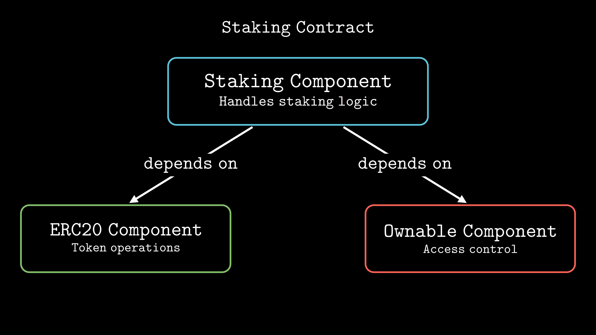
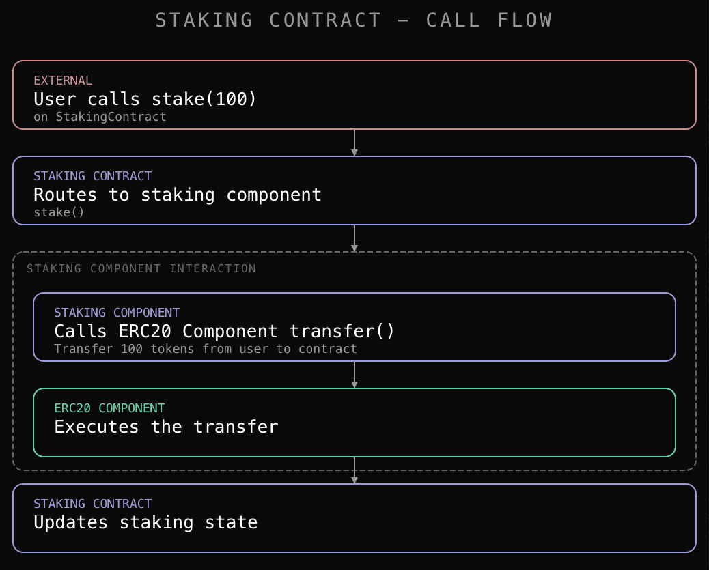
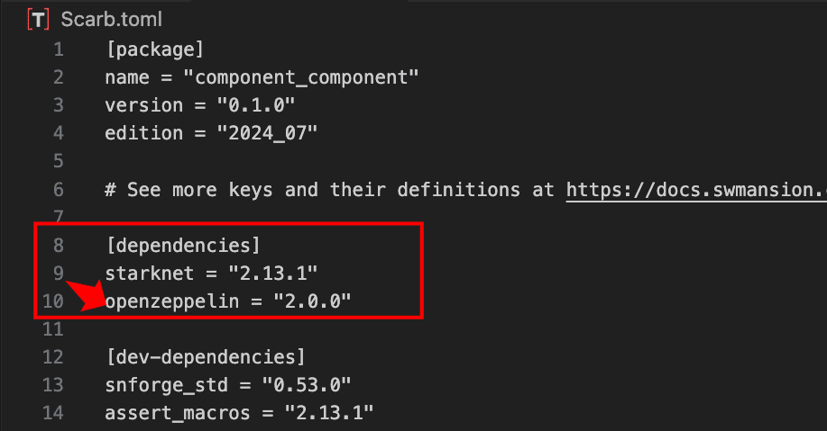
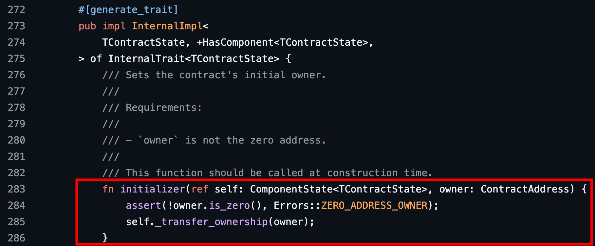

# Components 3

In [Component Part 1](https://rareskills.io/post/cairo-components-part-1), we learned how to create and use a component within a contract, and demonstrated that components behave like abstract contracts in Solidity. In [Component Part 2](https://rareskills.io/post/cairo-components-part-2), we learned to create a token contract using pre-built components from OpenZeppelin.

So far, we've used components at the contract level where the contract imports components and calls their functions. But what if we want to build a component that uses functionality from other components?

For example, consider a Staking Component that can be reused across multiple contracts. When users stake or unstake, the component needs to transfer tokens to and from their accounts. It also needs to ensure that only the contract owner can update reward rates. Both of these require calling into other components. Component to component interaction makes it possible for the Staking Component to call two separate components to handle these requirements.

The diagram below shows the Staking Contract integrating three components: Staking Component handles the staking logic and depends on both the ERC20 Component (for token transfers) and the Ownable Component (to ensure only the contract owner can update reward rates):



By the end of this chapter, you'll learn how to:

- Call components directly from other components
- Manage component dependencies within a contract
- Specify which component functions to expose in the contract's ABI
- Initialize components during contract deployment

### How Components Call Other Components

A component should focus on one area of responsibility such as token management, access control, or staking logic. When a component needs to use functionality from other components, you declare those dependencies in the component’s implementation signature. Once declared, the component can call functions from those dependencies. For example, a staking component could call transfer functions from an ERC20 component and ownership checks from an ownable component, without the contract needing to coordinate these interactions.

Here's what the component to component interaction flow looks like when a user stakes 100 tokens:



In this tutorial, we’ll embed the ERC20 Component and Staking Component in the same contract. This embedded approach is primarily for demonstrating component to component interaction. In production, staking contracts typically accept an external token address and interact with that separate token contract using contract dispatchers. We'll explain the external token approach and its differences at the end of the article.

# Building the Staking Component

We'll build a Staking Component that depends on OpenZeppelin’s ERC20 Component and Ownable Component to see how component to component interaction works in practice, then integrate it into a Staking Contract.

Our Staking Component will provide the following functionality:

- **Staking tokens**: Users can stake tokens to earn rewards. When a user stakes, tokens are transferred from their balance to the contract.
- **Unstaking tokens**: Users can unstake their tokens at any time (no lock up period). When unstaking, the staked tokens are returned to the user along with any accumulated rewards.
- **Setting reward rates**: Only the contract owner can update the reward rate, which determines how many reward tokens users earn per staked token over time.

#### Project Setup

Create a new scarb project and navigate to its directory:

```bash
scarb new component_component
cd component_component
```

#### Adding Component Dependencies

To use OpenZeppelin’s `ERC20` and `Ownable` components, add the OpenZeppelin dependency to your `Scarb.toml` file under `[dependencies]`:



## Staking Interface

The following interface defines the staking-specific functions the Staking Component will implement:

```rust
use starknet::ContractAddress;

#[starknet::interface]
pub trait IStaking<TContractState> {
    // User functions
    fn stake(ref self: TContractState, amount: u256);
    fn unstake(ref self: TContractState, amount: u256);
    fn claim_rewards(ref self: TContractState);

    // View functions
    fn get_staked_balance(self: @TContractState, user: ContractAddress) -> u256;
    fn get_total_staked(self: @TContractState) -> u256;
    fn calculate_rewards(self: @TContractState, user: ContractAddress) -> u256;
    fn get_reward_rate(self: @TContractState) -> u256;

    // Admin function
    fn set_reward_rate(ref self: TContractState, rate: u256);
}
```

Add the interface to your `src/lib.cairo` file, then add following component structure below it:

```rust
#[starknet::component]
pub mod StakingComponent {
    // Component implementation will go here
}
```

## Storage Setup

Every component defines its storage structure to keep track of its state. For the `StakingComponent`, we need to track how much each user has staked, when their rewards were last calculated, the total amount staked in the contract, users accumulated rewards, and the reward rate. Let's define the storage structure inside the `StakingComponent`:

```rust
#[starknet::component]
pub mod StakingComponent {
    use starknet::ContractAddress;
    use starknet::storage::Map;

    #[storage]
    pub struct Storage {
        staked_balances: Map<ContractAddress, u256>,
        total_staked: u256,
        reward_rate: u256,
        last_update_time: Map<ContractAddress, u64>,
        accumulated_rewards: Map<ContractAddress, u256>,
    }
}
```

Here’s what each storage field represents:

- `staked_balances`: A mapping that tracks how many tokens each user has staked. The key is the user's address, and the value is their staked amount.
- `total_staked`: The total amount of tokens staked across all users in the contract.
- `reward_rate`: The amount of reward tokens accrued per staked token per second (scaled by 1,000,000). This can be updated by the contract owner.
- `last_update_time`: A mapping from user address to the timestamp of their last reward update.
- `accumulated_rewards`: A mapping that tracks the total rewards each user has accumulated but not yet claimed.

#### A note on component storage and variable naming

Recall from Component Part 1 that the `#[substorage(v0)]` attribute allows the contract using the component to access that component's state.

When integrating multiple components, if two components define storage variables with identical names, the Cairo compiler will raise a warning about a potential collision:

```
warn: The path `component_a.variable_name` collides with existing path `component_b.variable_name`.
```

You can suppress this warning with `#[allow(starknet::colliding_storage_paths)]`, but this doesn't prevent the collision; it only silences the warning. Both variables will point to the same storage location.

This is why OpenZeppelin prefixes storage variables in their components ([`ERC20_total_supply`](https://github.com/OpenZeppelin/cairo-contracts/blob/main/packages/token/src/erc20/erc20.cairo#L37-#L42), [`Ownable_owner`](https://github.com/OpenZeppelin/cairo-contracts/blob/main/packages/access/src/ownable/ownable.cairo#L24-#L26), etc.). The prefixes ensure that even when multiple components are used together, their storage variables have unique names and won't collide.

So when building components, use descriptive prefixes or names that are unlikely to conflict with other components' storage variables.

## Events Declaration

To track when users stake and unstake tokens, add the following event definitions to the `StakingComponent`:

```rust
#[event]
#[derive(Drop, starknet::Event)]
pub enum Event {
    Staked: Staked,
    Unstaked: Unstaked
}

#[derive(Drop, starknet::Event)]
pub struct Staked {
    pub user: ContractAddress,
    pub amount: u256,
}

#[derive(Drop, starknet::Event)]
pub struct Unstaked {
    pub user: ContractAddress,
    pub amount: u256,
}
```

`Staked` logs the user's address and amount when they stake their tokens. `Unstaked` does the same when a user unstakes.

## Implementing the Staking Interface

With state variables and events in place, we can now implement the `IStaking` interface we defined earlier. We'll start by creating empty function stubs so our code compiles, then we'll implement each function one by one.

Add the following implementation block to the `StakingComponent`:

```rust
#[embeddable_as(StakingImpl)]
impl StakingImplImpl<
    TContractState,
    +HasComponent<TContractState>,
    +Drop<TContractState>,
> of super::IStaking<ComponentState<TContractState>> {

    fn stake(ref self: ComponentState<TContractState>, amount: u256) {
        // Implementation will go here
    }

    fn unstake(ref self: ComponentState<TContractState>, amount: u256) {
        // Implementation will go here
    }

    fn claim_rewards(ref self: ComponentState<TContractState>) {
        // Implementation will go here
    }

    fn get_staked_balance(
        self: @ComponentState<TContractState>, user: ContractAddress
    ) -> u256 {
        0 // Placeholder
    }

    fn get_total_staked(self: @ComponentState<TContractState>) -> u256 {
        0 // Placeholder
    }

    fn calculate_rewards(
        self: @ComponentState<TContractState>, user: ContractAddress
    ) -> u256 {
        0 // Placeholder
    }

    fn set_reward_rate(ref self: ComponentState<TContractState>, rate: u256) {
        // Implementation will go here
    }

    fn get_reward_rate(self: @ComponentState<TContractState>) -> u256 {
        0 // Placeholder
    }
}
```

The `#[embeddable_as(StakingImpl)]` attribute tells Cairo that this implementation should be available to embed in contracts.

### Declaring Component Dependencies

As mentioned earlier, `StakingComponent` must declare `ERC20Component` and `OwnableComponent` as dependencies in its implementation signature to call their functions directly.

Add the `ERC20Component`, `OwnableComponent`, and `starknet` imports to the `StakingComponent` module:

```rust
use openzeppelin::access::ownable::OwnableComponent;
use openzeppelin::token::erc20::ERC20Component;
use starknet::{get_caller_address, get_contract_address};
```

Next, declare these components as dependencies in the implementation signature:

```rust
#[embeddable_as(StakingImpl)]
impl StakingImplImpl
    TContractState,
    +HasComponent<TContractState>,
    +Drop<TContractState>,
    impl ERC20: ERC20Component::HasComponent<TContractState>,//ADD THIS LINE
    impl Ownable: OwnableComponent::HasComponent<TContractState>,//ADD THIS LINE
> of super::IStaking<ComponentState<TContractState>> {
    // Functions here
}
```

The `impl ERC20: ERC20Component::HasComponent<TContractState>` and `impl Ownable: OwnableComponent::HasComponent<TContractState>` lines tell Cairo that any contract using the `StakingComponent` must also include these components.

Here’s the complete `StakingComponent` code up to this point:

```rust
use starknet::ContractAddress;

#[starknet::interface]
pub trait IStaking<TContractState> {
    // User functions
    fn stake(ref self: TContractState, amount: u256);
    fn unstake(ref self: TContractState, amount: u256);
    fn claim_rewards(ref self: TContractState);

    // View functions
    fn get_staked_balance(self: @TContractState, user: ContractAddress) -> u256;
    fn get_total_staked(self: @TContractState) -> u256;
    fn calculate_rewards(self: @TContractState, user: ContractAddress) -> u256;
    fn get_reward_rate(self: @TContractState) -> u256;

    // Admin function
    fn set_reward_rate(ref self: TContractState, rate: u256);
}

#[starknet::component]
pub mod StakingComponent {
    use openzeppelin::access::ownable::OwnableComponent;
    use openzeppelin::token::erc20::ERC20Component;
    use starknet::storage::{
        Map, StorageMapReadAccess, StorageMapWriteAccess, StoragePointerReadAccess,
        StoragePointerWriteAccess,
    };
    use starknet::{ContractAddress, get_caller_address, get_contract_address};

    #[storage]
    pub struct Storage {
        staked_balances: Map<ContractAddress, u256>,
        total_staked: u256,
        reward_rate: u256,
        last_update_time: Map<ContractAddress, u64>,
        accumulated_rewards: Map<ContractAddress, u256>,
    }

    #[event]
    #[derive(Drop, starknet::Event)]
    pub enum Event {
        Staked: Staked,
        Unstaked: Unstaked,
    }

    #[derive(Drop, starknet::Event)]
    pub struct Staked {
        pub user: ContractAddress,
        pub amount: u256,
    }

    #[derive(Drop, starknet::Event)]
    pub struct Unstaked {
        pub user: ContractAddress,
        pub amount: u256,
    }

    #[embeddable_as(StakingImpl)]
    impl StakingImplImpl<
        TContractState,
        +HasComponent<TContractState>,
        +Drop<TContractState>,
        impl ERC20: ERC20Component::HasComponent<TContractState>,
        impl Ownable: OwnableComponent::HasComponent<TContractState>,
    > of super::IStaking<ComponentState<TContractState>> {
        fn stake(
            ref self: ComponentState<TContractState>, amount: u256,
        ) { // Implementation will go here
        }

        fn unstake(
            ref self: ComponentState<TContractState>, amount: u256,
        ) { // Implementation will go here
        }

        fn claim_rewards(ref self: ComponentState<TContractState>) {// Implementation will go here
        }

        fn get_staked_balance(
            self: @ComponentState<TContractState>, user: ContractAddress,
        ) -> u256 {
            0 // Placeholder
        }

        fn get_total_staked(self: @ComponentState<TContractState>) -> u256 {
            0 // Placeholder
        }

        fn calculate_rewards(self: @ComponentState<TContractState>, user: ContractAddress) -> u256 {
            0 // Placeholder
        }

        fn set_reward_rate(
            ref self: ComponentState<TContractState>, rate: u256,
        ) { // Implementation will go here
        }

        fn get_reward_rate(self: @ComponentState<TContractState>) -> u256 {
            0 // Placeholder
        }
    }
}
```

## Implementing the stake function

The `stake` function transfers tokens from the user to the contract, updates their staked balance, and records the timestamp for reward calculations:

```rust
fn stake(ref self: ComponentState<TContractState>, amount: u256) {
    assert(amount > 0, 'Amount must be greater than 0');

    let caller = get_caller_address();
    let contract_address = get_contract_address();

    // Transfer tokens from caller to contract
    let mut erc20 = get_dep_component_mut!(ref self, ERC20);
    erc20._transfer(caller, contract_address, amount);

    // Update staking balances
    let current_stake = self.staked_balances.read(caller);
    self.staked_balances.write(caller, current_stake + amount);

    let total = self.total_staked.read();
    self.total_staked.write(total + amount);

    self.emit(Staked { user: caller, amount });
}
```

The function starts by validating that the staking amount is greater than zero, then retrieves the caller's address and the contract address. It transfers tokens from the caller to the contract, updates the caller's staked balance and the total staked amount, and emits a `Staked` event.

#### Where the component to component interaction happens

Notice these lines:

```rust
let mut erc20 = get_dep_component_mut!(ref self, ERC20);
erc20._transfer(caller, contract_address, amount);
```

This is where the component-to-component interaction happens. The  `get_dep_component_mut!` macro retrieves a mutable reference to the `ERC20Component`, allowing us to call its `_transfer` function to move tokens from the user to the contract. Let's break down how this works:

- **The macro**: `get_dep_component_mut!` gives us a mutable reference to a component we depend on. This lets us call its internal functions.
- **The parameters**:
    - `ref self` refers to the component's state
    - `ERC20` is the dependency name we declared in the implementation signature
- **Why we need the macro**: Inside `StakingComponent`, we can't directly call `self.erc20._transfer(...)` because each component's storage is kept separate within the contract. The `get_dep_component_mut!` macro gets us a reference to the `ERC20Component` so we can call its functions.

You might wonder why we use `_transfer` instead of the conventional `transfer_from` function. As mentioned in the introduction, this tutorial uses an embedded token architecture where the token and staking logic are part of the same contract. This affects which transfer method we use. We'll explain it in more details and compare it to staking external tokens later in the article.

After the transfer, we update the user's staked balance by reading their current stake, we add the new amount, and write it back. We also update the total staked amount and emit a `Staked` event to log this action.

If you try to compile the code at this point, you'll notice that `_transfer` throws an error. When you hover over it, you'll see:

```
Method `_transfer` not found on type `openzeppelin_token::erc20::erc20::ERC20Comp
onent::ComponentState::<TContractState>`. Did you import the correct trait and impl?
```

This error occurs because `_transfer` is an internal function of the `ERC20Component`, and we haven't imported the trait that implements it. To fix this, add the following import at the top of the `StakingComponent` module:

```rust
use openzeppelin::token::erc20::ERC20Component::InternalTrait as ERC20InternalTrait;
```

This import gives us access to the `ERC20Component`’s internal functions like `_transfer` and `_mint`. if you compile again, you'll encounter another error that says:

```
Trait has no implementation in context: openzeppelin_token::erc20::erc20::ERC20Co
mponent::InternalTrait::<TContractState, ImplVarId(34881), ImplVarId(34882)> ….
```

This happens because the `ERC20Component` requires an implementation of its `ERC20HooksTrait`. This trait defines hooks that can run before and after token transfers. Since we don't need custom hooks for our staking contract, we'll use the empty implementation provided by OpenZeppelin.

Update the ERC20 import to include `ERC20HooksEmptyImpl`:

```rust
use openzeppelin::token::erc20::{ERC20Component, ERC20HooksEmptyImpl};
```

Now the code should compile successfully, and the `_transfer` function will work as expected.

However, the `stake` function implementation is incomplete. Before updating a user's stake, we need to calculate their accumulated rewards first. Let's create internal helper functions to handle reward calculations.

### Internal helper functions for reward calculations

Components can have internal functions that are only accessible within the component itself or by the contract that uses it, like `_transfer` in the `ERC20Component`. These functions are not part of the public interface and won't appear in the contract's ABI.

We define them using the `#[generate_trait]` attribute, which automatically generates a trait to hold the internal functions. Add the following internal implementation block below the main implementation to handle reward calculations and updates:

```rust
#[generate_trait]
 pub impl InternalImpl<
     TContractState,
     +HasComponent<TContractState>,
     +Drop<TContractState>,
     impl ERC20: ERC20Component::HasComponent<TContractState>,
     impl Ownable: OwnableComponent::HasComponent<TContractState>,
 > of InternalTrait<TContractState> {
      // Internal functions will go here
 }
```

Before we implement the reward calculation helpers, we need an initializer function to set up the component's initial state with an initial reward rate when the contract is deployed:

```rust
#[generate_trait]
pub impl InternalImpl<
    TContractState,
    +HasComponent<TContractState>,
    +Drop<TContractState>,
    impl ERC20: ERC20Component::HasComponent<TContractState>,
    impl Ownable: OwnableComponent::HasComponent<TContractState>,
> of InternalTrait<TContractState> {
    //NEWLY ADDED BELOW //
    fn initializer(ref self: ComponentState<TContractState>, initial_reward_rate: u256) {
        self.reward_rate.write(initial_reward_rate);
    }

    //other internal function will go here
}
```

#### Understanding component initializers

Sometimes components need to run initialization logic just once. In Solidity, this is possible with a constructor. **While Cairo contracts also support constructors, components do not.**

Instead, components use initializers: regular functions that handle setup when the contract is deployed. **The framework does not enforce single execution, so the convention is to call initializers only from the contract's constructor.** Since constructors run only once during deployment, this ensures initializers are also called only once.

In this case, the `Ownable` and `ERC20` components from OpenZeppelin, along with our custom `StakingComponent`, all provide initializer functions called `initializer`. Because it's a regular function, its name can be arbitrary. The name `initializer` is a convention.

These initializers will be called from the contract's constructor when we build the `StakingContract` later in the article. Forgetting to call a component's initializer will leave its state uninitialized, breaking contract logic or creating security vulnerabilities.

A snippet from the `Ownable` component initializer in OpenZeppelin looks like this:



The `Ownable` initializer sets the initial owner address, so our constructor must take in an owner address as a parameter.

#### Calculating Pending Rewards

With the initializer in place, we can implement the reward calculation helpers. The `_calculate_pending_rewards` function computes how many rewards a user has earned based on their staked amount and the time elapsed since their last update:

```rust
fn _calculate_pending_rewards(
        self: @ComponentState<TContractState>, user: ContractAddress,
    ) -> u256 {
       let staked = self.staked_balances.read(user);
        if staked == 0 {
            return self.accumulated_rewards.read(user);
        }

        let last_update = self.last_update_time.read(user);
        let current_time = get_block_timestamp();

        if last_update == 0 {
            return 0;
        }

        let time_elapsed = current_time - last_update;
        let reward_rate = self.reward_rate.read();

        // Calculate new rewards: staked_amount * reward_rate * time_elapsed
        let new_rewards = (staked * reward_rate * time_elapsed.into()) / 1000000;
        let accumulated = self.accumulated_rewards.read(user);

        accumulated + new_rewards
    }
```

The function first checks if the user has any staked tokens. If they don't, it returns their accumulated rewards from previous stakes.

It then retrieves when the user's rewards were last updated and the current block timestamp. If the user has never staked before (their `last_update_time` is 0), the function returns 0 since there are no rewards to calculate yet.

The function calculates the time elapsed since the last update and retrieves the current reward rate. The reward calculation uses this formula: `staked_amount * reward_rate * time_elapsed / 1000000`. We divide by 1,000,000 because Cairo has no floating-point numbers. The reward rate is scaled by 1,000,000 to represent fractional values as integers.

The function then adds any previously accumulated rewards to the newly calculated rewards and returns the total.

We need to import `get_block_timestamp` at the top of the module alongside the existing imports:

```rust
use starknet::{ContractAddress, get_block_timestamp, get_caller_address, get_contract_address};
```

Now let's implement the `update_rewards` function that uses `_calculate_pending_rewards` to calculate any pending rewards for a user, updates their accumulated rewards and last update timestamp:

```rust
fn update_rewards(ref self: ComponentState<TContractState>, user: ContractAddress) {
    let pending = self._calculate_pending_rewards(user);
    self.accumulated_rewards.write(user, pending);
    self.last_update_time.write(user, get_block_timestamp());
}
```

With `update_rewards` implemented, we can go back and complete the `stake` function by adding the reward update before changing the user's stake.

### Completing the `stake()` function

Update the `stake` function to include the `update_rewards` call:

```rust
fn stake(ref self: ComponentState<TContractState>, amount: u256) {
    assert(amount > 0, 'Amount must be greater than 0');

    let caller = get_caller_address();
    let contract_address = get_contract_address();

    // Update rewards before changing stake
    self.update_rewards(caller); //ADD THIS LINE

    // Transfer tokens from caller to contract
    let mut erc20 = get_dep_component_mut!(ref self, ERC20);
    erc20._transfer(caller, contract_address, amount);

    // Update staking balances
    let current_stake = self.staked_balances.read(caller);
    self.staked_balances.write(caller, current_stake + amount);

    let total = self.total_staked.read();
    self.total_staked.write(total + amount);

    self.emit(Staked { user: caller, amount });
}
```

The addition is `self.update_rewards(caller)` which is called before we change the user's staked balance. This ensures that rewards are calculated based on the user's previous stake before the new tokens are added. Without this, users would lose rewards earned on their previous stake.

Here's the complete `StakingComponent` code up to this point:

```rust
use starknet::ContractAddress;

#[starknet::interface]
pub trait IStaking<TContractState> {
    // User functions
    fn stake(ref self: TContractState, amount: u256);
    fn unstake(ref self: TContractState, amount: u256);
    fn claim_rewards(ref self: TContractState);

    // View functions
    fn get_staked_balance(self: @TContractState, user: ContractAddress) -> u256;
    fn get_total_staked(self: @TContractState) -> u256;
    fn calculate_rewards(self: @TContractState, user: ContractAddress) -> u256;
    fn get_reward_rate(self: @TContractState) -> u256;

    // Admin function
    fn set_reward_rate(ref self: TContractState, rate: u256);
}

#[starknet::component]
pub mod StakingComponent {
    use openzeppelin::access::ownable::OwnableComponent;
    use openzeppelin::token::erc20::ERC20Component::InternalTrait as ERC20InternalTrait;
    use openzeppelin::token::erc20::{ERC20Component, ERC20HooksEmptyImpl};
    use starknet::storage::{
        Map, StorageMapReadAccess, StorageMapWriteAccess, StoragePointerReadAccess,
        StoragePointerWriteAccess,
    };
    use starknet::{ContractAddress, get_block_timestamp, get_caller_address, get_contract_address};

    #[storage]
    pub struct Storage {
        staked_balances: Map<ContractAddress, u256>,
        total_staked: u256,
        reward_rate: u256,
        last_update_time: Map<ContractAddress, u64>,
        accumulated_rewards: Map<ContractAddress, u256>,
    }

    #[event]
    #[derive(Drop, starknet::Event)]
    pub enum Event {
        Staked: Staked,
        Unstaked: Unstaked,
    }

    #[derive(Drop, starknet::Event)]
    pub struct Staked {
        pub user: ContractAddress,
        pub amount: u256,
    }

    #[derive(Drop, starknet::Event)]
    pub struct Unstaked {
        pub user: ContractAddress,
        pub amount: u256,
    }

    #[embeddable_as(StakingImpl)]
    impl StakingImplImpl<
        TContractState,
        +HasComponent<TContractState>,
        +Drop<TContractState>,
        impl ERC20: ERC20Component::HasComponent<TContractState>,
        impl Ownable: OwnableComponent::HasComponent<TContractState>,
    > of super::IStaking<ComponentState<TContractState>> {
        /// @notice Stakes tokens into the contract and update rewards
        /// @param amount The amount of tokens to stake
        fn stake(ref self: ComponentState<TContractState>, amount: u256) {
            assert(amount > 0, 'Amount must be greater than 0');

            let caller = get_caller_address();
            let contract_address = get_contract_address();

            // Update rewards before changing stake
            self.update_rewards(caller);

            // This transfers from caller to contract without needing approval
            let mut erc20 = get_dep_component_mut!(ref self, ERC20);
            erc20._transfer(caller, contract_address, amount);

            // Update staking balances
            let current_stake = self.staked_balances.read(caller);
            self.staked_balances.write(caller, current_stake + amount);

            let total = self.total_staked.read();
            self.total_staked.write(total + amount);

            self.emit(Staked { user: caller, amount });
        }

        fn unstake(
            ref self: ComponentState<TContractState>, amount: u256,
        ) { // Implementation will go here
        }

        fn claim_rewards(ref self: ComponentState<TContractState>) { // Implementation will go here
        }

        fn get_staked_balance(
            self: @ComponentState<TContractState>, user: ContractAddress,
        ) -> u256 {
            0 // Placeholder
        }

        fn get_total_staked(self: @ComponentState<TContractState>) -> u256 {
            0 // Placeholder
        }

        fn calculate_rewards(self: @ComponentState<TContractState>, user: ContractAddress) -> u256 {
            0 // Placeholder
        }

        fn set_reward_rate(
            ref self: ComponentState<TContractState>, rate: u256,
        ) { // Implementation will go here
        }

        fn get_reward_rate(self: @ComponentState<TContractState>) -> u256 {
            0 // Placeholder
        }
    }

    #[generate_trait]
    pub impl InternalImpl<
        TContractState,
        +HasComponent<TContractState>,
        +Drop<TContractState>,
        impl ERC20: ERC20Component::HasComponent<TContractState>,
        impl Ownable: OwnableComponent::HasComponent<TContractState>,
    > of InternalTrait<TContractState> {
        //NEWLY ADDED BELOW //
        fn initializer(ref self: ComponentState<TContractState>, initial_reward_rate: u256) {
            self.reward_rate.write(initial_reward_rate);
        }

        fn _calculate_pending_rewards(
            self: @ComponentState<TContractState>, user: ContractAddress,
        ) -> u256 {
            let staked = self.staked_balances.read(user);
            if staked == 0 {
                return self.accumulated_rewards.read(user);
            }

            let last_update = self.last_update_time.read(user);
            let current_time = get_block_timestamp();

            if last_update == 0 {
                return 0;
            }

            let time_elapsed = current_time - last_update;
            let reward_rate = self.reward_rate.read();

            // Calculate new rewards: staked_amount * reward_rate * time_elapsed
            let new_rewards = (staked * reward_rate * time_elapsed.into()) / 1000000;
            let accumulated = self.accumulated_rewards.read(user);

            accumulated + new_rewards
        }

        fn update_rewards(ref self: ComponentState<TContractState>, user: ContractAddress) {
            let pending = self._calculate_pending_rewards(user);
            self.accumulated_rewards.write(user, pending);
            self.last_update_time.write(user, get_block_timestamp());
        }
    }
}
```

## Implementing the unstake function

The `unstake` function allows users to withdraw their staked tokens from the contract. Let's implement it:

```rust
fn unstake(ref self: ComponentState<TContractState>, amount: u256) {
    let caller = get_caller_address();
    let current_stake = self.staked_balances.read(caller);

    assert(amount > 0, 'Amount must be greater than 0');
    assert(current_stake >= amount, 'Insufficient staked balance');

    // Update rewards before changing stake
    self.update_rewards(caller);

    // Update staking balances
    self.staked_balances.write(caller, current_stake - amount);

    let total = self.total_staked.read();
    self.total_staked.write(total - amount);

    // Transfer tokens back to user using ERC20Component
    let mut erc20 = get_dep_component_mut!(ref self, ERC20);
    let contract_address = get_contract_address();
    erc20._transfer(contract_address, caller, amount);

    self.emit(Unstaked { user: caller, amount });
}
```

The function first retrieves the caller's address and their current staked balance. It then validates the amount and confirms the user has sufficient staked tokens.

Just like in the stake function, we call `self.update_rewards(caller)` before modifying the user's staked balance. This ensures rewards are calculated based on their stake before the withdrawal.

After updating rewards, the function decreases the user's staked balance and the total staked amount. It then transfers the tokens from the contract back to the user using the `ERC20Component`'s `_transfer` function and emits an `Unstaked` event.

## Implementing the claim rewards function

The `claim_rewards` function allows users to claim their accumulated rewards while keeping their tokens staked in the contract:

```rust
fn claim_rewards(ref self: ComponentState<TContractState>) {
    let caller = get_caller_address();

    self.update_rewards(caller);
    let rewards = self.accumulated_rewards.read(caller);

    assert(rewards > 0, 'No rewards to claim');

    // Reset accumulated rewards
    self.accumulated_rewards.write(caller, 0);

    // Transfer reward tokens to user
    let mut erc20 = get_dep_component_mut!(ref self, ERC20);
    let contract_address = get_contract_address();
    erc20._transfer(contract_address, caller, rewards);
}
```

The `claim_rewards` function first updates the user's rewards to ensure all pending rewards are calculated. It then reads the user's total accumulated rewards.

The function validates that the user has rewards to claim, resets their accumulated rewards to zero, and transfers the reward tokens to the user using `_transfer`.

## Implementing the set reward rate function

The `set_reward_rate` function allows the contract owner to update the reward rate:

```rust
fn set_reward_rate(ref self: ComponentState<TContractState>, rate: u256) {
    // Check ownership using OwnableComponent
    let ownable = get_dep_component!(@self, Ownable);
    ownable.assert_only_owner();

    self.reward_rate.write(rate);
}
```

This function also demonstrates another component-to-component interaction. We use `get_dep_component!(@self, Ownable)` to access the `OwnableComponent` and call its `assert_only_owner` function. This function will panic if the caller is not the contract owner, preventing unauthorized users from changing the reward rate.

Notice we use `get_dep_component!` here (without `_mut`) instead of `get_dep_component_mut!` that we used with the `ERC20Component`. The difference is:

- `get_dep_component_mut!` provides a mutable reference - use this when you need to modify the component's state (like transferring tokens)
- `get_dep_component!` provides an immutable reference - use this when you only need to read data or call functions that don't modify state (like checking ownership)

Since `assert_only_owner` only reads the owner address and doesn't modify the OwnableComponent's state, we use the immutable version.

If you compile the code now, you'll get an error:

```
Method 'assert_only_owner' not found on type '@openzeppelin_access::ownable::owna
ble::OwnableComponent::ComponentState::<TContractState>'. Consider importing one
of the following traits: 'OwnableComponent::InternalTrait'
```

This means we need to import the `OwnableComponent`’s internal trait at the top of the module:

```rust
use openzeppelin::access::ownable::OwnableComponent::InternalTrait as OwnableInternalTrait;
```

After the ownership check passes, the function updates the reward rate in storage.

## Implementing the view functions

We need to implement four view functions:

- `get_staked_balance` returns how many tokens a specific user has staked,
- `get_total_staked` returns the total amount staked across all users,
- `calculate_rewards` shows how many rewards a user can claim, and
- `get_reward_rate` returns the current reward rate.

```rust
fn get_staked_balance(
    self: @ComponentState<TContractState>, user: ContractAddress
) -> u256 {
    self.staked_balances.read(user)
}

fn get_total_staked(self: @ComponentState<TContractState>) -> u256 {
    self.total_staked.read()
}

fn calculate_rewards(
    self: @ComponentState<TContractState>, user: ContractAddress
) -> u256 {
    self._calculate_pending_rewards(user)
}

fn get_reward_rate(self: @ComponentState<TContractState>) -> u256 {
    self.reward_rate.read()
}
```

These implementations read from storage and return the requested values. The `calculate_rewards` function uses the internal `_calculate_pending_rewards` function to compute the rewards.

Here's the complete `StakingComponent` code:

```rust
use starknet::ContractAddress;

#[starknet::interface]
pub trait IStaking<TContractState> {
    // User functions
    fn stake(ref self: TContractState, amount: u256);
    fn unstake(ref self: TContractState, amount: u256);
    fn claim_rewards(ref self: TContractState);

    // View functions
    fn get_staked_balance(self: @TContractState, user: ContractAddress) -> u256;
    fn get_total_staked(self: @TContractState) -> u256;
    fn calculate_rewards(self: @TContractState, user: ContractAddress) -> u256;
    fn get_reward_rate(self: @TContractState) -> u256;

    // Admin function
    fn set_reward_rate(ref self: TContractState, rate: u256);
}

#[starknet::component]
pub mod StakingComponent {
    use openzeppelin::access::ownable::OwnableComponent;
    use openzeppelin::access::ownable::OwnableComponent::InternalTrait as OwnableInternalTrait;

    use openzeppelin::token::erc20::ERC20Component::InternalTrait as ERC20InternalTrait;
    use openzeppelin::token::erc20::{ERC20Component, ERC20HooksEmptyImpl};
    use starknet::storage::{
        Map, StorageMapReadAccess, StorageMapWriteAccess, StoragePointerReadAccess,
        StoragePointerWriteAccess,
    };
    use starknet::{ContractAddress, get_block_timestamp, get_caller_address, get_contract_address};

    #[storage]
    pub struct Storage {
        staked_balances: Map<ContractAddress, u256>,
        total_staked: u256,
        reward_rate: u256,
        last_update_time: Map<ContractAddress, u64>,
        accumulated_rewards: Map<ContractAddress, u256>,
    }

    #[event]
    #[derive(Drop, starknet::Event)]
    pub enum Event {
        Staked: Staked,
        Unstaked: Unstaked
    }

    #[derive(Drop, starknet::Event)]
    pub struct Staked {
        pub user: ContractAddress,
        pub amount: u256,
    }

    #[derive(Drop, starknet::Event)]
    pub struct Unstaked {
        pub user: ContractAddress,
        pub amount: u256,
    }

    #[embeddable_as(StakingImpl)]
    impl StakingImplImpl<
        TContractState,
        +HasComponent<TContractState>,
        +Drop<TContractState>,
        impl ERC20: ERC20Component::HasComponent<TContractState>,
        impl Ownable: OwnableComponent::HasComponent<TContractState>,
    > of super::IStaking<ComponentState<TContractState>> {
        /// @notice Stakes tokens into the contract and update rewards
        /// @param amount The amount of tokens to stake
        fn stake(ref self: ComponentState<TContractState>, amount: u256) {
            assert(amount > 0, 'Amount must be greater than 0');

            let caller = get_caller_address();
            let contract_address = get_contract_address();

            // Update rewards before changing stake
            self.update_rewards(caller);

            // This transfers from caller to contract without needing approval
            let mut erc20 = get_dep_component_mut!(ref self, ERC20);
            erc20._transfer(caller, contract_address, amount);

            // Update staking balances
            let current_stake = self.staked_balances.read(caller);
            self.staked_balances.write(caller, current_stake + amount);

            let total = self.total_staked.read();
            self.total_staked.write(total + amount);

            self.emit(Staked { user: caller, amount });
        }

        /// @notice Unstakes tokens and transfers them back to user
        /// @param amount The amount of tokens to unstake
        fn unstake(ref self: ComponentState<TContractState>, amount: u256) {
            let caller = get_caller_address();
            let current_stake = self.staked_balances.read(caller);

            assert(amount > 0, 'Amount must be greater than 0');
            assert(current_stake >= amount, 'Insufficient staked balance');

            // Update rewards before changing stake
            self.update_rewards(caller);

            // Update staking balances

            self.staked_balances.write(caller, current_stake - amount);

            let total = self.total_staked.read();
            self.total_staked.write(total - amount);

            // Transfer tokens back to user using ERC20Component
            let mut erc20 = get_dep_component_mut!(ref self, ERC20);
            let contract_address = get_contract_address();
            erc20._transfer(contract_address, caller, amount);

            self.emit(Unstaked { user: caller, amount });
        }

        /// @notice Claims accumulated rewards for the caller
        fn claim_rewards(ref self: ComponentState<TContractState>) {
            let caller = get_caller_address();

            self.update_rewards(caller);
            let rewards = self.accumulated_rewards.read(caller);

            assert(rewards > 0, 'No rewards to claim');

            // Reset accumulated rewards
            self.accumulated_rewards.write(caller, 0);

            // Transfer reward tokens to user
            let mut erc20 = get_dep_component_mut!(ref self, ERC20);
            let contract_address = get_contract_address();
            erc20._transfer(contract_address, caller, rewards);
        }

        /// @notice Returns the staked balance of a specific user
        /// @param user The address of the user
        /// @return The amount of tokens staked by the user
        fn get_staked_balance(
            self: @ComponentState<TContractState>, user: ContractAddress,
        ) -> u256 {
            self.staked_balances.read(user)
        }

        /// @notice Returns the total amount of tokens staked in the contract
        /// @return The total staked amount
        fn get_total_staked(self: @ComponentState<TContractState>) -> u256 {
            self.total_staked.read()
        }

        /// @notice Calculates the pending rewards for a user
        /// @param user The address of the user
        /// @return The amount of pending rewards
        fn calculate_rewards(self: @ComponentState<TContractState>, user: ContractAddress) -> u256 {
            self._calculate_pending_rewards(user)
        }

        /// @notice Sets the reward rate (only callable by owner)
        /// @param rate The new reward rate per second
        fn set_reward_rate(ref self: ComponentState<TContractState>, rate: u256) {
            // Check ownership using OwnableComponent
            let ownable = get_dep_component!(@self, Ownable);
            ownable.assert_only_owner();

            self.reward_rate.write(rate);
        }

        /// @notice Returns the current reward rate
        /// @return The reward rate per second
        fn get_reward_rate(self: @ComponentState<TContractState>) -> u256 {
            self.reward_rate.read()
        }
    }

    #[generate_trait]
    pub impl InternalImpl<
        TContractState,
        +HasComponent<TContractState>,
        +Drop<TContractState>,
        impl ERC20: ERC20Component::HasComponent<TContractState>,
        impl Ownable: OwnableComponent::HasComponent<TContractState>,
    > of InternalTrait<TContractState> {
        // Initializes the staking component with an initial reward rate
       fn initializer(ref self: ComponentState<TContractState>, initial_reward_rate: u256) {
           self.reward_rate.write(initial_reward_rate);
       }

        // Updates the accumulated rewards for a user
        fn update_rewards(ref self: ComponentState<TContractState>, user: ContractAddress) {
            let pending = self._calculate_pending_rewards(user);
            self.accumulated_rewards.write(user, pending);
            self.last_update_time.write(user, get_block_timestamp());
        }

        // Calculates pending rewards based on staked amount and time elapsed
        fn _calculate_pending_rewards(
            self: @ComponentState<TContractState>, user: ContractAddress,
        ) -> u256 {
            let staked = self.staked_balances.read(user);
            if staked == 0 {
                return self.accumulated_rewards.read(user);
            }

            let last_update = self.last_update_time.read(user);
            let current_time = get_block_timestamp();

            if last_update == 0 {
                return 0;
            }

            let time_elapsed = current_time - last_update;
            let reward_rate = self.reward_rate.read();

            // Calculate new rewards: staked_amount * reward_rate * time_elapsed
            let new_rewards = (staked * reward_rate * time_elapsed.into()) / 1000000;
            let accumulated = self.accumulated_rewards.read(user);

            accumulated + new_rewards
        }
    }
}
```

We've now completed the `StakingComponent`, which contains all the staking logic we need. The component handles staking and unstaking tokens, calculating and claiming rewards, and managing the reward rate.

However, a component on its own cannot be deployed. We need to create a contract that integrates our `StakingComponent` along with the `ERC20Component` and `OwnableComponent`. This contract will serve as the deployable smart contract that users interact with.

# Building the Staking Contract

The `StakingContract` will:

- Include the `StakingComponent` we just built
- Include the `ERC20Component` (for the staking token)
- Include the `OwnableComponent` (for access control)
- Initialize all three components with the necessary parameters
- Expose the functions we want users to be able to call

Let's build the `StakingContract` that brings all these components together.

### Importing Dependencies

**Note:** For this walkthrough, we're building both the `StakingComponent` and `StakingContract` in the same `lib.cairo` file. In a larger project, you could organize these into separate files (e.g., `staking_component.cairo` and `staking_contract.cairo`), but keeping everything in one file makes it easier to follow along.

First, we need to import all the components we'll be using:

```rust
#[starknet::contract]
mod StakingContract {
    use openzeppelin::access::ownable::OwnableComponent;
    use openzeppelin::token::erc20::{ERC20Component, ERC20HooksEmptyImpl};
    use starknet::{ContractAddress, get_contract_address};
    use super::StakingComponent;
}
```

We import the `OwnableComponent` and `ERC20Component` from OpenZeppelin, along with the `StakingComponent` we just created.

### Declaring Components

Next, we declare the three components our contract will use:

```rust
// Component declarations
component!(path: StakingComponent, storage: staking, event: StakingEvent);
component!(path: ERC20Component, storage: erc20, event: ERC20Event);
component!(path: OwnableComponent, storage: ownable, event: OwnableEvent);
```

Each `component!` macro declares a component and specifies:

- The component path (which component to use)
- The storage name (where this component's storage will be kept)
- The event name (what to call this component's events)

### Configuring the ERC20Component

The `ERC20Component` requires us to implement its `ImmutableConfig` trait. This trait configures values that are fixed at compile time rather than stored in contract storage. The ERC20 `DECIMALS` value never changes after deployment, making it ideal for this pattern.

```rust
// ERC20 Mixin configuration
impl ERC20ImmutableConfig of ERC20Component::ImmutableConfig {
    const DECIMALS: u8 = 18;
}
```

This sets the token to use 18 decimals, which is standard for most tokens.

### Exposing component functions

Now we need to decide which functions from each component should be publicly accessible. We use the `#[abi(embed_v0)]` attribute to expose implementations:

```rust
// Expose staking functions publicly
#[abi(embed_v0)]
impl StakingImpl = StakingComponent::StakingImpl<ContractState>;

// Expose ERC20 functions publicly
#[abi(embed_v0)]
impl ERC20MixinImpl = ERC20Component::ERC20MixinImpl<ContractState>;

// Expose Ownable functions publicly
#[abi(embed_v0)]
impl OwnableMixinImpl = OwnableComponent::OwnableMixinImpl<ContractState>;
```

These lines make all the staking functions, ERC-20 functions (like `transfer`, `balance_of`), and ownership functions (like `transfer_ownership`) available in the contract's public interface (ABI).

We also need to make the internal implementations available so components can call each other's internal functions:

```rust
// Internal implementations
impl StakingInternalImpl = StakingComponent::InternalImpl<ContractState>;
impl ERC20InternalImpl = ERC20Component::InternalImpl<ContractState>;
impl OwnableInternalImpl = OwnableComponent::InternalImpl<ContractState>;
```

### Storage structure

Each component requires its own storage space. We declare storage for all three components:

```rust
#[storage]
struct Storage {
    #[substorage(v0)]
    staking: StakingComponent::Storage,
    #[substorage(v0)]
    erc20: ERC20Component::Storage,
    #[substorage(v0)]
    ownable: OwnableComponent::Storage,
}
```

The `#[substorage(v0)]` attribute tells Cairo that each field contains a component's storage structure.

### Events

Similarly, we need to aggregate events from all components:

```rust
#[event]
#[derive(Drop, starknet::Event)]
pub enum Event {
    #[flat]
    StakingEvent: StakingComponent::Event,
    #[flat]
    ERC20Event: ERC20Component::Event,
    #[flat]
    OwnableEvent: OwnableComponent::Event,
}
```

### Constructor

The constructor initializes all three components when the contract is deployed:

```rust
#[constructor]
fn constructor(
    ref self: ContractState,
    owner: ContractAddress,
    token_name: ByteArray,
    token_symbol: ByteArray,
    initial_reward_rate: u256,
    initial_supply: u256,
) {
    // Initialize ownership
    self.ownable.initializer(owner);

    // Initialize the ERC20 token
    self.erc20.initializer(token_name, token_symbol);

    // Mint initial supply to the contract for rewards
    self.erc20.mint(get_contract_address(), initial_supply);

    // Initialize staking with reward rate
    self.staking.initializer(initial_reward_rate);
}
```

The constructor takes parameters needed for all three components: the owner's address, the token name and symbol, the initial reward rate, and an initial token supply. It initializes each component and mints the initial supply to the contract itself. This ensures the contract has tokens available to pay out as rewards when users stake and claim.

### Adding a mint function

We add one additional function to allow the owner to mint tokens:

```rust
#[generate_trait]
#[abi(per_item)]
impl ExternalImpl of ExternalTrait {
    #[external(v0)]
    fn mint(ref self: ContractState, recipient: ContractAddress, amount: u256) {
        self.ownable.assert_only_owner();
        self.erc20.mint(recipient, amount);
    }
}
```

This function checks that the caller is the owner, then mints tokens to the specified recipient.

Here’s the complete `StakingContract`:

```rust
#[starknet::contract]
mod StakingContract {
    use openzeppelin::access::ownable::OwnableComponent;
    use openzeppelin::token::erc20::{ERC20Component, ERC20HooksEmptyImpl};
    use starknet::{ContractAddress, get_contract_address};
    use super::StakingComponent;

    // Component declarations
    component!(path: StakingComponent, storage: staking, event: StakingEvent);
    component!(path: ERC20Component, storage: erc20, event: ERC20Event);
    component!(path: OwnableComponent, storage: ownable, event: OwnableEvent);

    // ERC20 Mixin configuration
    impl ERC20ImmutableConfig of ERC20Component::ImmutableConfig {
        const DECIMALS: u8 = 18;
    }

    // Expose staking functions publicly
    #[abi(embed_v0)]
    impl StakingImpl = StakingComponent::StakingImpl<ContractState>;

    // Expose ERC20 functions publicly
    #[abi(embed_v0)]
    impl ERC20MixinImpl = ERC20Component::ERC20MixinImpl<ContractState>;

    // Expose Ownable functions publicly
    #[abi(embed_v0)]
    impl OwnableMixinImpl = OwnableComponent::OwnableMixinImpl<ContractState>;

    // Internal implementations
    impl StakingInternalImpl = StakingComponent::InternalImpl<ContractState>;
    impl ERC20InternalImpl = ERC20Component::InternalImpl<ContractState>;
    impl OwnableInternalImpl = OwnableComponent::InternalImpl<ContractState>;

    #[storage]
    struct Storage {
        #[substorage(v0)]
        staking: StakingComponent::Storage,
        #[substorage(v0)]
        erc20: ERC20Component::Storage,
        #[substorage(v0)]
        ownable: OwnableComponent::Storage,
    }

    #[event]
    #[derive(Drop, starknet::Event)]
    pub enum Event {
        #[flat]
        StakingEvent: StakingComponent::Event,
        #[flat]
        ERC20Event: ERC20Component::Event,
        #[flat]
        OwnableEvent: OwnableComponent::Event,
    }

    #[constructor]
    fn constructor(
        ref self: ContractState,
        owner: ContractAddress,
        token_name: ByteArray,
        token_symbol: ByteArray,
        initial_reward_rate: u256,
        initial_supply: u256,
    ) {
        // Initialize ownership
        self.ownable.initializer(owner);

        // Initialize the ERC20 token
        self.erc20.initializer(token_name, token_symbol);

        // Mint initial supply to the contract for rewards
        self.erc20.mint(get_contract_address(), initial_supply);

        // Initialize staking with reward rate
        self.staking.initializer(initial_reward_rate);
    }

    #[generate_trait]
    #[abi(per_item)]
    impl ExternalImpl of ExternalTrait {
        #[external(v0)]
        fn mint(ref self: ContractState, recipient: ContractAddress, amount: u256) {
            self.ownable.assert_only_owner();
            self.erc20.mint(recipient, amount);
        }
    }
}
```

## Why we use ERC20Component's  `_transfer` instead of `transfer_from`

While `transfer_from` is the standard ERC-20 function for approved token transfers, it doesn't work correctly in component-to-component calls within the same contract.

In a typical staking contract, the staking contract and token are separate contracts. When a user stakes STRK tokens:

1. User approves the staking contract: `token.approve(staking_contract, amount)`
2. Staking contract calls: `token.transfer_from(user, staking_contract, amount)`
3. Inside the token contract, `transfer_from` calls `get_caller_address()` which returns the staking contract's address
4. The token checks: `allowances[user][staking_contract] >= amount`
5. If approved, tokens transfer

This works because `get_caller_address()` inside the token contract returns the staking contract (the external caller), which matches the approval.

### What happens in component-to-component calls

In our embedded architecture, the `StakingComponent` and `ERC20Component` are part of the same contract. When `StakingComponent` calls `ERC20Component`, it's an internal call, not an external one.

The important behaviour to note is that `get_caller_address()` maintains the original external caller's address even when called from within a component. When a user calls `stake()`:

1. External call enters the contract: `get_caller_address()` returns User
2. StakingComponent.stake() executes: `get_caller_address()` returns User
3. ERC20Component.transfer_from() executes: `get_caller_address()` still returns User

So `transfer_from` checks `allowances[user][user]` instead of `allowances[user][contract]`, which won't work.

Component calls are internal dispatches, not external contract calls, so there's no intermediate contract address in the call chain.

### Using `_transfer` for component calls

The `_transfer` internal function bypasses the allowance mechanism and directly transfers tokens:

```rust
fn stake(ref self: ComponentState<TContractState>, amount: u256) {
    let mut erc20 = get_dep_component_mut!(ref self, ERC20);
    erc20._transfer(caller, contract_address, amount);
    // No allowance check needed
}
```

This works because as mentioned earlier, our contract is the token; the same contract controls both token balances and transfers (`ERC20Component`) and staking logic (`StakingComponent`). The `_transfer` function bypasses the approval mechanism entirely, so users don't need to call `approve()` before staking.

### Staking external tokens

In a typical staking contract, you would stake external tokens rather than using an embedded `ERC20Component`. With this standard pattern, you use the external token's dispatcher (`IERC20Dispatcher { contract_address: token_address }`) in the `stake()` function, call `transfer_from` on that external contract, and the approval mechanism works correctly because it's a true external call.

`transfer_from` is meant for external contract-to-contract calls, not component-to-component calls within the same contract. When components interact within a single contract, use internal functions like `_transfer` that don't rely on `get_caller_address()` for authorization checks. The execution context and caller semantics differ between external contract interactions and internal component interactions, even when they implement the same interface.

## Conclusion

Component-to-component interaction lets us build reusable logic that depends on other components. By declaring dependencies explicitly, one component can call another's functions directly instead of routing calls through the contract.

In this tutorial, we built a `StakingComponent` that declares dependencies on the `ERC20Component` and `OwnableComponent`. This pattern of declaring and calling dependent components is fundamental to building modular, composable smart contracts.

As mentioned earlier, the embedded token approach we used in this tutorial is primarily for demonstration purposes; production staking contracts typically use the external token pattern.
Components work best when each one handles a specific concern. When logic needs to interact with multiple components, declare those dependencies explicitly to keep the code organized and reusable.