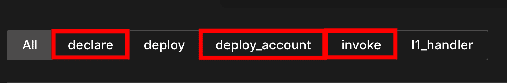
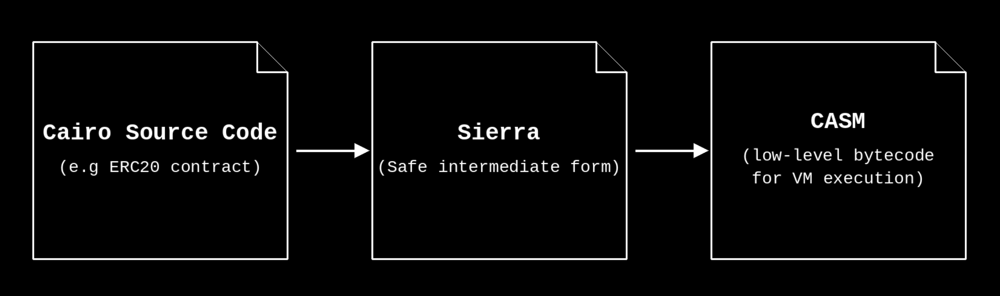
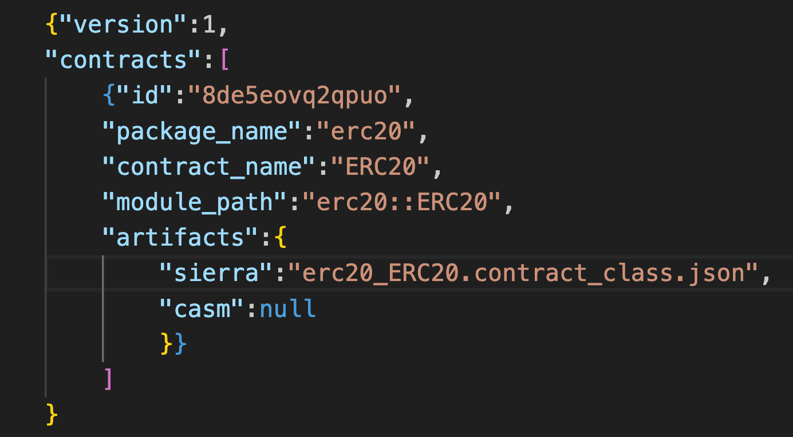
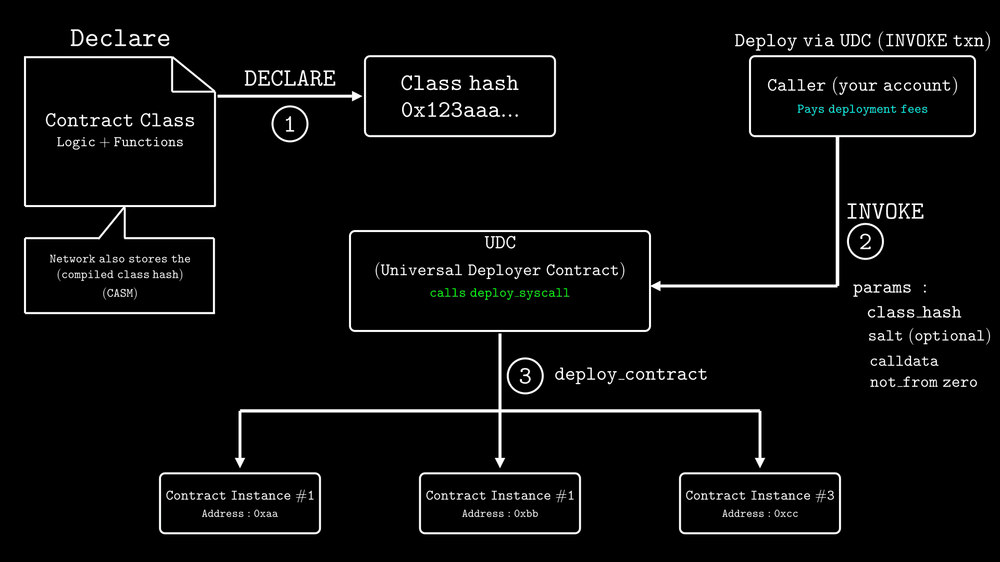
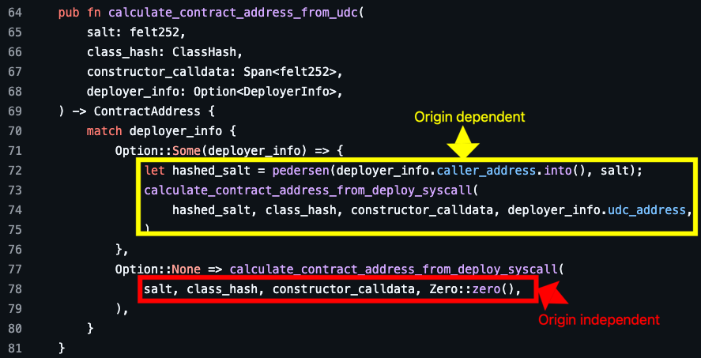
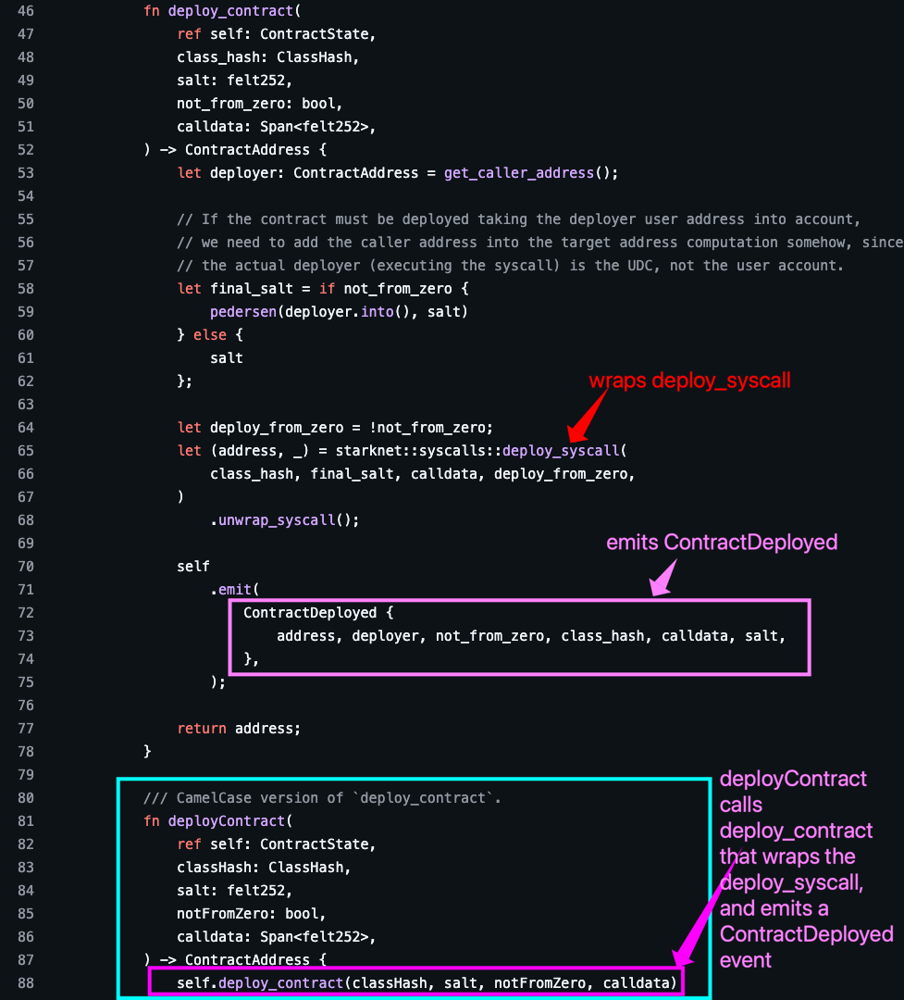
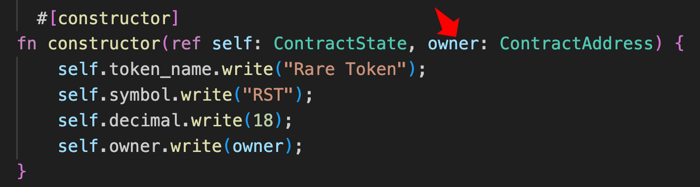

# Understanding Starknet’s Contract Deployment Model

On Ethereum, you deploy a contract in a single transaction. Starknet takes a different approach: deployment is split into two separate transactions, declaration and deployment.

The declaration transaction registers the contract bytecode on-chain and produces a class hash, while the deployment transaction uses that class hash to create a contract instance with its own address and storage. We'll refer to this two-step process as the declare-deploy model throughout this series.

In this article, you'll learn how:

- Starknet's declare-deploy model works behind the scene
- Regular contracts are deployed through the Universal Deployer Contract (UDC), though the UDC can also deploy account contracts as covered later in this article
- Account contracts are deployed through the `DEPLOY_ACCOUNT` transaction type (after the contract bytecode is declared on-chain via a `DECLARE` transaction)

## Deployment on Ethereum vs Starknet

Suppose you want to launch multiple ERC-20 tokens. On Ethereum, each deployment requires uploading the entire contract bytecode and paying gas to store all that data. You repeat this process for every single token contract, even though the code is nearly identical. This means you're paying to store duplicate code repeatedly.

Starknet avoids this by separating the contract class (the bytecode) from the contract instance. Declaring the contract class stores the bytecode on-chain once, then you can deploy as many instances as you need that references the declared class.

This separation also enables contract upgradeability: the logic of a deployed contract can be swapped without changing its address and storage. This is covered in detail in the “[Upgrading Contracts](https://rareskills.io/post/cairo-upgradeable-contract)” article.

To implement this separation, Starknet uses specific transaction types that handle declaration and deployment as separate operations.

## Transaction Types for Deployment on Starknet

Starknet currently defines four transaction types at the protocol level: `DECLARE`, `DEPLOY_ACCOUNT`, `INVOKE`, and `L1_HANDLER`. You can see all of them on the [explorer](https://voyager.online/txns?ps=25&p=1), which may also show the deprecated `DEPLOY` transaction type for backward compatibility. We'll focus on the three relevant to contract deployment (highlighted in red boxes below):



- `DECLARE`: registers contract code on-chain
- `DEPLOY_ACCOUNT`: deploys an account contract.
- `INVOKE`: deploys regular contracts and executes function calls on already deployed contracts. It is the transaction type used for sending tokens, swapping on DEXs, or performing any other contract interaction

`DECLARE` is always used for declaration, while the deployment step uses either `INVOKE` for regular contracts or `DEPLOY_ACCOUNT` for account contracts.

Before we walk through the declaration and deployment process, we need to understand the two types of contracts on Starknet, regular contracts and account contracts, since each of them uses seperate deployment approaches.

| Regular Contract                                                                                                                                                                                                   | Account Contract                                                                                                                                                                                                                                                                                                  |
| ------------------------------------------------------------------------------------------------------------------------------------------------------------------------------------------------------------------ | ----------------------------------------------------------------------------------------------------------------------------------------------------------------------------------------------------------------------------------------------------------------------------------------------------------------- |
| A regular contract is a smart contract that implements application logic like ERC-20 tokens, NFTs, and so on. Regular contracts cannot initiate transactions on their own and must be called by account contracts. | An account contract, on the other hand, is a type of smart contract that can validate that a transaction is authorized and execute transactions. Account contracts serve as the entry point for all transactions on Starknet. Your account on a Ready or Braavos wallet is an account contract deployed on-chain. |

With these two contract types in mind, let's walk through each step of the declare-deploy process.

## Declaring a Contract Class

To declare a contract, we first need to compile our Cairo source code into the format Starknet expects. The compilation process has two stages. First, the compiler converts Cairo code into Sierra (Safe Intermediate Representation). Then, during declaration, the sequencer (the node that orders transactions and builds blocks on Starknet) compiles Sierra into CASM (Cairo Assembly) on-chain.

#### Sierra and CASM

- **Sierra** is an intermediate representation between Cairo code and CASM. It guarantees that every contract execution or Cairo program can be proven, even if a transaction reverts.
  - **A Sierra class** is your contract code in the Sierra format. The distinction between Sierra and Sierra class is analogous to how JSON is a format and a JSON file is a specific document in that format. The Sierra class is what gets declared on-chain because it is stable and verifiable, ensuring that all contract code can always be proven.
- **CASM** is the low-level bytecode that the Cairo VM interprets to execute the contract. It is the final compiled form of our contract, generated from the Sierra class



#### Build Artifacts

When we compile any contract with `scarb build`, for example, our ERC‑20 contract, it produces two build artifacts in the (`target/dev`) directory:

**1. Sierra file** (named `...contract_class.json`)

This is the file that contains the Sierra class, which serves as the blueprint the network uses for declaration. It contains four key fields:

1. `sierra_program`: the contract logic compiled into Sierra bytecode
2. `entry_points_by_type`: the callable entry points of the contract, grouped by type. An entry point is a pair of a `selector` (the `starknet_keccak` hash of the function name, used to identify which function to call) and a `function_idx` (the position of that function's implementation in the `sierra_program` array) that tells the network which function to invoke and where to find it in the Sierra program. The three types are:
   - constructor
   - external functions of the contract
   - l1 handler: functions that handle messages sent from Ethereum to Starknet. This field is part of the Sierra file structure for every contract, but it is empty for contracts like ERC-20 that don't interact with L1
3. `abi`: the contract's interface including function signatures, parameter types, return types, events, and structs.
4. `contract_class_version`: the version of the contract class format

**2. Starknet artifacts file** (named `...starknet_artifacts.json`)

This file contains the contract's metadata and links it to its compiled Sierra file. It is used locally by tools like `sncast` to locate the correct Sierra file for a given contract name:



As you can see in the artifacts file in the image above, the `"casm"` field is `null` at compile time. This is because the CASM will be generated from Sierra class during the declaration process on-chain.

### What happens during a `DECLARE` transaction

With the compiled Sierra class ready, we use a `DECLARE` transaction to register it with the network. Tools like `sncast` or Starknet.js read the `starknet_artifacts.json` file to locate the Sierra class file for the contract, then submits that Sierra class in the `DECLARE` transaction, which our account signs. The sequencer then compiles Sierra to CASM and computes two hashes:

- **Class hash**: computed from all four fields in the Sierra file using the following formula:
  ```rust
  class_hash = h(
      contract_class_version,
      external_entry_points,
      l1_handler_entry_points,
      constructor_entry_points,
      abi_hash,
      sierra_program_hash
  )
  ```
  Where `h` is the Poseidon hash function: a hash function optimized for use inside STARK proofs. Note that `entry_points_by_type` contributes three separate inputs to the formula: `external_entry_points`, `l1_handler_entry_points`, and `constructor_entry_points`
  Before the ABI and Sierra program factor into the computation, each is hashed first:
  - The ABI is hashed using `starknet_keccak(bytes(ABI, "UTF-8"))` to produce the ABI hash (`abi_hash`),
  - The Sierra program is hashed to produce the Sierra program hash (`sierra_program_hash`)
    Since the contract and package name appear throughout the ABI, in event type names such as `erc20::ERC20::Transfer` and interface names such as `erc20::IERC20`, two contracts with identical Cairo code but different contract or package names will produce different ABI hashes and therefore different class hashes, meaning both can be declared successfully. Similarly, two contracts compiled with different compiler versions will produce different `sierra_program_hash` values and therefore different class hashes, even if the Cairo source code is identical. However, if none of these factors differ, the resulting class hash will be identical to one already on-chain, and the network will reject the declaration with a "contract has already been declared" error.
- **Compiled class hash**: computed from the CASM code generated from the Sierra class. It locks in the exact machine code the Cairo VM will execute

Once the sequencer processes the `DECLARE` transaction, the Sierra class, class hash, and compiled class hash are all stored on-chain, making the contract class available for deployment.

## Deploying a Contract Instance

Once a contract class is declared, we can create multiple instances of it. Each instance shares the same code but has its own address and storage. For example, account implementations like Ready (formerly Argent) are declared once on Starknet. When you create a new Ready account, no new declaration is needed because the [Ready class](https://voyager.online/class/0x036078334509b514626504edc9fb252328d1a240e4e948bef8d0c08dff45927f) already exists on-chain. You only pay for the account deployment, not for storing the code again. Your new deployed account gets its own unique address and storage but it uses the same underlying Ready code as all other Ready accounts.

Every deployed contract instance address is computed from the following formula:

```rust
contract_address = pedersen(
    "STARKNET_CONTRACT_ADDRESS",
    deployer_address,
    salt,
    class_hash,
    constructor_calldata_hash)
```

Where `pedersen` is a cryptographic hash function compatible for STARK proofs. It takes five inputs: a constant prefix, the deployer's address, a salt value, the class hash, and a hash of the constructor arguments. Changing any one of these inputs produces a different address, which is why you can deploy multiple instances of the same class hash by varying the salt, constructor arguments, or deployer address.

Deploying a contract instance requires four key components:

1. **Reference:** Which contract class to use
2. **Input:** What data to pass to the constructor
3. **Fee Payment:** Which account pays for the deployment
4. **Creates:** What address the new contract instance gets

However, these components work differently depending on whether you're deploying a regular contract or an account contract:

```
Regular Contracts (INVOKE via Universal Deployer Contract)
├── Reference: Contract class hash (already declared)
├── Input: Constructor calldata + salt
├── Fee Payment: From the sender's account
└── Creates: New contract instance at a deterministic address

Account Contracts (DEPLOY_ACCOUNT)
├── Reference: Account class hash (already declared)
├── Input: Constructor calldata + salt
├── Fee Payment: From the deployed account's own pre-funded address
└── Creates: New account contract at a counterfactual address (calculated before deployment)

Account Contracts (INVOKE via Universal Deployer Contract)
├── Reference: Account class hash (already declared)
├── Input: Constructor calldata + salt
├── Fee Payment: From the deployer's account
└── Creates: New account contract at a deterministic address, linked to the deployer
```

**Regular contracts** are deployed through the Universal Deployer Contract (UDC) via an `INVOKE` transaction. An existing account contract calls the UDC, which then calls `deploy_syscall` to create the new contract. The caller pays the transaction fee. (We'll cover the UDC in detail in the next section).

The diagram below illustrates the complete deployment flow for regular contracts. The numbered steps show the sequence of operations:

1. The `DECLARE` transaction registers the contract class on-chain and produces a class hash
2. Your account sends an `INVOKE` transaction to the UDC, passing the class hash, salt, calldata, and `not_from_zero` as parameters. `not_from_zero` is a boolean that determines whether the deployer's address is factored into the contract address calculation, covered in detail in the UDC section.
3. The UDC then calls `deploy_syscall` internally to create the contract instances, each getting its own unique address

The left side of the diagram shows the declaration step, while the right side shows how the same class hash can be reused to deploy multiple independent instances:



Account contracts can be deployed in two ways:

- **Using the `DEPLOY_ACCOUNT` transaction:** In this type of deployment, the account contract pays for its own deployment. The resulting address is calculated in advance and funded with STRK tokens. A `DEPLOY_ACCOUNT` transaction then deploys the contract and charges fees from that pre-funded address.
- **INVOKE via UDC:** In this type of deployment, an existing account contract calls the UDC to deploy the new account contract through an `INVOKE` transaction, just like regular contracts. The deployer pays the transaction fee.

Now that we've covered the declare-deploy model at a high level, let's examine each deployment method in detail.

## Deploying Contracts Through the Universal Deployer Contract (UDC)

A UDC is a singleton contract created by OpenZeppelin that wraps the `deploy_syscall` function, exposing it as a callable interface that account contracts can invoke. It serves as a standardized generic factory for Starknet contracts. It is deployed at address [`0x02ceed65a4bd731034c01113685c831b01c15d7d432f71afb1cf1634b53a2125`](https://sepolia.voyager.online/contract/0x02ceed65a4bd731034c01113685c831b01c15d7d432f71afb1cf1634b53a2125) on both Starknet sepolia and mainnet.

The UDC provides this interface:

```rust
#[starknet::interface]
pub trait IUniversalDeployer {
    fn deploy_contract(
        class_hash: ClassHash,
        salt: felt252,
        not_from_zero: bool,    // Determines deployment type
        calldata: Span<felt252> // Constructor parameters
    ) -> ContractAddress;
}
```

**With parameters:**

- `class_hash`: The class hash of the contract to deploy
- `salt`: The salt value for address calculation
- `not_from_zero`: A boolean that determines whether the deployer’s address is factored into the contract address calculation. When `true`, it is included. When `false`, it is not.
- `calldata`: Constructor parameters for the newly deployed contract

_Note: The current UDC version includes changes from earlier versions:_

- _`deployContract` was replaced with snake_case `deploy_contract`_
- _`unique` parameter was replaced with `not_from_zero` (with inverted semantics)_

### UDC Deployment Types

The UDC provides two deployment types that determine how contract addresses are calculated, controlled by the `not_from_zero` parameter:

1. Origin-Dependent Deployment
2. Origin-Independent Deployment

The UDC uses `calculate_contract_address_from_udc`, a utility function from OpenZeppelin's contracts library, that maps `not_from_zero` to either the UDC’s address or `0` before calling the standard address calculation:



1. **Origin-Dependent Deployment (`not_from_zero = true`)**

When using origin-dependent deployment, the deployer's address (`udc_address`) becomes part of the address calculation. This creates a "reserved address space" where only the owner (`caller_address`) of the deploying account can deploy contracts to those specific addresses.

The UDC modifies the `salt` passed by hashing it with the `caller's address` using Pedersen hash: `hashed_salt = pedersen(caller_address, salt)`, it then uses this modified salt (`hashed_salt`) together with:

- `class_hash` (the contract class being deployed)
- `constructor_calldata`(constructor parameters)
- `deployer_info.udc_address` (the UDC contract's address as the deployer)

in the standard contract address calculation.

This approach provides address reservation, preventing others from deploying to "your" addresses. Each deployer gets their own address space, and only you can deploy to addresses derived from your account. You'd choose this method when you want to ensure no one else can deploy to your intended addresses.

2. **Origin-Independent Deployment (`not_from_zero = false`)**

With origin-independent deployment, contract addresses are calculated independently of who deploys them. The address depends only on the salt, class hash, and constructor parameters.

The UDC uses the original salt that was passed unchanged and passes `0` as the deployer in the standard contract address calculation.

This makes deployments deterministic across deployers, anyone deploying the same contract with identical parameters gets the same address. However, only the first deployment will succeed; subsequent attempts with the same parameters will not go through since the address is already taken. This method works well when you want contract addresses to be completely predictable regardless of who deploys them, such as for deploying standard contracts across multiple networks.

### How UDC Deployment Works

Your account contract makes a `INVOKE` call to the UDC's `deployContract` function to create the new contract:



The `deployContract` function (shown in the blue box at the bottom) is a camelcase wrapper that calls the underlying `deploy_contract` function (shown in the main code block above), which receives parameters:`class_hash, salt`,`not_from_zero`, `calldata` .

The sequencer validates your account's `INVOKE` transaction, the UDC then captures the caller's address using `get_caller_address()`, this is your account address that initiated the `INVOKE` transaction, modifies the salt based on deployment type:

```rust
let final_salt = if not_from_zero {
    pedersen(caller_address.into(), salt)  // Origin-dependent: hash caller + salt
} else {
    salt                                   // Origin-independent: use original salt
};
```

With the modified (final) salt ready, the UDC wraps `deploy_syscall()` (highlighted in red) using the class hash, final salt, constructor calldata, and deployment type to create the actual contract instance.

The sequencer executes the contract's constructor with the provided arguments, and charges deployment fees from the calling account (not the newly deployed contract).

Upon successful deployment, the UDC emits a `ContractDeployed` event (highlighted in pink) containing the deployment information including the new contract address, deployer, deployment type, class hash, calldata, and original salt for tracking purposes. The function then returns the newly deployed contract address to the caller.

_**Note: When deploying contracts that use `get_caller_address()` in their constructor, remember that the UDC deploys the contract, not your account directly. Therefore, `get_caller_address()` returns the UDC's address, not your account's address.** This is why we passed the owner's address as a parameter in our token contract example._



### UDC for Account Contracts

While the UDC is primarily used for deploying regular contracts, it can also deploy account contracts as mentioned earlier. In this case, the deploying account pays the fees and the new account contract is linked to the deployer on-chain. This approach is useful when you don't need the new account to be pristine.

## Deploying Account Contracts: The `DEPLOY_ACCOUNT` Transaction

Deploying your first account contract presents a bootstrap problem: how do you pay for the deployment if you don't have an account yet?

Starknet solves this through counterfactual deployment, where the account address is computed and funded before the contract is deployed. “Counterfactual” means the address is treated as if it already exists before it actually does on-chain. Using a deterministic formula based on the salt, class hash, and constructor calldata, you can calculate the address in advance, fund it, and then deploy the contract to that exact address.

**The process**:

1. Calculate what the account address will be before deployment
2. Fund the pre-computed address with tokens (via [faucet](http://faucet.starknet.io/) for testnet)
3. Submit a `DEPLOY_ACCOUNT` transaction

**When the sequencer receives this transaction, it:**

- Verifies the deployment signature
- Runs the constructor with the provided arguments
- Charges fees from the newly deployed account's address (completing the bootstrap solution!)

This method is ideal for first-time account creation since the account pays for its own deployment using the pre-funded balance, eliminating the need for an existing account contract to sponsor the deployment. This is the preferred method for deploying account contracts when you want the account to be pristine, not linked to any other account, such as Ready or Braavos accounts.

The table below summarises the key differences between the two contract deployment methods:

| **Aspect**                | **`DEPLOY_ACCOUNT` transaction**                                      | **UDC Method**                                                                   |
| ------------------------- | --------------------------------------------------------------------- | -------------------------------------------------------------------------------- |
| **Use case**              | Account contract deployment (independent, not linked to any deployer) | Regular contract deployment, or account contract deployment (linked to deployer) |
| **Fee payer**             | The account being deployed (pre-funded)                               | Your existing account                                                            |
| **Transaction type**      | `DEPLOY_ACCOUNT`                                                      | `INVOKE`                                                                         |
| **deploy_syscall access** | Protocol-level mechanism                                              | Via UDC wrapper                                                                  |
| **Bootstrap problem**     | Solves it (no prior account needed)                                   | Requires existing account                                                        |
| **Address type**          | Counterfactual                                                        | Deterministic                                                                    |
| **Resulting account**     | Pristine, not linked to any other account                             | Linked to the deployer on-chain                                                  |

## Wrapping Up

In this article, we explored how Starknet's declare-deploy model separates contract code from state, enabling efficient deployment through the `DECLARE`, `INVOKE`, and `DEPLOY_ACCOUNT` transaction types. We examined how Sierra and CASM work together during declaration, and how the two deployment methods (`DEPLOY_ACCOUNT` for accounts that exist independently and the Universal Deployer Contract for regular contracts) handle different use cases.
In the next article, we'll walk through deploying the ERC-20 contract from our previous guide using both sncast and Starknet.js, and show you how to interact with your deployed contracts.
