# Deploying Contracts on Starknet

In the previous article, we covered Starknet's declare-deploy model, including the deployment paths for regular and account contracts. This article puts those concepts into practice. Using the ERC-20 contract from the ERC-20 chapter as our deployment example, we'll walk through the full deployment workflow with both Starknet Foundry (`sncast`) and `Starknet.js`: setting up an account to sign transactions, declaring the ERC-20 contract class, deploying an ERC-20 contract instance, and interacting with the deployed contract.

## Contract Setup

Create a new Scarb project with `scarb new erc20`, navigate into the project directory with `cd erc20`, then replace the contents of `src/lib.cairo` with the following code:

```rust
use starknet::ContractAddress;

#[starknet::interface]
pub trait IERC20<TContractState> {
    fn total_supply(self: @TContractState) -> u256;
    fn balance_of(self: @TContractState, account: ContractAddress) -> u256;
    fn allowance(self: @TContractState, owner: ContractAddress, spender: ContractAddress) -> u256;
    fn transfer(ref self: TContractState, recipient: ContractAddress, amount: u256) -> bool;
    fn transfer_from(
        ref self: TContractState, sender: ContractAddress, recipient: ContractAddress, amount: u256,
    ) -> bool;
    fn approve(ref self: TContractState, spender: ContractAddress, amount: u256) -> bool;

    fn name(self: @TContractState) -> ByteArray;
    fn symbol(self: @TContractState) -> ByteArray;
    fn decimals(self: @TContractState) -> u8;

    fn mint(ref self: TContractState, recipient: ContractAddress, amount: u256) -> bool; // For testing purposes
}

#[starknet::contract]
pub mod ERC20 {
    use starknet::{ContractAddress, get_caller_address};
    use starknet::storage::{
        Map, StoragePointerWriteAccess, StoragePointerReadAccess, StoragePathEntry,
    };

    #[storage]
    pub struct Storage {
        balances: Map<ContractAddress, u256>,
        allowances: Map<
            (ContractAddress, ContractAddress), u256,
        >, //  (owner, spender) -> amount
        token_name: ByteArray,
        symbol: ByteArray,
        decimal: u8,
        total_supply: u256,
        owner: ContractAddress,
    }

    #[event]
    #[derive(Drop, starknet::Event)]
    pub enum Event {
        Transfer: Transfer,
        Approval: Approval,
    }

    #[derive(Drop, starknet::Event)]
    pub struct Transfer {
        #[key]
        from: ContractAddress,
        #[key]
        to: ContractAddress,
        amount: u256,
    }

    #[derive(Drop, starknet::Event)]
    pub struct Approval {
        #[key]
        owner: ContractAddress,
        #[key]
        spender: ContractAddress,
        value: u256,
    }

      #[constructor]
    fn constructor(ref self: ContractState, owner: ContractAddress) {
        self.token_name.write("Rare Token");
        self.symbol.write("RST");
        self.decimal.write(18);
        self.owner.write(owner);
    }

    #[abi(embed_v0)]
    impl ERC20Impl of super::IERC20<ContractState> {
        fn total_supply(self: @ContractState) -> u256 {
            self.total_supply.read()
        }
        fn balance_of(self: @ContractState, account: ContractAddress) -> u256 {
            let balance = self.balances.entry(account).read();
            balance
        }

        fn name(self: @ContractState) -> ByteArray {
            self.token_name.read()
        }

        fn symbol(self: @ContractState) -> ByteArray {
            self.symbol.read()
        }

        fn decimals(self: @ContractState) -> u8 {
            self.decimal.read()
        }

        fn allowance(
            self: @ContractState, owner: ContractAddress, spender: ContractAddress,
        ) -> u256 {
            let allowance = self.allowances.entry((owner, spender)).read();

            allowance
        }

        fn transfer(ref self: ContractState, recipient: ContractAddress, amount: u256) -> bool {
            let sender = get_caller_address();

            let sender_prev_balance = self.balances.entry(sender).read();
            let recipient_prev_balance = self.balances.entry(recipient).read();

            assert(sender_prev_balance >= amount, 'Insufficient amount');

            self.balances.entry(sender).write(sender_prev_balance - amount);
            self.balances.entry(recipient).write(recipient_prev_balance + amount);

            assert(
                self.balances.entry(recipient).read() > recipient_prev_balance,
                'Transaction failed',
            );
            self.emit(Transfer { from: sender, to: recipient, amount });

            true
        }

        fn transfer_from(
            ref self: ContractState,
            sender: ContractAddress,
            recipient: ContractAddress,
            amount: u256,
        ) -> bool {
            let spender = get_caller_address();

            let spender_allowance = self.allowances.entry((sender, spender)).read();
            let sender_balance = self.balances.entry(sender).read();
            let recipient_balance = self.balances.entry(recipient).read();

            assert(amount <= spender_allowance, 'amount exceeds allowance');
            assert(amount <= sender_balance, 'amount exceeds balance');

            self.allowances.entry((sender, spender)).write(spender_allowance - amount);
            self.balances.entry(sender).write(sender_balance - amount);
            self.balances.entry(recipient).write(recipient_balance + amount);

            self.emit(Transfer { from: sender, to: recipient, amount });

            true
        }

        fn approve(ref self: ContractState, spender: ContractAddress, amount: u256) -> bool {
            let caller = get_caller_address();

            self.allowances.entry((caller, spender)).write(amount);

            self.emit(Approval { owner: caller, spender, value: amount });

            true
        }

        fn mint(ref self: ContractState, recipient: ContractAddress, amount: u256) -> bool {
            let caller = get_caller_address();
            assert(caller == self.owner.read(), 'Call not owner');

            let previous_total_supply = self.total_supply.read();
            let previous_balance = self.balances.entry(recipient).read();

            self.total_supply.write(previous_total_supply + amount);
            self.balances.entry(recipient).write(previous_balance + amount);

            let zero_address: ContractAddress = 0.try_into().unwrap();

            self.emit(Transfer { from: zero_address, to: recipient, amount });

            true
        }
    }
}
```

We'll deploy this contract using two approaches: Starknet Foundry (`sncast`) and `Starknet.js`. Both approaches follow the same deployment steps:

1. Set up an account to sign transactions and pay gas fees
2. Declare an ERC-20 contract class to register the code on-chain and get a class hash
3. Deploy the ERC-20 contract instance to create a live instance from that class hash

## Deploying with Starknet Foundry (`sncast`)

### Account Setup

We need an account contract to sign transactions and pay for the deployment. If you already have a `sncast` account configured, you can skip to the declaration step. Otherwise, let's create one.

The command for creating an account using `sncast` is:

```bash
sncast account create --network <NETWORK_NAME> --name <ACCOUNT_NAME>
```

Where:

- `<NETWORK_NAME>` is the network you want to deploy to (e.g., `sepolia`, `mainnet`)
- `<ACCOUNT_NAME>` is an arbitrary local identifier you choose to reference this account (e.g., `my_account`, `deployer_account`)

For example, to create an account on Sepolia:

```
sncast account create --network sepolia --name new_account_1
```

When you run the above command, `sncast`:

- generates a private/public key pair locally
- computes the account address deterministically from the public key and salt
- saves the account details in a local JSON file (`~/.starknet_accounts/starknet_open_zeppelin_accounts.json`). Inspect the file with:

```rust
cat ~/.starknet_accounts/starknet_open_zeppelin_accounts.json
```

- The address becomes known to the network (in our case, sepolia) but no account contract is deployed yet.

> Note: We use `account create` here (instead of `declare`) since account contract classes are typically pre-declared by their providers. In this case, OpenZeppelin has already declared the account contract class we are using, so we are only creating an instance of it, not declaring a new one.

After running the `create` command, your output should look as follows:

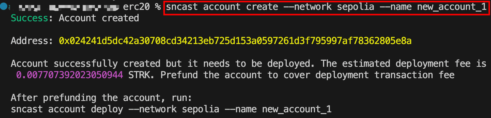

If you search the address on [Voyager](https://sepolia.voyager.online/?lang=en&theme=dark), you’ll notice that the account address exists but with a status of “Uninitialized”. This shows that the account contract hasn't been deployed yet.

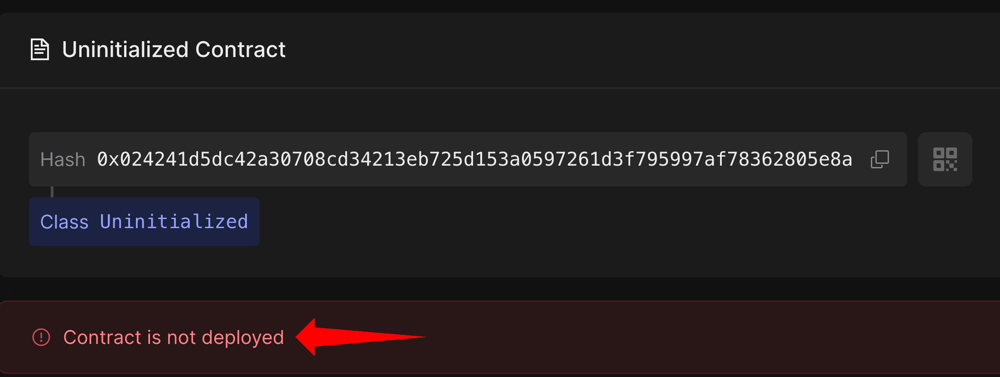

To deploy the newly created account, copy the address from the output and fund it with STRK tokens from the [Starknet faucet](https://faucet.starknet.io/). This is the counterfactual deployment process we discussed in the previous article: the account pays for its own deployment from its pre-funded address, resulting in a new account that exists independently and is not linked to any other account.

Once you've gotten the test tokens, deploy the account using:

```bash
sncast account deploy --network sepolia --name <ACCOUNT_NAME>
```

Replace `<ACCOUNT_NAME>` with the same name used during account creation. For this example, we’ll use `new_account_1` since that’s what we used in the `account create` step:

```
sncast account deploy --network sepolia --name new_account_1
```

After running the above command, `sncast` will prompt you to make this account the local or global default. A local default applies only to the current project, while a global default applies across all Scarb projects. For this tutorial, choose local. Once you confirm, the account is deployed:

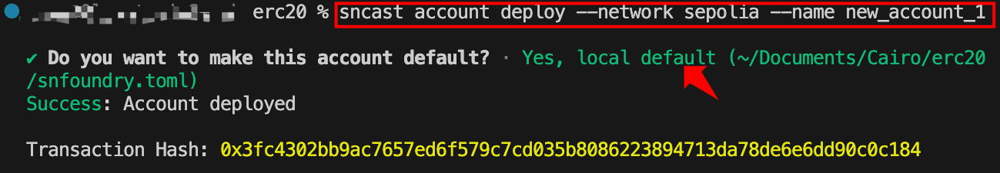

If you check the transaction on [Voyager](https://sepolia.voyager.online/contract/0x024241d5dc42a30708cd34213eb725d153a0597261d3f795997af78362805e8a), you'll notice the transaction type is `DEPLOY_ACCOUNT`. This is the protocol-level transaction type dedicated to first-time account creation, where no existing account is needed to sponsor the deployment.

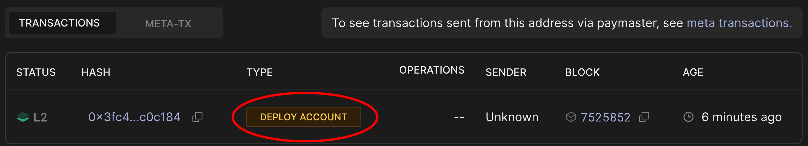

During this transaction, the sequencer validates the deployment, runs the account constructor with your public key, and charges the deployment fees from the pre-funded address. Your account contract is now live on Starknet.

### Declaring the ERC-20 Contract Class

Unlike account contracts which are pre-declared by their providers, regular contracts like our ERC-20 must be declared by us before deployment.

The syntax for declaring a regular contract is:

```bash
sncast --account <ACCOUNT_NAME> \
declare \
--url <URL> \
--contract-name <CONTRACT_NAME>
```

Where:

- `<ACCOUNT_NAME>`: the name of the account you created and deployed earlier
- `<URL>`: the RPC endpoint URL for the network you're deploying to
- `<CONTRACT_NAME>`: the name of the contract module, for example `ERC20` from `mod ERC20 {}`

To declare our ERC-20 contract on Sepolia, run the following command, replacing `{apiKey}` with your [Alchemy](https://dashboard.alchemy.com/) API key and `new_account_1` with your account name:

```rust
sncast --account new_account_1 \
   declare \
   --url https://starknet-sepolia.g.alchemy.com/starknet/version/rpc/v0_10/{apiKey} \
   --contract-name ERC20
```

Recall that declaration registers your contract code on-chain and returns a class hash. Here's what happens during this process:

- **Compilation**: `sncast` reads your Sierra file, compiles it to CASM (Cairo Assembly) locally, and computes the compiled class hash from that CASM
- **Transaction submission**: `sncast` sends both the Sierra class and the locally-computed compiled class hash to the sequencer, signed by your account
- **Sequencer verification**: The sequencer compiles the Sierra to CASM and verifies that its compiled class hash matches what you provided
- **Network storage**: If the hashes match, both the Sierra class and compiled class hash are stored on Starknet
- **Class hash returned**: The sequencer returns the class hash (computed from Sierra), which identifies this contract class.

The output shows both the transaction hash and the class hash. Copy the class hash as we'll need it to deploy the contract instance:

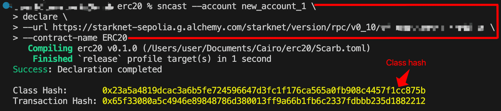

`sncast` provides a ready-to-use deployment command in the output. You can copy that generated command directly, or use the format below for better readability. Both approaches work identically.

### Deploying Contract Instances via UDC

With our contract class declared, we can now deploy any number of instances from that class hash. The `sncast deploy` command abstracts away the UDC interaction, and handles the deployment under the hood.

The syntax to deploy a contract is:

```bash
sncast \
 --account <ACCOUNT_NAME> \
 deploy \
 --class-hash <CLASS_HASH> \
 --arguments "<CONSTRUCTOR_ARGS>" \
 --url <URL>
```

By default, `sncast` generates a random salt to ensure a unique contract address. If you need to predict or reproduce the resulting contract address, you can pass `--salt` with a specific value, for example `--salt 0x146`. You can also pass `--unique`, which modifies the salt using your deployer address to ensure the address is unique to your account. For this tutorial, we omit both flags and let `sncast` generate the salt automatically.

To deploy an instance of our ERC-20 contract, run the following command. Replace the `<OWNER_ADDRESS>` with your actual account address and `{apiKey}` with your Alchemy API key. You can use the class hash from your own declaration or the one provided below:

```rust
sncast \
 --account new_account_1 \
 deploy \
 --class-hash 0x23a5a4819dcac3a6b5fe724596647d3fc1f176ca565a0fb908c4457f1cc875b \
 --arguments "<OWNER_ADDRESS>" \
 --url https://starknet-sepolia.g.alchemy.com/starknet/version/rpc/v0_10/{apiKey}
```

The owner address can be wrapped in either single or double quotes. This address will be set as the contract owner, meaning only this account will be authorized to mint tokens, so make sure it's the address you intend to use to interact with the contract.

You'll receive a transaction receipt in your terminal with the contract address:

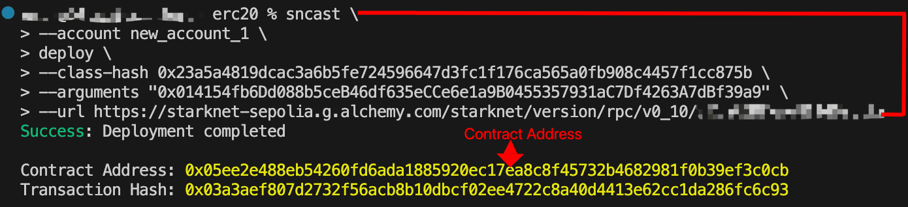

You can verify the deployment on [Voyager](https://sepolia.voyager.online/tx/0x3a3aef807d2732f56acb8b10dbcf02ee4722c8a40d4413e62cc1da286fc6c93). Notice the transaction type is `INVOKE` and the operation is `deployContract`. This confirms that `sncast` deployed the contract through the UDC:

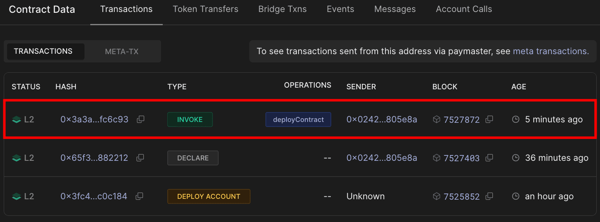

Click on the [transaction](https://sepolia.voyager.online/tx/0x3a3aef807d2732f56acb8b10dbcf02ee4722c8a40d4413e62cc1da286fc6c93) hash to open the transaction details. This shows the exact parameters passed to the UDC's `deployContract` function:

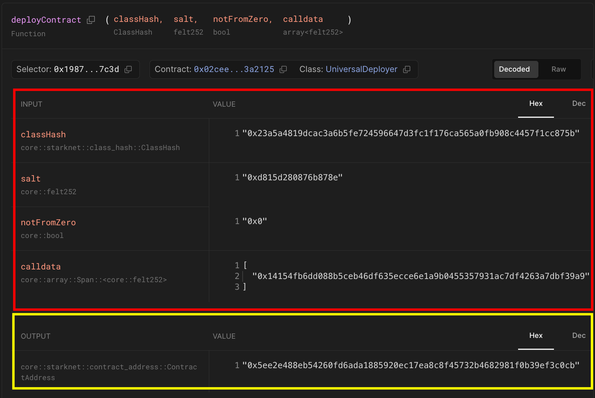

When you ran the contract deployment command, `sncast` handled the UDC interaction automatically:

- Since no `--salt` was provided, `sncast` generates a random salt (`0xd815d280876b878e` as shown in the second row of the input data table) to ensure a unique contract address
- Your account sends an `INVOKE` transaction to the UDC with:
  - `classHash`: `0x23a5a4819dcac3a6b5fe724596647d3fc1f176ca565a0fb908c4457f1cc875b` (first row in the input data table)
  - `salt`: `0xd815d280876b878e` (second row in the input data table)
  - `notFromZero`: `0x0` (false); since `--unique` was not passed, the contract address is derived from the deployer's address rather than the zero address
  - `calldata`: `[0x14154fb6dd088b5ceb46df635ecce6e1a9b0455357931ac7df4263a7dbf39a9]` (fourth row in the input data table - your constructor arguments, the owner's address)
- The UDC calls `deployContract` to create your contract instance returning the contract address `0x02ceed65a4bd731034c01113685c831b01c15d7d432f71afb1cf1634b53a2125` (in the output data field highlighted in yellow)

## Deploying with Starknet.js

As an alternative to using Starknet Foundry's `sncast` command, we can also deploy our contract using `Starknet.js`. This approach lets you deploy programmatically, making it easier to automate deployments or integrate them into your development workflow.

### Setting Up the Environment

Since the ERC-20 contract class was already declared on-chain using the `sncast` approach, attempting to declare the same code again from the same project with the same compiler version will result in a “_contract has already been declared”_ error, because an identical class hash already exists on-chain. To avoid this error, we'll create a new Scarb project:

```bash
scarb new erc20_starknetjs
cd erc20_starknetjs
```

Copy the same ERC-20 contract code from the Contract Setup section into `src/lib.cairo`, then compile the project using `scarb build`. This gives you a clean slate for declaration and deployment using `Starknet.js`.

Now, create a `scripts` folder for the deployment code:

```bash
mkdir scripts
```

Install the required packages for the deployment script:

```bash
npm install starknet dotenv
npm install -D typescript @types/node tsx
```

**Package purposes:**

- **starknet** is the official library for interacting with Starknet contracts
- **dotenv** loads environment variables from a `.env` file
- **typescript & @types/node** is typescript support for our script
- **tsx** is the modern typescript runner that handles ES modules

Configure your project to use ES module syntax (import/export) instead of CommonJS (require/module.exports) by adding the `"type": "module"` field to your `package.json` :

```json
{
  "dependencies": {
    "dotenv": "^17.2.3",
    "starknet": "^9.2.1"
  },
  "type": "module",
  "devDependencies": {
    "@types/node": "^25.0.3",
    "tsx": "^4.21.0",
    "typescript": "^5.9.3"
  }
}
```

This allows us to use `import` statements instead of the older `require()` syntax.

Create a `.env` file in your project root:

```
PRIVATE_KEY=your_private_key_here
ALCHEMY_API_KEY=your_alchemy_api_key_here
OWNER_ADDRESS=your_owner_address_here
```

Since we'll be calling write functions on the deployed contract through Voyager, you'll need to connect a wallet like Ready or Braavos. You have two options:

**Option 1: Import the account we created (Recommended)**

Import the account we created earlier into Ready wallet using the private key from `~/.starknet_accounts/starknet_open_zeppelin_accounts.json`. Follow this guide to import your account:

<video src="https://r2media.rareskills.io/CairoVideos/import-account.mp4" type="video/mp4" autoplay loop muted controls></video>

Once imported, set the following in your `.env` file:

- `OWNER_ADDRESS`: The imported account's address (same as in the JSON file)
- `PRIVATE_KEY`: The private key from the JSON file

**Option 2: Use your existing account**

If you already have an Ready or Braavos Sepolia account, you can use those credentials instead:

- `OWNER_ADDRESS`: Your existing wallet address
- `PRIVATE_KEY`: Your existing wallet's private key

> Add `.env` to your `.gitignore` file to avoid committing your private key to version control.

### Generating the CASM File

Before running the deployment script, you need to generate the CASM file from your Sierra file. Newer versions of Scarb don't automatically generate CASM files when you run `scarb build`.

This requires the Sierra compiler, which you can install by running:

```rust
cargo install starknet-sierra-compile
```

Once installed, compile your Sierra file to CASM by running

```rust
starknet-sierra-compile \
target/dev/erc20_starknetjs_ERC20.contract_class.json \
target/dev/erc20_starknetjs_ERC20.compiled_contract_class.json
```

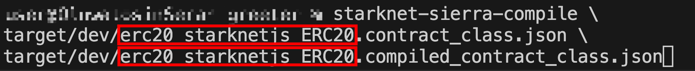

This command takes two arguments:

- **Input:** `target/dev/erc20_starknetjs_ERC20.contract_class.json` - the Sierra file generated by `scarb build`
- **Output:** `target/dev/erc20_starknetjs_ERC20.compiled_contract_class.json` - the CASM bytecode file that will be created

> The filename follows the pattern `{package_name}_{contract_module_name}`. If your contract name differs from `erc20_starknetjs_ERC20`, adjust both file paths accordingly, then run the command.

You'll see the newly generated `.compiled_contract_class.json` file in your `target/dev` directory, containing the CASM bytecode needed for deployment.

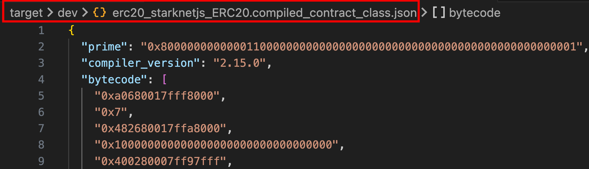

### Writing the Deployment Script

The script we're creating automates every step of the deployment process. It connects to Starknet Sepolia, initializes your account using your private key, and retrieves the Sierra and CASM files.

Create `scripts/deploy.ts` with the following code:

```tsx
import { Account, RpcProvider, json, CallData } from "starknet";
import fs from "fs";
import * as dotenv from "dotenv";
dotenv.config();

async function main() {
  // Setup provider with Alchemy RPC URL
  const provider = new RpcProvider({
    nodeUrl: `https://starknet-sepolia.g.alchemy.com/starknet/version/rpc/v0_10/${process.env.ALCHEMY_API_KEY}`,
  });

  // Setup account
  const account = new Account({
    provider: provider,
    address: process.env.OWNER_ADDRESS!,
    signer: process.env.PRIVATE_KEY!,
  });

  // Read the compiled contract files
  const compiledSierra = json.parse(
    fs
      .readFileSync("./target/dev/erc20_starknetjs_ERC20.contract_class.json")
      .toString("ascii")
  );
  const compiledCasm = json.parse(
    fs
      .readFileSync(
        "./target/dev/erc20_starknetjs_ERC20.compiled_contract_class.json"
      )
      .toString("ascii")
  );

  // Declare the contract
  console.log("\nDeclaring contract...");
  const declareResponse = await account.declare({
    contract: compiledSierra,
    casm: compiledCasm,
  });
  console.log(
    "Declaration transaction hash:",
    declareResponse.transaction_hash
  );

  await provider.waitForTransaction(declareResponse.transaction_hash);

  // Prepare constructor arguments
  const myCallData = new CallData(compiledSierra.abi);
  const constructorCalldata = myCallData.compile("constructor", {
    owner: account.address,
  });

  // Deploy the contract
  console.log("\nDeploying contract...");
  const deployResponse = await account.deployContract({
    classHash: declareResponse.class_hash,
    constructorCalldata: constructorCalldata,
  });
  console.log("Deployment transaction hash:", deployResponse.transaction_hash);

  await provider.waitForTransaction(deployResponse.transaction_hash);

  console.log("\nDeployment Summary:");
  console.log("━━━━━━━━━━━━━━━━━━━━━━━━━━━━━━━━━━━━━━━━");
  console.log("Class Hash:", declareResponse.class_hash);
  console.log("Contract Address:", deployResponse.contract_address);
  console.log("━━━━━━━━━━━━━━━━━━━━━━━━━━━━━━━━━━━━━━━━");
}

main()
  .then(() => process.exit(0))
  .catch((error) => {
    console.error("\nDeployment failed:", error);
    process.exit(1);
  });
```

Update the contract name in your deployment script with the correct name if yours differs from `erc20_starknetjs_ERC20`.

To find the correct name for your project, run:

```bash
ls target/dev/*.contract_class.json
```

For example, if you see `my_token_MyERC20.contract_class.json`, update the file paths like this:

```tsx
// Change from:
fs.readFileSync("./target/dev/erc20_starknetjs_ERC20.contract_class.json");

// To:
fs.readFileSync("./target/dev/my_token_MyERC20.contract_class.json");
```

Do the same for both `.contract_class.json` and `.compiled_contract_class.json` files.

**Key differences from `sncast`:**

`Starknet.js` takes a different approach compared to the starknet foundry command-line approach. Instead of running separate declare and deploy commands, the `declareAndDeploy()` function handles both steps in one go, which means you don't have to copy class hashes between commands. While both approaches rely on the UDC for deployment, `Starknet.js` allows us to programmatically control aspects like salt generation and deployment types, making it easier to build automated deployment scripts with proper error handling.

Run the following command to deploy your contract:

```jsx
npx tsx scripts/deploy.ts
```

If successful, you'll see the output as follows:

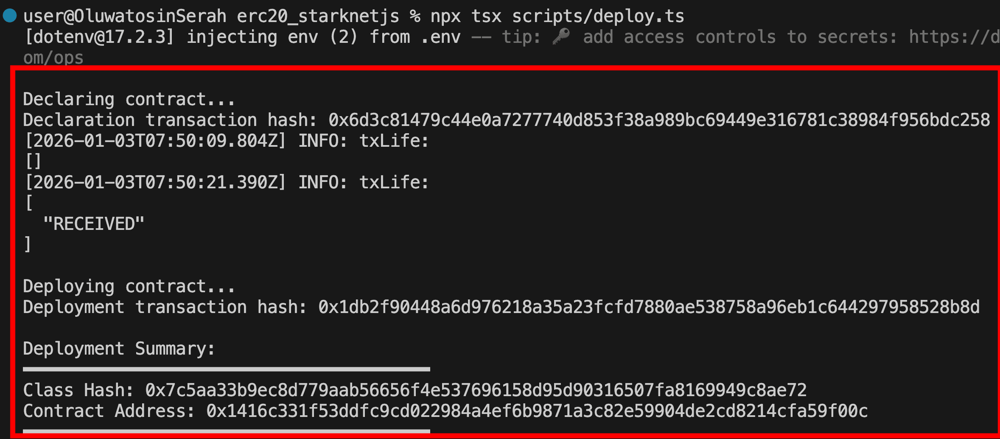

## Interacting with the Deployed Contract on Voyager

Now that the contract is deployed, we can interact with it through Voyager's web interface. Go to the deployed contract on Voyager Sepolia. Click on the "[Write Contract](https://sepolia.voyager.online/contract/0x05ee2e488eb54260fd6ada1885920ec17ea8c8f45732b4682981f0b39ef3c0cb)" tab. This interface shows all the contract's public functions.

Connect your wallet (Ready or Braavos) and ensure you're using the wallet that has the address you set as owner. This is important because only the owner can call restricted functions like `mint`.

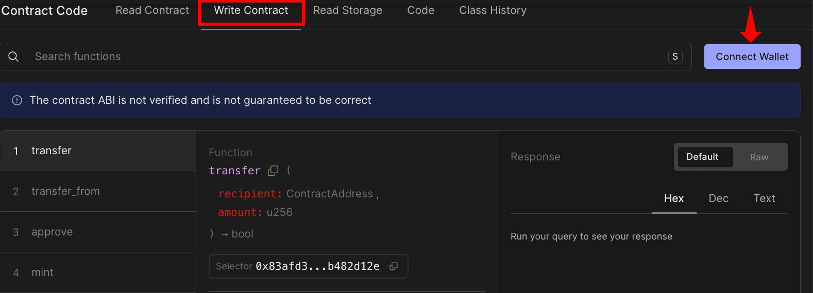

Mint tokens In the **_Write_** section, find the `mint` function and fill in the parameters:

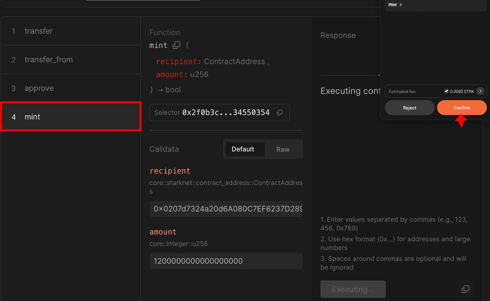

Click **_"Write"_** and confirm the transaction in your wallet. After confirmation, you'll receive the transaction hash.

Switch to the **_Read_** section and find `total_supply`. Click **_"Query_"** to see the result:

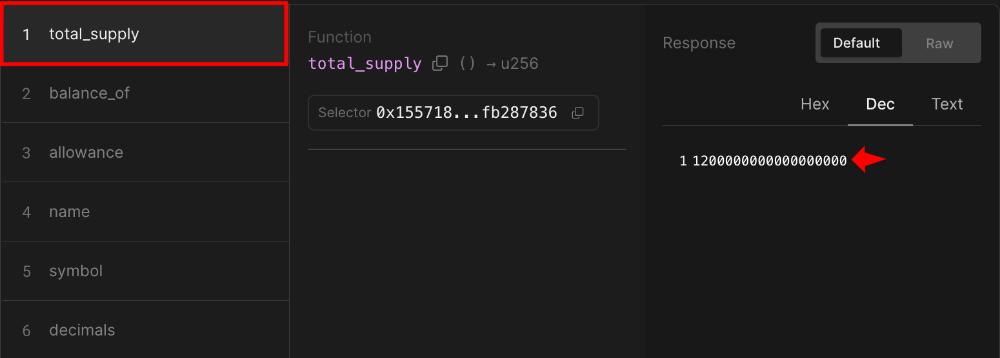

Check your balance In the same **_Read_** section, use `balance_of` with the address you just minted tokens to. Click **"_Query_"** to confirm you received `1200000000000000000` (which equals 1000 minted Raretokens).

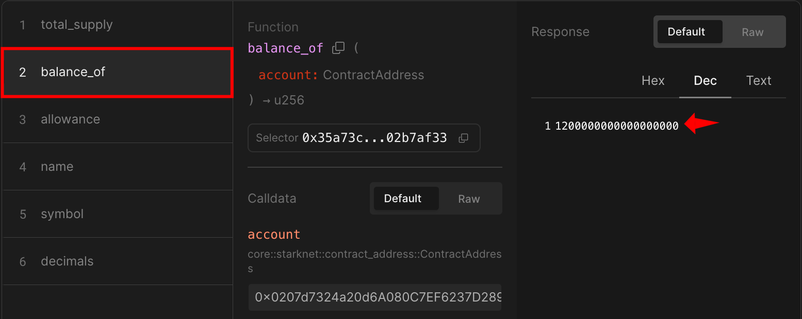

You can experiment further by transferring tokens to other addresses, minting more tokens, or checking allowances to fully test your contract's functionality.

## Interacting with ERC-20 using `Starknet.js`

We've seen how to interact with contracts through Voyager web interface. Now let's do the same using `Starknet.js` instead. The script below mints tokens to an account and displays the transaction confirmation with event details. Create `scripts/interact.ts` with the following code:

```tsx
import { Account, RpcProvider, Contract } from "starknet";
import * as dotenv from "dotenv";
dotenv.config();

async function interactWithERC20() {
  // initialize provider for Sepolia testnet
  const provider = new RpcProvider({
    nodeUrl: `https://starknet-sepolia.g.alchemy.com/starknet/version/rpc/v0_10/${process.env.ALCHEMY_API_KEY}`,
  });

  // initialize account
  const account = new Account({
    provider: provider,
    address: process.env.OWNER_ADDRESS!,
    signer: process.env.PRIVATE_KEY!,
  });

  // REPLACE WITH YOUR DEPLOYED CONTRACT ADDRESS
  const contractAddress =
    "0x1416c331f53ddfc9cd022984a4ef6b9871a3c82e59904de2cd8214cfa59f00c";

  // fetch contract ABI from deployed contract
  const { abi } = await provider.getClassAt(contractAddress);
  if (abi === undefined) {
    throw new Error("ABI not found");
  }

  // create contract instance
  const contract = new Contract({
    abi,
    address: contractAddress,
    providerOrAccount: provider,
  });

  // prepare the mint call data
  const call = contract.populate("mint", [
    account.address,
    3000000000000000000000n, // mint 3000 tokens (with 18 decimals)
  ]);

  console.log("Minting tokens...");

  // execute the transaction through the account
  const { transaction_hash: mintTxHash } = await account.execute(call);

  console.log("Transaction hash:", mintTxHash);

  // wait for transaction confirmation
  const receipt = await provider.waitForTransaction(mintTxHash);

  if (receipt.isSuccess()) {
    console.log("\nMint successful!");

    // Parse and display emitted events
    const events = contract.parseEvents(receipt);
    console.log("\nEvents emitted:");
    console.log(events);
  } else {
    console.error("Transaction failed");
  }
}

// run the function and handle any errors
interactWithERC20().catch(console.error);
```

Replace `contractAddress` with your deployed contract address and run the script using:

```bash
npx tsx scripts/interact.ts
```

You should see output showing successful minting and the emitted `Transfer` event from the zero address to your account as follows:

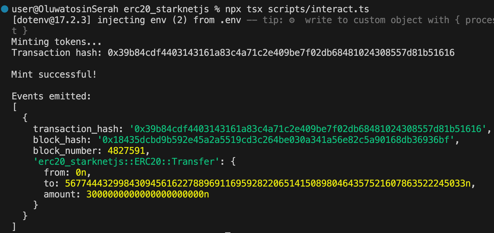

### Interacting with Existing Tokens

You can also interact with existing ERC-20 tokens like _STRK_ by changing the contract address. Create a new `interact_existing.ts` file and paste the following script to check your _STRK_ balance:

```tsx
import { RpcProvider, Contract } from "starknet";
import * as dotenv from "dotenv";

dotenv.config();

async function checkSTRKBalance() {
  const alchemyApiKey = process.env.ALCHEMY_API_KEY;

  const provider = new RpcProvider({
    nodeUrl: `https://starknet-sepolia.g.alchemy.com/starknet/version/rpc/v0_10/${alchemyApiKey}`,
  });

  // REPLACE WITH YOUR ACCOUNT ADDRESS
  const accountAddress =
    "0x014154fb6Dd088b5ceB46df635eCCe6e1a9B0455357931aC7Df4263A7dBf39a9";

  const strkContractAddress =
    "0x04718f5a0fc34cc1af16a1cdee98ffb20c31f5cd61d6ab07201858f4287c938d";

  const { abi } = await provider.getClassAt(strkContractAddress);

  const strkContract = new Contract({
    abi,
    address: strkContractAddress,
    providerOrAccount: provider,
  });

  const balance = await strkContract.balance_of(accountAddress);
  console.log(`STRK Balance (raw): ${balance.toString()}`);

  const balanceInSTRK = Number(balance) / 10 ** 18;
  console.log(`STRK Balance: ${balanceInSTRK} STRK`);
}

checkSTRKBalance().catch(console.error);
```

Run with: `npx tsx scripts/interact_existing.ts`

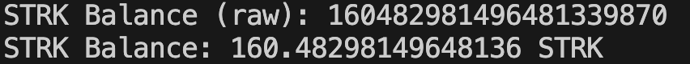

**\*Note**: When interacting with existing tokens like STRK, you can check balances and, if you hold tokens, transfer or approve them, but minting requires being the contract owner.\*

## Wrapping Up

In this article, we covered the practical examples of deploying and interacting with ERC-20 tokens using `sncast` and `Starknet.js`. In the next article, we'll explore factory patterns using the direct `deploy_syscall`, showing how contracts can deploy other contracts without the UDC.
