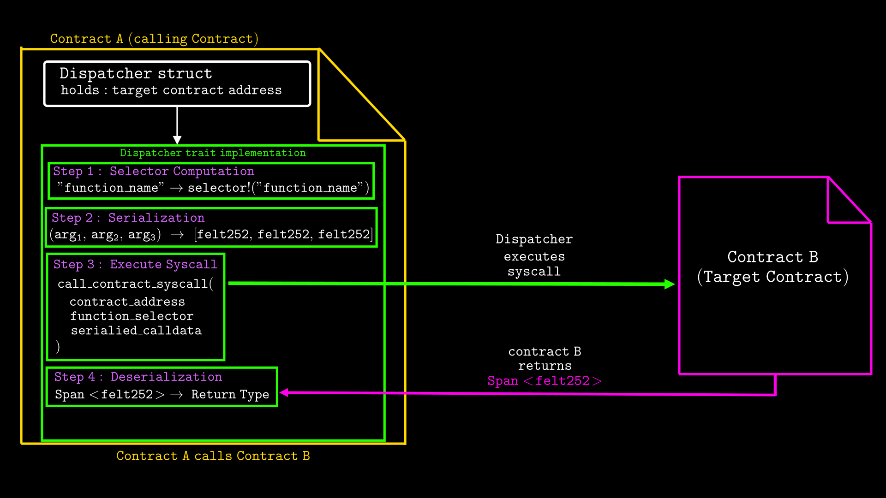
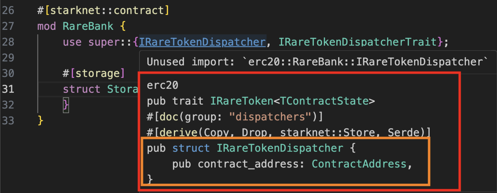

# Cross-contract call on Starknet

A cross-contract call is how one contract calls another contract's public function. A common example is a liquidity pool calling an ERC-20 token contract to transfer tokens in or out of the pool.

In this article, you'll learn how cross-contract calls work on Starknet and how to implement them in your smart contracts.

## Ways to make cross-contract calls

There are two ways to make cross-contract calls in Starknet contracts:

1. Using a contract dispatcher
2. Using the `call_contract_syscall` syscall directly

Let's walk through each one of them.

## 1. Using a contract dispatcher

A dispatcher is a compiler-generated struct that enables type-safe calls to other contracts. It wraps a `ContractAddress` and implements the trait that the compiler generates from your `#[starknet::interface]`.

In Solidity, you cast the target contract's address to an interface type to call its functions. Cairo's dispatcher works similarly, except the compiler generates it from your `#[starknet::interface]` and handles the casting for you.

When you call another contract’s function, you simply invoke it on the dispatcher with the arguments. Internally, the dispatcher:

- computes the function selector from the function name at compile time
- serializes the function arguments into `felt252` values
- uses `call_contract_syscall` to execute the call with the contract address, function selector, and serialized arguments
- and deserializes the returned `Span<felt252>` back into the expected Cairo types

The diagram below shows what happens when Contract A calls Contract B's function through a dispatcher:



At a high-level, you make a cross-contract call the same way you call any regular function. The dispatcher handles selector computation, serialization, and deserialization behind the scenes.

For each contract interface, the compiler generates several dispatchers (see the full list [here](https://gist.github.com/RareSkills/549b1519133fd19ed5c6ab2e75edea51)). We’ll focus on:

- **Regular contract dispatcher**: makes cross-contract calls and panics on failure
- **Safe contract dispatcher**: makes cross-contract calls and returns `Result<T, Array<felt252>>`. Your code can then inspect the result and handle failures without reverting the entire transaction. However, there are cases that still cause immediate reverts which cannot be caught. We'll discuss these limitations later in the article.

### Building a simple bank contract to demonstrate cross-contract calls

We’ll walk through a bank contract where users can deposit and withdraw _RareTokens_ (our [ERC-20 implementation](https://rareskills.io/post/cairo-erc-20) from an earlier chapter). The setup includes two contracts:

- `RareBank`: the main banking contract.
- `RareToken`: the ERC-20 token contract.

The `RareBank` will use a dispatcher to call functions on the `RareToken` contract for deposits and withdrawals.

Let's define both the interface of the token contract `IRareToken` and `IRareBank`:

```rust
use starknet::ContractAddress;

// RareToken ERC20 Interface
#[starknet::interface]
pub trait IRareToken<TContractState> {
    fn total_supply(self: @TContractState) -> u256;
    fn balance_of(self: @TContractState, account: ContractAddress) -> u256;
    fn allowance(self: @TContractState, owner: ContractAddress, spender: ContractAddress) -> u256;
    fn transfer(ref self: TContractState, recipient: ContractAddress, amount: u256) -> bool;
    fn transfer_from(ref self: TContractState, sender: ContractAddress, recipient: ContractAddress, amount: u256) -> bool;
    fn approve(ref self: TContractState, spender: ContractAddress, amount: u256) -> bool;
    fn name(self: @TContractState) -> ByteArray;
    fn symbol(self: @TContractState) -> ByteArray;
    fn decimals(self: @TContractState) -> u8;
    fn mint(ref self: TContractState, recipient: ContractAddress, amount: u256) -> bool; // For testing
}

// RareBank Interface
#[starknet::interface]
pub trait IRareBank<TContractState> {
    fn deposit(ref self: TContractState, amount: u256);
    fn withdraw(ref self: TContractState, amount: u256);
    fn get_balance(self: @TContractState, user: ContractAddress) -> u256;
}
```

When you define an interface with `#[starknet::interface]`, the compiler automatically generates dispatcher types for it. These become available when you import the interface using `use super::{I..}`.

In our case, defining `IRareBank` and `IRareToken` generates their respective dispatchers shown in the animation below:

<video width="100%" controls>
  <source src="./media/dispatcher.mp4" type="video/mp4">
</video>

As seen above, the compiler generates many dispatcher-related types, but the ones most relevant for our discussion (highlighted in green) are:

For `IRareBank`:

- `IRareBankDispatcher` for regular contract calls that panic on errors
- `IRareBankSafeDispatcher` for calls that return `Result<...>` for error handling

For `IRareToken`:

- `IRareTokenDispatcher` for regular calls
- `IRareTokenSafeDispatcher` for calls with error handling

The other generated types (like `Copy`, `Drop`, `Serde`, etc.) are implementation details that Cairo uses internally to make these dispatchers work properly.

### Using regular contract dispatcher in the bank contract

Moving to the contract implementation, here are the required imports:

```rust
#[starknet::contract]
mod RareBank {
    use super::{IRareTokenDispatcher, IRareTokenDispatcherTrait};
}
```

We import both the `IRareTokenDispatcher` struct and `IRareTokenDispatcherTrait` using `super::` because they're generated in the same module where we defined our interfaces. Here's the `IRareTokenDispatcher` struct that the compiler generates (highlighted in orange):



The dispatcher struct holds the target contract's address (which will point to the _RareToken_ contract), and the compiler generates the corresponding `IRareTokenDispatcherTrait` that contains all function signatures we can call from the `IRareToken` interface:

```rust
trait IRareTokenDispatcherTrait<T> {
    fn total_supply(self: T) -> u256;
    fn balance_of(self: T, account: ContractAddress) -> u256;
    fn allowance(self: T, owner: ContractAddress, spender: ContractAddress) -> u256;
    fn transfer(self: T, recipient: ContractAddress, amount: u256) -> bool;
    fn transfer_from(self: T, sender: ContractAddress, recipient: ContractAddress, amount: u256) -> bool;
    fn approve(self: T, spender: ContractAddress, amount: u256) -> bool;
    fn name(self: T) -> ByteArray;
    fn symbol(self: T) -> ByteArray;
    fn decimals(self: T) -> u8;
    fn mint(self: T, recipient: ContractAddress, amount: u256) -> bool;
}

// The compiler also generates this implementation
impl IRareTokenDispatcherImpl of IRareTokenDispatcherTrait<IRareTokenDispatcher> {
    fn transfer(self: IRareTokenDispatcher, recipient: ContractAddress, amount: u256) -> bool {
        //logic goes in
    }
    // ... other function implementations
}
```

Note that all the function signatures match exactly what we defined in our `IRareToken` interface, but the `self` parameter changes from `@TContractState` or `ref TContractState` to just `T`.

The generic type parameter `T` allows the same trait to be reused for different dispatcher types. Since the compiler generates multiple dispatcher variants from your interface (like `IRareTokenDispatcher` and `IRareTokenSafeDispatcher`), using `T` means one trait definition can serve all these variants. When you use a specific dispatcher, the compiler substitutes `T` with that concrete type.

The dispatcher’s `self` is `T`, the generic that holds the target contract address rather than `TContractState`. Unlike a contract implementation, it has no access to contract state. Instead, it translates function calls into cross-contract calls to the address it holds.

For each function in the trait implementation, the compiler generates code that:

- serializes the function arguments into calldata (an array of `felt252` values)
- makes a low-level contract call using `call_contract_syscall` with the contract address, function selector, and the serialized calldata
- deserializes the returned value into the expected return type

This is the "translation" process we mentioned earlier: the dispatcher converts high-level Cairo function calls into low-level syscalls, executes them, and converts the results back into Cairo types.

Here's the complete bank contract implementation. The constructor sets up the bank with an owner and the RareToken contract address. `deposit()` accepts token deposit from the user, `withdraw()` transfer tokens back to the user, and `get_balance()` returns a user's current bank balance:

```rust
use starknet::ContractAddress;

// RareToken ERC20 Interface - defines functions we can call on the token contract
#[starknet::interface]
pub trait IRareToken<TContractState> {
    fn total_supply(self: @TContractState) -> u256;
    fn balance_of(self: @TContractState, account: ContractAddress) -> u256;
    fn allowance(self: @TContractState, owner: ContractAddress, spender: ContractAddress) -> u256;
    fn transfer(ref self: TContractState, recipient: ContractAddress, amount: u256) -> bool;
    fn transfer_from(ref self: TContractState, sender: ContractAddress, recipient: ContractAddress, amount: u256) -> bool;
    fn approve(ref self: TContractState, spender: ContractAddress, amount: u256) -> bool;
    fn name(self: @TContractState) -> ByteArray;
    fn symbol(self: @TContractState) -> ByteArray;
    fn decimals(self: @TContractState) -> u8;
    fn mint(ref self: TContractState, recipient: ContractAddress, amount: u256) -> bool; // For testing
}

// RareBank Interface - defines the bank's functions
#[starknet::interface]
pub trait IRareBank<TContractState> {
    fn deposit(ref self: TContractState, amount: u256);
    fn withdraw(ref self: TContractState, amount: u256);
    fn get_balance(self: @TContractState, user: ContractAddress) -> u256;
}

// RareBank Contract - manages RareToken deposits and withdrawals
#[starknet::contract]
mod RareBank {
    use starknet::{ContractAddress, get_caller_address, get_contract_address};
    use starknet::storage::{
        StoragePointerReadAccess, StoragePointerWriteAccess,
        Map, StoragePathEntry
    };

    // import the generated dispatcher and trait for cross contract calls
    use super::{IRareTokenDispatcher, IRareTokenDispatcherTrait};

    #[storage]
    struct Storage {
        owner: ContractAddress,
        rare_token: ContractAddress,  // address of the RareToken contract we'll interact with
        balances: Map<ContractAddress, u256>, // maps user addresses to their bank balances
    }

    #[event]
    #[derive(Drop, starknet::Event)]
    pub enum Event {
        DepositSuccessful: DepositSuccessful,
        WithdrawSuccessful: WithdrawSuccessful,
    }

    #[derive(Drop, starknet::Event)]
    struct DepositSuccessful {
        user: ContractAddress,
        amount: u256
    }

    #[derive(Drop, starknet::Event)]
    struct WithdrawSuccessful {
        user: ContractAddress,
        amount: u256
    }

    // constructor sets up the bank with owner and RareToken contract address
    #[constructor]
    fn constructor(ref self: ContractState, owner: ContractAddress, rare_token_address: ContractAddress) {
        assert!(owner !=  0.try_into().unwrap(), "address zero detected");
        assert!(rare_token_address !=  0.try_into().unwrap(), "address zero detected");
        self.owner.write(owner);
        self.rare_token.write(rare_token_address);  // store the token contract address
    }

    // Implements the IRareBank interface and makes functions externally callable
    #[abi(embed_v0)]
    impl RareBankImpl of super::IRareBank<ContractState> {
        fn deposit(ref self: ContractState, amount: u256) {
            assert!(amount > 0, "can't deposit zero amount");

            let caller = get_caller_address();
            let this_contract = get_contract_address();
            let rare_token_address = self.rare_token.read();  // get the stored token address

            // create dispatcher instance pointing to the RareToken contract
            let rare_token = IRareTokenDispatcher { contract_address: rare_token_address };

            // cross contract call: transfer tokens from caller to this bank contract
            // this calls the transfer_from function on the RareToken contract
            // note: caller must have approved this contract to spend at least `amount` tokens
            let success = rare_token.transfer_from(caller, this_contract, amount);
            assert!(success, "transfer failed");

            // update the caller's balance in our bank's storage
            let prev_balance = self.balances.entry(caller).read();
            self.balances.entry(caller).write(prev_balance + amount);

            // emit DepositSuccessful event
            self.emit(DepositSuccessful { user: caller, amount });
        }

        fn withdraw(ref self: ContractState, amount: u256) {
            let caller = get_caller_address();
            let rare_token_address = self.rare_token.read();

            assert!(rare_token_address !=  0.try_into().unwrap(), "RareToken not set");

            // check if caller has sufficient balance in the bank
            let user_balance = self.balances.entry(caller).read();
            assert!(user_balance >= amount, "insufficient funds");

            // update balance first
            self.balances.entry(caller).write(user_balance - amount);

            // create dispatcher instance pointing to the RareToken contract
            let rare_token = IRareTokenDispatcher { contract_address: rare_token_address };

            // cross contract call: transfer tokens from bank back to caller
            // this calls the transfer function on the RareToken contract
            let success = rare_token.transfer(caller, amount);
            assert!(success, "transfer failed");

            // emit WithdrawSuccessful event
            self.emit(WithdrawSuccessful { user: caller, amount });
        }

        // view function to check user's balance in the bank
        fn get_balance(self: @ContractState, user: ContractAddress) -> u256 {
            self.balances.entry(user).read()
        }
    }
}
```

Looking at this lines below from the `deposit()` function, here’s how RareBank uses a dispatcher to call the `transfer_from` on the RareToken contract to transfer tokens from the caller to the bank:

```rust
// create a dispatcher instance pointing to the *RareToken* contract
let rare_token = IRareTokenDispatcher { contract_address: rare_token_address };

// use the dispatcher to call transfer_from on the *RareToken* contract
let success = rare_token.transfer_from(caller, this_contract, amount);
```

The equivalent in Solidity would be:

```solidity
// cast the address to the interface type
// transferFrom returns true on success, reverts on failure
IERC20 rareToken = IERC20(rareTokenAddress);
bool success = rareToken.transferFrom(msg.sender, address(this), amount);
```

Both Cairo and Solidity use the same approach: wrap a contract address with an interface definition to make type-safe calls to external contracts. The syntax differs slightly (Solidity wraps using `IERC20(address)` while Cairo uses struct initialization), but the underlying concept is identical.

**How the Dispatcher works in the `deposit()` function**

Here’s what happens in the Cairo `deposit()` code:

- **Create dispatcher instance:** We instantiate `IRareTokenDispatcher` with the _RareToken_ contract's address
- **Call the function**: When we call `rare_token.transfer_from(caller, this_contract, amount)`, the dispatcher (`IRareTokenDispatcherTrait`) handles the translation
- **Translation process**:
  - The dispatcher serializes the arguments (`caller`, `this_contract`, `amount`) into a `felt252` array
  - Computes the function selector (a `felt252` hash) from the function name using
    `selector!("transfer_from")`
  - Calls `call_contract_syscall` with:
    - RareToken contract address
    - Computed function selector
    - Serialized arguments
  - Deserializes the returned `felt252` array back into a `bool` result

Once the cross-contract call succeeds, the _RareToken_ contract's state is updated (tokens are transferred from the caller to the bank), and the bank contract continues with its own logic:

```rust
// update the user's balance in the bank's storage
let prev_balance = self.balances.entry(caller).read();
self.balances.entry(caller).write(prev_balance + amount);

// emit DepositSuccessful event
self.emit(DepositSuccessful { user: caller, amount });
```

The same pattern applies in the `withdraw()` function:

```rust
let rare_token = IRareTokenDispatcher { contract_address: rare_token_address };
let success = rare_token.transfer(caller, amount);
```

### Using safe contract dispatcher to handle errors

Unlike the regular contract dispatcher, when you call a function using a safe dispatcher, you don't get the result directly. Instead, you get a `Result` type that can be either:

- `Ok(value)`: the call succeeded and returned a value
- `Err(error_data)`: the call failed and returned error information

This lets you handle errors yourself. You use `match` to handle both cases and decide what to do when errors occur.

**Extending RareBank to use safe dispatcher**

Let's create `withdraw_safe()` function, a version that uses safe dispatcher to handle errors from the RareToken contract. When we call `rare_token.transfer()` and it fails (returns an error), instead of panicking and reverting the entire transaction, we'll restore the user's bank balance and emit an error event.

Import the RareToken safe dispatcher types (`IRareTokenSafeDispatcher` and `IRareTokenSafeDispatcherTrait` ) alongside the existing dispatcher imports:

```rust
use super::{
    IRareTokenDispatcher, IRareTokenDispatcherTrait,
    IRareTokenSafeDispatcher, IRareTokenSafeDispatcherTrait, //NEWLY ADDED
};
```

Next, define a new event to capture withdrawal failures ( `WithdrawFailed`):

```rust
#[event]
#[derive(Drop, starknet::Event)]
pub enum Event {
    DepositSuccessful: DepositSuccessful,
    WithdrawSuccessful: WithdrawSuccessful,
    WithdrawFailed: WithdrawFailed,  // New event
}

#[derive(Drop, starknet::Event)]
struct WithdrawFailed {
    user: ContractAddress,
    amount: u256,
    error: Array<felt252>,
}
```

Update the `IRareBank` interface to include the new function:

```rust
#[starknet::interface]
pub trait IRareBank<TContractState> {
    fn deposit(ref self: TContractState, amount: u256);
    fn withdraw(ref self: TContractState, amount: u256);
    fn withdraw_safe(ref self: TContractState, amount: u256);  // ADD THIS
    fn get_balance(self: @TContractState, user: ContractAddress) -> u256;
}
```

Now implement the `withdraw_safe` function. The `#[feature("safe_dispatcher")]` attribute is required when using safe dispatchers. Without it, you'll get a compiler warning about using an unstable feature. The attribute explicitly enables safe dispatcher usage for this function:

```rust
#[feature("safe_dispatcher")]
fn withdraw_safe(ref self: ContractState, amount: u256) {
    let caller = get_caller_address();
    let rare_token_address = self.rare_token.read();

    // check if caller has sufficient balance in the bank
    let user_balance = self.balances.entry(caller).read();
    assert!(user_balance >= amount, "insufficient funds");

    // update balance first
    self.balances.entry(caller).write(user_balance - amount);

    // CREATE SAFE DISPATCHER INSTANCE
    let rare_token = IRareTokenSafeDispatcher { contract_address: rare_token_address };

    match rare_token.transfer(caller, amount) {
        Result::Ok(_) => {
            // Transfer succeeded - RareToken always returns true on success
            self.emit(WithdrawSuccessful { user: caller, amount });
        },
        Result::Err(error) => {
            // Transfer panicked - restore balance and emit error
            self.balances.entry(caller).write(user_balance);
            self.emit(WithdrawFailed { user: caller, amount, error });
        },
    }
}
```

The `withdraw_safe` function starts by checking the user's balance, then deducts the withdrawal amount. We create a safe dispatcher pointing to the RareToken contract and call `transfer()`.

The `match` statement handles the returned `Result`:

- `Result::Ok(_)`: The transfer function executed successfully. The RareToken contract's `transfer` function always returns `true` when it succeeds - all error cases cause the function to panic instead.
- `Result::Err(error)`: The transfer function panicked. This happens when:
  - The sender has insufficient balance (`assert(sender_prev_balance >= amount)` fails)
  - The transaction verification fails
  - Any other assertion in the transfer function fails

When we catch the error, we restore the user's bank balance back to `user_balance` (the amount before we deducted the withdrawal) and emit `WithdrawFailed` with the error details.

**When safe dispatchers still revert**

While safe contract dispatchers handle many error scenarios during cross-contract calls, certain system-level failures cause the entire transaction to revert immediately rather than returning a `Result::Err`. These include:

- calling a contract that doesn't exist at the specified address
- errors thrown by Cairo Zero contracts, which do not support the `Result` error handling
- when the called contract internally attempts to deploy a contract with invalid parameters
- when the called contract internally attempts to upgrade using a non-existent class hash

These are system-level failures that safe dispatchers cannot catch. Safe contract dispatchers only catch errors from normal contract execution like failed assertions or explicit reverts.

In our `withdraw_safe` example, if `rare_token_address` points to a non-existent contract, the transaction will revert immediately when we call `rare_token.transfer()`, even with a safe dispatcher. Similarly, if you were calling a factory contract that tries to deploy with an invalid class hash, that would also cause an immediate revert.

_Note: These limitations are expected to be addressed in future Starknet versions._

## 2. Using the `call_contract_syscall` syscall directly

Cairo uses `call_contract_syscall` to make cross-contract calls. While the contract dispatchers use this syscall internally, we can call it directly when we need manual control over serialization and deserialization.

To use `call_contract_syscall`, we need to import the following:

```rust
use starknet::{SyscallResultTrait, syscalls};
```

`SyscallResultTrait` provides the `.unwrap_syscall()` method for extracting results from syscall operations, and the `syscalls` module contains the `call_contract_syscall` function we'll use to make the low-level call.

### `call_contract_syscall` Implementation example

The code below shows how our deposit function uses `call_contract_syscall` directly to execute the cross-contract call:

```rust
fn deposit_with_direct_syscall(ref self: ContractState, amount: u256) {
    assert!(amount > 0, "can't deposit zero amount");

    let caller = get_caller_address();
    let this_contract = get_contract_address();
    let rare_token_address = self.rare_token.read();

    // manually serialize function arguments into felt252 array
    let mut call_data: Array<felt252> = array![];
    Serde::serialize(@caller, ref call_data);        // sender
    Serde::serialize(@this_contract, ref call_data); // recipient
    Serde::serialize(@amount, ref call_data);        // amount

    // === MAKE THE DIRECT SYSCALL === //
    let mut res = syscalls::call_contract_syscall(
        rare_token_address,
        selector!("transfer_from"),
        call_data.span(),
    ).unwrap_syscall();

    // manually deserialize the response
    let success: bool = Serde::<bool>::deserialize(ref res).unwrap();
    assert!(success, "transfer failed");

    // update balance and emit event
    let prev_balance = self.balances.entry(caller).read();
    self.balances.entry(caller).write(prev_balance + amount);

    self.emit(DepositSuccessful { user: caller, amount });
}
```

The `call_contract_syscall` requires three parameters:

```rust
let mut res = syscalls::call_contract_syscall(
        rare_token_address,
        selector!("transfer_from"),
        call_data.span(),
    ).unwrap_syscall();
```

- Contract address (`rare_token_address`): the target contract to call
- Function selector: computed using `selector!("function_name")`
- Calldata: function arguments serialized as `Span<felt252>`

We must manually handle serialization of arguments using `Serde::serialize()` and deserialization of responses using `Serde::deserialize()`.

`deposit_with_direct_syscall()` does the exact thing the `deposit()` in our regular contract dispatcher does.

## Recommended method for cross-contract calls

**Using `call_contract_syscall` directly is not recommended for standard contract interactions** as it:

- Require manual serialization/deserialization
- Lack compile-time type checking
- More prone to serialization errors than dispatchers

Instead, use the contract dispatcher approach:

```rust
let rare_token = IRareTokenDispatcher { contract_address: rare_token_address };
let success = rare_token.transfer_from(caller, this_contract, amount);

```

Since the contract dispatcher handles serialization and type checking automatically, direct syscalls should only be used when dispatchers cannot meet your specific requirements.

## Wrapping Up

We've covered the main ways to make cross-contract calls on Starknet: contract dispatchers (regular and safe) and direct syscalls.

Contract dispatchers are the recommended approach for most use cases. Use regular dispatchers when calls must succeed. Use safe dispatchers when you need to handle failures without reverting the entire transaction, keeping in mind that some system-level failures can still cause immediate reverts as we’ve discussed. Direct syscalls serve specialized needs requiring explicit serialization control.

When building with cross-contract calls, always validate inputs, handle errors carefully, and be mindful of reverts or malicious contracts to keep your contracts secure.
