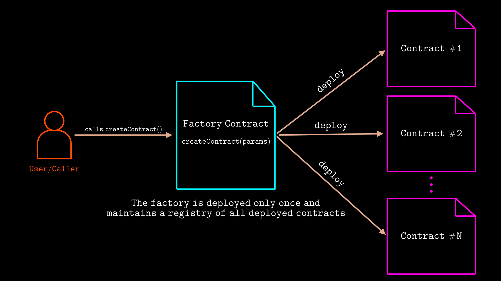
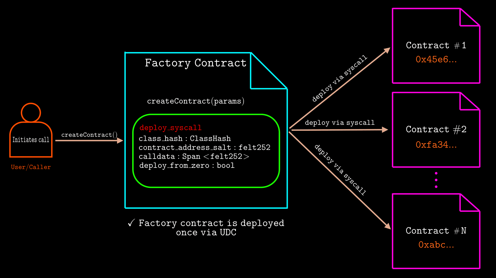
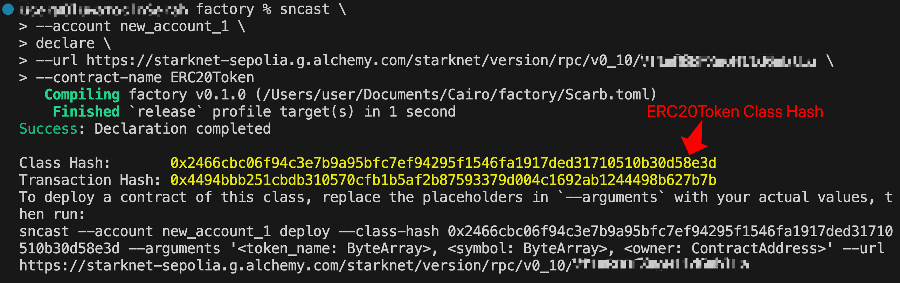
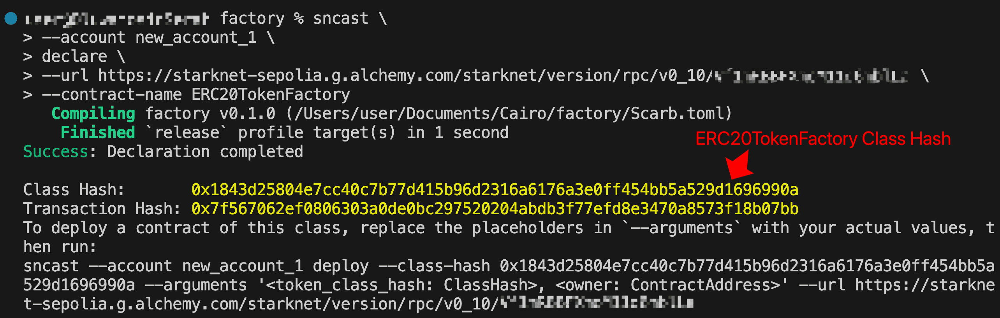
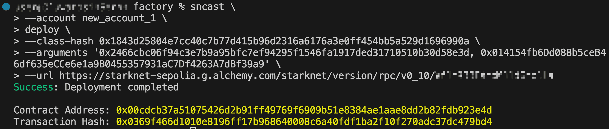
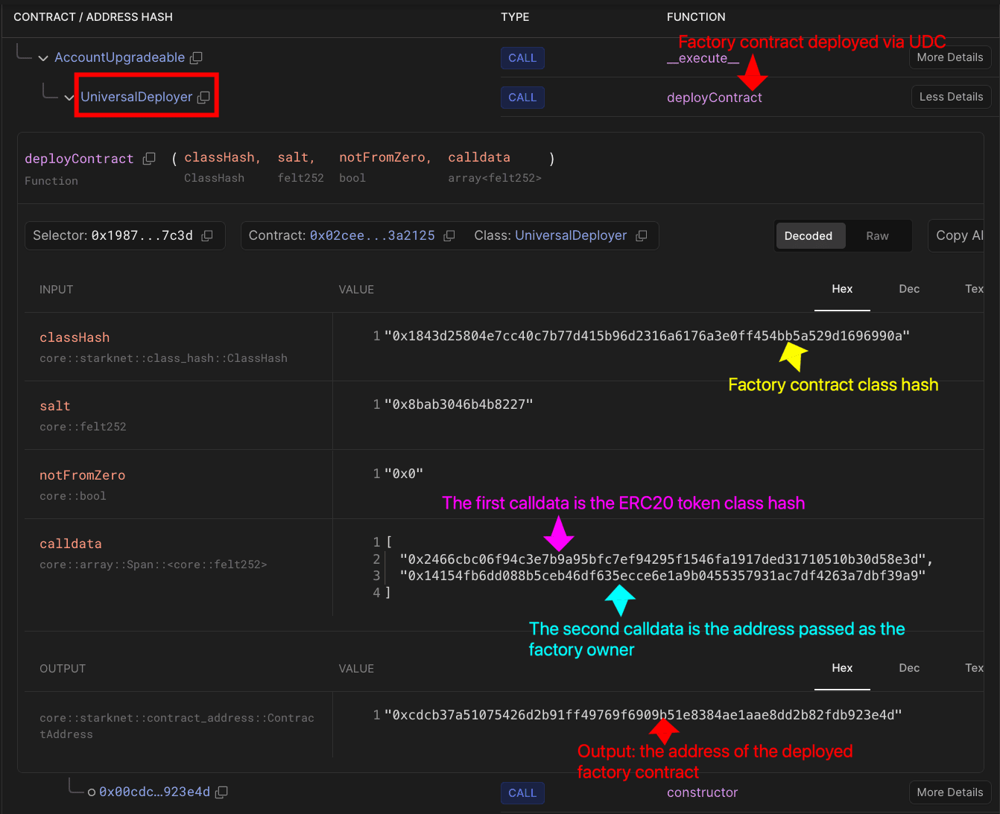
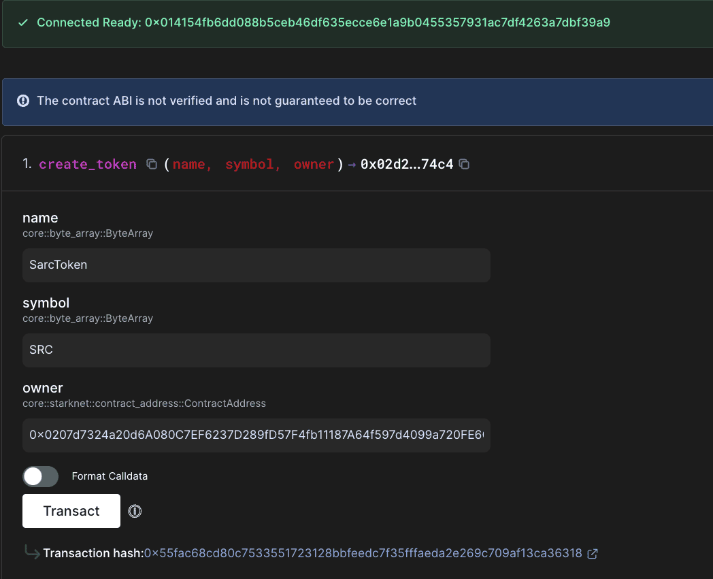
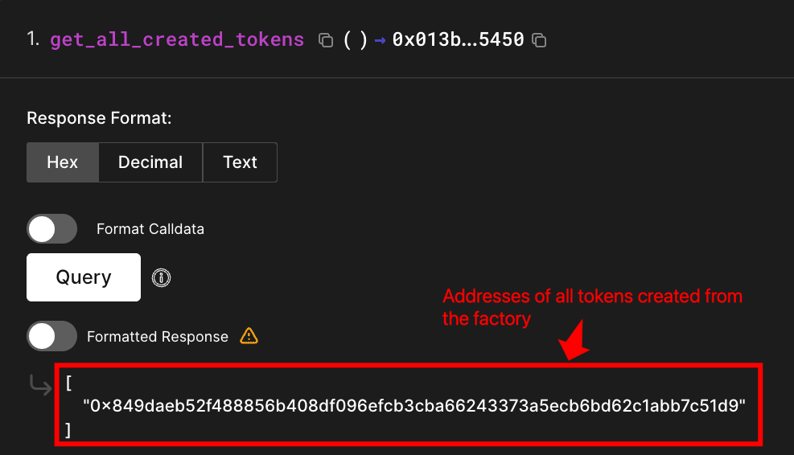
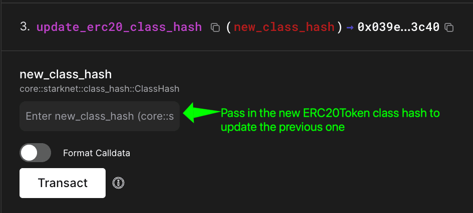

# Factory Contract in Cairo

A factory contract is a contract that deploys one or more instances of a contract.

In the "[_Understanding Starknet's Contract Deployment Model_](https://rareskills.io/post/cairo-contract-deployment-model)" chapter, we learned that with Starknet's declare-deploy model, you must first declare a contract class once and then you can deploy multiple instances from it manually. However, when we deploy contract instances manually, we must look up the correct class hash and pass the right constructor arguments (if any) each time.

Factory contracts solve this by providing a consistent deployment interface. Instead of handling class hashes manually, you simply call the factory, which deploys a new contract instance of the intended contract:



On Ethereum (and other EVM chains), the factory contract uses the [`CREATE` or `CREATE2` opcode](https://rareskills.io/post/ethereum-address-derivation) under the hood to deploy new child contracts. On Starknet, factories achieve the same behaviour through the `deploy_syscall`.

In this article, you'll learn how to implement the factory contract using `deploy_syscall`.

## How factories use `deploy_syscall`

Factory contracts call `deploy_syscall` directly to deploy contract instances. Here is the `deploy_syscall` function signature:

```rust
pub extern fn deploy_syscall(
    class_hash: ClassHash,
    contract_address_salt: felt252,
    calldata: Span<felt252>,
    deploy_from_zero: bool
) -> Result<(ContractAddress, Span<felt252>), Array<felt252>>
implicits(GasBuiltin, System) nopanic;
```

It takes four parameters:

- **`class_hash`**: the class hash of the contract you want to deploy
- **`contract_address_salt`**: a salt value for address calculation
- **`calldata`**: constructor arguments for the new contract
- `deploy_from_zero`: determines whether the deployer's address is excluded from the contract address calculation. When `false`, the deployer's address is included. When `true`, it is excluded and the address is calculated as if deployed from address `0`. Note that this is the inverse of the `not_from_zero` parameter in the UDC interface.

The `deploy_syscall` returns a `Result` type with two possible outcomes:

1. On success, you get the `ContractAddress` of the newly deployed contract and a `Span<felt252>` of serialized constructor return data. Since Cairo constructors don't typically return values, this span is usually empty, but it is available if the constructor explicitly returns values.
2. On failure, you get an `Array<felt252>` containing error information describing what went wrong during deployment

> _Note: `implicits(GasBuiltin, System)` are implicit parameters for gas tracking and system operations, automatically handled by Cairo. `nopanic` means the function returns a `Result` type instead of panicking on errors._

In a factory contract, you call a factory function such as `createContract()`, which internally calls `deploy_syscall` with the required parameters: `class_hash`, `salt`, `calldata`, and `deploy_from_zero`, as shown in the image below:



During `deploy_syscall` execution, the network computes the contract address using the Pedersen-based contract address formula covered in _Understanding Starknet's Contract Deployment Model_. The `deploy_from_zero` parameter determines the `deployer_address` value in that formula: when `false`, it is set to the factory contract's address; when `true`, it is set to `0`.

The network then deploys the contract instance at that computed address and executes the constructor with the provided calldata.

Once deployment completes, the `deploy_syscall` returns the new `ContractAddress` along with any constructor return data to the factory. If the factory implementation includes an event, it emits relevant deployment data at this point before returning the `ContractAddress` to the original caller.

## Universal Deployer Contract vs Custom Factory Contract

The Universal Deployer Contract (UDC) that we use for regular contract deployment is itself a factory contract. It wraps the low-level `deploy_syscall` and exposes a simple interface for deploying any declared contract. However, the UDC doesn't track deployed contracts and is strictly for general deployment purposes.

When you need more than basic deployment, you build a custom factory contract. For example, you might want to track which contracts were deployed and by whom (registry), restrict who can deploy or update contract classes (access control). In the next section, we'll implement a token factory to show how these ideas work.

> Like any regular contract, the factory contract is deployed through the UDC. But when the factory deploys instances, it calls `deploy_syscall` directly rather than going through the UDC again.

## Creating a Token Factory Contract

We'll build an ERC-20 factory contract that abstracts away class hashes and deployment parameters, letting you deploy token instances through a simple interface.

### Updating the Token Contract

We need to modify our ERC-20 contract from the “[ERC-20 Token on Starknet](https://rareskills.io/post/cairo-erc-20)” chapter. The original version had hardcoded values for the token `name`, `symbol`, and `decimals`. Since the factory needs to deploy tokens with different names and symbols, these values must be configurable:

```rust
#[constructor]
fn constructor(
    ref self: ContractState, token_name: ByteArray, symbol: ByteArray, owner: ContractAddress,
) {
    self.token_name.write(token_name); //newly added
    self.symbol.write(symbol); // newly added
    self.decimal.write(18);
    self.owner.write(owner);
}
```

`token_name` and `symbol` are now parameters instead of hardcoded values, `owner` is passed as a parameter to determine who can mint tokens, and decimals remain fixed at 18 (the ERC-20 standard).

Create `src/erc20.cairo` in your Scarb project and paste the full updated contract code into it:

```rust
use starknet::ContractAddress;

#[starknet::interface]
pub trait IERC20<TContractState> {
    fn total_supply(self: @TContractState) -> u256;
    fn balance_of(self: @TContractState, account: ContractAddress) -> u256;
    fn allowance(self: @TContractState, owner: ContractAddress, spender: ContractAddress) -> u256;
    fn transfer(ref self: TContractState, recipient: ContractAddress, amount: u256) -> bool;
    fn transfer_from(
        ref self: TContractState, sender: ContractAddress, recipient: ContractAddress, amount: u256,
    ) -> bool;
    fn approve(ref self: TContractState, spender: ContractAddress, amount: u256) -> bool;

    fn name(self: @TContractState) -> ByteArray;
    fn symbol(self: @TContractState) -> ByteArray;
    fn decimals(self: @TContractState) -> u8;

    fn mint(ref self: TContractState, recipient: ContractAddress, amount: u256) -> bool;
}

#[starknet::contract]
pub mod ERC20Token {
    use starknet::storage::{
        Map, StoragePathEntry, StoragePointerReadAccess, StoragePointerWriteAccess,
    };
    use starknet::{ContractAddress, get_caller_address};

    #[storage]
    pub struct Storage {
        balances: Map<ContractAddress, u256>,
        allowances: Map<
            (ContractAddress, ContractAddress), u256,
        >, //  (owner, spender) -> amount, amount>
        token_name: ByteArray,
        symbol: ByteArray,
        decimal: u8,
        total_supply: u256,
        owner: ContractAddress,
    }

    #[event]
    #[derive(Drop, starknet::Event)]
    pub enum Event {
        Transfer: Transfer,
        Approval: Approval,
    }

    #[derive(Drop, starknet::Event)]
    pub struct Transfer {
        #[key]
        from: ContractAddress,
        #[key]
        to: ContractAddress,
        amount: u256,
    }

    #[derive(Drop, starknet::Event)]
    pub struct Approval {
        #[key]
        owner: ContractAddress,
        #[key]
        spender: ContractAddress,
        value: u256,
    }
    #[constructor]
    fn constructor(
        ref self: ContractState, token_name: ByteArray, symbol: ByteArray, owner: ContractAddress,
    ) {
        self.token_name.write(token_name);
        self.symbol.write(symbol);
        self.decimal.write(18);
        self.owner.write(owner);
    }

    #[abi(embed_v0)]
    impl ERC20Impl of super::IERC20<ContractState> {
        fn total_supply(self: @ContractState) -> u256 {
            self.total_supply.read()
        }
        fn balance_of(self: @ContractState, account: ContractAddress) -> u256 {
            let balance = self.balances.entry(account).read();
            balance
        }

        fn name(self: @ContractState) -> ByteArray {
            self.token_name.read()
        }

        fn symbol(self: @ContractState) -> ByteArray {
            self.symbol.read()
        }

        fn decimals(self: @ContractState) -> u8 {
            self.decimal.read()
        }

        fn allowance(
            self: @ContractState, owner: ContractAddress, spender: ContractAddress,
        ) -> u256 {
            let allowance = self.allowances.entry((owner, spender)).read();

            allowance
        }

        fn transfer(ref self: ContractState, recipient: ContractAddress, amount: u256) -> bool {
            let sender = get_caller_address();

            let sender_prev_balance = self.balances.entry(sender).read();
            let recipient_prev_balance = self.balances.entry(recipient).read();

            assert(sender_prev_balance >= amount, 'Insufficient amount');

            self.balances.entry(sender).write(sender_prev_balance - amount);
            self.balances.entry(recipient).write(recipient_prev_balance + amount);

            assert(
                self.balances.entry(recipient).read() > recipient_prev_balance,
                'Transaction failed',
            );
            self.emit(Transfer { from: sender, to: recipient, amount });

            true
        }

        fn transfer_from(
            ref self: ContractState,
            sender: ContractAddress,
            recipient: ContractAddress,
            amount: u256,
        ) -> bool {
            let spender = get_caller_address();

            let spender_allowance = self.allowances.entry((sender, spender)).read();
            let sender_balance = self.balances.entry(sender).read();
            let recipient_balance = self.balances.entry(recipient).read();

            assert(amount <= spender_allowance, 'amount exceeds allowance');
            assert(amount <= sender_balance, 'amount exceeds balance');

            self.allowances.entry((sender, spender)).write(spender_allowance - amount);
            self.balances.entry(sender).write(sender_balance - amount);
            self.balances.entry(recipient).write(recipient_balance + amount);

            self.emit(Transfer { from: sender, to: recipient, amount });

            true
        }

        fn approve(ref self: ContractState, spender: ContractAddress, amount: u256) -> bool {
            let caller = get_caller_address();

            self.allowances.entry((caller, spender)).write(amount);

            self.emit(Approval { owner: caller, spender, value: amount });

            true
        }

        fn mint(ref self: ContractState, recipient: ContractAddress, amount: u256) -> bool {
            let caller = get_caller_address();
            assert(caller == self.owner.read(), 'Caller is not owner');

            let previous_total_supply = self.total_supply.read();
            let previous_balance = self.balances.entry(recipient).read();

            self.total_supply.write(previous_total_supply + amount);
            self.balances.entry(recipient).write(previous_balance + amount);

            let zero_address: ContractAddress = 0.try_into().unwrap();

            self.emit(Transfer { from: zero_address, to: recipient, amount });

            true
        }
    }
}
```

### Defining the Factory Interface (`IERC20Factory`)

Before we write any implementation code, let's define what our factory will do. Our factory contract will have four major functions:

1. **Deploy a token**: creates a new token instance with a name, symbol, and owner address
2. **Deploy a token at a specific address**: creates a new token with a user-specified salt, allowing the caller to determine the resulting contract address
3. **Query deployed tokens**: retrieves all tokens deployed through this factory, either globally or filtered by user
4. **Update the token contract class**: changes the ERC-20 contract class used for all future token deployments

```rust
use starknet::{ContractAddress, ClassHash};

#[starknet::interface]
pub trait IERC20Factory<TContractState> {
    // Deploy a new ERC20 token contract with a user-specified salt
    fn create_token_at(
        ref self: TContractState,
        salt: felt252,
        name: ByteArray,
        symbol: ByteArray,
        owner: ContractAddress,
    ) -> ContractAddress;

    // Deploy a new ERC20 token contract using a default salt
    fn create_token(
        ref self: TContractState,
        name: ByteArray,
        symbol: ByteArray,
        owner: ContractAddress,
    ) -> ContractAddress;

    // Update the stored class hash used for new ERC20 deployments
    fn update_erc20_class_hash(ref self: TContractState, new_class_hash: ClassHash);

    // Returns an array of all token contract addresses created by this factory
    fn get_all_created_tokens(self: @TContractState) -> Array<ContractAddress>;

    // Returns all token contract addresses created by a specific user
    fn get_user_tokens(self: @TContractState, user: ContractAddress) -> Array<ContractAddress>;
}
```

**Storage Variables**

From the interface above, we can determine what the factory contract needs to store. We need to store the token class hash we’ll deploy from, track every token we create, organize them by creator, and restrict who can update the token class hash used for future deployments. This leads us to define these state variables:

```rust
#[storage]
struct Storage {
    token_class_hash: ClassHash, // class hash of the token contract to deploy
    created_tokens: Vec<ContractAddress>,  // global list of all deployed token instances
    user_tokens: Map<ContractAddress, Vec<ContractAddress>>, // tokens deployed per user
    factory_owner: ContractAddress, // address with admin rights over the factory
}
```

The `token_class_hash` stores the ERC-20 contract class that the factory uses to deploy new tokens. Every token created through this factory will be an instance of this class hash. The factory owner can update this value later to deploy improved token versions.

We maintain two different list for created tokens:

- The `created_tokens` vector provides a complete record of every token deployed through this factory
- Meanwhile, the `user_tokens` mapping creates individual lists for each user, storing only the tokens that the specific address has created.

The `factory_owner` stores the address that has permission to update the token class hash.

### Factory Constructor

The factory constructor stores the ERC-20 class hash to deploy from and the owner address that has admin rights over the factory:

```rust
#[constructor]
fn constructor(ref self: ContractState, token_class_hash: ClassHash, owner: ContractAddress) {
    self.token_class_hash.write(token_class_hash);
    self.factory_owner.write(owner);
}
```

### Event Definitions

We need a way for external applications to track deployments and class hash changes. We'll define two events that broadcast our key activities:

```rust
 #[event]
    #[derive(Drop, starknet::Event)]
    enum Event {
        TokenContractCreated: TokenContractCreated, // Emitted when a new token is created
        ClassHashUpdated: ClassHashUpdated,         // Emitted when the ERC20 class hash is updated
    }

    #[derive(Drop, starknet::Event)]
    struct TokenContractCreated {
        #[key]
        creator: ContractAddress,          // User who created the token
        #[key]
        token_address: ContractAddress,    // Address of the new token contract
        name: ByteArray,
        symbol: ByteArray,
    }

    #[derive(Drop, starknet::Event)]
    struct ClassHashUpdated {
        old_class_hash: ClassHash,
        new_class_hash: ClassHash,
    }
```

When a token is deployed, `TokenContractCreated` captures the creator, token address, name, and symbol, with indexed fields (`#[key]`) for efficient searching. When the token template (class hash) changes, `ClassHashUpdated` records the transition from old to new class hash.

### Factory Contract Implementation

Now let's implement the functions defined in the factory interface. The factory provides two ways to create tokens, depending on whether users need to specify their own salt value or not:

**1. Token creation with custom salt**

The `create_token_at` function is used to deploy tokens with a caller-specified salt, which determines the resulting contract address:

```rust
fn create_token_at(
    ref self: ContractState,
    salt: felt252,
    name: ByteArray,
    symbol: ByteArray,
    owner: ContractAddress,
  ) -> ContractAddress {
     let caller = get_caller_address();
     let erc20_class_hash = self.token_class_hash.read();

     // prepare constructor arguments
     let mut constructor_calldata = array![];
     name.serialize(ref constructor_calldata);
     symbol.serialize(ref constructor_calldata);
     owner.serialize(ref constructor_calldata);

     // deploy the token contract
     let (token_address, _) = deploy_syscall(
          erc20_class_hash, salt, constructor_calldata.span(), false // deploy_from_zero
      )
        .unwrap_syscall();

      // add to the global token list
      self.created_tokens.push(token_address);

      // append to user's token list
      let user_tokens_entry = self.user_tokens.entry(caller);
      user_tokens_entry.push(token_address);

      // emit event
      self
          .emit(
              TokenContractCreated {
                  creator: caller, token_address, name: name.clone(), symbol: symbol.clone(),
              },
          );

      token_address
  }
```

The function starts by getting the caller's address and reading the ERC-20 class hash from storage, then serializes the constructor arguments into an array. Cairo expects these as an array of `felt252` values that the CairoVM can understand:

```rust
  let mut constructor_calldata = array![];
  name.serialize(ref constructor_calldata);
  symbol.serialize(ref constructor_calldata);
  owner.serialize(ref constructor_calldata);
```

So the function takes the token name, symbol, and owner address and serializes them in the exact order that matches the token contract's constructor. **Getting this order wrong would cause the deployment to fail because the constructor will receive mismatched argument types.**

Once the data is properly serialized, the function calls `deploy_syscall` with the class hash, salt, and the serialized constructor arguments.

```rust
  // deploy the token contract
  let (token_address, _) = deploy_syscall(
        erc20_class_hash, salt, constructor_calldata.span(), false // deploy_from_zero
      )
    .unwrap_syscall();
```

As mentioned in the `deploy_syscall` parameter section, passing `false` for `deploy_from_zero` tells Starknet to deploy from the factory's address rather than the zero, which affects how the final contract address gets calculated.

After deployment succeeds, the factory keeps track of the new token in two places: a global list of all tokens created `created_tokens` and a personal list for each user `user_tokens`. It also emits a `TokenContractCreated` event, then returns the new contract address to whoever called the function.

**2. Token creation with default salt**

The `create_token` function provides the simplest way to deploy a new token. It takes three parameters: the token `name`, `symbol`, and `owner` address, and delegates the actual deployment to `create_token_at` with a default salt of 0.

```rust
fn create_token(
    ref self: ContractState,
    name: ByteArray,
    symbol: ByteArray,
    owner: ContractAddress,
) -> ContractAddress {
    // Use default salt of 0
    self.create_token_at(0, name, symbol, owner)
}
```

Using `0` as the default salt is a common convention, though any fixed salt value works if you're implementing your own factory.

**Why use a default salt?**

- Users don't need to understand or manage salt values
- Each deployment automatically gets a unique address as long as parameters are different; otherwise you'll get the same address (though the second deployment would fail since the address is already occupied)

**Registry and Query Functions**

The `get_all_created_tokens` function returns every token that has ever been deployed by this factory:

```rust
fn get_all_created_tokens(self: @ContractState) -> Array<ContractAddress> {
    let mut tokens = array![];
    for i in 0..self.created_tokens.len() {
        tokens.append(self.created_tokens.at(i).read());
    }
    tokens
}
```

It loops through the `created_tokens` storage vector, appends each address to a `tokens` array, and returns it.

The `get_user_tokens` function works similarly but focuses on tokens created by a specific user:

```rust
fn get_user_tokens(self: @ContractState, user: ContractAddress) -> Array<ContractAddress> {
    let user_tokens_entry = self.user_tokens.entry(user);
    let mut tokens = array![];
    for i in 0..user_tokens_entry.len() {
        tokens.append(user_tokens_entry.at(i).read());
    }
    tokens
}
```

It takes a user's address as input, looks up that user's entry in the `user_tokens` mapping, then loops through their personal token list to build the return array. This is particularly useful for wallet interfaces or portfolio trackers where users want to see only the tokens they've created.

Both functions use the same pattern: they create a mutable array, iterate through the relevant storage structure, and append each address they find. The main difference is that one reads from the global registry while the other reads from a user-specific mapping.

**Class hash update function**

The `update_erc20_class_hash` function is used by the factory to update the token contract class it uses for new deployments:

```rust
fn update_erc20_class_hash(ref self: ContractState, new_class_hash: ClassHash) {
      let caller = get_caller_address();
      assert(caller == self.factory_owner.read(), 'Only owner can update');

      let old_class_hash = self.token_class_hash.read();
      self.token_class_hash.write(new_class_hash);

      self.emit(ClassHashUpdated { old_class_hash, new_class_hash });
  }
```

When called, the function verifies the caller is the factory owner. If not, the transaction fails with an “Only owner can update” error.

Once the permission check passes, the function reads the current class hash and stores it as the old value, then writes the new class hash to storage. This means that all future token deployments will use the updated contract implementation, while existing tokens remain unchanged on their original version. The function then emits a `ClassHashUpdated` event containing both class hash values.

**Note that the class hash update will only work if the new contract class hash follows the same constructor signature and serialization order as the original.** Currently, the factory's `create_token_at` function expects:

```rust
fn create_token_at(
    ref self: ContractState,
    salt: felt252,
    name: ByteArray,
    symbol: ByteArray,
    owner: ContractAddress,
) -> ContractAddress
```

**Any updated class hash must have a constructor that has these exact parameters in the same order.**

```rust
 let mut constructor_calldata = array![];
 name.serialize(ref constructor_calldata);
 symbol.serialize(ref constructor_calldata);
 owner.serialize(ref constructor_calldata);
```

**If the new contract has different constructor parameters, token creation will fail due to serialization mismatches during initialization.**

Before we deploy and test the factory, copy and paste the full ERC20 factory contract into `src/erc20_factory.cairo`:

```rust
use starknet::{ClassHash, ContractAddress};

#[starknet::interface]
pub trait IERC20Factory<TContractState> {
    fn create_token(
        ref self: TContractState, name: ByteArray, symbol: ByteArray, owner: ContractAddress,
    ) -> ContractAddress;

    fn create_token_at(
        ref self: TContractState,
        salt: felt252,
        name: ByteArray,
        symbol: ByteArray,
        owner: ContractAddress,
    ) -> ContractAddress;

    fn update_erc20_class_hash(ref self: TContractState, new_class_hash: ClassHash);
    fn get_all_created_tokens(self: @TContractState) -> Array<ContractAddress>;
    fn get_user_tokens(self: @TContractState, user: ContractAddress) -> Array<ContractAddress>;
}

#[starknet::contract]
mod ERC20TokenFactory {
    use starknet::storage::{
        Map, MutableVecTrait, StoragePathEntry, StoragePointerReadAccess, StoragePointerWriteAccess,
        Vec, VecTrait,
    };
    use starknet::syscalls::deploy_syscall;
    use starknet::{ClassHash, ContractAddress, SyscallResultTrait, get_caller_address};

    #[storage]
    struct Storage {
        token_class_hash: ClassHash,
        created_tokens: Vec<ContractAddress>,
        user_tokens: Map<ContractAddress, Vec<ContractAddress>>,
        factory_owner: ContractAddress,
    }

    #[event]
    #[derive(Drop, starknet::Event)]
    enum Event {
        TokenContractCreated: TokenContractCreated,
        ClassHashUpdated: ClassHashUpdated,
    }

    #[derive(Drop, starknet::Event)]
    struct TokenContractCreated {
        #[key]
        creator: ContractAddress,
        #[key]
        token_address: ContractAddress,
        name: ByteArray,
        symbol: ByteArray,
    }

    #[derive(Drop, starknet::Event)]
    struct ClassHashUpdated {
        old_class_hash: ClassHash,
        new_class_hash: ClassHash,
    }

    #[constructor]
    fn constructor(ref self: ContractState, token_class_hash: ClassHash, owner: ContractAddress) {
        self.token_class_hash.write(token_class_hash);
        self.factory_owner.write(owner);
    }

    #[abi(embed_v0)]
    impl ERC20FactoryImpl of super::IERC20Factory<ContractState> {
        fn create_token(
            ref self: ContractState, name: ByteArray, symbol: ByteArray, owner: ContractAddress,
        ) -> ContractAddress {
            // Use default salt of 0
            self.create_token_at(0, name, symbol, owner)
        }

        fn create_token_at(
            ref self: ContractState,
            salt: felt252,
            name: ByteArray,
            symbol: ByteArray,
            owner: ContractAddress,
        ) -> ContractAddress {
            let caller = get_caller_address();
            let erc20_class_hash = self.token_class_hash.read();

            // prepare constructor arguments
            let mut constructor_calldata = array![];
            name.serialize(ref constructor_calldata);
            symbol.serialize(ref constructor_calldata);
            owner.serialize(ref constructor_calldata);

            // deploy the token contract
            let (token_address, _) = deploy_syscall(
                erc20_class_hash, salt, constructor_calldata.span(), false // deploy_from_zero
            )
                .unwrap_syscall();

            // track the created token
            self.created_tokens.push(token_address);

            // track user's tokens
            let user_tokens_entry = self.user_tokens.entry(caller);
            user_tokens_entry.push(token_address);

            // emit event
            self
                .emit(
                    TokenContractCreated {
                        creator: caller, token_address, name: name.clone(), symbol: symbol.clone(),
                    },
                );

            token_address
        }

        fn update_erc20_class_hash(ref self: ContractState, new_class_hash: ClassHash) {
            let caller = get_caller_address();
            assert(caller == self.factory_owner.read(), 'Only owner can update');

            let old_class_hash = self.token_class_hash.read();
            self.token_class_hash.write(new_class_hash);

            self.emit(ClassHashUpdated { old_class_hash, new_class_hash });
        }

        fn get_all_created_tokens(self: @ContractState) -> Array<ContractAddress> {
            let mut tokens = array![];

            for i in 0..self.created_tokens.len() {
                tokens.append(self.created_tokens.at(i).read());
            }

            tokens
        }

        fn get_user_tokens(self: @ContractState, user: ContractAddress) -> Array<ContractAddress> {
            let user_tokens_entry = self.user_tokens.entry(user);
            let mut tokens = array![];

            for i in 0..user_tokens_entry.len() {
                tokens.append(user_tokens_entry.at(i).read());
            }

            tokens
        }
    }
}
```

In the `src/lib.cairo` file, both contracts need to be declared as public modules so they can be accessed by the Cairo compiler:

```rust
pub mod erc20;
pub mod erc20_factory;
```

The `lib.cairo` file serves as the entry point for the Cairo project. It tells the compiler which modules to include in the build. Declaring both modules as `pub` makes them accessible to other modules in the project.

The final project structure should look as follows:

```
src/
├── lib.cairo
└── erc20.cairo
└── erc20_factory.cairo
```

## Deploying the Factory using `sncast`

Now that we have both contracts written, let's declare them to get their class hashes, then deploy the factory contract, which will use the ERC-20 class hash to create tokens later.

### Step 1: Declare the ERC-20 Token Contract

First, we need to declare our token contract to register it on Starknet and get its class hash:

```rust
sncast \
--account <ACCOUNT_NAME> \
declare \
--url https://starknet-sepolia.g.alchemy.com/starknet/version/rpc/v0_10/<YOUR_API_KEY> \
--contract-name ERC20Token
```

Replace `ACCOUNT_NAME` with the actual account name and your `YOUR_API_KEY` with your API Key from [Alchemy](https://dashboard.alchemy.com/), then run the command. You'll see output similar to this:



We need to save this class hash, it will be required for the factory deployment.

### Step 2: Declare the Factory Contract

Next, we’ll run the `sncast` command below to declare our factory contract:

```rust
sncast \
--account <ACCOUNT_NAME> \
declare \
--url https://starknet-sepolia.g.alchemy.com/starknet/version/rpc/v0_10/<YOUR_API_KEY> \
--contract-name ERC20TokenFactory
```

This will return the class hash for our factory contract:



### Step 3: Deploy the Factory Contract

Now we deploy our factory contract using its class hash:

```rust
sncast \
--account <ACCOUNT_NAME> \
deploy \
--class-hash <ERC20TOKENFACTORY_CLASS_HASH> \
--arguments '<ERC20_CLASS_HASH>, <OWNER_ADDRESS>' \
--url https://starknet-sepolia.g.alchemy.com/starknet/version/rpc/v0_10/<YOUR_API_KEY>
```

The constructor calldata contains two arguments:

1. ERC-20 class hash (`0xea2b282ed...`): tells the factory which contract class to use
2. Factory owner address (`0x014154fb...`): sets who can update the factory's class hash

After successful deployment, we'll get a contract address:



## **Verifying Factory Deployment via UDC**

With our factory contract deployed, let's examine how it actually got deployed to confirm our earlier explanation in the “Custom Factory Contract vs UDC” section.

On Voyager, search for the transaction using the transaction hash (not the contract address).

By looking at the [internal calls](https://sepolia.voyager.online/tx/0x42fcd5103b5fc662ef0274a386ed98768d6cc47c06afc2412e50af772263ce#internalCalls) (click `deployContract` then "More Details"), we can verify that the factory contract itself was deployed through the Universal Deployer Contract (UDC):



- **UDC deployment call**: The UDC (highlighted in the red box at the top) receives the factory deployment request and calls its `deployContract` function with the necessary parameters.
- **Factory class hash**: The `classHash` parameter (highlighted in yellow) shows `0x1843d25804e7cc40c7b77d415b96d2316a6176a3e0ff454bb5a529d1696990a` - this is our factory contract's class hash that was previously declared.
- **Salt**: The `salt` parameter shows `0x8bab3046b4b8227` generated by `sncast` to ensure unique contract addresses.
- **Constructor parameters**: In the `calldata` array, we can see:
  - **First parameter** (`0x2466cbc06f94c3e7b9a95bfc7ef94295f1546fa1917ded31710510b30d58e3d`): This is the ERC-20 token contract class hash that our factory will use to deploy tokens
  - **Second parameter** (`0x14154fb6dd088b5ceb46df635ecce6e1a9b0455357931ac7df4263a7dbf39a9`): This is the address we passed as the factory owner
- **Deployment result**: The output shows the deployed factory contract address: `0xcdcb37a51075426d2b91ff49769f6909b51e8384ae1aae8dd2b82fdb923e4d`

The factory contract uses `deploy_syscall` directly to create individual token instances, bypassing the need to go through the UDC for each token deployment.

## Using the Factory to Create Tokens

Let's see how users can interact with our deployed factory to create their own tokens. We'll use Voyager's interface to show the token creation process.

---

### Creating a token through the factory

When we navigate to our factory contract on Voyager at [0xcdcb37a51075426d2b91ff49769f6909b51e8384ae1aae8dd2b82fdb923e4d](https://sepolia.voyager.online/contract/0xcdcb37a51075426d2b91ff49769f6909b51e8384ae1aae8dd2b82fdb923e4d#writeContract), and go to the **Write Contract** tab, we can see the available write functions. The first we have is the `create_token` function interface where users can input their token parameters.

To create a token, we fill in the required fields:

- **name**: "SarcToken" (the full name of our token)
- **symbol**: "SRC" (the trading symbol)
- **owner**: The address that will own and control the token



After connecting our wallet and clicking "Transact", the factory deploys a new ERC-20 token contract. The transaction returns the address of our newly created token: `0x849daeb52f488856b408df096efcb3cba66243373a5ecb6bd62c1abb7c51d9`.

### Verifying the Created Token

We can now interact with our newly created token at its contract address. Go to the **Read Contract** tab to verify the token details. The token implements the standard ERC-20 functionality; users can mint tokens (if they're the owner), transfer them, check balances, and approve spending allowances.

Calling `get_all_created_tokens` can retrieves an array of all token contracts that have been deployed through this factory:



### Updating the Token Class hash

By updating the class hash through `update_erc20_class_hash`, the factory will use the new template for subsequent token deployments. Previously deployed tokens before upgrade remains unchanged with their existing implementation (old class hash).

> **Again, before updating the class hash, ensure the new contract class has the exact same constructor signature and serialization order as the current one. If they don't match, the factory will pass incorrect constructor parameters to the new contract, causing deployment to fail.**



## Conclusion

All deployments on Starknet ultimately use the `deploy_syscall` function, but factories wrap this low-level functionality in simple interfaces. Our ERC-20 factory shows how one contract can handle token creation for multiple users while keeping track of what's been deployed

The `update_erc20_class_hash` function works well for updating to new token versions that use the same constructor parameters. For situations where you want the factory to create tokens with different initialization or serialization requirements, you can upgrade the factory itself using `replace_class_syscall`, which will be discussed in another article. Similarly, individual ERC20 tokens can include upgrade functionality to allow their owners to upgrade token logic when needed.
