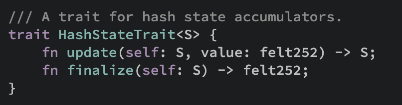
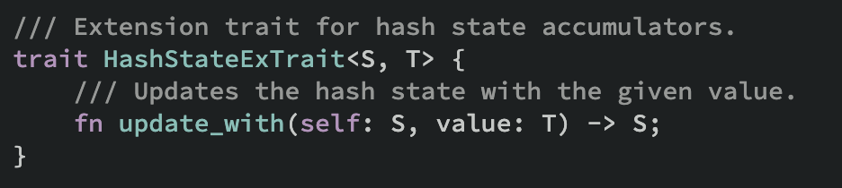
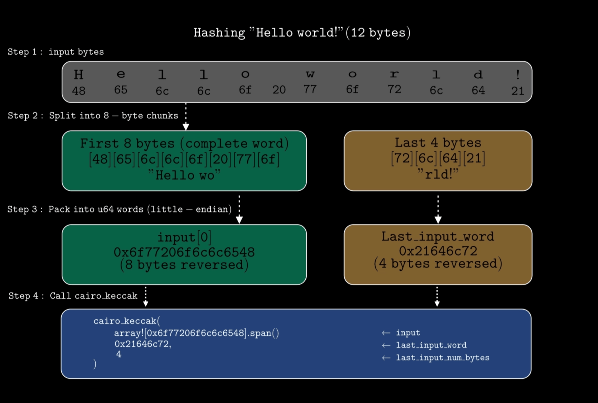

# Hash Functions on Starknet

Solidity relies on keccak-256 as its primary hash function to derive deterministic identifiers from arbitrary data such as computing function selectors or computing storage slots for mappings, but Cairo provides separate hash functions for different contexts.

This article covers three hash functions in Starknet/Cairo: Pedersen, Poseidon, and Keccak-256. We will explain how and when to use each of them in your smart contracts.

## Why Does Cairo Use Three Hash Functions?

ZK proof systems like Starknet work over finite fields, where every operation is expressed as a constraint. A constraint is an arithmetic equation that encodes computation rules which must be satisfied to produce a valid proof. The more constraints an operation requires, the more expensive it is to prove.

Keccak-256 is particularly expensive in this regard because it is built on bitwise operations like XOR, AND, and bit rotations. Those operations don't map directly to field arithmetic and must be emulated using many constraints, making Keccak-256 significantly more expensive to prove than operations that are natively field-friendly.

Cairo therefore provides three hash functions, each for a different context:

1. **Keccak-256 Hash**

    This hash function is included in Cairo for compatibility with Ethereum, for example, computing function selectors, replicating storage layouts, and verifying Ethereum signatures.

    While not optimized for STARK proofs due to too many constraints and therefore expensive to use frequently, it is needed for cross-chain interoperability, and for deriving the base address of storage variables in Cairo.

2. **Pedersen Hash**

    An elliptic-curve based hash function defined over Starknet’s native field (`felt252`). It was the first hash function used on Starknet and is still used for computing storage addresses (for example, `Map` type relies on Pedersen to hash storage keys). As a result, Pedersen is often required for compatibility with existing contracts, state commitments, or Merkle trees that already depend on it.

    Unlike Keccak, which relies on bitwise operations that require many constraints in STARK proofs, Pedersen uses point additions and scalar multiplications on a Stark-curve which makes it cheaper to prove inside Cairo. Pedersen produces `felt252` outputs.

3. **Poseidon Hash**

    It operates directly over the prime field used by Starknet, avoiding elliptic-curve arithmetic entirely. This results in far fewer constraints, making it cheaper and faster than both Pedersen and Keccak, and the recommended choice for general hashing, Merkle trees, and commitments within Cairo. It produces `felt252` outputs.


> Note: If you need to interact with legacy contracts, use “Pedersen”. If you are free to choose the best option for efficiency, you use “Poseidon”. If you need Ethereum compatibility, use “Keccak”.
>

## **How to Use Hash Functions in Cairo**

Now that we understand what these hash functions are and what their purpose is, let’s look at how to use them in practice. Cairo provides these hash functions in its core library. For functions like Pedersen and Poseidon, their preimage (*the input value to be hashed*) type must implement a trait called `Hash`.

### The Hash Trait

This trait marks a type as hashable. It is implemented for Cairo's primitive types (`felt252`, `bool` `u8`, etc.) which can all be represented as `felt252` values. For complex types such as structs and enums, deriving `Hash` (`#[derive(Hash)]`) makes them hashable using any supported hash function (Poseidon or Pedersen), provided that every field or variant is hashable itself.

Collection types, on the other hand do not and cannot derive the `Hash` trait; therefore are unhashable. The following examples illustrate which types can and cannot derive `Hash` (*we will see why after the code block*):

```rust
// ✅ All fields are hashable
// Primitive types can be hashed
#[derive(Hash)]
struct A {
    f1: felt252,
    f2: u256, // u256 is actually a struct { low: u128, high: u128 }
							// but derives Hash by default since both fields are hashable
}

// ❌ Cannot derive Hash: STORAGE collections
// Vectors and Maps in storage cannot be hashed because they don't implement `Hash`.
struct B {
    f1: Vec<felt252>,
    f2: Map<felt252, u128>,
}

// ❌ Cannot derive Hash: MEMORY collections
// Arrays and Dictionaries in memory cannot be hashed because they don't implement `Hash`.
struct C {
    f1: Array<felt252>,
    f2: Felt252Dict<u128>,
}
```

Struct `A` can derive `Hash` because both fields are hashable. While `felt252` is clearly a primitive type, `u256` is actually a struct `{ low: u128, high: u128 }`. However, because `u256` itself derives `Hash` (both `u128` fields are hashable), it behaves like a primitive type for hashing purposes. The other structs cannot derive `Hash` because:

Memory collections like `Array` and `Felt252Dict` do not implement `Hash` by design, so structs containing them can't use `derive(Hash)` since it requires all fields to be hashable.

Types like `Map` and `Vec` are specifically for storage, which means their data lives in the contract's persistent storage rather than Cairo's execution memory. Since `Hash` trait requires in-memory values, these types cannot implement it.

To hash values in Cairo, you need two components: the `Hash` trait (*which marks types as hashable*) and a hasher state (*which performs the actual hashing operation*).

### The Hasher State

The hasher state progressively hash values and then finalizes it to produce a digest (*the final hash output*). This design makes it possible to hash an arbitrary number of inputs.

Conceptually, think of hashing a list of values like this:

```rust
hashFunc(x1, x2, x3, …, xn)
```

Rather than computing this in a single step, the hasher works incrementally:

1. **Initialize the hasher state**

    The state starts from a predefined constant value that is hardcoded into the hash function's specification.

2. **Hash the first input**

    ```rust
    state₁ = h(state₀, x1)
    ```

3. **Hash the next input**

    ```rust
    state₂ = h(state₁, x2)
    ```

4. **Continue hashing inputs**

    This process repeats for each input until all values have been hashed:

    ```rust
    stateₙ = h(stateₙ₋₁, xn)
    ```

5. **Finalize the state**

    The final state is the digest:

    ```rust
    digest = finalize(stateₙ)
    ```


Cairo exposes two traits to work with the hasher state:

1. **HashStateTrait:** This trait is designed for hashing Cairo's native field elements (`felt252`).

    It provides two core methods:

    - `.update`: updates the hash state with value of type `felt252` only.
    - `.finalize`: finalizes the state and returns the hash digest as a `felt252`.

    

2. **HashStateExTrait:** This trait “extends” HashStateTrait.

    It provides a method:

    - `.update_with`: updates the hash state with value of “any type” that implements the `Hash` traits.

    


The next step is to see how the `Hash` trait and the hasher state come together in practice. We will demonstrate how to use them to hash values with Pedersen and Poseidon.

## Pedersen and Poseidon

Both **Pedersen** and **Poseidon** expose the same hashing workflow in Cairo:

1. **Initialize** a hash state
2. **Update** it with one or more values
3. **Finalize** to produce a `felt252` digest

This makes them look nearly identical to use, with one key difference: Pedersen requires a “base” value.

Here is an example of how we’ll hash two fields using Poseidon:

```rust
PoseidonTrait::new()
    .update(a)
    .update(b)
    .finalize()
```

Using Pedersen:

```rust
PedersenTrait::new(<*base_value*>)   // base
    .update(a)
    .update(b)
    .finalize()
```

From a usage perspective, the only visible difference between the two is the extra argument passed to `PedersenTrait::new`, called the **base**.

### **What the Pedersen “base” actually is**

The Pedersen *base* is simply an **initial value** of type `felt252`.

Pedersen is a 2-input hash function (it always hashes two `felt252` values), which means there is no native “hash one value” operation. To hash a single value, the base is supplied as first input and the actual value to hash (*the preimage*) as the second input.

Conceptually:

```
final_hash = pedersen(base, a)
```

When hashing multiple values, the first hash output becomes the next state and is chained forward. For example, hashing three values `a`, `b` and `c` with a base looks like this:

```
initial_state = pedersen(base, a)

state1 = pedersen(initial_state, b)

final_hash = pedersen(state1, c)
```

> Notice how the previous state becomes the first input in the next hash operation, this is exactly what makes it a chain.
>

The base can also be used as **domain separator.** Using different base values places hashes in different logical domains, even if the same values are hashed in the same order. For example, imagine your contract hashes a `(user, amount)` pair both for an airdrop claim and for a transfer approval. Without domain separation, both operations would produce the same hash for the same inputs. By using a different base value for each operation, the two hashes are placed in different logical domains and will always produce different outputs even when given identical inputs:

```rust
// Base 0: airdrop claim domain
let claim_hash = PedersenTrait::new(0)
    .update(user)
    .update(amount)
    .finalize();

// Base 1: transfer approval domain
let approval_hash = PedersenTrait::new(1)
    .update(user)
    .update(amount)
    .finalize();

// claim_hash != approval_hash, even though inputs are identical
```

### **Poseidon: The Base Is Already Baked In**

Poseidon on the other hand does not need an explicit base value because it already has an internal fixed state. When `PoseidonTrait::new()` is called, it starts from that predefined state.

So conceptually, hashing a single value in Poseidon looks like this:

```
initial_state = PREDEFINED_STATE

hash = poseidon(initial_state, a)
```

With two inputs `a` and `b`:

```
initial_state = PREDEFINED_STATE

state1 = poseidon(initial_state, a)

hash = poseidon(state1, b)
```

Let’s look at some examples of how to use Poseidon and Pedersen in a contract.

### **Example 1: Hashing Two Field Elements With `.update`**

The code example below, demonstrates how to hash two `felt252` values using **Poseidon**:

```rust
#[starknet::interface]
pub trait IHelloStarknet<TContractState> {
    fn hash_two_felts_poseidon(self: @TContractState, a: felt252, b: felt252);
}

#[starknet::contract]
mod HelloStarknet {
    // IMPORT `Poseidon` HASH FUNCTION
    use core::poseidon::PoseidonTrait;

		// IMPORT THE TRAIT
    use core::hash::{
        HashStateTrait // .update(felt252) AND .finalize()
    };

    #[storage]
    struct Storage {}

    #[abi(embed_v0)]
    impl HelloStarknetImpl of super::IHelloStarknet<ContractState> {

	      //*** FUNCTION THAT IMPLEMENTS THE POSEIDON HASH ***//
        fn hash_two_felts_poseidon(self: @ContractState, a: felt252, b: felt252) {
            let digest = PoseidonTrait::new() // initialize a hash state
                .update(a) // takes first felt252
                .update(b) // takes second felt252
                .finalize(); // produce the digest

            println!("Digest: {:?}", digest);
        }
    }
}
```

Same idea for **Pedersen**; ****the only difference is that you pass a **base** when creating the state.  `0` is a common choice and will be used throughout this article:

```rust
#[starknet::interface]
pub trait IHelloStarknet<TContractState> {
    fn hash_two_felts_pedersen(self: @TContractState, a: felt252, b: felt252);
}

#[starknet::contract]
mod HelloStarknet {
    // IMPORT `Pedersen` HASH FUNCTION
    use core::pedersen::PedersenTrait;

		// IMPORT THE TRAIT
    use core::hash::{
        HashStateTrait // .update(felt252) AND .finalize()
    };

    #[storage]
    struct Storage {}

    #[abi(embed_v0)]
    impl HelloStarknetImpl of super::IHelloStarknet<ContractState> {

        //*** FUNCTION THAT IMPLEMENTS THE PEDERSEN HASH ***//
        fn hash_two_felts_pedersen(self: @ContractState, a: felt252, b: felt252) {
				    let digest = PedersenTrait::new(0) // 0 as the base for the running hash
				        .update(a)
				        .update(b)
				        .finalize();

				    println!("Digest: {:?}", digest);
				}

    }
}
```

### **Example 2: Hashing with `.update_with`**

So far, we have only hashed `felt252` values using `.update`. But in practice, we will often want to hash values of other types.

That is what `.update_with` is for. It comes from `HashStateExTrait` and is used to hash any type that implements (or derives) `Hash` trait.

#### **Hashing a ContractAddress using Poseidon**

In the code below, we hash two `ContractAddress` values, `a` and `b`. Since `ContractAddress` implements the `Hash` trait, we can pass them directly into the hasher state using `.update_with()`.

```rust
use starknet::ContractAddress;

#[starknet::interface]
pub trait IHelloStarknet<TContractState> {
    fn hash_two_addresses_poseidon(
			    self: @TContractState,
			    a: ContractAddress,
			    b: ContractAddress
			 );
}

#[starknet::contract]
mod HelloStarknet {
		use starknet::ContractAddress;

    // IMPORT `Poseidon` HASH FUNCTION
    use core::poseidon::PoseidonTrait;

		// IMPORT THE TRAIT
    use core::hash::{
        HashStateTrait,
        HashStateExTrait // .update_with(<T>) *** NEWLY ADDED ***
    };

    #[storage]
    struct Storage {}

    #[abi(embed_v0)]
    impl HelloStarknetImpl of super::IHelloStarknet<ContractState> {

	      //*** FUNCTION THAT IMPLEMENTS THE POSEIDON HASH ***//
        fn hash_two_addresses_poseidon(self: @ContractState, a: ContractAddress, b: ContractAddress) {
            let digest = PoseidonTrait::new()  // initialize a hash state
                .update_with(a)   // takes first address
                .update_with(b)   // takes second address
                .finalize();  // produce the digest

             println!("Digest: {:?}", digest);
        }
    }
}
```

#### **Hashing a ContractAddress using Pedersen**

This contract below hashes two addresses using Pedersen hash function:

```rust
use starknet::ContractAddress;

#[starknet::interface]
pub trait IHelloStarknet<TContractState> {
    fn hash_two_addresses_pedersen(
			    self: @TContractState,
			    a: ContractAddress,
			    b: ContractAddress
			 );
}

#[starknet::contract]
mod HelloStarknet {
		use starknet::ContractAddress;

    // IMPORT `Pedersen` HASH FUNCTION
    use core::pedersen::PedersenTrait;

		// IMPORT THE TRAIT
    use core::hash::{
        HashStateTrait,
        HashStateExTrait // .update_with(<T>) *** NEWLY ADDED ***
    };

    #[storage]
    struct Storage {}

    #[abi(embed_v0)]
    impl HelloStarknetImpl of super::IHelloStarknet<ContractState> {

	      //*** FUNCTION THAT IMPLEMENTS THE PEDERSEN HASH ***//
        fn hash_two_addresses_pedersen(self: @ContractState, a: ContractAddress, b: ContractAddress) {
            let digest = PedersenTrait::new(0) // initialize a hash state
                .update_with(a) // takes first address
                .update_with(b) // takes second address
                .finalize(); // produce the digest

             println!("Digest: {:?}", digest);
        }
    }
}
```

#### **Hashing a struct using Poseidon**

In the code below, since `MyStruct` is used as a parameter in the interface, we define it outside the contract module so both the interface and the contract implementation can access it.
Any struct that appears in a `#[starknet::interface]` must:

- Be defined **outside** the contract module
- Derive `Serde` so it can be serialized into a sequence of `felt252`s, and deserialized back from them
- Derive `Drop` so the value can be safely discarded when it goes out of scope

```rust
// DEFINE OUR STRUCT
#[derive(Hash, Serde, Drop)]
struct MyStruct {
    a: u256,
    b: felt252,
}

#[starknet::interface]
pub trait IHelloStarknet<TContractState> {
    fn hash_struct_poseidon(self: @TContractState, my_struct: MyStruct);
}

#[starknet::contract]
mod HelloStarknet {
    use core::hash::{ HashStateTrait, HashStateExTrait };
    use core::poseidon::PoseidonTrait;

    //*** IMPORT THE STRUCT WE DEFINED OUTSIDE THE CONTRACT ***//
    use super::MyStruct;

    #[storage]
    struct Storage {}

    #[abi(embed_v0)]
    impl HelloStarknetImpl of super::IHelloStarknet<ContractState> {

        fn hash_struct_poseidon(self: @ContractState, my_struct: MyStruct) {
            let digest = PoseidonTrait::new().update_with(my_struct).finalize();

	          println!("Digest: {:?}", digest);
        }

    }
}
```

#### **Hashing a struct using Pedersen**

This works the same with Pedersen, just replace the import with Pedersen hash function and the state with `PedersenTrait::new(0)` and keep the rest unchanged:

```rust
// DEFINE OUR STRUCT
#[derive(Hash, Serde, Drop)]
struct MyStruct {
    a: u256,
    b: felt252,
}

#[starknet::interface]
pub trait IHelloStarknet<TContractState> {
    fn hash_struct_pedersen(self: @TContractState, my_struct: MyStruct);
}

#[starknet::contract]
mod HelloStarknet {
    use core::hash::{ HashStateTrait, HashStateExTrait };
    use core::pedersen::PedersenTrait;

    //*** IMPORT THE STRUCT WE DEFINED OUTSIDE THE CONTRACT ***//
    use super::MyStruct;

    #[storage]
    struct Storage {}

    #[abi(embed_v0)]
    impl HelloStarknetImpl of super::IHelloStarknet<ContractState> {

        fn hash_struct_pedersen(self: @ContractState, my_struct: MyStruct) {
            let digest = PedersenTrait::new(0) // *** REPLACEMENT HERE *** //
								            .update_with(my_struct).finalize();

            println!("Digest: {:?}", digest);
        }

    }
}

```

If a struct is only used internally within the contract and not exposed through the interface, it does not need to derive `Serde`.

Below is an example of a hashable struct defined and used within a contract:

```rust
#[starknet::interface]
pub trait IHelloStarknet<TContractState> {
    fn hash_struct_pedersen(
			    self: @TContractState,
			    value1: u256,
			    value2: felt252
		);
}

#[starknet::contract]
mod HelloStarknet {
    use core::hash::{HashStateExTrait, HashStateTrait};
    use core::pedersen::PedersenTrait;

    // *** DEFINE STRUCT INSIDE THE CONTRACT *** //
    #[derive(Hash, Drop)]
    struct MyStruct {
        a: u256,
        b: felt252,
    }

    #[storage]
    struct Storage {}

    #[abi(embed_v0)]
    impl HelloStarknetImpl of super::IHelloStarknet<ContractState> {
        fn hash_struct_pedersen(self: @ContractState, value1: u256, value2: felt252) {

		        // *** INITIALIZE THE STRUCT *** //
            let my_struct = MyStruct { a: value1, b: value2 };

            let digest = PedersenTrait::new(0).update_with(my_struct).finalize();

            println!("Digest: {:?}", digest);

        }
    }
}

```

### **Example 3: Hashing Arrays**

We can not directly hash an array like we did with other types, because an array itself doesn’t implement the `Hash` trait. To hash an array you must **loop through each element**, update the hash state as we go, and then call `.finalize()` at the end.

#### Hash an `Array<felt252>` using Poseidon:

```rust
#[starknet::interface]
pub trait IHelloStarknet<TContractState> {
    fn hash_array_manual_poseidon(self: @TContractState, values: Array<felt252>);
}

#[starknet::contract]
mod HelloStarknet {
    use core::hash::HashStateTrait;
    use core::poseidon::PoseidonTrait;

    #[storage]
    struct Storage {}

    #[abi(embed_v0)]
    impl HelloStarknetImpl of super::IHelloStarknet<ContractState> {

        fn hash_array_manual_poseidon(self: @ContractState, values: Array<felt252>) {
            let mut state = PoseidonTrait::new(); // The hash state
            let mut i = 0;
            let len = values.len();

            // The loop
            while i != len {
                state = state.update(*values.at(i));
                i += 1;
            }

            // Finalize the state
            let digest = state.finalize();

            println!("Digest: {:?}", digest);
        }

    }
}
```

Cairo has a built-in **Poseidon** helper that handles the looping under the hood and manages state updates automatically: `poseidon_hash_span`.

**Using the Built-in Poseidon Helper to Hash an Array of `felt252`**

The `poseidon_hash_span` function takes a `Span<felt252>` as input, iterates through each element to build the hash state, then finalizes and returns a single `felt252` digest.

Below is an example. Unlike manual Poseidon hashing where we need to import `PoseidonTrait` and `HashStateTrait`, `poseidon_hash_span` is a standalone function that handles everything internally. We only need to import and use it:

```rust
#[starknet::interface]
pub trait IHelloStarknet<TContractState> {
    fn hash_array_builtin_poseidon(self: @TContractState, values: Array<felt252>);
}

#[starknet::contract]
mod HelloStarknet {
		// IMPORT `poseidon_hash_span`
    use core::poseidon::poseidon_hash_span;

    #[storage]
    struct Storage {}

    #[abi(embed_v0)]
    impl HelloStarknetImpl of super::IHelloStarknet<ContractState> {

        fn hash_array_builtin_poseidon(self: @ContractState, values: Array<felt252>) {
            // Convert Array<felt252> to Span<felt252>
            let span = values.span();

						// USE `poseidon_hash_span`
            let digest = poseidon_hash_span(span);

            println!("Digest: {:?}", digest);
        }

    }
}
```

Since the `poseidon_hash_span` function takes a `Span<felt252>` as input, we first convert our array to span using `.span()`, then pass it to the built-in function, which returns a single `felt252` digest.

If we pass the same array to both `hash_array_manual_poseidon` and `hash_array_builtin_poseidon` functions, they will produce identical Poseidon hashes, because `poseidon_hash_span` simply does the manual loop under the hood.

#### Hash an `Array<felt252>` using Pedersen:

The steps for hashing an array of felts with Pedersen are similar to those for Poseidon: you manually loop through the array and hash each element sequentially. However, there's a convention in Starknet when hashing arrays with Pedersen “**the array length must be included as the final element**. The pattern is followed consistently across the Starknet ecosystem, including the [protocol implementation](https://github.com/xJonathanLEI/starknet-rs/blob/master/starknet-core/src/crypto.rs#L66C8-L66C32) and standard libraries like [starknet.js](https://github.com/starknet-io/starknet.js/blob/develop/src/utils/hash/classHash/pedersen.ts#L33).

The `hash_array_manual_pedersen` function below shows this pattern in action. After hashing all the array elements, we hash the array length as the final element before finalizing the hash state:

```rust
#[starknet::interface]
pub trait IHelloStarknet<TContractState> {
    fn hash_array_manual_pedersen(self: @TContractState, values: Array<felt252>);
}

#[starknet::contract]
mod HelloStarknet {
    use core::hash::HashStateTrait;
    use core::pedersen::PedersenTrait;

    #[storage]
    struct Storage {}

    #[abi(embed_v0)]
    impl HelloStarknetImpl of super::IHelloStarknet<ContractState> {
        fn hash_array_manual_pedersen(self: @ContractState, values: Array<felt252>) {
            let mut state = PedersenTrait::new(0);
            let mut i = 0;
            let len = values.len();

            while i != len {
                state = state.update(*values.at(i));
                i += 1;
            }

            // FOCUS HERE: Include the array length
            state = state.update(len.into());

            let digest = state.finalize();

            println!("Digest: {:?}", digest);
        }
    }
}
```

>
>
>
> Takeaways:
>
> - Use the manual loop when custom logic is needed (e.g. mixing other data types or conditional updates).
> - Use `poseidon_hash_span` to compute the Poseidon hash of a `felt252` array. It’s cleaner and requires less code.
> - The standard pattern for hashing arrays with Pedersen is to include the array length as the final element before finalizing the hash state.

## Keccak256

Cairo’s `core::keccak` module provides four functions:

- `compute_keccak_byte_array`: Hash a `ByteArray`.
- `keccak_u256s_be_inputs`:  Hash an array of `u256` values encoded in big-endian format.
- `keccak_u256s_le_inputs`:  Hash an array of `u256` values encoded in little-endian format.
- `cairo_keccak`: Hash a byte sequence with custom padding (equivalent of Solidity’s `keccak256(abi.encodePacked(val))`).

All of these return a `u256` that represents the same 32-byte digest produced by Solidity’s `keccak256`. The difference is in how the value is represented: Solidity returns the digest as `bytes32` in big-endian format, while Cairo returns it as a little-endian `u256`.

For example, suppose Solidity’s keccak hash of a value produced `0x1234...5678`. Cairo’s keccak would represent that same digest as a little-endian `u256`, so its byte order would be reversed: `0x7856...3412`. We will see how to get matching results between Cairo and Solidity’s keccak in the last section.

### **Cairo’s Keccak Functions With Their Solidity Equivalents**

- `compute_keccak_byte_array` → Hashes a `ByteArray`.

    Solidity contract:

    ```solidity
    contract Example {
        function hashHello() external pure returns (bytes32) {
            return keccak256(abi.encodePacked("Hello RareSkills"));
        }
    }
    ```

    Cairo Equivalent:

    ```rust
    #[starknet::interface]
    pub trait IHelloStarknet<TContractState> {
        fn hash_hello(self: @TContractState);
    }

    #[starknet::contract]
    mod HelloStarknet {

        // IMPORTS
        use core::keccak::compute_keccak_byte_array;

        #[storage]
        struct Storage {}

        #[abi(embed_v0)]
        impl HelloStarknetImpl of super::IHelloStarknet<ContractState> {
            fn hash_hello(self: @ContractState) {
    		        // Perform the hash
                let digest = compute_keccak_byte_array(@"Hello RareSkills");

                println!("Digest: {:?}", digest);
            }
        }
    }
    ```


- `keccak_u256s_be_inputs` → Hashes an array of `u256` values in big-endian order, matching Solidity’s default encoding.

    Solidity contract:

    ```solidity
    contract Example {
        function hash() external pure returns (bytes32) {
            return keccak256(abi.encode(1,2));
        }
    }
    ```

    Cairo Equivalent:

    ```rust
    #[starknet::interface]
    pub trait IHelloStarknet<TContractState> {
        fn hash(self: @TContractState);
    }

    #[starknet::contract]
    mod HelloStarknet {

        // IMPORTS
        use core::keccak::keccak_u256s_be_inputs;

        #[storage]
        struct Storage {}

        #[abi(embed_v0)]
        impl HelloStarknetImpl of super::IHelloStarknet<ContractState> {
            fn hash(self: @ContractState) {
    		        // Perform the hash
                let digest = keccak_u256s_be_inputs([1, 2].span());

                println!("Digest: {:?}", digest);
            }
        }
    }
    ```


- `keccak_u256s_le_inputs` → Hashes an array of `u256` values **in little-endian order**. Solidity can replicate this by manually converting inputs to little-endian before hashing.

    Solidity contract:

    ```solidity
    contract Example {
        function hash() external pure returns (bytes32) {
          // Convert 1_u256 and 2_u256 to little endian
          uint256 one_le =
    	      0x0100000000000000000000000000000000000000000000000000000000000000;
          uint256 two_le =
    	      0x0200000000000000000000000000000000000000000000000000000000000000;

          return keccak256(abi.encode(one_le,two_le));
        }
    }
    ```

    Cairo Equivalent:

    ```rust
    #[starknet::interface]
    pub trait IHelloStarknet<TContractState> {
        fn hash(self: @TContractState);
    }

    #[starknet::contract]
    mod HelloStarknet {

        // IMPORTS
        use core::keccak::keccak_u256s_le_inputs;

        #[storage]
        struct Storage {}

        #[abi(embed_v0)]
        impl HelloStarknetImpl of super::IHelloStarknet<ContractState> {
            fn hash(self: @ContractState) {
    		        // Perform the hash
                let digest = keccak_u256s_le_inputs([1, 2].span());

                println!("Digest: {:?}", digest);
            }
        }
    }
    ```


- `cairo_keccak` → it takes in three arguments:
    - `input` - array of complete 64-bit words in little-endian format
    - `last_input_word` - remaining bytes from `input` that don't fill a complete 8-byte word. For example, if you are hashing 12 bytes total, the first 8 bytes go in `input` as one complete word, and the last 4 bytes go in `last_input_word`. If your input is exactly divisible by 8 (e.g., 8, 16, or 32 bytes), then `last_input_word` is `0`.
    - `last_input_num_bytes` - number of bytes in the `last_input_word`. Must be an integer between `0` and `7`, inclusive.

    The diagram below shows how these parameters work together:

    

    **Example 1 – Hash data that is a multiple of u64 or 8bytes**

    Solidity contract:

    ```solidity
    contract Example {
        function hash() external pure returns (bytes32) {
          uint64 one = 1; // 0x0000000000000001

          return keccak256(abi.encodePacked(one));
        }
    }
    ```

    Cairo Equivalent:

    ```rust
    #[starknet::interface]
    pub trait IHelloStarknet<TContractState> {
        fn hash(self: @TContractState);
    }

    #[starknet::contract]
    mod HelloStarknet {

        // IMPORTS
        use core::keccak::cairo_keccak;

        #[storage]
        struct Storage {}

        #[abi(embed_v0)]
        impl HelloStarknetImpl of super::IHelloStarknet<ContractState> {
            fn hash(self: @ContractState) {
                let mut input = array![0x0100000000000000]; // 1_u64 as little-endian
                let digest = cairo_keccak(ref input, 0, 0); // no extra bytes

                println!("Digest: {:?}", digest);
            }
        }
    }
    ```

    The last two `cairo_keccak` arguments; `last_input_word` and `last_input_num_bytes` are 0 because we don’t have extra bytes to hash.

    **Example 2 – Hash data that is NOT a multiple of u64 or 8bytes**

    Suppose we want to hash `0x48656c6c6f20776f726c6421` which represents "Hello world!" (12 bytes). Since 12 is not divisible by 8, we will need to use the `last_input_word` parameter.

    Solidity contract:

    ```solidity
    contract Example {
        function hash() external pure returns (bytes32) {
          bytes12 input = 0x48656c6c6f20776f726c6421;

          return keccak256(abi.encodePacked(input));
        }
    }
    ```

    Cairo Equivalent:

    ```rust
    fn hash(self: @ContractState) {
    		// bytes to hash - 0x48656c6c6f20776f726c6421 (12 bytes)

    		// first 8 bytes (48656c6c6f20776f), reversed to little-endian
    	  let mut input = array![0x6f77206f6c6c6548];

        // Perform the hash
        // the remaining 4 bytes (726c6421) to little-endian - 0x21646c72
        let digest = cairo_keccak(ref input, 0x21646c72, 4);

        println!("Digest: {:?}", digest);
    }
    ```

    Here:

    - `0x6f77206f6c6c6548` is the first 8 bytes reversed.
    - `0x21646c72` is the remaining 4 bytes reversed.
    - `4` indicates the count of those remaining bytes.

These examples show how Cairo’s Keccak functions align with Solidity’s `keccak256`, but their outputs differ in byte order. Cairo returns a little-endian `u256`, while Solidity produces a big-endian `bytes32`. Reverse the byte order of the Cairo result before comparing it to a Solidity hash.

### Converting Little-Endian to Big-Endian and vice versa

The animation below shows a bytes conversion from little-endian to big endian:

<video controls>
  <source src="https://r2media.rareskills.io/CairoVideos/keccack-hello.mp4" type="video/mp4">
</video>

To do the same in Cairo, we reverse the byte order of a `u256` value by reversing each 128-bit half and swapping their positions. Cairo provides a built-in function `u128_byte_reverse` from Cairo’s `core::integer` module to reverse bytes.

The following code example shows how to convert a `u256` value from little-endian to big-endian representation (and vice versa) by reversing its byte order:

```rust
fn u256_reverse_bytes(x: u256) -> u256 {
    u256 {
		    // Take the high 128 bits, reverse their byte order, put in low position
        low: core::integer::u128_byte_reverse(x.high),

        // Take the low 128 bits, reverse their byte order, put in high position
        high: core::integer::u128_byte_reverse(x.low),
    }
}
```

Since a `u256` in Cairo is composed of two `u128` values (`low` and `high`), reversing the byte order of the **256-bit integer requires:

1. Reversing the byte order within each 128-bit half.
2. Swapping the two halves.

The `core::integer::u128_byte_reverse` function performs the byte-level reversal for each `u128`. By applying it to both halves and swapping their positions, we reverse the byte order of the entire 256-bit value.

Because byte reversal is symmetric, this same function can be used to convert:

- little-endian → big-endian
- big-endian → little-endian

Applying it twice returns the original value.
