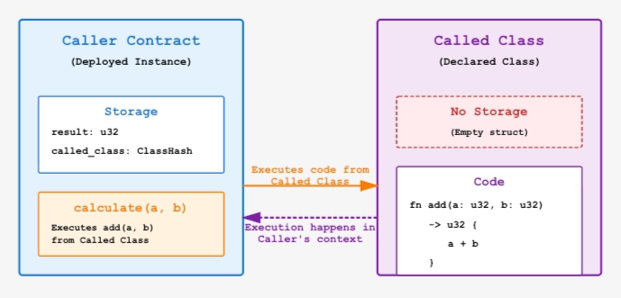

# `Library call on Starknet`

A library call executes the logic of a declared contract class in the context and storage of the contract that invokes it. This is similar to [Solidity’s `delegatecall`](https://rareskills.io/post/delegatecall) but uses class hashes rather than deployed contract addresses.

In this article, you'll learn how library calls work in detail and the two implementation approaches in Cairo contracts.

## How library calls work

Consider this code example with two contracts: `CallerContract` and `CalledContract`.
`CalledContract` is a contract class that defines reusable logic that deployed contracts can execute via library calls. It has an `add()` function that takes two numbers and returns their sum:

```rust
#[starknet::interface]
pub trait ICalledContract<TContractState> {
    fn add(self: @TContractState, a: u32, b: u32) -> u32;
}

#[starknet::contract]
mod CalledContract {
    #[storage]
    struct Storage {
        // no storage needed
    }

    #[abi(embed_v0)]
    impl CalledContractImpl of super::ICalledContract<ContractState> {
        fn add(self: @ContractState, a: u32, b: u32) -> u32 {
            a + b
        }
    }
}
```

`CallerContract` is a deployed contract that stores `CalledContract`'s class hash. When its `calculate()` function is called, it executes the `add()` function from `CalledContract`'s class via a library call and then stores the result in its own storage:

```rust
#[starknet::interface]
pub trait ICallerContract<TContractState> {
    fn calculate(ref self: TContractState, a: u32, b: u32) -> u32;
}

#[starknet::contract]
mod CallerContract {
    use starknet::{ClassHash, get_caller_address, get_contract_address};
    use starknet::storage::{StoragePointerWriteAccess};

    #[storage]
    struct Storage {
        result: u32,  // CallerContract's storage
        called_class: ClassHash,
    }

    #[constructor]
    fn constructor(ref self: ContractState, called_class_hash: ClassHash) {
        self.called_class.write(called_class_hash);
    }

    #[abi(embed_v0)]
    impl CallerContractImpl of super::ICallerContract<ContractState> {
        fn calculate(ref self: ContractState, a: u32, b: u32) -> u32 {
            let caller = get_caller_address();
            let this = get_contract_address();

            // Execute add() from CalledContract via library call
            // Library call details will be shown later
            let sum = // ... library call to add(a, b) ...

            // Store result in CallerContract's storage
            self.result.write(sum);
            sum
        }
    }
}
```

Here's a diagram showing how `CallerContract` executes code from `CalledContract` through a library call:



### Library calls preserve the caller's context

When a user calls `CallerContract.calculate()`, inside `CallerContract`:

- `get_caller_address()` returns the user's address
- `get_contract_address()` returns `CallerContract`'s address

When `CallerContract` executes the `add()` function from `CalledContract`'s class via a library call, the execution stays in `CallerContract`'s context. This means:

- `get_caller_address()` still returns the user's address (preserved from the original call)
- `get_contract_address()` still returns `CallerContract`'s address
- Storage updates happen in `CallerContract`'s storage (the `result` field gets modified)

The code from `CalledContract` executes as if it were written directly inside `CallerContract`.

> `*get_contract_address()` always returns the address of the contract whose context is active, not necessarily whose code is running.*
>

**Library call comparison with Solidity's `delegatecall`:**

| Aspect | Cairo library call | Solidity `DELEGATECALL` |
| --- | --- | --- |
| Target | Contract class (declared class hash) | Deployed library contract |
| Mechanism | `library_call_syscall` | `DELEGATECALL` opcode |
| Context | Caller's context | Caller's context |
| Storage Modified | Caller's storage | Caller's storage |
| msg.sender equivalent | Original user's address preserved | Original msg.sender preserved |

The key difference from regular cross-contract calls is whose storage gets updated and in whose context the code executes.

## Ways to make library calls

There are two ways to make library calls on Starknet:

1. Using the library dispatcher
2. Using the  `library_call_syscall` directly

Let's walk through each one of them.

### 1. Using the Library Dispatcher

A library dispatcher is a compiler-generated struct that enables type-safe library calls to contract classes. It wraps a `ClassHash` and implements the trait that the compiler generates from your `#[starknet::interface]`.

When you call a function via library dispatcher, you simply invoke it like a regular function. Internally, the dispatcher:

- computes the function selector from the function name at compile time
- serializes the function arguments into `felt252` values
- uses `library_call_syscall` to execute the call with the class hash, function selector, and serialized arguments
- deserializes the returned `Span<felt252>` back into the expected Cairo types

Like contract dispatchers (used in cross-contract calls), library dispatchers come in two variants:

- **Regular library dispatcher**: Makes library calls and reverts the entire transaction if the call panics
- **Safe library dispatcher**: Makes library calls and returns `Result<T, Array<felt252>>`, allowing you to handle failures without reverting. However, certain system-level failures such as using a class hash that doesn't exist on-chain and errors in legacy Cairo Zero classes still cause immediate transaction reverts that cannot be caught.

Let's examine how a `Calculator` contract uses library dispatcher to execute calculation functions from a `MathUtils` class. We’ll create a `MathUtils` class that defines reusable code. This class is declared on-chain but never deployed as a contract instance, so no storage is allocated:

```rust
#[starknet::interface]
trait IMathUtils<TContractState> {
    fn add(self: @TContractState, a: u256, b: u256) -> u256;
    fn multiply(self: @TContractState, a: u256, b: u256) -> u256;
}

// Math utilities class (declared but never deployed)
#[starknet::contract]
mod MathUtils {
    #[storage]
    struct Storage {
        // no storage needed
    }

    #[abi(embed_v0)]
    impl MathUtilsImpl of super::IMathUtils<ContractState> {
        fn add(self: @ContractState, a: u256, b: u256) -> u256 {
            a + b
        }

        fn multiply(self: @ContractState, a: u256, b: u256) -> u256 {
            a * b
        }
    }
}

// Calculator contract (deployed instance that uses MathUtils)
#[starknet::interface]
trait ICalculator<TContractState> {
    fn add(ref self: TContractState, a: u256, b: u256) -> u256;
    fn multiply(ref self: TContractState, a: u256, b: u256) -> u256;
    fn get_result(self: @TContractState) -> u256;
}

#[starknet::contract]
mod Calculator {
    use starknet::storage::{StoragePointerReadAccess, StoragePointerWriteAccess};
    use starknet::ClassHash;
    use super::{IMathUtilsDispatcherTrait, IMathUtilsLibraryDispatcher};

    #[storage]
    struct Storage {
        math_class: ClassHash,
        result: u256,  // Calculator's storage
    }

    #[constructor]
    fn constructor(ref self: ContractState, math_class: ClassHash) {
        self.math_class.write(math_class);
    }

    #[abi(embed_v0)]
    impl CalculatorImpl of super::ICalculator<ContractState> {
        fn add(ref self: ContractState, a: u256, b: u256) -> u256 {
            // Executes MathUtils add() in Calculator's context
            let sum = IMathUtilsLibraryDispatcher { class_hash: self.math_class.read() }
                .add(a, b);

            // Calculator stores the result
            self.result.write(sum);
            sum
        }

        fn multiply(ref self: ContractState, a: u256, b: u256) -> u256 {
            // Executes MathUtils multiply() in Calculator's context
            let product = IMathUtilsLibraryDispatcher { class_hash: self.math_class.read() }
                .multiply(a, b);

            // Calculator stores the result
            self.result.write(product);
            product
        }

        fn get_result(self: @ContractState) -> u256 {
            self.result.read()
        }
    }
}
```

In the `Calculator` contract, we import the auto-generated dispatcher types from the IMathUtils
interface:

```rust
use super::{IMathUtilsDispatcherTrait, IMathUtilsLibraryDispatcher};
```

Then, when we want to execute code from `MathUtils`, we create a dispatcher instance with the class hash and call the function. For example, in the `add` function:

```rust
let sum = IMathUtilsLibraryDispatcher { class_hash: self.math_class.read() }
    .add(a, b)
```

This creates the dispatcher instance and immediately calls the `add` function from `MathUtils`.

When we call `Calculator.add(5, 3)`, it makes a library call to the `MathUtils` class that
executes the `add` function. The calculation happens in `Calculator`'s context, and
`Calculator` stores the result (8) in its own storage.

When we call `Calculator.multiply(4, 2)`, it executes the `multiply` function from
`MathUtils`, then stores the product (8) in `Calculator`'s storage.

The `get_result()` function directly reads from `Calculator`'s storage, returning whatever value was last stored.

This shows how library calls enable code reuse without deploying separate contract instances. `Calculator` executes logic from the `MathUtils` class as if it were part of its own code.

### 2. Using the `library_call_syscall` directly

Since the library dispatcher uses `library_call_syscall`  under the hood, you can also call this syscall directly when you need manual serialization handling.

Here's how the `Calculator` contract looks when you use `library_call_syscall` directly:

```rust
#[starknet::interface]
pub trait ICalculator<TContractState> {
    fn add_direct(ref self: TContractState, a: u256, b: u256) -> u256;
    fn get_result(self: @TContractState) -> u256;
}

#[starknet::contract]
mod Calculator {
    use starknet::storage::{StoragePointerReadAccess, StoragePointerWriteAccess};
    use starknet::syscalls::library_call_syscall;
    use starknet::{ClassHash, SyscallResultTrait};

    #[storage]
    struct Storage {
        math_class: ClassHash,
        result: u256,
    }

    #[constructor]
    fn constructor(ref self: ContractState, math_class: ClassHash) {
        self.math_class.write(math_class);
    }

    #[abi(embed_v0)]
    impl CalculatorImpl of super::ICalculator<ContractState> {
        fn add_direct(ref self: ContractState, a: u256, b: u256) -> u256 {
            // Manually serialize function arguments
            let mut calldata: Array<felt252> = array![];
            Serde::serialize(@a, ref calldata);
            Serde::serialize(@b, ref calldata);

            // Make the direct library syscall
            let mut res = library_call_syscall(
                self.math_class.read(),
                selector!("add"),
                calldata.span(),
            ).unwrap_syscall();

            // Manually deserialize the response
            let sum = Serde::<u256>::deserialize(ref res).unwrap();

            // Store the result
            self.result.write(sum);
            sum
        }

        fn get_result(self: @ContractState) -> u256 {
            self.result.read()
        }
    }
}
```

The `add_direct` function shows the three-step process of making direct library calls:

- **Manual Serialization**: We create an empty array and serialize each parameter (`a` and `b`) into `felt252` values using `Serde::serialize()`. This converts our `u256` parameters into the low-level format that the syscall expects.

- **Direct Library Syscall**: We call `library_call_syscall` with three parameters:
    - The class hash of `MathUtils` (retrieved from storage)
    - The function selector (`"add"`)
    - The serialized calldata

- **Manual Deserialization**: The syscall returns raw `felt252` data, which we manually deserialize back into a `u256` using `Serde::<u256>::deserialize()`.

When this function executes, it runs the `MathUtils` code within `Calculator`'s context. `Calculator` then stores the result in its own storage.

Using `library_call_syscall` directly allows explicit serialization handling but requires
more code than using the library dispatcher.

**Direct low-level syscalls should only be used when you need to handle serialization manually
or when the function selector must be determined at runtime**. The library dispatcher requires
compile-time knowledge of which function to call (e.g., `dispatcher.add()`), making it unsuitable for cases where the function depends on user input or contract state. In such
scenarios, you use `library_call_syscall` directly.