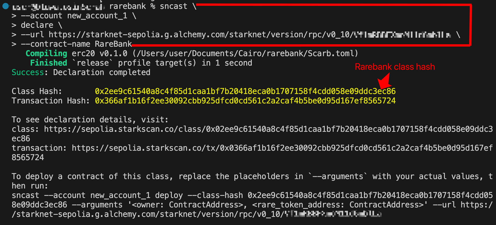
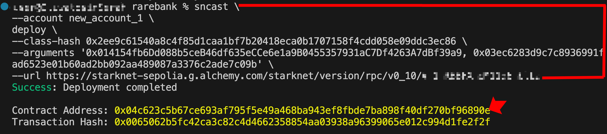
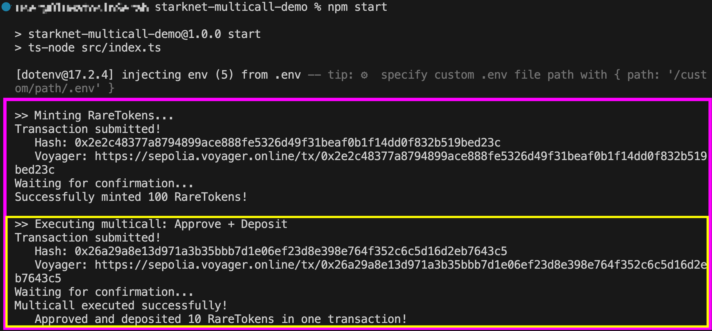
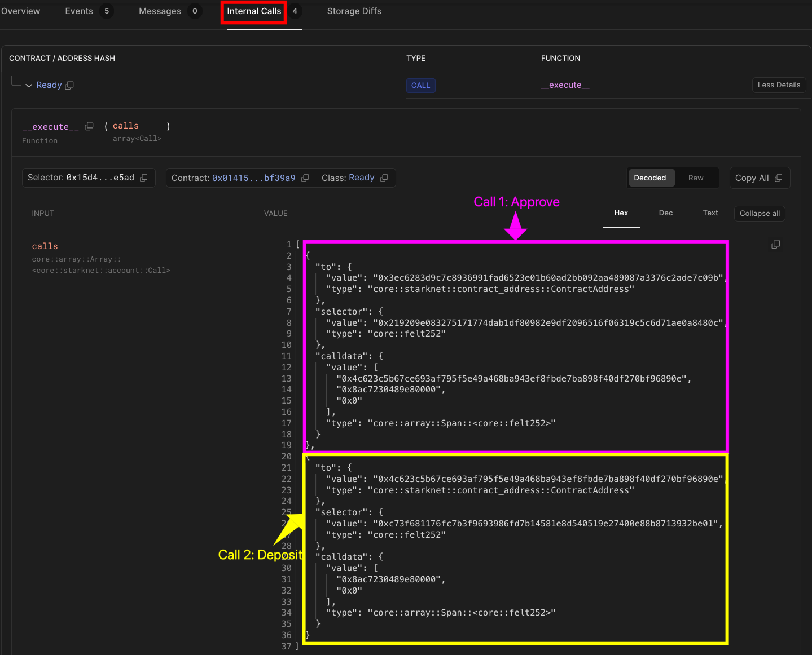
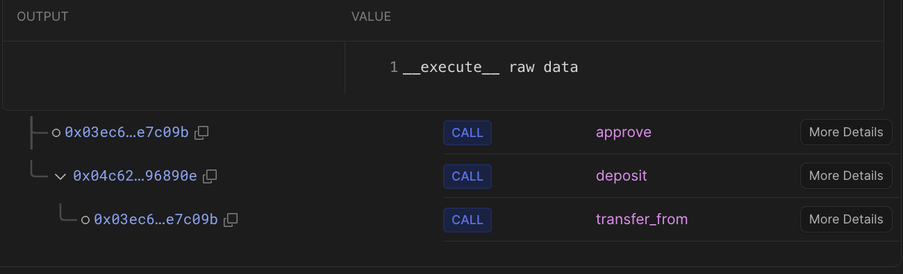

# Native Multicall

Native multicall is Starknet's ability to bundle multiple contract calls into a single atomic transaction. Some decentralized application workflows require signing multiple transactions in sequence. Token swaps are a common example. When you want to convert token A to token B on a traditional DEX, you have to sign multiple transactions:

- you sign to approve the DEX contract to spend your token A
- then sign again to swap token A for token B

That's a two-step transaction process, with gas fees paid each time you sign. More importantly, these two transactions have no atomicity guarantee. If the approval succeeds but the swap fails, the DEX contract retains a spending access to your tokens indefinitely. That dangling approval creates an attack surface: if the DEX contract is later exploited, an attacker can use the contract's existing `transferFrom` permission to drain the approved amount without any action from you.

Starknet eliminates these problems by allowing multiple contract calls to be bundled into a single atomic transaction. You sign once and pay gas fees once.

This capability is built into Starknet's protocol through its native account abstraction architecture. In this article, we'll explore how multicall works and demonstrate it by executing a token approval and deposit as a single atomic transaction using starknet.js.

## How multicall works under the hood

As covered in the previous chapter, Starknet implements native Account Abstraction where every account is a smart contract. Each account contract has an `__execute__` function that the protocol calls when you send a transaction. It takes an array of calls to execute:

```rust
fn __execute__(ref self: ContractState, calls: Array<Call>) -> Array<Span<felt252>>
```

The parameter `calls: Array<Call>` is what makes multicall possible. It allows the function to execute one or multiple operations in a single transaction.

Each `Call` in that array is defined as:

```rust
#[derive(Drop, Serde, Debug)]
struct Call {
    to: ContractAddress,       // Target contract address
    selector: felt252,         // Function selector
    calldata: Array<felt252>   // Encoded parameters
}
```

- `to`: The address of the contract you want to interact with. For a token swap, this might be the DEX contract address, or for an approval, it would be the token contract address.
- `selector`: A unique identifier for the function you want to call on the target contract. For example, to call `transfer`, you pass `sn_keccak(’transfer’)` as the selector.
- `calldata`: This is an array of `felt252` values that represent the arguments you're passing to the function

To approve and execute a swap using multicall, you pass the following two calls to the `calls` parameter:

```rust
const calls: Call[] = [
  {
    contractAddress: TOKEN_ADDRESS,      // to: token contract
    entrypoint: "approve",               // selector: approve function
    calldata: [DEX_ADDRESS, amount]      // calldata: spender and amount
  },
  {
    contractAddress: DEX_ADDRESS,        // to: DEX contract
    entrypoint: "swap",                  // selector: swap function
    calldata: [tokenA, tokenB, amount]   // calldata: swap parameters
  }
];
```

When you send a transaction with multiple calls, the `__execute__` function processes them sequentially. If all calls succeed,`__execute__` returns the result of each call to the caller. If any call fails, the entire transaction reverts; none of the operations take effect.

## Executing Multicalls with Starknet.js

Now let's see how to execute multicalls using `starknet.js`. We'll demonstrate this by depositing _RareTokens_ into `RareBank`, two contracts we've built in previous chapters.

`RareToken` (covered in the [ERC20 chapter](https://rareskills.io/post/cairo-erc-20)) is a standard token contract, while `RareBank` (from the "[Cross Contract Calls](https://rareskills.io/post/cairo-cross-contract-call)" article) allows users to deposit and withdraw these tokens. Depositing requires two steps:

- Approve `RareBank` to spend your tokens
- Deposit the tokens into `RareBank`

Without multicall, this requires two separate transactions and gas fees paid for each. With multicall, we can execute both operations atomically in a single transaction, so you pay one transaction fee instead of two.

### Deploying the Contracts

Before interacting with `RareBank` and `RareToken` contracts, we need to ensure both are deployed on Starknet. For this demo, we'll use Starknet Sepolia. The `RareToken` contract was already deployed in the "Deploying Contracts" chapter. The address provided below has an unrestricted `mint` function. It allows anyone to mint tokens for testing the `RareBank` contract.

**`RareToken` contract address:**

```
0x03ec6283d9c7c8936991fad6523e01b60ad2bb092aa489087a3376c2ade7c09b
```

You can view it on [Voyager](https://sepolia.voyager.online/contract/0x03ec6283d9c7c8936991fad6523e01b60ad2bb092aa489087a3376c2ade7c09b#writeContract).

**_Note: If you're using your own token, replace the RareToken address throughout this tutorial with your token's contract address._**

We only need to deploy the `RareBank` contract for this chapter. Below is the `RareBank` contract:

```rust
use starknet::ContractAddress;

// RareToken ERC20 Interface - defines functions we can call on the token contract
#[starknet::interface]
pub trait IRareToken<TContractState> {
    fn total_supply(self: @TContractState) -> u256;
    fn balance_of(self: @TContractState, account: ContractAddress) -> u256;
    fn allowance(self: @TContractState, owner: ContractAddress, spender: ContractAddress) -> u256;
    fn transfer(ref self: TContractState, recipient: ContractAddress, amount: u256) -> bool;
    fn transfer_from(ref self: TContractState, sender: ContractAddress, recipient: ContractAddress, amount: u256) -> bool;
    fn approve(ref self: TContractState, spender: ContractAddress, amount: u256) -> bool;
    fn name(self: @TContractState) -> ByteArray;
    fn symbol(self: @TContractState) -> ByteArray;
    fn decimals(self: @TContractState) -> u8;
    fn mint(ref self: TContractState, recipient: ContractAddress, amount: u256) -> bool; // For testing
}

// RareBank Interface - defines the bank's functions
#[starknet::interface]
pub trait IRareBank<TContractState> {
    fn deposit(ref self: TContractState, amount: u256);
    fn withdraw(ref self: TContractState, amount: u256);
    fn get_balance(self: @TContractState, user: ContractAddress) -> u256;
}

#[starknet::contract]
mod RareBank {
    use starknet::{ContractAddress, get_caller_address, get_contract_address};
    use starknet::storage::{
        StoragePointerReadAccess, StoragePointerWriteAccess,
        Map, StoragePathEntry
    };

    // import the generated dispatcher and trait for cross contract calls
    use super::{IRareTokenDispatcher, IRareTokenDispatcherTrait};

    #[storage]
    struct Storage {
        owner: ContractAddress,
        rare_token: ContractAddress,  // address of the RareToken contract we'll interact with
        balances: Map<ContractAddress, u256>, // maps user addresses to their bank balances
    }

    #[event]
    #[derive(Drop, starknet::Event)]
    pub enum Event {
        DepositSuccessful: DepositSuccessful,
        WithdrawSuccessful: WithdrawSuccessful,
    }

    #[derive(Drop, starknet::Event)]
    struct DepositSuccessful {
        user: ContractAddress,
        amount: u256
    }

    #[derive(Drop, starknet::Event)]
    struct WithdrawSuccessful {
        user: ContractAddress,
        amount: u256
    }

    // constructor sets up the bank with owner and RareToken contract address
    #[constructor]
    fn constructor(ref self: ContractState, owner: ContractAddress, rare_token_address: ContractAddress) {
        assert!(owner !=  0.try_into().unwrap(), "address zero detected");
        assert!(rare_token_address !=  0.try_into().unwrap(), "address zero detected");
        self.owner.write(owner);
        self.rare_token.write(rare_token_address);  // store the token contract address
    }

    #[abi(embed_v0)]
    impl RareBankImpl of super::IRareBank<ContractState> {
        fn deposit(ref self: ContractState, amount: u256) {
            assert!(amount > 0, "can't deposit zero amount");

            let caller = get_caller_address();
            let this_contract = get_contract_address();
            let rare_token_address = self.rare_token.read();  // get the stored token address

            // create dispatcher instance pointing to the RareToken contract
            let rare_token = IRareTokenDispatcher { contract_address: rare_token_address };

            // cross contract call: transfer tokens from user to this bank contract
            // this calls the transfer_from function on the RareToken contract
            let success = rare_token.transfer_from(caller, this_contract, amount);
            assert!(success, "transfer failed");

            // update the user's balance in our bank's storage
            let prev_balance = self.balances.entry(caller).read();
            self.balances.entry(caller).write(prev_balance + amount);

            // emit DepositSuccessful event
            self.emit(DepositSuccessful { user: caller, amount });
        }

        fn withdraw(ref self: ContractState, amount: u256) {
            let caller = get_caller_address();
            let rare_token_address = self.rare_token.read();

            assert!(rare_token_address !=  0.try_into().unwrap(), "RareToken not set");

            // check if user has sufficient balance in the bank
            let user_balance = self.balances.entry(caller).read();
            assert!(user_balance >= amount, "insufficient funds");

            // update balance first
            self.balances.entry(caller).write(user_balance - amount);

            // create dispatcher instance pointing to the RareToken contract
            let rare_token = IRareTokenDispatcher { contract_address: rare_token_address };

            // cross contract call: transfer tokens from bank back to user
            // this calls the transfer function on the RareToken contract
            let success = rare_token.transfer(caller, amount);
            assert!(success, "transfer failed");

            // emit WithdrawSuccessful event
            self.emit(WithdrawSuccessful { user: caller, amount });
        }

        // view function to check user's balance in the bank
        fn get_balance(self: @ContractState, user: ContractAddress) -> u256 {
            self.balances.entry(user).read()
        }
    }
}
```

To deploy the `RareBank` contract, we first declare its contract class, then deploy an instance.

**Declaring RareBank**:

```bash
sncast \
--account <ACCOUNT_NAME> \
declare \
--url https://starknet-sepolia.g.alchemy.com/starknet/version/rpc/v0_10/<YOUR_API_KEY> \
--contract-name RareBank
```

Replace:

- `<ACCOUNT_NAME>` with your account name from sncast
- `<YOUR_API_KEY>` with your API key from [Alchemy](https://dashboard.alchemy.com/).

After running this command, you'll receive a class hash in your terminal; it will be needed for the deployment of the `RareBank` contract.



**Deploying RareBank**

Looking at the `RareBank` constructor:

```rust
#[constructor]
fn constructor(
    ref self: ContractState,
    owner: ContractAddress,
    rare_token_address: ContractAddress
) {
    assert!(owner != 0.try_into().unwrap(), "address zero detected");
    assert!(rare_token_address != 0.try_into().unwrap(), "address zero detected");
    self.owner.write(owner);
    self.rare_token.write(rare_token_address);
}
```

The constructor expects two parameters:

- **owner:** The address that will own the `RareBank` contract
- **rare_token_address:** The token contract address

Deploy the `RareBank` contract:

```bash
sncast \
--account <ACCOUNT_NAME> \
deploy \
--class-hash <CLASS_HASH> \
--arguments '<OWNER_ADDRESS>,<RARE_TOKEN_CONTRACT_ADDRESS>' \
--url https://starknet-sepolia.g.alchemy.com/starknet/version/rpc/v0_10/<YOUR_API_KEY>
```

Replace:

- `<ACCOUNT_NAME>` with your account name
- `<YOUR_API_KEY>` with your Alchemy API key
- `<CLASS_HASH>` with the class hash from declaration
- `<OWNER_ADDRESS>` with your wallet address
- `<RARE_TOKEN_CONTRACT_ADDRESS>` with your deployed token contract address or `0x03ec6283d9c7c8936991fad6523e01b60ad2bb092aa489087a3376c2ade7c09b`

After deployment, save the contract address; it will be needed for the multicall implementation.



## Setting up the Project

With the contract addresses ready, we’ll use `starknet.js` to execute the multicall programmatically, signing and submitting the transaction from our account. Run the command below to clone the repository with the project structure and configuration already setup:

```bash
git clone https://github.com/Sayrarh/starknet-multicall-demo.git
cd starknet-multicall-demo
```

Then install dependencies and set up your environment file:

```bash
npm install
cp .env.example .env
```

Open `.env` and replace the placeholder values:

- `ACCOUNT_ADDRESS`: Your Starknet account address
- `PRIVATE_KEY`: Your account's private key
- `ALCHEMY_API_KEY`: Your Alchemy API key
- `RARE_TOKEN_ADDRESS`: Use the provided address (public minting enabled) or your own token contract address
- `RARE_BANK_ADDRESS`: Use the provided address or your own `RareBank` contract address

### Writing the Multicall Code

Open `src/index.ts` and start by setting up the basic imports and configuration:

```tsx
import { Account, Call, CallData, RpcProvider, uint256 } from "starknet";
import * as dotenv from "dotenv";

dotenv.config();

const alchemyApiKey = process.env.ALCHEMY_API_KEY;

// Initialize provider
const provider = new RpcProvider({
  nodeUrl: `https://starknet-sepolia.g.alchemy.com/starknet/version/rpc/v0_10/${alchemyApiKey}`,
});

// Connect your account
const account = new Account({
  provider: provider,
  address: process.env.ACCOUNT_ADDRESS!,
  signer: process.env.PRIVATE_KEY!,
});
```

We import the necessary modules from `starknet.js`, including **Call** (defines contract interactions) and **CallData** (encodes function parameters). Then we load environment variables, set up the RPC provider to connect to Starknet Sepolia via Alchemy, and initialize our account.

### Minting Tokens

Before we can deposit tokens, we need some _RareTokens_ in our account. The `mintTokens` function mints 100 _RareTokens_ to the connected account:

```rust
async function mintTokens() {
  console.log("\n>> Minting RareTokens...");

  const amount = 100n * 10n ** 18n;
  const amountUint256 = uint256.bnToUint256(amount);

  const result = await account.execute({
    contractAddress: process.env.RARE_TOKEN_ADDRESS!,
    entrypoint: "mint",
    calldata: CallData.compile({
      recipient: process.env.ACCOUNT_ADDRESS!,
      amount: amountUint256,
    }),
  });

  console.log("Transaction submitted!");
  console.log(`   Hash: ${result.transaction_hash}`);
  console.log(`   Voyager: https://sepolia.voyager.online/tx/${result.transaction_hash}`);
  console.log("Waiting for confirmation...");

  await provider.waitForTransaction(result.transaction_hash);

  console.log("Successfully minted 100 RareTokens!\n");
}
```

Minting is included in the script to ensure you have tokens before depositing.

### Constructing the Calls

Since a multicall is simply an array of individual `Call` objects, when we specify an `entrypoint` (like `'approve'`) in `starknet.js`, it converts it to a selector hash, the same `selector: felt252` field in the `Call` struct. Similarly, `contractAddress` in `starknet.js` maps to the `to` field in the `Call` struct.

Let's build the two calls we need:

#### Call 1: Approve RareBank

`approveCall` approves `RareBank` to spend 10 _RareTokens_ from the connected account.

```jsx
const amount = 10n * 10n ** 18n;  // 10 tokens (accounting for 18 decimals)
const amountUint256 = uint256.bnToUint256(amount);

const approveCall: Call = {
  contractAddress: process.env.RARE_TOKEN_ADDRESS!,
  entrypoint: 'approve',
  calldata: CallData.compile({
    spender: process.env.RARE_BANK_ADDRESS!,
    amount: amountUint256
  })
};
```

Note that we multiply by 10¹⁸ because `RareToken` has 18 decimals.

#### Call 2: Deposit to RareBank

`depositCall` deposits the approved tokens into `RareBank`. It relies on the approval from Call 1 having already executed within the same transaction.

```jsx
const depositCall: Call = {
  contractAddress: process.env.RARE_BANK_ADDRESS!,
  entrypoint: 'deposit',
  calldata: CallData.compile({
    amount: amountUint256
  })
};
```

### Executing the Multicall

Now let's combine both calls and execute them in a single transaction:

```tsx
async function depositToRareBank() {
  console.log(">> Executing multicall: Approve + Deposit");

  const amount = 10n * 10n ** 18n;
  const amountUint256 = uint256.bnToUint256(amount);

  const multiCall: Call[] = [
    {
      contractAddress: process.env.RARE_TOKEN_ADDRESS!,
      entrypoint: "approve",
      calldata: CallData.compile({
        spender: process.env.RARE_BANK_ADDRESS!,
        amount: amountUint256,
      }),
    },
    {
      contractAddress: process.env.RARE_BANK_ADDRESS!,
      entrypoint: "deposit",
      calldata: CallData.compile({
        amount: amountUint256,
      }),
    },
  ];

  const result = await account.execute(multiCall);

  console.log("Transaction submitted!");
  console.log(`   Hash: ${result.transaction_hash}`);
  console.log(
    `   Voyager: https://sepolia.voyager.online/tx/${result.transaction_hash}`
  );
  console.log("Waiting for confirmation...");

  await provider.waitForTransaction(result.transaction_hash);

  console.log("Multicall executed successfully!");
  console.log(
    `   Approved and deposited ${
      amount / 10n ** 18n
    } RareTokens in one transaction!\n`
  );
}
```

Here's the complete code; copy it into the `src/index.ts` file:

```jsx
import { Account, Call, CallData, RpcProvider, uint256 } from "starknet";
import * as dotenv from "dotenv";

dotenv.config();

const alchemyApiKey = process.env.ALCHEMY_API_KEY;

// Initialize provider
const provider = new RpcProvider({
  nodeUrl: `https://starknet-sepolia.g.alchemy.com/starknet/version/rpc/v0_8/${alchemyApiKey}`,
});

// initialize account
const account = new Account({
  provider: provider,
  address: process.env.ACCOUNT_ADDRESS!,
  signer: process.env.PRIVATE_KEY!,
});

async function mintTokens() {
  console.log("\n>> Minting RareTokens...");

  const amount = 100n * 10n ** 18n;
  const amountUint256 = uint256.bnToUint256(amount);

  const result = await account.execute({
    contractAddress: process.env.RARE_TOKEN_ADDRESS!,
    entrypoint: "mint",
    calldata: CallData.compile({
      recipient: process.env.ACCOUNT_ADDRESS!,
      amount: amountUint256,
    }),
  });

  console.log("Transaction submitted!");
  console.log(`   Hash: ${result.transaction_hash}`);
  console.log(`   Voyager: https://sepolia.voyager.online/tx/${result.transaction_hash}`);
  console.log("Waiting for confirmation...");

  await provider.waitForTransaction(result.transaction_hash);

  console.log("Successfully minted 100 RareTokens!\n");
}

async function depositToRareBank() {
  console.log(">> Executing multicall: Approve + Deposit");

  const amount = 10n * 10n ** 18n;
  const amountUint256 = uint256.bnToUint256(amount);

  const multiCall: Call[] = [
    {
      contractAddress: process.env.RARE_TOKEN_ADDRESS!,
      entrypoint: "approve",
      calldata: CallData.compile({
        spender: process.env.RARE_BANK_ADDRESS!,
        amount: amountUint256,
      }),
    },
    {
      contractAddress: process.env.RARE_BANK_ADDRESS!,
      entrypoint: "deposit",
      calldata: CallData.compile({
        amount: amountUint256,
      }),
    },
  ];

  const result = await account.execute(multiCall);

  console.log("Transaction submitted!");
  console.log(`   Hash: ${result.transaction_hash}`);
  console.log(`   Voyager: https://sepolia.voyager.online/tx/${result.transaction_hash}`);
  console.log("Waiting for confirmation...");

  await provider.waitForTransaction(result.transaction_hash);

  console.log("Multicall executed successfully!");
  console.log(`   Approved and deposited ${amount / 10n ** 18n} RareTokens in one transaction!\n`);
}

async function main() {
  await mintTokens();
  await depositToRareBank();
}

main()
```

Before running the code, make sure you have STRK tokens for gas fees on Sepolia; get them from the [Starknet Sepolia Faucet](https://starknet-faucet.vercel.app/).

Run the code using:

```bash
npm start
```

You should see output similar to this:



### Inspecting the Transaction Trace

To better understand what happens during the multicall, let's examine the transaction trace. Open your transaction on Voyager, navigate to the [Internal Calls](https://sepolia.voyager.online/tx/0x26a29a8e13d971a3b35bbb7d1e06ef23d8e398e764f352c6c5d16d2eb7643c5#internalCalls) section, and expand the `__execute__` function; you'll see the array of the two calls we constructed:



**Call 1: Approve**

- `to`: `0x3ec6283d9c7c8936991fad6523e01b60ad2bb092aa489087a3376c2ade7c09b` (`RareToken` contract)
- `selector`: `0x219209e083275171774dab1df80982e9df2096516f06319c5c6d71ae0a8480c` (the hash of `approve`)
- `calldata`:
  - `0x4c623c5b67ce693af795f5e49a468ba943ef8fbde7ba898f40df270bf96890e` (`RareBank` address; the spender)
  - `0x8ac7230489e80000` (least significant bits in hex; 10 tokens)
  - `0x0` (most significant bits)

> Recall that in Starknet, type `u256` is split into two parts (low: `u128` and high: `u128`), which is why you see two values for the amount.

**Call 2: Deposit**

- `to`: `0x4c623c5b67ce693af795f5e49a468ba943ef8fbde7ba898f40df270bf96890e` (`RareBank` contract)
- `selector`: `0xc73f681176fc7b3f9693986fd7b14581e8d540519e27400e88b8713932be01` (the hash of `deposit`)
- `calldata`:
  - `0x8ac7230489e80000` (least significant bits in hex; 10 tokens)
  - `0x0` (most significant bits)

In the Output section, you'll also see the call tree:



- `__execute__` processes your multicall array
- `approve` call to `RareToken`
- `deposit` call to `RareBank`
  - Internally calls `transfer_from` on `RareToken`

Check the [**Events**](https://sepolia.voyager.online/tx/0x26a29a8e13d971a3b35bbb7d1e06ef23d8e398e764f352c6c5d16d2eb7643c5#events) tab to see `Approval` and `DepositSuccessful` events confirming success.
