# Pragma Oracle

Pragma is an oracle protocol built for Starknet that brings off-chain price data on-chain. It provides price feeds and computational feeds (such as yield curves and volatility data).

In this article, you'll learn how to integrate Pragma's price feed oracle into your Cairo contract.

## An Overview of How Pragma Works

Before integrating price feeds, let's explain how Pragma works at a high level.

Pragma collects price data from multiple independent sources and aggregates them on-chain to provide reliable, manipulation-resistant price feeds. The key difference is that Pragma performs all aggregation directly on Starknet, making the entire process transparent and verifiable.

Pragma aggregates data through a two-tier system:

1. **Sources** are the actual exchanges, data providers, and markets where prices originate, such as Binance, Coinbase, OKX, Ekubo, Chainlink, etc.

2. **Publishers** are entities whitelisted by Pragma's admin-controlled registry. They monitor prices from various sources and submit this data to the oracle contract. You can find the complete list of publishers in Pragma's publisher registry contract. As of this writing, current [publishers](https://voyager.online/contract/0x024a55b928496ef83468fdb9a5430fe031ac386b8f62f5c2eb7dd20ef7237415#readContract) include the following:

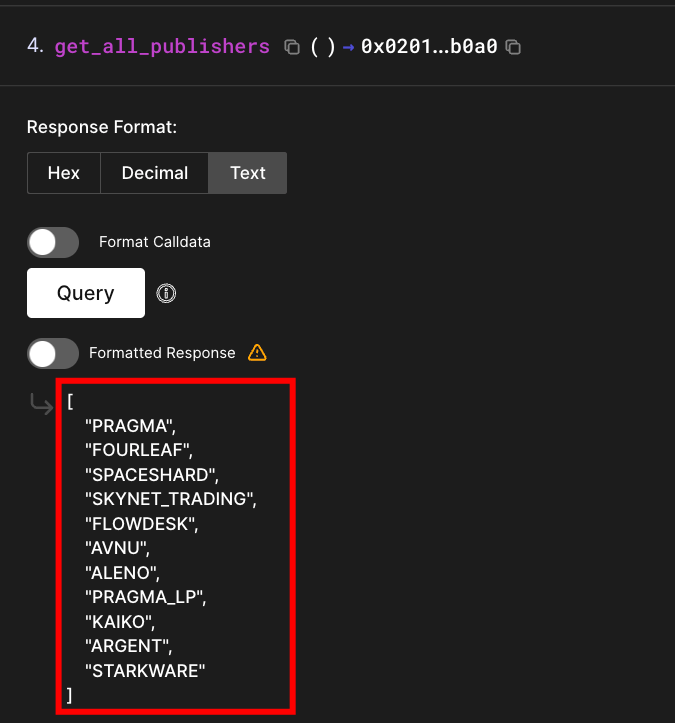

Each publisher independently monitors multiple sources and submits price data to the oracle contract. Pragma's oracle then aggregates submissions from all publishers. If one publisher reports an outlier price, Pragma's aggregation excludes it.

For example, here are the sources that the ARGENT publisher monitors:

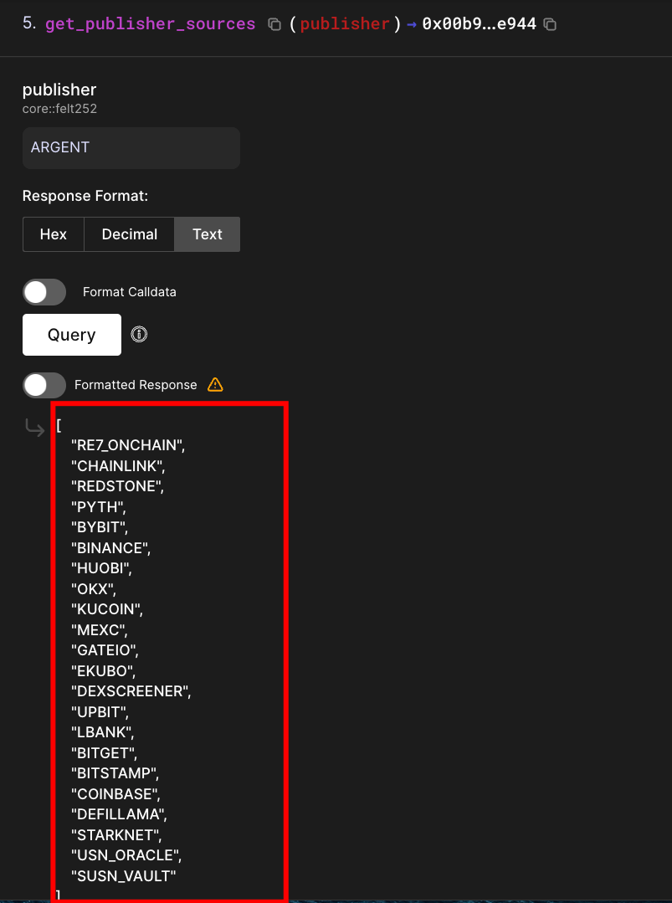

So when ARGENT (a publisher) wants to report a price, it monitors the multiple sources highlighted in the red box above and submits the observed price data to Pragma's oracle contract.

### How Price Data Flows from Sources to Your Contract

1. **Data Collection**

   Publishers monitor their assigned sources (exchanges, oracles, data providers) and collect current price observations.

2. **On-Chain Submission**

   Publishers timestamp the collected data, then submit it directly to Pragma's oracle contract on Starknet. There's no centralized off-chain aggregation layer; each publisher independently submits their data on-chain where it can be publicly verified. For example, if 10 publishers submit the ETH price, Pragma has 10 data points on-chain to work with.

3. **Price Calculation**

   Pragma uses a two-step aggregation process to calculate the final price:

   - **Aggregate per source**: For each individual source (like Binance), Pragma calculates the median price from all publishers who reported data for that source. For example, if three publishers each submit the ETH/USD price they observed from Binance, Pragma takes the median of those three values to get a single consensus price for Binance.
   - **Aggregate across sources**: After getting consensus prices from each source (Binance, Coinbase, OKX, etc.), your smart contract can choose how to combine these source prices into a final value. You can use median, mean, Time Weighted Average Price (TWAP), or other aggregation methods depending on your needs.

4. **Smart Contract Query**

   Your contract queries Pragma's oracle for the current ETH/USD price and receives the aggregated price with a timestamp.

Here’s a summary of this entire flow:

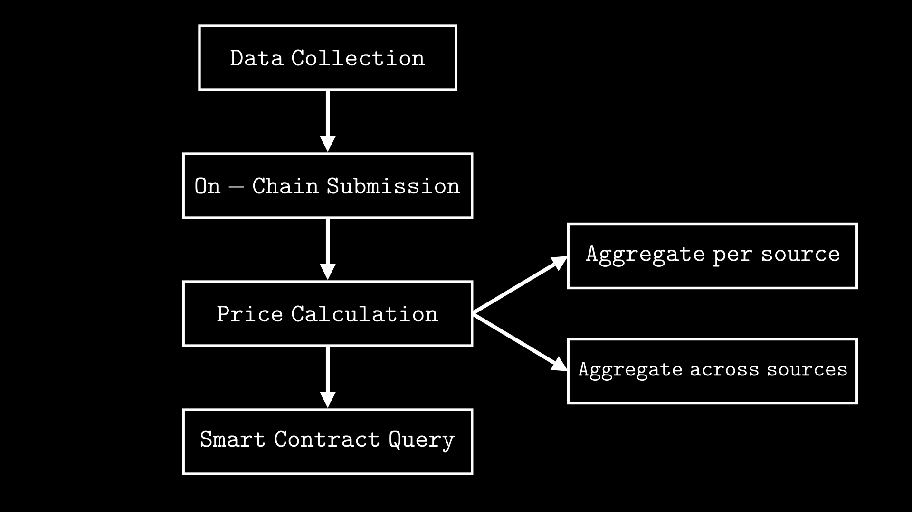

## Building a Simple Vault with Price Condition

Let’s build a basic vault contract where users can deposit STRK tokens, but they can only withdraw when the STRK price reaches a certain threshold.

Here’s a visual flow of how deposits and withdrawals work in this vault:

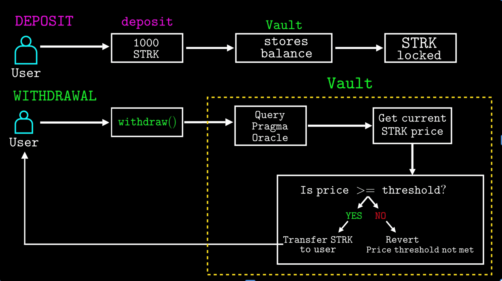

### Setting up the Project

Create a new scarb project and navigate to the directory:

```bash
scarb new simple_vault
cd simple_vault
```

Open `Scarb.toml` and add the Pragma oracle library as a dependency under the `[dependencies]` section:

```toml
[dependencies]
pragma_lib = { git = "https://github.com/astraly-labs/pragma-lib" }
```

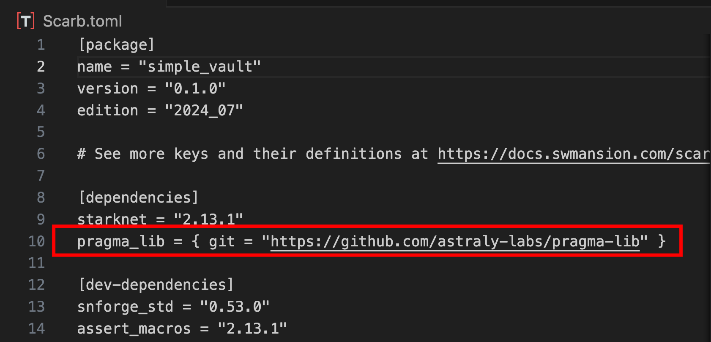

Now run `scarb build` to download the dependency and verify the project is set up correctly. This may take a minute on the first run as it downloads the dependencies. Once the build succeeds, we’re set to start writing the vault contract.

### Defining the Vault Interface

First, we define the interface for our vault contract. This specifies all the functions our vault will expose:

- `deposit(amount)`: Lock STRK tokens in the vault
- `withdraw()`: Retrieve STRK tokens (only if price condition is met)
- `get_balance(user)`: Check how much STRK a specific user has deposited
- `get_strk_price()`: Query the current STRK/USD price from Pragma oracle

```rust
use starknet::ContractAddress;

#[starknet::interface]
trait ISimpleVault<TContractState> {
    fn deposit(ref self: TContractState, amount: u256);
    fn withdraw(ref self: TContractState);
    fn get_balance(self: @TContractState, user: ContractAddress) -> u256;
    fn get_strk_price(self: @TContractState) -> u128;
}
```

### Defining the ERC20 Interface

Since the vault needs to transfer STRK tokens during deposits and withdrawals, we need to define an ERC-20 interface with `transfer_from` for moving tokens from users to the vault and `transfer` for returning tokens from the vault to users:

```rust
#[starknet::interface]
trait IERC20<TContractState> {
    fn transfer_from(
        ref self: TContractState,
        sender: ContractAddress,
        recipient: ContractAddress,
        amount: u256
    ) -> bool;

    fn transfer(ref self: TContractState, recipient: ContractAddress, amount: u256) -> bool;
}
```

### Contract Imports

Start by declaring the contract module and importing the required types, traits, and functions:

```rust
#[starknet::contract]
mod SimpleVault {
    use starknet::{ContractAddress, get_caller_address};
    use pragma_lib::abi::{IPragmaABIDispatcher, IPragmaABIDispatcherTrait};
    use pragma_lib::types::{DataType, PragmaPricesResponse};
    use starknet::storage::{Map, StoragePathEntry, StoragePointerReadAccess, StoragePointerWriteAccess};
    use super::{IERC20Dispatcher, IERC20DispatcherTrait};
```

The key imports to note are from `pragma_lib`:

- `IPragmaABIDispatcher` and `IPragmaABIDispatcherTrait`: contract dispatcher and trait for calling functions on Pragma's oracle contract
- `DataType`: specifies the type of data we want (spot price for current market price)
- `PragmaPricesResponse`: holds the price information returned by Pragma

### Defining Contract Constants

We define two key constants:

```rust
// Constants
const STRK_USD_PAIR_ID: felt252 = 6004514686061859652; // STRK/USD pair ID from Pragma
const PRICE_THRESHOLD: u128 = 16000000; // $0.16 in 8 decimals (0.16 * 10^8)
```

`STRK_USD_PAIR_ID` identifies which Pragma price feed to query. In this case, we're querying the STRK/USD feed. The pair ID `6004514686061859652` corresponds to the UTF-8 encoding of the uppercased ticker string `'STRK/USD'`. This means the pair ID constant can be written more readably as:

```rust
const STRK_USD_PAIR_ID: felt252 = 'STRK/USD';
```

The same pattern applies to other price pairs. Each pair ID is simply the UTF-8 encoding of its uppercased ticker string. For example,`'ETH/USD'`, can be written as either the string `'ETH/USD'` or its `felt252` numeric value `19514442401534788`, both are equivalent in Cairo. Other asset pair IDs are available from Pragma's [price feeds](https://docs.pragma.build/starknet/assets#spot) documentation. Each asset pair has its own unique ID and decimal precision; make sure to check the Decimals column when selecting a different pair. **The same pair ID is used for both Sepolia testnet and mainnet**.

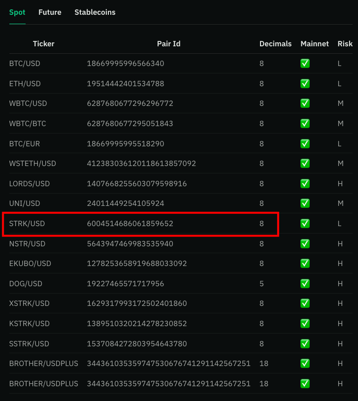

`PRICE_THRESHOLD` sets the minimum STRK price ($0.16) required for withdrawals. Since Pragma returns STRK prices with 8 decimal precision, we represent $0.16 as 16,000,000 (0.16 × 10^8).

### Defining Contract Storage

The storage struct defines what data our contract stores:

```rust
#[storage]
struct Storage {
    pragma_oracle: ContractAddress,        //pragma_oracle contract address
    strk_token: ContractAddress,           // strk token contract address
    balances: Map<ContractAddress, u256>,  // user balances
}
```

What we're storing:

- `pragma_oracle`: address of Pragma's oracle contract on Starknet, used to fetch live asset prices
- `strk_token`: address of the STRK token contract, used to handle deposits and withdrawals
- `balances`: mapping from user addresses to their deposited STRK amounts

### Initializing the Contract

With storage defined, we initialize the contract by passing the Pragma oracle and STRK token addresses to the constructor during deployment:

```rust
#[constructor]
fn constructor(
    ref self: ContractState,
    pragma_oracle: ContractAddress,
    strk_token: ContractAddress
) {
    self.pragma_oracle.write(pragma_oracle);
    self.strk_token.write(strk_token);
}
```

These addresses allow the vault contract to query prices from Pragma's oracle and handle STRK token transfers, as we'll see when we discuss the deposit and withdrawal functions.

### Defining Contract Events

Next, we define events to track deposits (`Deposit`) and withdrawals (`Withdrawal`) in the vault:

```rust
#[event]
#[derive(Drop, starknet::Event)]
enum Event {
    Deposit: Deposit,
    Withdrawal: Withdrawal,
}

#[derive(Drop, starknet::Event)]
struct Deposit {
    user: ContractAddress,
    amount: u256,
}

#[derive(Drop, starknet::Event)]
struct Withdrawal {
    user: ContractAddress,
    amount: u256,
}
```

Each event logs the user’s address and how much STRK was deposited or withdrawn.

### Implementing the Interface Functions

Now, let's implement the vault interface functions we defined earlier:

#### `deposit` function

When a user calls `deposit(amount)`, the function verifies the amount is greater than zero, then uses `transfer_from` to move STRK tokens from the user's account to the vault. This requires the user to have approved the vault contract beforehand. After the transfer succeeds, the user's balance is updated in storage and a `Deposit` event is emitted.

```rust
fn deposit(ref self: ContractState, amount: u256) {
    let caller = get_caller_address();
    assert(amount > 0, 'Amount must be greater than 0');

    // Transfer STRK from user to this contract
    let strk = IERC20Dispatcher { contract_address: self.strk_token.read() };
    let success = strk.transfer_from(caller, starknet::get_contract_address(), amount);
    assert(success, 'Transfer failed');

    // Update user balance
    let current_balance = self.balances.entry(caller).read();
    self.balances.entry(caller).write(current_balance + amount);

    // Emit deposit event
    self.emit(Deposit { user: caller, amount });
}
```

#### `withdraw` function

The withdrawal function ensures the user has a non-zero balance, then fetches the current STRK price from Pragma. If the price meets or exceeds $0.16, it resets the user's balance (following the checks-effects-interactions pattern), transfers their STRK tokens back to their account, and emit a `Withdrawal` event.

```rust
fn withdraw(ref self: ContractState) {
    let caller = get_caller_address();
    let balance = self.balances.entry(caller).read();

    assert(balance > 0, 'No balance to withdraw');

    // Get current STRK price
    let current_price = self.get_strk_price();

    // Check if price threshold is met
    assert(current_price >= PRICE_THRESHOLD, 'Price threshold not met');

    // Reset balance before transfer (CEI pattern)
    self.balances.entry(caller).write(0);

    // Transfer STRK back to user
    let strk = IERC20Dispatcher { contract_address: self.strk_token.read() };
    let success = strk.transfer(caller, balance);
    assert(success, 'Transfer failed');

    // Emit withdrawal event
    self.emit(Withdrawal { user: caller, amount: balance });
}
```

#### `get_balance` function

Returns how much STRK a specific user has deposited in the vault:

```rust
fn get_balance(self: @ContractState, user: ContractAddress) -> u256 {
    self.balances.entry(user).read()
}
```

#### `get_strk_price` function

Fetches the current STRK/USD price from Pragma oracle:

```rust
fn get_strk_price(self: @ContractState) -> u128 {
    let oracle = IPragmaABIDispatcher { contract_address: self.pragma_oracle.read() };
    let response: PragmaPricesResponse = oracle.get_data_median(DataType::SpotEntry(STRK_USD_PAIR_ID));
    response.price
}
```

First, it creates a contract dispatcher to interact with the Pragma oracle contract using the stored address:

```rust
let oracle = IPragmaABIDispatcher { contract_address: self.pragma_oracle.read() };
```

Then calls `get_data_median()`, passing `DataType::SpotEntry(STRK_USD_PAIR_ID)` to request the current spot price for STRK/USD. The method aggregates data from multiple publishers and returns the median, which prevents any single source from manipulating the result:

```rust
let response: PragmaPricesResponse = oracle.get_data_median(DataType::SpotEntry(STRK_USD_PAIR_ID));
```

`get_data_median()` returns a `PragmaPricesResponse` struct with the following fields:

```rust
struct PragmaPricesResponse {
    price: u128,                           // The aggregated price
    decimals: u32,                         // Number of decimal places
    last_updated_timestamp: u64,           // When the price was last updated
    num_sources_aggregated: u32,           // Number of sources used in aggregation
    expiration_timestamp: Option<u64>,     // Optional expiration time
}
```

`get_strk_price` returns only the `price` field from this struct:

```rust
response.price
```

The price is returned as a `u128` with 8 decimal precision. For example, if STRK is trading at $0.15, this returns `15000000` (since Pragma uses 8 decimal places: 0.15 × 10^8).

> _By using `get_data_median()`, we're accepting Pragma's default initial aggregation (median of all publishers-submitted prices). Since we're querying a single pair, the median of all publishers for STRK/USD is our final price._

Copy the complete vault contract into `lib.cairo`, and compile using `scarb build`:

```rust
use starknet::ContractAddress;

#[starknet::interface]
trait IERC20<TContractState> {
    fn transfer_from(
        ref self: TContractState,
        sender: ContractAddress,
        recipient: ContractAddress,
        amount: u256
    ) -> bool;
    fn transfer(ref self: TContractState, recipient: ContractAddress, amount: u256) -> bool;
}

#[starknet::interface]
trait ISimpleVault<TContractState> {
    fn deposit(ref self: TContractState, amount: u256);
    fn withdraw(ref self: TContractState);
    fn get_balance(self: @TContractState, user: ContractAddress) -> u256;
    fn get_strk_price(self: @TContractState) -> u128;
}

#[starknet::contract]
mod SimpleVault {
    use starknet::{ContractAddress, get_caller_address};
    use pragma_lib::abi::{IPragmaABIDispatcher, IPragmaABIDispatcherTrait};
    use pragma_lib::types::{DataType, PragmaPricesResponse};
    use starknet::storage::{Map, StoragePathEntry, StoragePointerReadAccess, StoragePointerWriteAccess};
    // Add this import for the ERC20 dispatcher
    use super::{IERC20Dispatcher, IERC20DispatcherTrait};

    // Constants
    const STRK_USD_PAIR_ID: felt252 = 6004514686061859652; // STRK/USD pair ID
    const PRICE_THRESHOLD: u128 = 16000000; // $0.16 in 8 decimals(0.16 * 10^8)

    #[storage]
    struct Storage {
        pragma_oracle: ContractAddress,
        strk_token: ContractAddress,
        balances: Map<ContractAddress, u256>,
    }

    #[event]
    #[derive(Drop, starknet::Event)]
    enum Event {
        Deposit: Deposit,
        Withdrawal: Withdrawal,
    }

    #[derive(Drop, starknet::Event)]
    struct Deposit {
        user: ContractAddress,
        amount: u256,
    }

    #[derive(Drop, starknet::Event)]
    struct Withdrawal {
        user: ContractAddress,
        amount: u256,
    }

    #[constructor]
    fn constructor(
        ref self: ContractState,
        pragma_oracle: ContractAddress,
        strk_token: ContractAddress
    ) {
        self.pragma_oracle.write(pragma_oracle);
        self.strk_token.write(strk_token);
    }

    #[abi(embed_v0)]
    impl SimpleVaultImpl of super::ISimpleVault<ContractState> {
        fn deposit(ref self: ContractState, amount: u256) {
            let caller = get_caller_address();
            assert(amount > 0, 'Amount must be greater than 0');

            // Transfer STRK from user to this contract
            let strk = IERC20Dispatcher { contract_address: self.strk_token.read() };
            let success = strk.transfer_from(caller, starknet::get_contract_address(), amount);
            assert(success, 'Transfer failed');

            // Update user balance
            let current_balance = self.balances.entry(caller).read();
            self.balances.entry(caller).write(current_balance + amount);

            // Emit deposit event
            self.emit(Deposit { user: caller, amount });
        }

        fn withdraw(ref self: ContractState) {
            let caller = get_caller_address();
            let balance = self.balances.entry(caller).read();

            assert(balance > 0, 'No balance to withdraw');

            // Get current STRK price
            let current_price = self.get_strk_price();

            // Check if price threshold is met
            assert(current_price >= PRICE_THRESHOLD, 'Price threshold not met');

            // Reset balance before transfer (CEI pattern)
            self.balances.entry(caller).write(0);

            // Transfer STRK back to user
            let strk = IERC20Dispatcher { contract_address: self.strk_token.read() };
            let success = strk.transfer(caller, balance);
            assert(success, 'Transfer failed');

            // Emit withdrawal event
            self.emit(Withdrawal { user: caller, amount: balance });
        }

        fn get_balance(self: @ContractState, user: ContractAddress) -> u256 {
            self.balances.entry(user).read()
        }

        fn get_strk_price(self: @ContractState) -> u128 {
            let oracle = IPragmaABIDispatcher { contract_address: self.pragma_oracle.read() };
            let response: PragmaPricesResponse = oracle.get_data_median(DataType::SpotEntry(STRK_USD_PAIR_ID));
            response.price
        }
    }
}
```

### Deploying the Vault Contract

First, declare the contract using `sncast`:

```bash
sncast --account <YOUR_ACCOUNT_NAME> \
declare \
--url https://starknet-sepolia.g.alchemy.com/starknet/version/rpc/v0_10/<YOUR_API_KEY> \
--contract-name SimpleVault
```

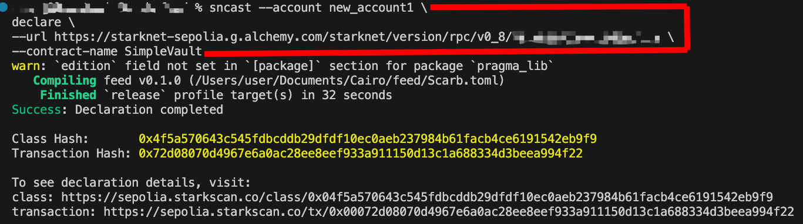

Pragma provides the two addresses required for deployment. We’ll pass them as parameters to the constructor:

- **Pragma Oracle**: `0x036031daa264c24520b11d93af622c848b2499b66b41d611bac95e13cfca131a`
- **STRK Token**: `0x04718f5a0fc34cc1af16a1cdee98ffb20c31f5cd61d6ab07201858f4287c938d`

You can find the latest deployment addresses in [Pragma's GitHub repository](https://github.com/astraly-labs/pragma-oracle/blob/main/README.md#deployment-addresses).

Deploy the contract with the constructor parameters:

```bash
sncast \
--account new_account1 \
deploy \
--url https://starknet-sepolia.g.alchemy.com/starknet/version/rpc/v0_10/<YOUR_API_KEY> \
--class-hash <CLASS_HASH> \
--constructor-calldata "0x036031daa264c24520b11d93af622c848b2499b66b41d611bac95e13cfca131a" "0x04718f5a0Fc34cC1AF16A1cdee98fFB20C31f5cD61D6Ab07201858f4287c938D"
```

Copy the `<CLASS_HASH>` from the declare output and paste it into the deploy command. The terminal will display a transaction receipt containing the deployed vault contract address.

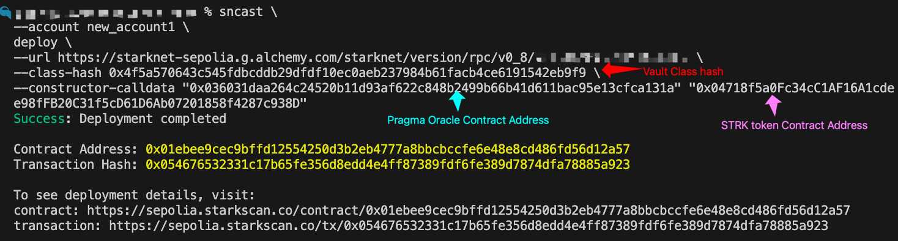

Save the address for the next steps.

## Interacting with the Vault

With the vault deployed, let's walk through depositing and withdrawing STRK tokens using [Voyager](https://sepolia.voyager.online/).

### Approving the Vault

Before depositing, the vault must be approved to transfer STRK tokens. Navigate to the STRK token contract's "Write Contract" tab on [Voyager](https://sepolia.voyager.online/contract/0x04718f5a0fc34cc1af16a1cdee98ffb20c31f5cd61d6ab07201858f4287c938d#writeContract) and call the `approve` function with the vault's contract address as the spender and the amount of STRK you intend to deposit. Once done, execute the transaction and wait for confirmation.

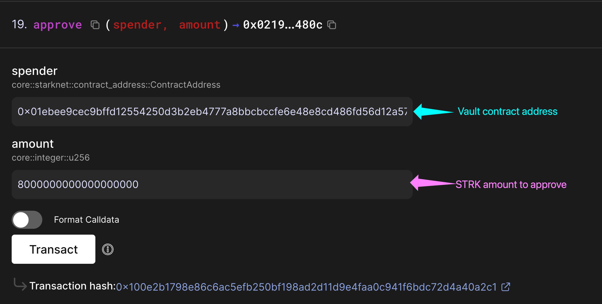

### Making a Deposit

With approval granted, tokens can now be deposited. On the vault contract's "[Write Contract](https://sepolia.voyager.online/contract/0x01ebee9cec9bffd12554250d3b2eb4777a8bbcbccfe6e48e8cd486fd56d12a57#writeContract)" tab, call the `deposit` function with the amount you previously approved. After executing this transaction, the STRK tokens are locked in the vault.

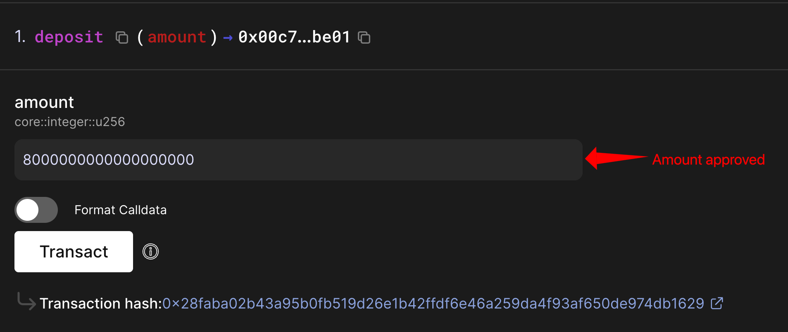

### Checking the Balance

To verify the deposit succeeded, navigate to the "Read Contract" tab and call `get_balance` with the wallet address. It should return the balance, confirming the STRK deposit.

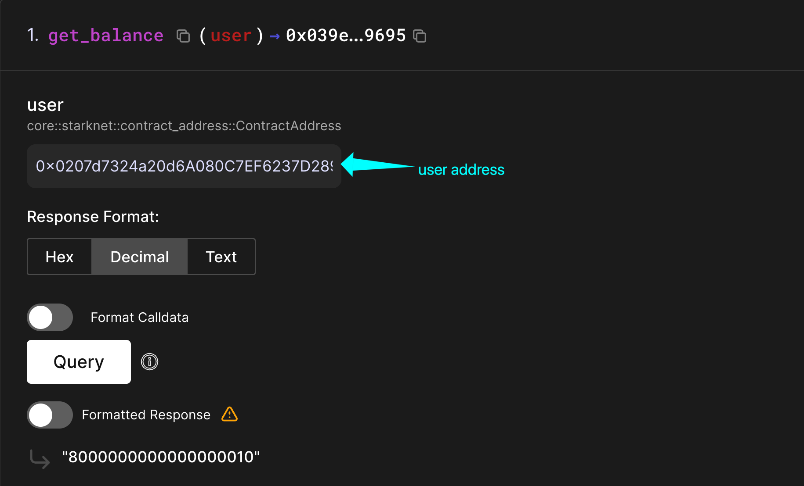

### Checking the Current STRK Price

Call `get_strk_price` in the "Read Contract" tab to check the current STRK price from Pragma. The function returns the price as an integer with 8 decimal places. To convert this to a USD value, divide the returned number by 100,000,000

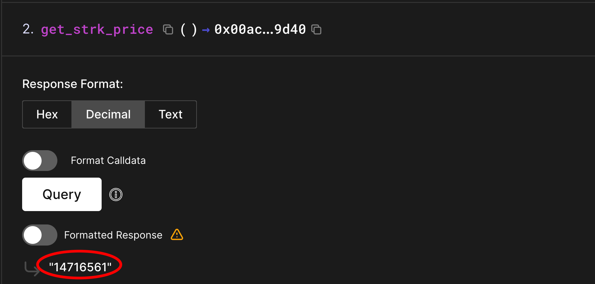

For example, here the function returns `14716561`. Dividing by 100,000,000:

```
14716561 ÷ 100,000,000 = 0.14716561
```

So the current STRK price at this time of query is **$0.147.**

### Attempting Withdrawal

Now try withdrawing the deposited STRK. In the "Write Contract" tab, call the `withdraw` function and execute the transaction.

The outcome depends on the current price. If STRK is below $0.16, the transaction will fail with the error message "Price threshold not met." If STRK has reached $0.16 or higher, the tokens will be returned to the wallet.

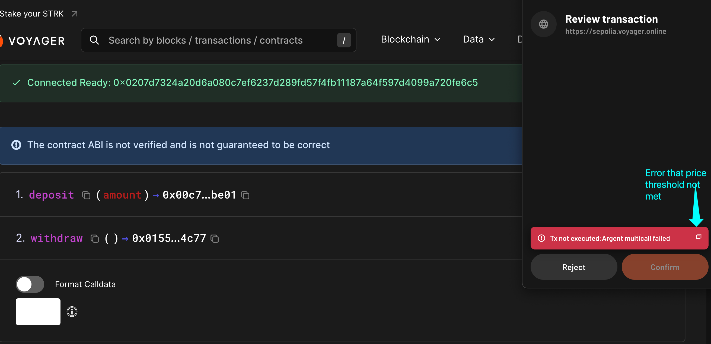

To test a successful withdrawal immediately, the contract can be redeclared and redeployed with a lower threshold like `10000000` (representing $0.10), or one can wait for the STRK price to naturally rise above $0.16.

## Conclusion

Integrating Pragma's price feeds enables lending protocols, prediction markets, dynamic NFTs, and other applications to access verified price data on-chain. Right now, the vault simply locks and releases funds based on price. There's no yield or reward mechanism beyond the price condition. The contract can be extended with features that fit specific use cases: staking rewards for depositors, multiple price thresholds for different user tiers, or time-weighted unlocks.

Pragma's [computational feeds](https://docs.pragma.build/starknet/advanced/overview) offer more than spot prices. Volatility feeds measure market turbulence for risk-adjusted protocols. TWAP provides time-averaged prices resistant to manipulation from flashloan attacks. Exploring these feeds, trying different asset pairs, and combining conditions reveals how oracles transform contracts to respond dynamically to real-world conditions.
