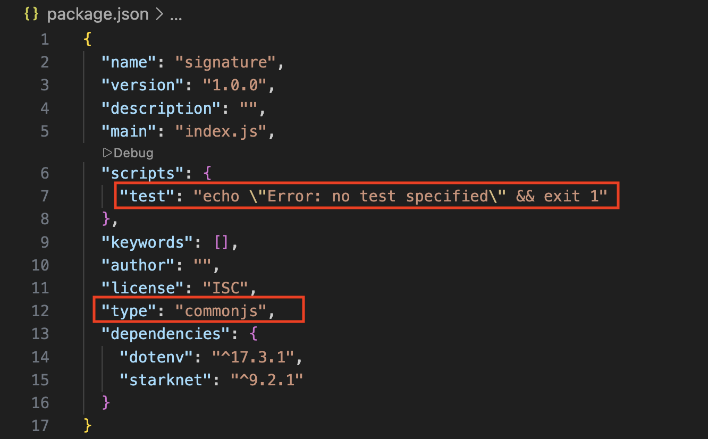
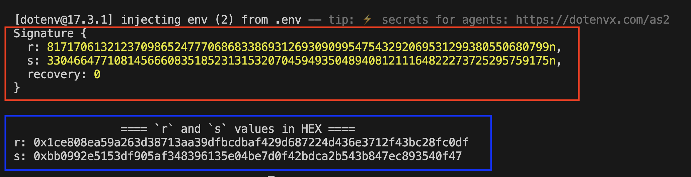
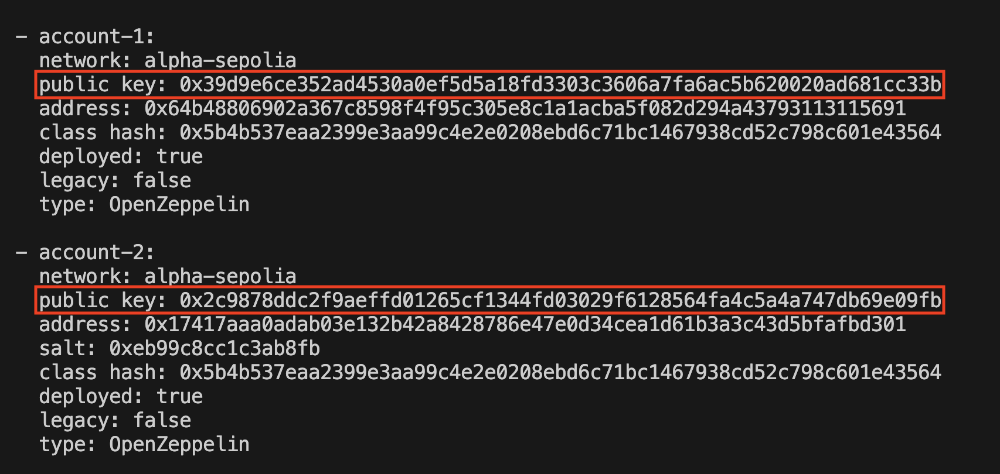

# Signature Verification

Signature verification is the process of using a public key to mathematically prove that a message or transaction was signed using the corresponding private key.

## Signature verification on Ethereum vs Starknet

On Ethereum, signature verification lives either in the protocol or in contract code, depending on whether the account is an EOA or a smart contract wallet.

- EOAs use native ECDSA (secp256k1): the protocol handles signature verification as part of transaction processing. It recovers the signer’s address from the signature, and if the recovered address matches the expected address, the signature is valid. The verification rules are built into the protocol and cannot be changed.
- Smart contract wallets use contract-defined validation: the wallet contract defines its own verification logic (most commonly through EIP-1271) and returns whether or not the signature is valid. The authority is shifted from the protocol to contract code.

On Starknet, there are no EOAs. Every account is a smart contract, so the distinction between EOAs and smart wallets doesn't exist. Signature verification is always handled by the account contract itself. This is an example of [account abstraction](https://rareskills.io/post/cairo-account-abstraction), where the rules for validation are programmable rather than fixed by the protocol.

From the protocol’s point of view, the signature verification process never changes: a message hash and a signature are provided, the account contract is called, and it decides whether or not the signature is valid. The transaction is then executed or rejected based on that decision.

How the account contract reaches that decision is entirely up to its implementation. In practice, most implementations differ mainly in the signature scheme they use for verification.

In this article, we will cover the common signature schemes on Starknet and show how each one is verified in practice.

## Common signature schemes used for verification

On Starknet today, the most common signature schemes are:

- Stark curve ECDSA, and
- secp256k1 ECDSA.

## Stark curve ECDSA (native Starknet scheme)

Starknet’s native signature scheme uses ECDSA over the Stark-friendly elliptic curve (the “Stark curve”). Signatures are verified against the hash of the message and the signer's public key using Cairo's built-in ECDSA functions.

### **How a signature is verified using** Stark curve ECDSA

Cairo's core library provides a built-in function, `check_ecdsa_signature`, for verifying Stark curve signatures. It takes four arguments: the message hash, the signer's public key, and the signature values `r` and `s`, then return whether the signature is valid:

```rust
fn check_ecdsa_signature(
     message_hash: felt252,
     public_key: felt252,
     signature_r: felt252,
     signature_s: felt252
) -> bool;
```

Before any verification happens, the inputs are sanity-checked within the function. The signature values must be non-zero and not equal to the stark curve order. However, the function does not check that `r` and `s` are strictly less than the curve order, which is important because both values operate in integers modulo `n` (curve order), nor does it check for [signature malleability](https://scs.owasp.org/SCWE/SCSVS-CRYPTO/SCWE-054/). Callers are therefore expected to assert two things before invoking the function:

- that `r` is  less than the curve order,
- and that `s <= ORDER / 2` to eliminate malleable variants.

Both checks will be covered in a later sub-section.

After all checks are in place, the `check_ecdsa_signature` function is invoked to verify that the signature `(r, s)` is tied to the given message hash and public key. It performs a series of elliptic curve operations on these inputs and checks whether the results are consistent. If they are, the signature is valid and the function returns `true`; otherwise, it returns `false`.

Wallet providers (e.g., Ready, Braavos) commonly rely on this scheme to confirm that a transaction was authorized by the correct account before allowing it to be executed on-chain.

### **Putting the Stark curve signature verification into practice: a token airdrop example**

To make this more concrete, consider a simple token airdrop example which shows how Stark-curve ECDSA verification is used in practice to confirm that a user is eligible to receive tokens.

In this flow, we will:

- Have an authorized signer generate a Stark-curve signature over the eligible recipient’s address and claim amount using its private key
- Deploy an airdrop contract that verifies the signature on-chain before transferring any tokens
- Test the airdrop contract by verifying the generated signature and claiming some tokens.

#### Generate a Stark-curve signature using `starknet.js`

Before we create the airdrop contract that accepts signatures, we need a way to produce a Stark-curve signature off-chain. In a real application, this is usually done with a wallet. For this example, we will keep things simple and generate the signature using `starknet.js`.

We will start by setting up a small `Node.js` project to:

- construct the message to be signed
- hash it
- sign it using a Stark-curve private key

**Project setup**

First, create a new project folder and initialize it:

```bash
mkdir my_signature
cd my_signature
npm init -y
```

Next, install the dependencies:

```bash
npm install starknet dotenv
```

Here’s why we need them:

- `starknet`: provides functions for hash messages and generate Stark-curve ECDSA signatures
- `dotenv`: lets us keep private keys and configuration out of the codebase and load them safely from environment variables

Now, let’s create the `src` directory and the entry file:

```bash
mkdir src
touch src/index.js
```

At this point, the project structure should look like this:

```
my_signature/
├── src/
│   └── index.js
├── package.json
└── node_modules/
```

Navigate to the `package.json` file, it should look like the image below:



Replace the highlighted parts in red with the following:

```json
{
		...
		scripts: {
				"start": "node src/index.js"
		},
		...
		"type": "module",
		...
}
```

Create a `.env` file for configuration variables:

```bash
touch .env
```

Add the following to the `.env` file:

```
AIRDROP_SIGNER_PK=0x...
RECIPIENT=0x...
```

Replace the placeholder values:

- `AIRDROP_SIGNER_PK`: the private key of the account that will sign the message. Use one of your existing `sncast` accounts by running `sncast account list -p` to see available accounts and their corresponding private keys
- `RECIPIENT`:  Eligible user Starknet account address

With the project set up, we can move on to the next part, which is writing the script that signs a message.

To do that, we will:

1. Define the message to be signed. We will define who can claim a token and how much they can claim
2. Hash that message exactly the same way the contract expects
3. Sign the hash using Stark-curve ECDSA

**Signing the airdrop message**

Below is the complete script. Paste it into the `index.js` file we created earlier. It may look a bit heavy at first glance, but don’t worry, we will break it down piece by piece right after.

```jsx
import { ec, hash } from "starknet";
import * as dotenv from "dotenv";

dotenv.config();

const privateKey = process.env.AIRDROP_SIGNER_PK;
if (!privateKey) throw new Error("Set AIRDROP_SIGNER_PK=0x... in .env file");

const recipient = process.env.RECIPIENT;
if (!recipient) throw new Error("Set RECIPIENT=0x... in .env file");

// Amount (scaled 18 decimals)
const amount = 200 * 10**18;

// Message layout MUST match Cairo hashing exactly
// [recipient, amount]
const message = [recipient, amount];

// Hash + sign (Stark curve ECDSA)
const msgHash = hash.computePoseidonHashOnElements(message);
const signature = ec.starkCurve.sign(msgHash, privateKey);

// Log the signature
console.log(signature);

// Log `r` and `s` values in hex
console.log("\n\n\t\t==== `r` and `s` values in HEX ====");
console.log("r: 0x" + signature.r.toString(16));
console.log("s: 0x" + signature.s.toString(16) + "\n");
```

Here is the complete break down of the code above.

**Imports and configuration:**

```jsx
import { ec, hash } from "starknet";
import * as dotenv from "dotenv";

dotenv.config();
```

Here, we import two things from `starknet.js`:

- `hash`: a module that provides helper functions for hashing messages using Starknet's hashing scheme
- `ec`: a module for elliptic curve operations, used to sign the hashed message over the Stark curve

We also load environment variables using `dotenv`, which keeps private info out of the source code.

**Reading inputs from environment variables and validating** **them:**

In this part of the code, we are reading the private key (`AIRDROP_SIGNER_PK`) and the user’s address (`RECIPIENT`), then validating that they exist, else, throw an error.

```jsx
const privateKey = process.env.AIRDROP_SIGNER_PK;
if (!privateKey) throw new Error("Set AIRDROP_SIGNER_PK=0x...");

const recipient = process.env.RECIPIENT;
if (!recipient) throw new Error("Set RECIPIENT=0x...");
```

**Defining the message to be signed:**

```jsx
const amount = 200 * 10**18;
const message = [recipient, amount];
```

This is the exact message we are signing. In plain terms, it means “This ‘recipient’ is allowed to claim this ‘amount’ of tokens.”

> *Note that the message layout must match exactly what the contract hashes on-chain. Any mismatch, whether it’s a different order, a missing value, or even using a different hash function, will cause signature verification to fail.*
>

**Hashing the message:**

```jsx
const msgHash = hash.computePoseidonHashOnElements(message);
```

`computePoseidonHashOnElements` takes an array of values (in our case, the airdrop message) and hashes them into a single field element using the Poseidon hash function. The result is the message hash (`msgHash`) that will be signed.

We are using Poseidon here because it’s faster and cheaper to verify on-chain compared to other [hash functions](https://rareskills.io/post/cairo-hash-functions).

**Signing with Stark-curve ECDSA:**

```jsx
const signature = ec.starkCurve.sign(msgHash, privateKey);
```

Finally, we sign the message hash using Stark-curve ECDSA. The result is a signature object containing two large numbers, `r` and `s`, which together make up the signature, plus a `recovery` value used internally during verification.

This signature data is what the airdrop contract will verify on-chain.

Use the following command to run the script:

```bash
npm start
```

If everything is executed correctly, the terminal output should resemble the following (note that the values will differ depending on the message and private key used):



In practice, only the `r` and `s` values from the `Signature` struct (in the red box) are needed. These are the signature components the eligible recipient will pass to the contract when claiming their tokens.

The `recovery` value is used to reconstruct the signer’s public key from the signature. However, it isn’t needed for Stark-curve signature verification, since the public key is provided as an argument to the verification function, so there’s no need to recover it during verification.

The blue box shows the `r` and `s` values in hexadecimal format. Save these values, as they will be needed later during token claim.

#### Airdrop contract

Now that we can generate a valid Stark-curve signature off-chain, the next step is to look at the airdrop contract and see how it verifies this signature on-chain before releasing tokens to the recipient.

**Create a Scarb project**

In the root folder, run the following command to create a Scarb project called `my_contract` then `cd` into it:

```bash
scarb new my_contract
cd my_contract
```

The new project structure should look like this:

```
my_signature/
├── my_contract/
│   ├── src/
│		│   └── lib.cairo
│   └ ...
└── ...
```

Next, replace the auto-generated contract in `lib.cairo` file with the airdrop contract below. At a high level, the contract does three things:

- reconstructs the exact message hash that was signed off-chain
- verifies the Stark-curve ECDSA signature
- transfer tokens on a successful verification

We will walk through the contract piece by piece after the code block.

```rust
// WARNING: This code is for demonstration purposes only. Do not use in production.

use starknet::ContractAddress;

#[starknet::interface]
trait IERC20<TContractState> {
    fn transfer(ref self: TContractState, recipient: ContractAddress, amount: u256) -> bool;
}

#[starknet::interface]
pub trait ISignatureAirdrop<TContractState> {
    fn claim(ref self: TContractState, amount: felt252, r: felt252, s: felt252);
}

#[starknet::contract]
mod SignatureAirdrop {
    use core::ecdsa::check_ecdsa_signature;
    use core::ec::stark_curve::ORDER;

    use core::poseidon::poseidon_hash_span;
    use starknet::storage::{
        Map, StoragePathEntry, StoragePointerReadAccess, StoragePointerWriteAccess,
    };
    use starknet::{ContractAddress, get_caller_address};

    // Bring the generated dispatcher types/traits into scope (from IERC20 interface).
    use super::{IERC20Dispatcher, IERC20DispatcherTrait};

    #[storage]
    struct Storage {
        // Use ContractAddress as the mapping key (instead of felt252).
        claimed: Map<ContractAddress, bool>,
        // Store the signer "Stark key" as felt252 (what check_ecdsa_signature expects).
        signer: felt252,
        // ERC20 token to airdrop
        token: ContractAddress,
    }

    #[constructor]
    fn constructor(ref self: ContractState, signer_stark_key: felt252, token: ContractAddress) {
        self.signer.write(signer_stark_key);
        self.token.write(token);
    }

    #[abi(embed_v0)]
    impl SignatureAirdropImpl of super::ISignatureAirdrop<ContractState> {
        fn claim(ref self: ContractState, amount: felt252, r: felt252, s: felt252) {
            // 1) Cache caller's address
				    let recipient = get_caller_address();

            // 2) One-time claim
            let already_claimed = self.claimed.entry(recipient).read();
            assert!(!already_claimed, "Already claimed");

            // 3) Reconstruct message hash exactly like starknet.js:
            //    msgHash = computePoseidonHashOnElements([recipient, amount])
            let msg: Array<felt252> = array![recipient.into(), amount];
            let msg_hash: felt252 = poseidon_hash_span(msg.span());

            // 4) Sanity-check on r and s value.
            let order_u256: u256 = ORDER.into();
            let r_u256: u256 = r.into();
            let s_u256: u256 = s.into();
            assert!(r_u256 < order_u256, "r >= curve order");
            assert!(s_u256 <= order_u256 / 2, "s > curve order / 2");

            // 5) Verify signature
            let signer_pk = self.signer.read();
            let valid = check_ecdsa_signature(msg_hash, signer_pk, r, s);
            assert!(valid, "Invalid signature");

            // 6) Mark claimed
            self.claimed.entry(recipient).write(true);

            // 7) Transfer tokens
            let token_addr = self.token.read();
            let token = IERC20Dispatcher { contract_address: token_addr };
            let ok = token.transfer(recipient, amount.into());
            assert!(ok, "Transfer failed");
        }
    }
}
```

**Contract Interfaces**

In the code above, we used two interfaces:

1. a minimal ERC-20 interface for transferring tokens
2. an interface for the airdrop’s `claim` function

```rust
use starknet::ContractAddress;

#[starknet::interface]
trait IERC20<TContractState> {
    fn transfer(ref self: TContractState, recipient: ContractAddress, amount: u256) -> bool;
}

#[starknet::interface]
pub trait ISignatureAirdrop<TContractState> {
    fn claim(
        ref self: TContractState,
        amount: felt252,
        r: felt252,
        s: felt252,
    );
}
```

The airdrop contract requires two interfaces: one to interact with the ERC-20 contract via its `transfer` function, and the other to expose a `claim` entrypoint for users to claim their tokens.

**Importing Relevant Dependencies**

Most of the dependencies here should already look familiar from earlier articles. The only imports we haven’t talked about yet are the ones below the comment `**NEWLY ADDED IMPORTS**`:

```rust
use core::poseidon::poseidon_hash_span;
use starknet::storage::{
    Map, StoragePathEntry, StoragePointerReadAccess, StoragePointerWriteAccess,
};
use starknet::{ContractAddress, get_caller_address};
use super::{IERC20Dispatcher, IERC20DispatcherTrait};

// *** NEWLY ADDED IMPORTS ***** //**
use core::ecdsa::check_ecdsa_signature;
use core::ec::stark_curve::ORDER;
```

The `check_ecdsa_signature` is the function that performs the verification.

The `ORDER` constant is imported from Cairo’s core Stark-curve module, which will be used to ensure that the `r` and `s` values lie within the valid range of the curve.

**Storage Layout**

Each field has a very specific role:

- `claimed` tracks whether a recipient has already claimed (one claim per address)
- `signer` is the Stark-curve public key corresponding to the private key authorized to sign airdrop messages
- `token` is the address of the ERC-20 token being distributed

```rust
#[storage]
struct Storage {
    claimed: Map<ContractAddress, bool>,
    signer: felt252,
    token: ContractAddress,
}
```

**Airdrop contract constructor**

The constructor simply assigns:

- the authorized signer’s public key to the `signer` storage variable
- the airdrop token address to the `token` storage variable

```rust
#[constructor]
fn constructor(ref self: ContractState, signer_stark_key: felt252, token: ContractAddress) {
    self.signer.write(signer_stark_key);
    self.token.write(token);
}
```

**Claim function**

The `claim` function allows an eligible user to claim their airdrop allocation. It takes the claimed `amount` and a signature `(r, s)` as arguments:

```rust
fn claim(ref self: ContractState, amount: felt252, r: felt252, s: felt252) {
    // 1) Cache caller's address
    let recipient = get_caller_address();

    // 2) One-time claim
    let already_claimed = self.claimed.entry(recipient).read();
    assert!(!already_claimed, "Already claimed");

    // 3) Reconstruct message hash exactly like starknet.js:
    //    msgHash = computePoseidonHashOnElements([recipient, amount])
    let msg: Array<felt252> = array![recipient.into(), amount];
		let msg_hash: felt252 = poseidon_hash_span(msg.span());

    // 4) Sanity-check on r and s value.
    let order_u256: u256 = ORDER.into();
    let r_u256: u256 = r.into();
    let s_u256: u256 = s.into();
    assert!(r_u256 < order_u256, "r >= curve order");
    assert!(s_u256 <= order_u256 / 2, "s > curve order / 2");

    // 5) Verify signature
    let signer_pk = self.signer.read();
    let valid = check_ecdsa_signature(msg_hash, signer_pk, r, s);
    assert!(valid, "Invalid signature");

    // 6) Mark claimed
    self.claimed.entry(recipient).write(true);

    // 7) Transfer tokens
    let token_addr = self.token.read();
    let token = IERC20Dispatcher { contract_address: token_addr };
    let ok = token.transfer(recipient, amount.into());
    assert!(ok, "Transfer failed");
}
```

Let’s go through this step by step.

1. Cache the caller’s address:

    ```rust
    // 1) Cache caller's address
    let recipient = get_caller_address();
    ```

    We need this to reconstruct the message and be sure that the caller is eligible to claim some tokens.

2. Enforce one-time claims:

    ```rust
    let already_claimed = self.claimed.entry(recipient).read();
    assert!(!already_claimed, "Already claimed");
    ```

    Before performing any cryptography, we make sure the recipient hasn’t already claimed. This prevents replaying the same signature to drain the airdrop.

3. Reconstruct the message hash:

    ```rust
    let msg: Array<felt252> = array![recipient.into(), amount];
    let msg_hash: felt252 = poseidon_hash_span(msg.span());
    ```

    Here, the contract reconstructs the exact message hash that was signed off-chain using the same hash function. Any mismatch between the on-chain and off-chain hashing will cause signature verification to fail.

4. Signature sanity-check:

    ```rust
    let order_u256: u256 = ORDER.into();
    let r_u256: u256 = r.into();
    let s_u256: u256 = s.into();

    assert!(r_u256 < order_u256, "r >= curve order");
    assert!(s_u256 <= order_u256 / 2, "s > curve order / 2");
    ```

    Checks that `r` is strictly less than the Stark curve order, and that `s` is in the lower half of the curve order (`s <= ORDER / 2`). Both checks ensure the values are valid ECDSA scalars. The `s` check additionally eliminates signature malleability. Restricting `s` to the lower half ensures only one of the two forms is accepted, guaranteeing a unique signature per message.

5. Verify the stark-curve signature:

    ```rust
    let signer_pk = self.signer.read();
    let valid = check_ecdsa_signature(msg_hash, signer_pk, r, s);
    assert!(valid, "Invalid signature");
    ```

    Here, Cairo’s built-in `check_ecdsa_signature` function verifies:

    - the message hash
    - the signer’s public key
    - the `(r, s)` signature pair

    If this check passes, we know the signer authorized the “recipient” to claim this “amount” of tokens. If it doesn’t, the whole transaction reverts with "Invalid signature" error.

6. Mark as Claimed:

    ```rust
    self.claimed.entry(recipient).write(true);
    ```

    After verifying the signature, the recipient is marked as claimed before transferring tokens.

7. Transfer Tokens:

    ```rust
    let token_addr = self.token.read();
    let token = IERC20Dispatcher { contract_address: token_addr };
    let ok = token.transfer(recipient, amount.into());
    assert!(ok, "Transfer failed");
    ```

    Finally, the contract calls into the ERC-20 contract and transfers the tokens. If the transfer fails, the entire transaction reverts.


### Test the contract

To keep this section focused on what we are actually testing (signature verification and claim logic), we will reuse an existing ERC-20 deployed on Starknet sepolia and mint tokens directly to the airdrop contract.

**Deploy the airdrop contract**

First, we declare the contract to obtain its class hash using the following command:

```bash
sncast --account <ACCOUNT_NAME> \
  declare \
  --url https://starknet-sepolia.g.alchemy.com/starknet/version/rpc/v0_10/<YOUR_API_KEY> \
  --contract-name SignatureAirdrop
```

Replace:

- `<ACCOUNT_NAME>` with your account name from sncast
- `<YOUR_API_KEY>` with your API key from [Alchemy](https://dashboard.alchemy.com/).

Declaring the contract registers its class on StarkNet. Once we have the class hash, we can deploy an instance of the contract.

To deploy the airdrop contract, we need the following:

- **Signer public key:** This is the Stark-curve public key whose corresponding private key is used to sign airdrop messages off-chain. During a claim, the contract verifies that the submitted signature was produced by this key before releasing any tokens.

    Run this command to get the list of public keys tied to their corresponding private keys:

    ```bash
    sncast account list

    		 # OR

    sncast account list -p # To show private keys too
    ```

    Then copy the public key that corresponds to the signer’s private key used in generating the signature:

    

- **Token contract address:** The address of the already deployed ERC-20 token on StarkNet Sepolia.

    ```rust
    0x03ec6283d9c7c8936991fad6523e01b60ad2bb092aa489087a3376c2ade7c09b
    ```


Now we can proceed to deploying the airdrop contract:

```bash
sncast --account <ACCOUNT_NAME> \
  deploy \
  --url https://starknet-sepolia.g.alchemy.com/starknet/version/rpc/v0_10/<YOUR_API_KEY> \
  --class-hash <CLASS_HASH> \
  --arguments '<SIGNER_PUBKEY>, <TOKEN_CONTRACT_ADDRESS>'
```

Replace:

- `<ACCOUNT_NAME>` with your account name
- `<YOUR_API_KEY>` with your Alchemy API key
- `<CLASS_HASH>` with the class hash from declaration
- `<SIGNER_PUBKEY>` with the signer’s public key
- `<TOKEN_CONTRACT_ADDRESS>` with the deployed token contract address (`0x03ec6283d9c7c8936991fad6523e01b60ad2bb092aa489087a3376c2ade7c09b`)

Once the deployment succeeds, save the airdrop contract address, we will need to mint some tokens to it and use it for all subsequent test calls.

**Mint tokens to the airdrop contract**

Before any claims can succeed, the airdrop contract must hold enough tokens to distribute.

Run the command to mint 1,000 tokens (scaled to 18 decimals) to the airdrop contract:

```bash
sncast --account <ACCOUNT_NAME> \
	invoke \
	--url https://starknet-sepolia.g.alchemy.com/starknet/version/rpc/v0_10/<YOUR_API_KEY> \
  --contract-address <TOKEN_CONTRACT_ADDRESS> \
  --function <FUNCTION_NAME> \
  --arguments '<RECIPIENT>, 1_000_000_000_000_000_000_000'
```

Replace:

- `<ACCOUNT_NAME>` with your account name
- `<YOUR_API_KEY>` with your Alchemy API key
- `<TOKEN_CONTRACT_ADDRESS>` with the deployed token contract address (`0x03ec6283d9c7c8936991fad6523e01b60ad2bb092aa489087a3376c2ade7c09b`)
- `<FUNCTION_NAME>` with the name of the function to invoke (`mint`)
- `<RECIPIENT>` with the airdrop contract address

At this point, the setup is complete. The airdrop contract is deployed and funded with tokens. We can now move on to testing the claim function.

**Invoking `claim` function**

To claim, we will supply the `r` and `s` signature components that were generated off-chain in a previous section, along with the token `amount`.

> The account address that calls the `claim` function **must be the same recipient address that was signed in the message**. If a different account attempts to claim using that signature, the transaction will revert.
>

Using `sncast`, the recipient calls the `claim` function on the deployed airdrop contract passing the necessary arguments:

```bash
sncast --account <RECIPIENT_ACCOUNT> \
  invoke \
  --url https://starknet-sepolia.g.alchemy.com/starknet/version/rpc/v0_10/<YOUR_API_KEY> \
  --contract-address <AIRDROP_CONTRACT_ADDRESS> \
  --function claim \
  --arguments '<AMOUNT>, <R>, <S>'
```

Replace:

- `<RECIPIENT_ACCOUNT>` with the account corresponding to the signed recipient’s account name
- `<YOUR_API_KEY>` with your Alchemy API key
- `<AIRDROP_CONTRACT_ADDRESS>` with the deployed airdrop contract address
- `<AMOUNT>` with the exact amount included in the signed message, in our case, `0xad78ebc5ac6200000` (200 * 1e18)
- `<R>` and `<S>` with `r` and `s` value respectively (the values from the signature generated off-chain)

If everything is correct, the transaction should succeed. To confirm the claim worked, we query the ERC-20 token `balance_of` function for the recipient:

```bash
sncast call \
  --url https://starknet-sepolia.g.alchemy.com/starknet/version/rpc/v0_10/<YOUR_API_KEY> \
  --contract-address <TOKEN_CONTRACT_ADDRESS> \
  --function balance_of \
  --arguments '<RECIPIENT_ADDRESS>'
```

Replace:

- `<YOUR_API_KEY>` with your Alchemy API key
- `<TOKEN_CONTRACT_ADDRESS>` with the token contract address
- `<RECIPIENT_ADDRESS>` with the recipient’s address

If the claim was successful, the returned balance should reflect the claimed `<AMOUNT>`.

Now that we have successfully verified a Stark-curve signature and completed a claim, let’s see how Ethereum signatures are verified within a Cairo contract.

## Secp256k1 ECDSA (Ethereum-style signatures)

`secp256k1` is the elliptic curve used by Ethereum's ECDSA signature scheme. **In practice, an Ethereum wallet proves “I control this address” by signing a message or transaction with its private key. The verifier can recover the signer’s Ethereum address from the signature and the message or transaction hash, then check that it matches the expected address.

This is where the flow differs from the Stark-curve scheme discussed earlier. With the `check_ecdsa_signature` function we discussed earlier, the public key is passed in as an input and the function returns an explicit boolean result. With Ethereum-style signatures, `ecrecover` only recovers an address, there is no verification until the recovered address is explicitly compared against the expected signer.

On Starknet, Cairo’s core library provides helper functions to verify Ethereum signatures, namely, [`verify_eth_signature`](https://github.com/starkware-libs/cairo/blob/b5c6d867f2378e17922bee242cbf0e81752821ab/corelib/src/starknet/eth_signature.cairo#L51) and [`is_eth_signature_valid`](https://github.com/starkware-libs/cairo/blob/b5c6d867f2378e17922bee242cbf0e81752821ab/corelib/src/starknet/eth_signature.cairo#L90). These functions are used in Starknet contracts to verify an Ethereum signature against a message hash and an expected Ethereum address. The main difference between them is that `verify_eth_signature` asserts and panics on invalid input, while `is_eth_signature_valid` returns a `Result`, which allows for graceful handling of errors.

Additionally, both functions have the signature malleability fix built in, they enforce **`s <= N/2` (alongside `s != 0` as a sanity check) via [`is_signature_s_valid`](https://github.com/starkware-libs/cairo/blob/b5c6d867f2378e17922bee242cbf0e81752821ab/corelib/src/starknet/secp256_trait.cairo#L251-L257) under the hood, meaning you do not need to add that check yourself.

To demonstrate how Ethereum signature verification works inside a Starknet contract, we can reuse the same airdrop-based example idea from the Stark-curve ECDSA section.

### **Token airdrop example**

Suppose the project wants to distribute tokens on Starknet to users who are eligible based on their Ethereum addresses. To ensure that only the rightful owner of an eligible Ethereum address can claim, the signed message should include all the values that define the claim, such as:

- the eligible Ethereum address,
- the Starknet address that will receive the tokens, and
- the token amount.

This ties the claim data together. If any of these values are changed, the message hash will also change, the recovered signer will no longer match the trusted signer, and the verification will fail.

In code, the flow would be:

- generate a signature off-chain using an Ethereum private key (the authorized signer) with `ethers.js`
- create a Starknet airdrop contract to verify signatures and claim tokens

#### Generate signature using `Ethers.js`

To generate the Ethereum signature off-chain, we can use `Ethers.js`, a JavaScript library for interacting with Ethereum. It provides tools for computing hashes, creating signatures, and interacting with smart contracts, but for the Ethereum ecosystem.

At a high level, the signature-generation code performs the following steps:

1. Imports from ethers library.
2. Loads an Ethereum wallet using a private key.
3. Constructs the claim message (including the Ethereum address, Starknet address, and token amount).
4. Hashes the message using keccak256.
5. Signs the hash using secp256k1
6. Extracts the `r`, `s`, and `v` values needed to verify the signature.

```jsx
// 1. Imports
import { solidityPackedKeccak256, Signature, SigningKey } from "ethers";
import * as dotenv from "dotenv";

dotenv.config();

// 2. Authorized signer (distributor)
const privateKey = process.env.ETH_SIGNER_PK; // SET `privateKey` IN .env FILE
const key = new SigningKey(privateKey);

// 3. Claim data (eligible user info)
const ethAddress = "0x1234567890123456789012345678901234567890";
const starknetAddress =
  "0x0123456789abcdef0123456789abcdef0123456789abcdef0123456789abcd";
const amount = 1000;

// 4. Create message hash
const messageHash = solidityPackedKeccak256(
  ["uint256", "uint256", "uint256"],
  [ethAddress, starknetAddress, amount],
);

// 5. Sign the hash
const signature = key.sign(messageHash);

// 6. Split signature
const { r, s, v } = Signature.from(signature);

console.log({ messageHash, r, s, v });
```

Here is a detailed breakdown of each part:

1. Imports

    ```jsx
    import { solidityPackedKeccak256, Signature, SigningKey } from "ethers";
    ```

    - `solidityPackedKeccak256`: Pack values together and hashes them using Keccak256.
    - `SigningKey`: Provides low-level secp256k1 signing functionality. It is used to sign a 32-byte message hash directly.
    - `Signature`: A utility to format and extract `r`, `s`, and `v` from the signature object.
2. Creating the Signing Key

    ```jsx
    const key = new SigningKey(privateKey);
    ```

    This gives us access to secp256k1 signing functionality, which is exactly what we need: sign a 32-byte hash and obtain `(r, s, v)`.

3. Claim data

    ```jsx
    const ethAddress = "0x1234567890123456789012345678901234567890";
    const starknetAddress =
      "0x0123456789abcdef0123456789abcdef0123456789abcdef0123456789abcd";
    const amount = 1000;
    ```

    - `ethAddress` is the eligible Ethereum address.
    - `starknetAddress` is the address that will receive the tokens on Starknet.
    - `amount` is the number of tokens being claimed.
4. Building the message hash with the claim data

    ```jsx
    const messageHash = solidityPackedKeccak256(
      ["uint256", "uint256", "uint256"],
      [ethAddress, starknetAddress, amount],
    );
    ```

    Packed the claim data (Ethereum address, Starknet address, amount) and hashed it using Keccak-256, the same hash function used by Ethereum.

    > *Keep in mind that the hashing logic off-chain must exactly match the hashing logic inside the Starknet contract. If the packing order, or hashing function differ, the recovered signer will not match and the claim will fail.*
    >
5. Signing the Hash

    ```jsx
    const signature = key.sign(messageHash);
    ```

    This produces a standard Ethereum ECDSA signature over secp256k1. The result contains three components `r`, `s`, and `v` (recovery bit). These are the values the airdrop contract will later use to recover the signer’s public key and derive the Ethereum address.

6. Extracting `r`, `s`, and `v`

    ```jsx
    const { r, s, v } = Signature.from(signature);
    ```

    These three values are what the user will pass to the `claim` function on Starknet.


Next is the implementation of the airdrop contract, then we test it locally.

#### Airdrop contract

In the contract, the `claim` function does the following:

1. Rebuild the message hash, same as the off-chain script
2. Convert the keccak output from little-endian to big-endian
3. Verifies the Ethereum signature using Cairo’s secp256k1 helpers
4. Transfers tokens to the Starknet recipient

Replace the contents of `lib.cairo` with the following code:

```rust
// WARNING: This code is for demonstration purposes only. Do not use in production.

use starknet::ContractAddress;
use starknet::eth_address::EthAddress;

#[starknet::interface]
pub trait IERC20<TContractState> {
    fn transfer(ref self: TContractState, recipient: ContractAddress, amount: u256) -> bool;
}

#[starknet::interface]
pub trait ISignatureAirdrop<TContractState> {
    fn claim(
        ref self: TContractState,
        eth_address: EthAddress,
        recipient: ContractAddress,
        amount: u256,
        r: u256,
        s: u256,
        v: u256,
    );
}

#[starknet::contract]
mod SignatureAirdrop {
		// Imports
    use core::integer::u128_byte_reverse;
    use core::keccak::keccak_u256s_be_inputs;
    use starknet::eth_address::EthAddress;
    use starknet::eth_signature::verify_eth_signature;
    use starknet::secp256_trait::Signature;

    use starknet::storage::{
        Map, StoragePathEntry, StoragePointerReadAccess, StoragePointerWriteAccess,
    };
    use starknet::ContractAddress;
    use super::{IERC20Dispatcher, IERC20DispatcherTrait, ISignatureAirdrop};

    #[storage]
    struct Storage {
        authorized_signer: EthAddress,
        token: ContractAddress,
        claimed: Map<ContractAddress, bool>,
    }

    #[constructor]
    fn constructor(ref self: ContractState, authorized_signer: EthAddress, token: ContractAddress) {
        self.authorized_signer.write(authorized_signer);
        self.token.write(token);
    }

    #[abi(embed_v0)]
    impl SignatureAirdropImpl of ISignatureAirdrop<ContractState> {
        fn claim(
            ref self: ContractState,
            eth_address: EthAddress,
            recipient: ContractAddress,
            amount: u256,
            r: u256,
            s: u256,
            v: u256,
        ) {

            let already_claimed = self.claimed.entry(recipient).read();
            assert(!already_claimed, 'ALREADY_CLAIMED');

            // 1) Rebuild the exact same hash as ethers.js:
            // solidityPackedKeccak256(
            //   ["uint256", "uint256", "uint256"],
            //   [ethAddress, starknetAddress, amount]
            // )
            let eth_felt: felt252 = eth_address.into();
            let eth_u256: u256 = eth_felt.into();

            let recipient_felt: felt252 = recipient.into();
            let recipient_u256: u256 = recipient_felt.into();

            let msg_hash_le = keccak_u256s_be_inputs(
                array![eth_u256, recipient_u256, amount].span(),
            );

            // 2) Convert from little-endian to big-endian
            let msg_hash_be = u256 {
                low: u128_byte_reverse(msg_hash_le.high),
                high: u128_byte_reverse(msg_hash_le.low),
            };

            // 3) Verify Ethereum signature from the stored authorized signer
            let signer = self.authorized_signer.read();
            let sig = Signature {
									            r,
									            s,
									            y_parity: v == 28
									    };

            verify_eth_signature(msg_hash_be, sig, signer);

            self.claimed.entry(recipient).write(true);

            // 4) Transfer tokens
            let token = IERC20Dispatcher { contract_address: self.token.read() };
            let ok = token.transfer(recipient, amount);
            assert(ok, 'TRANSFER_FAILED');

        }
    }
}
```

Here is a detailed breakdown of the commented parts:

**Imports**

Before verifying an Ethereum-style signature on-chain, we need a few helper types and functions. The first five imports below are all required to verify a secp256k1 (Ethereum) signature inside a Starknet contract.

```rust
use core::integer::u128_byte_reverse;
use core::keccak::keccak_u256s_be_inputs;
use starknet::eth_address::EthAddress;
use starknet::eth_signature::verify_eth_signature;
use starknet::secp256_trait::Signature;
```

- `u128_byte_reverse` reverses the byte order of a 128-bit integer.
- `keccak_u256s_be_inputs` computes a Keccak hash over `u256` inputs in big-endian format, matching Ethereum’s hashing standard.
- `EthAddress` represents a standard 20-byte Ethereum address inside Cairo.
- `verify_eth_signature` performs secp256k1 verification on-chain. It takes a message hash and a signature, recovers the Ethereum address from the signature, and compares it against the expected address. If they match, the signature is valid.
- `Signature` defines the structure of an Ethereum signature, which consists of three components `r`, `s` and `v`.

**The `claim` function**

The function receives:

- `eth_address`: the Ethereum address eligible for the airdrop
- `recipient`: the Starknet address that will receive the airdrop tokens
- `amount`: the number of tokens being claimed
- `r`, `s`, `v`: the components of the Ethereum ECDSA signature

```rust
fn claim(
    ref self: ContractState,
    eth_address: EthAddress,
    recipient: ContractAddress,
    amount: u256,
    r: u256,
    s: u256,
    v: u256,
) {

	// Claim logic

}
```

**The claim logic**

1. Rebuilding the Message Hash

    ```rust
    let eth_felt: felt252 = eth_address.into();
    let eth_u256: u256 = eth_felt.into();

    let recipient_felt: felt252 = recipient.into();
    let recipient_u256: u256 = recipient_felt.into();

    let msg_hash_le = keccak_u256s_be_inputs(
        array![eth_u256, recipient_u256, amount].span(),
    );
    ```

    This recreates the exact same message hash that was built off-chain using:

    ```jsx
    solidityPackedKeccak256(
      ["uint256","uint256","uint256"],
      [ethAddress, starknetAddress, amount]
    );
    ```

    We:

    - Convert `EthAddress` and `ContractAddress` into `u256`
    - Keep the same order: `[ethAddress, starknetAddress, amount]`
    - Hash them using Keccak-256

    > *The order, types, and hashing function must match the off-chain logic exactly. Any difference will produce a different hash, and the signature verification will fail.*
    >

1. Converting Message Hash to Big-Endian Format

    ```rust
    let msg_hash_be = u256 {
        low: u128_byte_reverse(msg_hash_le.high),
        high: u128_byte_reverse(msg_hash_le.low),
    };
    ```

    The reason for this step is that Cairo’s `keccak_u256s_be_inputs` returns the hash in little-endian format, while Ethereum signatures are produced over a big-endian 32-byte hash.

    Because of this difference, the message hash produced inside the Starknet contract would not match the hash produced off-chain using `ethersjs`. If we tried to verify the signature using the little-endian value directly, the recovered signer would be incorrect and the verification would fail.

    To fix this, we convert the hash to big-endian format by reversing the byte order. Since a `u256` is represented internally as two `u128` halves (`low` and `high`), we:

    - reverse the bytes of each `u128`
    - swap their positions

    This produces the message hash that matches the one that was signed off-chain, allowing the signature verification step to succeed.


1. Verifying the Ethereum Signature

    ```rust
    let signer = self.authorized_signer.read();
    let sig = Signature {
    									r,
    									s,
    									y_parity: v == 28,
    					};

    verify_eth_signature(msg_hash_be, sig, signer);
    ```

    This is the cryptographic verification step:

    - Load the stored `authorized_signer`
    - Construct a `Signature` struct using `(r, s, y_parity)`. Although the `claim` function receives the signature parameter `v` (normally 27 or 28 in Ethereum), the Starknet `Signature` type expects `y_parity` of type bool instead. If `v` equals `28`, the parity is `true`, else it is `false`.

        ```rust
        y_parity: v == 28
        ```

    - Call `verify_eth_signature` function

    Internally, this function:

    - Recovers the public key from `(r, s, y_parity)`
    - Derives the Ethereum address from that key
    - Compares it with `authorized_signer`

    If they don’t match, execution reverts.


1. Transferring the Tokens

    ```rust
    self.claimed.entry(recipient).write(true);

    let token = IERC20Dispatcher { contract_address:self.token.read() };
    let ok = token.transfer(recipient,amount);
    assert(ok,'TRANSFER_FAILED');
    ```

    Only after successful signature verification do we:

    1. Mark the user as claimed (to prevent double-claims).
    2. Call the ERC20 contract’s `transfer` function.
    3. Assert the transfer succeeded.

    If transfer fails, the entire transaction reverts.


#### Test airdrop contract locally

Since this is a local test with no ERC-20 integration, comment out step 4 (the token transfer) in the contract’s `claim` function, as the focus is solely on verifying the signature logic.

Paste the following code in `test_contract.cairo` file:

```rust
use /** <PROJECT_NAME> **/::{ISignatureAirdropDispatcher, ISignatureAirdropDispatcherTrait};
use snforge_std::{ContractClassTrait, DeclareResultTrait, declare};
use starknet::{ContractAddress, EthAddress};

fn deploy_contract(name: ByteArray) -> ContractAddress {
    let contract = declare(name).unwrap().contract_class();

    let signerAddress: felt252 = /** <SIGNER_ADDRESS> **/;
    let tokenAddress: felt252 = 0x123;

    let mut args = ArrayTrait::new();
    args.append(signerAddress);
    args.append(tokenAddress);

    let (contract_address, _) = contract.deploy(@args).unwrap();
    contract_address
}

#[test]
fn test_increase_balance() {
    let contract_address = deploy_contract("SignatureAirdrop");
    let dispatcher = ISignatureAirdropDispatcher { contract_address };

		// The same message we signed off-chain
    let eth_address: EthAddress = 0x1234567890123456789012345678901234567890.try_into().unwrap();
    let starknet_address: ContractAddress =
        0x0123456789abcdef0123456789abcdef0123456789abcdef0123456789abcd
        .try_into()
        .unwrap();
    let amount: u256 = 1000;

    dispatcher
        .claim(
            eth_address,
            starknet_address,
            amount,
            /** <R> **/,
            /** <S> **/,
            /** <V> **/,
        );
}
```

Replace:

- `<PROJECT_NAME>` with the project (folder) name
- `<SIGNER_ADDRESS>` with the Ethereum address tied to the signer's private key
- `<R>`, `<S>`, and `<V>` with `r`, `s`, and `v` values respectively (the values from the signature generated off-chain)

Then run:

```bash
scarb test
```

A passing test confirms that the contract correctly reconstructs the message hash, verifies the signature against the signer's public key, and marks the claim as used. If the test fails with `"Invalid signature"`, the most likely causes are:

- The message hash was not constructed identically on-chain and off-chain (field ordering, encoding mismatch)
- The wrong signer address was passed to the constructor
- The `r`, `s`, or `v` values were copied incorrectly from the off-chain script output

Exercise: Test the failure case by changing only the `amount` in the test file to a different value, then run the test again.