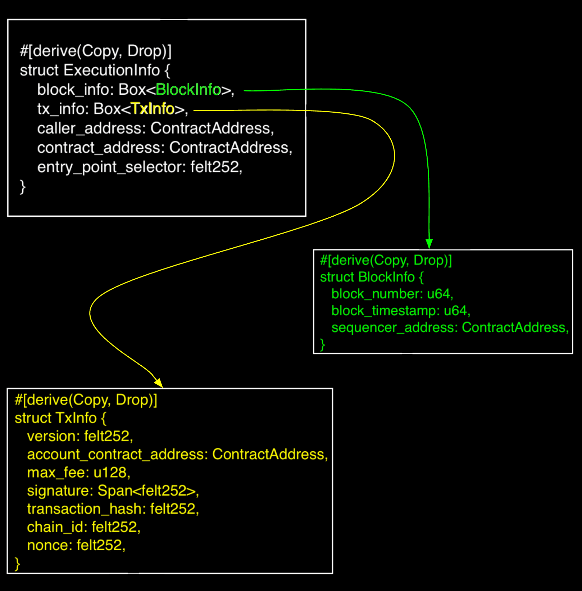
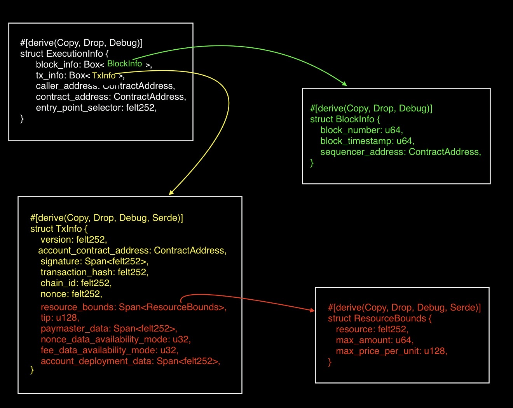
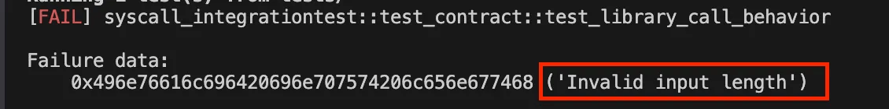
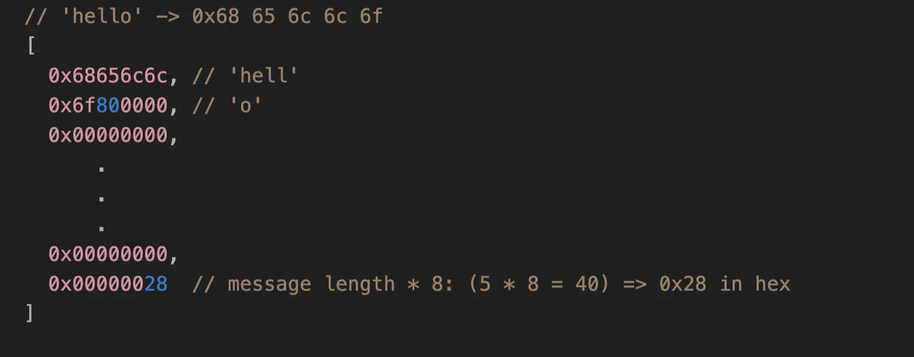
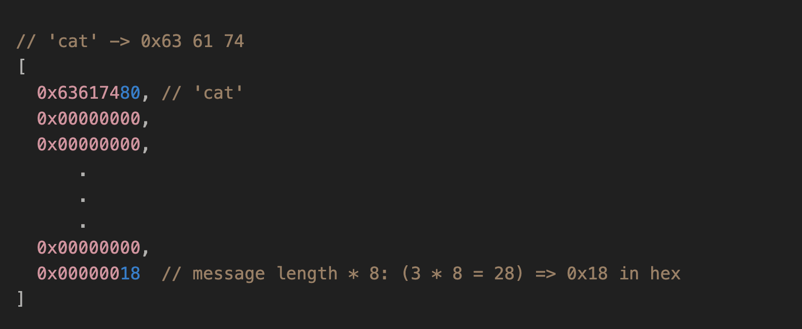
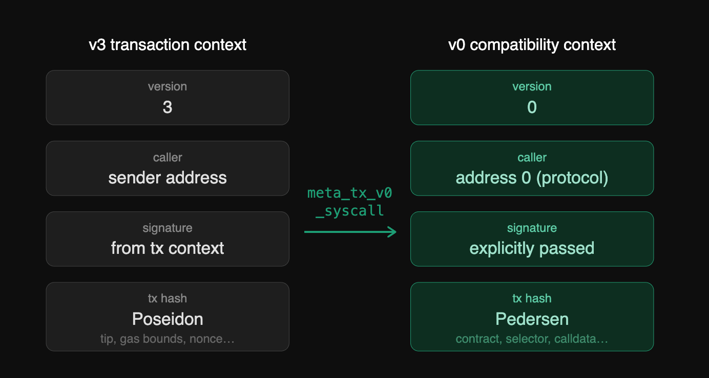

# Syscalls in Starknet

In Solidity, low-level operations like reading/writing to storage, contract to contract calls, or sending messages are performed directly through inline assembly using Yul opcodes like `call`, `sload`, and `sstore`. These opcodes bypass Solidity's high-level abstractions.

Cairo introduces a similar concept through system calls (syscalls). A syscall is a low-level call from a Starknet contract to the Starknet OS to perform an operation that ordinary Cairo code cannot do by itself, such as calling another contract, deploying a contract, emitting an event, reading execution context, or accessing storage.

In this article, we will walk through the different syscalls available and how they are used in Starknet contracts.

## **Syscalls and Their Solidity Equivalent**

The following list includes all currently available Starknet syscalls and their closest equivalents in Solidity where applicable.

- **`storage_read_syscall`** and **`storage_write_syscall`** are equivalent to `sload` and `sstore` in Solidity assembly respectively.
- **`get_block_hash_syscall`** is ****equivalent to ****`blockhash()`, returns the hash of a given block.
- **`call_contract_syscall`** is comparable to `address.call()` for contract calls.
- **`deploy_syscall`** is similar to `create2` for deploying contracts at a predictable address.
- **`emit_event_syscall`** is similar to `event` + `emit`. Both log data for off-chain indexing.
- **`keccak_syscall`** is equivalent to `keccak256`.
- **`get_class_hash_at_syscall`** is similar to `address.codehash`, which returns the hash of a contract’s bytecode.
- **`library_call_syscall`** is similar to `delegatecall`, which executes code from another contract in the current contract’s execution context.
- **`replace_class_syscall`** , **`get_execution_info_syscall`, `get_execution_info_v2_syscall`,`send_message_to_l1_syscall`, `sha256_process_block_syscall`** and **`meta_tx_v0_syscall`** do not have direct Solidity equivalent.

Now let’s see how the above syscalls are used in practice.

## **Syscalls to read and write to storage**

Unlike Cairo’s `.read()` and `.write()` methods, which can only read and write storage variables declared in the `Storage` struct, `storage_read_syscall` and `storage_write_syscall` read from and write to raw storage slots directly. They do not require a declared storage variable. If you know a slot’s storage address, you can read from it or write to it directly.

**Storage read syscall**

The `storage_read_syscall` function signature is:

```rust
fn storage_read_syscall(
    address_domain: u32, address: StorageAddress,
) -> SyscallResult<felt252>;
```

This syscall takes in two arguments;

- `address_domain`: it determines which data availability mode the storage operation uses. Currently, only domain `0` is supported, so for now always pass `0`.
- `address`: the storage address (slot) to read from, typed as `StorageAddress`.

`storage_read_syscall` returns a `felt252` value. `SyscallResult` is just Cairo's `Result` type for syscalls, so you can either unwrap it with `.unwrap_syscall()` (which panics and reverts on failure) or match on it explicitly to handle the error yourself without reverting.

**Storage write syscall**

The `storage_write_syscall` function signature is:

```rust
fn storage_write_syscall(
    address_domain: u32, address: StorageAddress, value: felt252,
) -> SyscallResult<()>;
```

This syscall takes in three arguments; `address_domain`, `address`, and

- `value`:  the value (`felt252`) to write to the storage address.

It returns `SyscallResult<()>`, where `()` means there is no value on success, the only thing that matters is whether it succeeded or failed.

Both `storage_read_syscall` and `storage_write_syscall` revolve around one key parameter `address`. Before we can use them effectively, we need to understand how Cairo computes these storage addresses.

**Computing the Storage Address (Slot) of a Storage Variable**

In Solidity, each storage variable is assigned a sequential slot number at compile time: the first declared variable gets slot `0`, the second gets `1`, and so on. The EVM identifies variables by slot number. We can get a variable's slot directly using `.slot` in assembly:

```solidity
contract Hello {
    uint256 public a; // slot 0
    uint256 public b; // slot 1

    function getSlot() public {
        assembly {
            let x := b.slot
        }
    }
}
```

Here, `b.slot` resolves to `1`, because `b` is the second declared variable.

This Solidity slot number assignment model becomes a problem when upgrading contracts. If a new version of the contract removes or reorders a storage variable, the slot numbers shift, and the new variable ends up reading data that belonged to a different variable in the old version.

In Cairo, storage addresses are derived from variable names instead. Cairo computes the `sn_keccak` hash of each storage variable's name and uses the result as its storage address. `sn_keccak` is Starknet's variant of Ethereum's keccak256, truncated to the first 250 bits.

Below is the Cairo equivalent of the Solidity contract above. It uses the `selector!` macro to compute the storage slot for a variable. The explanation that follows breaks down the relevant parts of the code.

```rust
use starknet::storage_access::StorageAddress;

#[starknet::interface]
pub trait IHelloStarknet<TContractState> {
    fn get_slot(self: @TContractState) -> StorageAddress;
}

#[starknet::contract]
mod HelloStarknet {
    // *** IMPORTS *** //
    use starknet::storage_access::{
			    StorageAddress,
			    storage_address_from_base,
			    storage_base_address_from_felt252,
		};

    #[storage]
    struct Storage {
		    a: u256,
		    b: u256
    }

    #[abi(embed_v0)]
    impl HelloStarknetImpl of super::IHelloStarknet<ContractState> {

        fn get_slot(self: @ContractState) -> StorageAddress {
				     // The `selector!` macro can be used to compute {sn_keccak}.
		        let selector_in_felt = selector!("b");

		        // Convert `felt252` to `StorageBaseAddress` type
            let slot_base = storage_base_address_from_felt252(selector_in_felt);

            // Convert `StorageBaseAddress` to `StorageAddress` type
            storage_address_from_base(slot_base)
        }

    }
}
```

Here is a step by step explanation of the code above:

1. We import the needed type and helpers:

    ```rust
    // *** IMPORTS *** //
    use starknet::storage_access::{
    		  StorageAddress,
    			storage_address_from_base,
          storage_base_address_from_felt252,
    };
    ```

    These helpers let us convert from a raw `felt252` to a valid `StorageAddress` type that the storage read or write syscall expects.

2. In the `get_slot` function, `selector!("b")` computes `sn_keccak("b")` as a `felt252`:

    ```rust
    // The `selector!` macro can be used to compute {sn_keccak}.
    let selector_in_felt = selector!("b");
    ```

3. The result is converted into a `StorageBaseAddress` using the `storage_base_address_from_felt252` method:

    ```rust
    // Convert `felt252` to `StorageBaseAddress` type
    let slot_base = storage_base_address_from_felt252(selector_in_felt);
    ```

    A `felt252` is just a number, and Cairo does not automatically treat numbers as storage addresses. Converting it to `StorageBaseAddress` does not change the underlying value. Instead, it changes how Cairo treats that value, that is, it now understands that this number should be used as a storage address, rather than as an ordinary integer. In other words, the conversion does not modify the data itself, it assigns a storage-address type to it so it can be used in storage operations.

4. That base address is then converted into a `StorageAddress` using `storage_address_from_base`. `StorageAddress` is the type expected by the storage syscalls.

    ```rust
    // Convert `StorageBaseAddress` to `StorageAddress` type
    storage_address_from_base(slot_base)
    ```

    `StorageAddress` is the exact format required by the storage read and write syscalls. Think of it as the final, usable form of the address. It’s Cairo's way of clearly separating "just a number" from "a valid storage address” ready to be used in a syscall.


Now that we know how to compute the storage slot of a declared variable, next is to read from and write to a slot.

**Reading and Writing To Storage Variable `b` via Syscalls**

The contract below extends the previous example with two new functions:

- one to write to variable `b` and
- the other to read from it,

both using syscalls directly:

```rust
use starknet::storage_access::StorageAddress;

#[starknet::interface]
pub trait IHelloStarknet<TContractState> {
    fn get_slot(self: @TContractState) -> StorageAddress;

		// *** NEWLY ADDED FUNCTIONS *** //
    fn write_to_b_low_level(ref self: TContractState);
    fn read_from_b_low_level(self: @TContractState) -> felt252;
}

#[starknet::contract]
mod HelloStarknet {
    use starknet::storage_access::{
        storage_address_from_base,
        storage_base_address_from_felt252,
        StorageAddress,
    };

    // *** NEWLY ADDED IMPORTS *** //
    use starknet::syscalls::{
			    storage_read_syscall,
			    storage_write_syscall
	  };
    use starknet::SyscallResultTrait;

    #[storage]
    struct Storage {
		    a: u256,
		    b: u256
    }

    #[abi(embed_v0)]
    impl HelloStarknetImpl of super::IHelloStarknet<ContractState> {

        // *** LOW-LEVEL WRITE TO VARIABLE `b` *** //
        fn write_to_b_low_level(ref self: ContractState) {
            // Get the slot for variable `b`
            let slot = self.get_slot();

            // Perform a syscall to write the value 4 into variable `b`
            let _ = storage_write_syscall(0, slot, 4);
        }


        // *** LOW-LEVEL READ FROM VARIABLE `b` *** //
        fn read_from_b_low_level(self: @ContractState) -> felt252 {
            // Get the slot for variable `b`
            let slot = self.get_slot();

            // Perform a syscall to read from variable `b`
            // `.unwrap_syscall()` unwraps the syscall result and panics if it failed
            storage_read_syscall(0, slot).unwrap_syscall()
        }


        fn get_slot(self: @ContractState) -> StorageAddress {
            let selector_in_felt = selector!("b");
            let slot_base = storage_base_address_from_felt252(selector_in_felt);
            storage_address_from_base(slot_base)
        }
    }
}

```

Below is a detailed explanation of the relevant parts of the code above:

1. Two functions were added to the `IHelloStarknet` interface: one to write to the storage variable `b`, and the other to read from it.

    ```rust
    // *** NEWLY ADDED FUNCTIONS *** //
    fn write_to_b_low_level(ref self: TContractState);
    fn read_from_b_low_level(self: @TContractState) -> felt252;
    ```

2. The storage syscalls and `SyscallResultTrait` (*to unwrap syscall result*).

    ```rust
    // *** NEWLY ADDED IMPORTS *** //
    use starknet::syscalls::{
    		storage_read_syscall,
        storage_write_syscall
    };

    use starknet::SyscallResultTrait;
    ```

    Two new imports were added.

    - First, `storage_read_syscall` and `storage_write_syscall` from `starknet::syscalls` . These are the low-level syscalls we will use to read from and write to storage directly, instead of Cairo's high-level `.read()` and `.write()` methods.
    - Second, `SyscallResultTrait` from `starknet` which is needed to call `.unwrap_syscall()` on the result returned by the syscalls.
3. In the write function, the storage slot for `b` is computed and passed to `storage_write_syscall` to write the value `4` to that slot.

    ```rust
    // *** LOW-LEVEL WRITE TO VARIABLE `b` *** //
    fn write_to_b_low_level(ref self: ContractState) {
        // Get the slot for variable `b`
        let slot = self.get_slot();

        // Perform a syscall to write the value 4 into variable `b`
        let _ = storage_write_syscall(0, slot, 4);
     }
    ```

4. In the read function, the same slot is computed and passed to `storage_read_syscall` to read the value, which returns a `Result`. Calling `.unwrap_syscall()` on it yields the raw felt252 value.

    ```rust
    // *** LOW-LEVEL READ FROM VARIABLE `b` *** //
    fn read_from_b_low_level(self: @ContractState) -> felt252 {
        // Get the slot for variable `b`
        let slot = self.get_slot();

        // Perform a syscall to read from variable `b`
        // `.unwrap_syscall()` unwraps the syscall result and panics if it failed
        storage_read_syscall(0, slot).unwrap_syscall()
    }
    ```


**Arbitrary Storage Slot Access Using Syscalls**

So far, we have only read from and written to storage variables that were explicitly declared in the `Storage` struct. But what if you need to access a storage slot that was never declared, for example, inspecting raw storage for debugging, building proxy contracts, or interacting with storage layouts from other contracts?
This is where arbitrary slot access becomes useful. Instead of deriving the slot from a variable name via `selector!()`, we provide the slot value directly as a raw `felt252`.
The conversion process is identical to what we covered earlier, convert the raw `felt252` to `StorageBaseAddress`, then to `StorageAddress`. The only difference is where the slot value comes from.

The contract below reads from and writes to storage slot `1` directly:

```rust
#[starknet::interface]
pub trait IHelloStarknet<TContractState> {
    fn write_to_slot1_low_level(ref self: TContractState);
    fn read_from_slot1_low_level(self: @TContractState) -> felt252;
}

#[starknet::contract]
mod HelloStarknet {
    // IMPORTS
    use starknet::syscalls::{
			    storage_read_syscall,
			    storage_write_syscall
		};
    use starknet::storage_access::{
			    storage_address_from_base,
			    storage_base_address_from_felt252
		};
    use starknet::SyscallResultTrait; // for .unwrap_syscall()

    #[storage]
    struct Storage {}

    #[abi(embed_v0)]
    impl HelloStarknetImpl of super::IHelloStarknet<ContractState> {

        // LOW-LEVEL WRITE TO SLOT 1
        fn write_to_slot1_low_level(ref self: ContractState) {
            // Convert `felt252` to `StorageBaseAddress` type
            let slot_base = storage_base_address_from_felt252(1);

            // Convert `StorageBaseAddress` to `StorageAddress` type
            let slot = storage_address_from_base(slot_base);

            // Perform a syscall to write the value 4 into the slot 1
            let _ = storage_write_syscall(0, slot, 4);
        }

        // LOW-LEVEL READ FROM SLOT 1
        fn read_from_slot1_low_level(self: @ContractState) -> felt252 {
            // Convert `felt252` to `StorageBaseAddress` type
            let slot_base = storage_base_address_from_felt252(1);

            // Convert `StorageBaseAddress` to `StorageAddress` type
            let slot = storage_address_from_base(slot_base);

            // Perform a syscall to read from the slot 1
            // `.unwrap_syscall()` unwraps the syscall result and panics if it failed
            storage_read_syscall(0, slot).unwrap_syscall()
        }

    }
}
```

In this example, before reading from and writing to storage address (slot) `1`, we converted the value `1` from `felt252` to `StorageBaseAddress` type, and then to `StorageAddress`, which is the required type for storage addresses in both syscalls.

## **Cross-contract call syscall**

The `call_contract_syscall`  is used to perform low-level cross-contract calls, similar to `address.call()` in Solidity. Its function signature is:

```rust
fn call_contract_syscall(
    address: ContractAddress,
    entry_point_selector: felt252,
    calldata: Span<felt252>,
) -> SyscallResult<Span<felt252>>;
```

It takes in three arguments;

- `address`: the address of the contract being called.
- `entry_point_selector`: the selector of the function being called, derived from the function name via `selector!()` macro.
- `calldata`: a `Span<felt252>` containing arguments passed to the function.

This syscall returns a `Span<felt252>` because at the syscall level, Cairo has no knowledge of the return type of the function being called, it could return a single value, a tuple, a struct, or nothing at all.

To handle all these cases uniformly, the return data is serialized into a flat sequence of `felt252` values. For example, if the called function returns a `u256`, which is [internally represented as two `u128` values](https://rareskills.io/post/cairo-integers) (low and high), the result would come back as two `felt252` elements in the span. It is then the caller's responsibility to deserialize the returned span back into the expected type.

```rust
let result: u256 = u256 {
    low: ret_data_low_felt252,
    high: ret_data_high_felt252,
};
```

The code below illustrates how we use `call_contract_syscall` to invoke the `transfer` function of another contract in practice. Notice how the `selector!()` macro is used to derive the function selector from the name, and how the calldata is passed as a `Span<felt252>`:

```rust
use starknet::ContractAddress;

#[starknet::interface]
pub trait IHelloStarknet<TContractState> {
    fn call_something(ref self: TContractState, target: ContractAddress, calldata: Span<felt252>);
}

#[starknet::contract]
mod HelloStarknet {
		// IMPORTS
    use starknet::syscalls::call_contract_syscall;
    use starknet::SyscallResultTrait; // for .unwrap_syscall()
    use starknet::ContractAddress;


    #[storage]
    struct Storage {}

    #[abi(embed_v0)]
    impl HelloStarknetImpl of super::IHelloStarknet<ContractState> {
        fn call_something(
            ref self: ContractState,
            target: ContractAddress,
            calldata: Span<felt252>,
        ) {
		        // selector for `transfer(felt252,u128)`
		        let selector = selector!("transfer");

		        // CALL `target` CONTRACT
            let _ = call_contract_syscall(target, selector, calldata).unwrap_syscall();
        }
    }
}
```

In the `call_something` function, the `selector!` macro hashes the function name `"transfer"` into a `felt252` value that uniquely identifies the entry point in the target contract (the same idea as function selectors in Solidity, where `keccak256("transfer(address,uint256)")` produces a 4-byte selector). Once we have the selector and the calldata ready, we pass them along with the target address to `call_contract_syscall` to perform the actual call.

**What Happens If the Call Fails?**
Unlike Solidity's `address.call()`, which returns a boolean indicating success or failure and allows the caller to handle it gracefully, `call_contract_syscall` does not give you that option. If the invoked contract reverts for any reason, the failure propagates immediately and the entire transaction reverts, there is no way to catch or recover from it on-chain. This is an important distinction to keep in mind when designing contracts that rely on cross-contract calls.

## **Deploying a New Contract**

The `deploy_syscall` is Cairo’s low-level way of creating contracts, similar to Solidity’s `create2`. It deploys contract at a predictable address.

The function signature for `deploy_syscall` is:

```rust
fn deploy_syscall(
    class_hash: ClassHash,
    contract_address_salt: felt252,
    calldata: Span<felt252>,
    deploy_from_zero: bool,
) -> SyscallResult<(ContractAddress, Span<felt252>)>;
```

This syscall takes the following arguments:

- `class_hash`: the identifier of the contract’s class to deploy, which is of type `ClassHash`.
- `contract_address_salt`: a salt used to deterministically compute the deployed contract’s address. Type is `felt252`.
- `calldata`: a `Span<felt252>` containing the constructor arguments.
- `deploy_from_zero`: a `bool` that indicates whether the contract address is computed using the caller’s address or `0` as the deployer address.

`deploy_syscall` returns a tuple `(ContractAddress, Span<felt252>)`. The first element is the address of the newly deployed contract. The second element is a span of `felt252`, representing the return data from the contract’s constructor. Just like `call_contract_syscall`, the constructor return values are flattened into a contiguous sequence of felts, making it possible to handle multiple return values of varying types.

The following code deploys an example counter contract with a constructor that takes an initial value:

```rust
use starknet::ClassHash;

#[starknet::interface]
pub trait IHelloStarknet<TContractState> {
    fn deploy_counter(ref self: TContractState, class_hash: ClassHash, initial: felt252);
}

#[starknet::contract]
mod HelloStarknet {
		// IMPORTS
    use starknet::ClassHash;
    use starknet::SyscallResultTrait; // for .unwrap_syscall()
    use starknet::syscalls::deploy_syscall;

    #[storage]
    struct Storage {}

    #[abi(embed_v0)]
    impl HelloStarknetImpl of super::IHelloStarknet<ContractState> {
        fn deploy_counter(ref self: ContractState, class_hash: ClassHash, initial: felt252) {
            // Prepare constructor calldata as Span<felt252>
            let mut calldata: Array<felt252> = ArrayTrait::new();
            calldata.append(initial);
            let calldata_span = calldata.span();

            // Salt for deterministic address
            let salt: felt252 = 123;

            // Deploy the contract
            let (_contract_address, _) = deploy_syscall(class_hash, salt, calldata_span, false)
                .unwrap_syscall();
        }
    }
}
```

The `deploy_counter` function serializes the constructor argument into a `Span<felt252>`, then calls `deploy_syscall` with the class hash, salt, and constructor calldata.

## Syscalls for emitting e**vents**

The `emit_event_syscall` is the low-level primitive for logging events on Starknet. It serves the same purpose as `logN()` in low-level Solidity, where N is the number of topics. But unlike the EVM where the log opcode support a maximum of 4 indexed topics, Starknet supports up to 50 keys (topics).

The `emit_event_syscall` function signature is:

```rust
fn emit_event_syscall(
    keys: Span<felt252>, data: Span<felt252>,
) -> SyscallResult<()>;
```

It takes two arguments:

- `keys`: a `Span<felt252>` containing the indexed topics used for filtering and searching events (equivalent to `indexed` parameters in Solidity events).
- `data`: a `Span<felt252>` containing the non-indexed event data.

`emit_event_syscall` returns `SyscallResult<()>`: on success the value is `()`, and on failure it returns an error without halting execution, allowing the failure to be handled gracefully.

Consider this Solidity contract that logs an event with 2 topics. Don’t worry too much about what the code is doing just jump to the `**FOCUS HERE**` comment:

```solidity
// SPDX-License-Identifier: MIT
pragma solidity ^0.8.20;

contract Hello {
		// Event to emit
		event MyEvent(address indexed from, uint256 amount);

    function emitMyEvent(bytes32 t0, bytes32 t1) external {
        assembly {
            // Write the non-indexed data (amount = 4) to memory ptr 0x00
            mstore(0x00, 4)

						//  ****   FOCUS HERE    *****
						//			_____data_____   _____keys_____
						//		 |              | |              |
            // log2(memPtr, memSize, topic0, topic1)
            log2(0x00, 0x20, t0, t1)

        }
    }
}
```

The `log2` opcode in the code above:

- reads `0x20` bytes (memSize) of data from memory starting at `0x00` (memPtr): this is the event data (non-indexed).
- uses `t0` and `t1` as the two topics (indexed).

Thereby separating the non-indexed data from the topics.

Below is the Cairo equivalent using `emit_event_syscall`:

```rust
#[starknet::interface]
pub trait IHelloStarknet<TContractState> {
    fn emit_my_event(ref self: TContractState, amount: felt252);
}

#[starknet::contract]
mod HelloStarknet {
    use starknet::get_caller_address;

    use starknet::SyscallResultTrait; // for .unwrap_syscall()
    use starknet::syscalls::emit_event_syscall;

    #[storage]
    struct Storage {}

    #[abi(embed_v0)]
    impl HelloStarknetImpl of super::IHelloStarknet<ContractState> {
        fn emit_my_event(ref self: ContractState, amount: felt252) {
		        // event MyEvent(address indexed from, uint256 amount);
            let t0: felt252 = selector!("MyEvent");
            let t1: felt252 = get_caller_address().into(); // like msg.sender

            // ---- keys (topics) ----
            let mut keys: Array<felt252> = ArrayTrait::new();
            keys.append(t0); // topic0 = event selector
            keys.append(t1); // topic1 = indexed "from"

            // ---- data (non-indexed) ----
            let mut data: Array<felt252> = ArrayTrait::new();
            data.append(amount);

            // low-level syscall (assembly-like)
            //					  			__keys___   ___data___
						//		             |         | |          |
            emit_event_syscall(keys.span(), data.span()).unwrap_syscall();
        }
    }
}
```

Notice how `emit_event_syscall` explicitly separates keys and data as two `Span<felt252>` parameters, similar to how `log2` takes memory pointer and size for data and separate parameters for topics.

## **Getting Block Hash**

In Solidity, getting a block hash is straightforward with the builtin `blockhash(blockNumber)` (only works for the 256 most recent blocks). Cairo exposes similar capability through the `get_block_hash_syscall`, but with different availability constraints.

This syscall is available for block numbers in the range `first_v0_12_0_block` (*the first Starknet block number produced after the network upgraded to Starknet v0.12.0*) to `current_block - 10`. There is a 10-block lag because newer blocks must be finalized before their hashes can be safely exposed, meaning you cannot query the hash of the 10 most recent blocks. Asking for anything outside that range would throw a `BLOCK_NUMBER_OUT_OF_RANGE` error.

The `get_block_hash_syscall` function signature is:

```rust
fn get_block_hash_syscall(
    block_number: u64,
) -> SyscallResult<felt252>;
```

It takes an argument `block_number` of type `u64` and returns a `felt252` representing the hash of the requested block.

Here’s a simple contract that retrieves the block hash for a given block number:

```rust
#[starknet::interface]
pub trait IHelloStarknet<TContractState> {
    fn get_block_hash(self: @TContractState, block_number: u64) -> felt252;
}

#[starknet::contract]
mod HelloStarknet {
    // IMPORTS
    use starknet::SyscallResultTrait; // for .unwrap_syscall()
    use starknet::syscalls::get_block_hash_syscall;

    #[storage]
    struct Storage {}

    #[abi(embed_v0)]
    impl HelloStarknetImpl of super::IHelloStarknet<ContractState> {
        fn get_block_hash(self: @ContractState, block_number: u64) -> felt252 {
            // Call the syscall and unwrap the result
            // Will throw if the `block_number` is outside the valid range
            let block_hash: felt252 = get_block_hash_syscall(block_number).unwrap_syscall();

            // Return the block hash as a felt252
            block_hash
        }
    }
}
```

## **Getting Execution Context**

In Solidity, values such as `block.timestamp`, `msg.sender`, `tx.origin` and so on are available as **built-in globals**.

Cairo doesn't provide built-in global variables for these values. Instead, you must retrieve them by calling the `get_execution_info_syscall` syscall.

The `get_execution_info_syscall` function signature is:

```rust
fn get_execution_info_syscall() ->
					SyscallResult<Box<starknet::info::ExecutionInfo>>
```

It takes no arguments and returns a `Box<ExecutionInfo>` struct wrapped in a `SyscallResult`. The struct contains fields for caller address, block information, transaction info, and other execution context data as seen below:



The returned struct (`Box<ExecutionInfo>`) can then be destructured to extract the specific fields of interest, such as the caller address, block information, transaction info and so on.

The following code example retrieves the caller's address and block timestamp from the execution context:

```rust
#[starknet::interface]
pub trait IHelloStarknet<TContractState> {
    fn context_info(self: @TContractState);
}

#[starknet::contract]
mod HelloStarknet {
    // IMPORTS
    use starknet::SyscallResultTrait; // for .unwrap_syscall()
    use starknet::syscalls::get_execution_info_syscall;

    #[storage]
    struct Storage {}

    #[abi(embed_v0)]
    impl HelloStarknetImpl of super::IHelloStarknet<ContractState> {
        fn context_info(self: @ContractState) {
            // Call syscall
            let info = get_execution_info_syscall().unwrap_syscall();

            // Extract sender and timestamp
            let (_sender, _timestamp) = (info.caller_address, info.block_info.block_timestamp);
        }
    }
}
```

The `context_info` function calls `get_execution_info_syscall()` to retrieve the execution context. It accesses `caller_address` directly from the returned struct (`info.caller_address`) and `block_timestamp` from the nested `block_info` field (`info.block_info.block_timestamp`).

Note**:** This example extracts but doesn't return or use the values for simplicity. In a real contract, you would typically return these values or use them for access control, timing logic, or other logic.

## **Getting Execution Context v2**

This is similar to Getting Execution Context, except that the `TxInfo` field is replaced with `v2::TxInfo`, which includes both the original transaction fields and additional fields introduced in newer transaction versions.

Below is an image of the `ExecutionInfo` struct with the new `v2::TxInfo`



The newer fields (highlighted in red) in `v2::TxInfo` were added to support [V3 transactions](https://docs.starknet.io/learn/cheatsheets/transactions-reference#invoke-v3). They describe how much of the network’s resources a transaction is allowed to use, how fees may be paid, where certain transaction data is stored, and whether the transaction includes account-deployment data.

- `resource_bounds`: Sets limits on the resources the transaction is allowed to consume. You can think of this as a budget: the transaction declares how much network work it is willing to pay for. In V3, this is part of how transaction fees are described.
- `tip`: An extra amount attached to the transaction to incentivize faster transaction processing by prioritizing them over others.
- `paymaster_data`: Contains data that includes the address of the paymaster (an account other than the transaction sender that pays the transaction fees) and extra data to send to the paymaster. This extra data is not fixed by the protocol, it exists so the paymaster can enforce its own logic for sponsoring a transaction.
- `nonce_data_availability_mode`: Specifies the data-availability mode used for the transaction’s nonce. In other words, it indicates whether the transaction’s nonce data should be made available on L1 (Ethereum) or L2 (Starknet).
    - L1 data-availability mode is 0 (default).
    - L2 data-availability mode is 1.
- `fee_data_availability_mode`: Specifies the data-availability mode for the account balance used to pay transaction fees. Like the nonce field above, it determines whether the fee-related account data should be made available on L1 or L2.
- `account_deployment_data`: This field is used when you want to combine account contract deployment and transaction execution into a single operation. It contains the deployment parameters (class hash, address salt, and constructor calldata). When populated, it deploys the account contract before executing the transaction. When empty, it skips deployment and executes from an existing account contract.

The following code example shows how to retrieve the transaction `tip` from the execution context (v2):

```rust
#[starknet::interface]
pub trait IHelloStarknet<TContractState> {
    fn context_info(self: @TContractState);
}

#[starknet::contract]
mod HelloStarknet {
    // IMPORTS
    use starknet::syscalls::{get_execution_info_v2_syscall};
    use starknet::SyscallResultTrait; // for .unwrap_syscall()

    #[storage]
    struct Storage {}

    #[abi(embed_v0)]
    impl HelloStarknetImpl of super::IHelloStarknet<ContractState> {
        fn context_info(self: @ContractState) {
            // Call syscall
            let info = get_execution_info_v2_syscall().unwrap_syscall();

            // Extract tip
            let _tip = info.tx_info.tip;
        }
    }
}
```

## Get Class Hash - `get_class_hash_at_syscall`

In Starknet, every deployed contract is associated with a *class hash***,** a unique identifier that represents its compiled contract class (analogous to the bytecode hash in the EVM).

The `get_class_hash_at_syscall` is used to retrieve the class hash of any contract given its address. This is similar to `address.codehash` in Solidity, which returns the bytecode hash at an address.

The `get_class_hash_at_syscall` function signature is:

```rust
fn get_class_hash_at_syscall(contract_address: ContractAddress) ->
				SyscallResult<ClassHash>
```

It takes one argument, `contract_address` (the address of the deployed contract), and returns a `ClassHash` representing the class hash of the contract at that address.

The following code example retrieves and return the class hash of a contract using `get_class_hash_at_syscall`:

```rust
use starknet::{ContractAddress, ClassHash};

#[starknet::interface]
pub trait IHelloStarknet<TContractState> {
    fn get_class_hash(self: @TContractState, target: ContractAddress) -> ClassHash;
}

#[starknet::contract]
mod HelloStarknet {
    // IMPORTS
    use starknet::{ContractAddress, ClassHash};
    use starknet::SyscallResultTrait; // for .unwrap_syscall()
    use starknet::syscalls::get_class_hash_at_syscall;

    #[storage]
    struct Storage {}

    #[abi(embed_v0)]
    impl HelloStarknetImpl of super::IHelloStarknet<ContractState> {

        fn get_class_hash(self: @ContractState, target: ContractAddress) -> ClassHash {
						// Retrieve and return the class hash of the contract at `target`.
            get_class_hash_at_syscall(target).unwrap_syscall()
        }

    }
}
```

## Library_call syscall

In Solidity, executing another contract’s code in the context of the caller’s storage is done with the `delegatecall` opcode. Cairo provides a similar mechanism through the `library_call` syscall, which invokes a function defined in a different class hash (the identifier for a contract's compiled code) while keeping the caller’s storage context.

This means that although the code being executed comes from the target contract, any reads and writes to storage will affect the calling contract’s storage rather than that of the target contract itself.

The `library_call_syscall` function signature is:

```rust
fn library_call_syscall(
    class_hash: ClassHash, function_selector: felt252, calldata: Span<felt252>,
) -> SyscallResult<Span<felt252>>;
```

It takes the following arguments:

- `class_hash`**:** the hash of the class (contract code hash) containing the function to call. It is of type `ClassHash`.
- `function_selector`**:** the selector of the function to execute. Type `felt252`.
- `calldata`**:** the array of arguments to pass to that function. Type `Span<felt252>`.

It returns the called function's return data as a `Span<felt252>`, wrapped in a `SyscallResult` to handle potential errors.

Below is a code example that shows how the `library_call_syscall` is used:

```rust
use starknet::ClassHash;

#[starknet::interface]
pub trait IHelloStarknet<TContractState> {
    fn lib_call(
		    ref self: TContractState,
		    class_hash: ClassHash,
		    selector: felt252,
		    calldata: Span<felt252>
		 );
}

#[starknet::contract]
mod HelloStarknet {
    // IMPORTS
    use starknet::ClassHash;
    use starknet::SyscallResultTrait; // for .unwrap_syscall()
    use starknet::syscalls::library_call_syscall;

    #[storage]
    struct Storage {}

    #[abi(embed_v0)]
    impl HelloStarknetImpl of super::IHelloStarknet<ContractState> {

        fn lib_call(ref self: ContractState, class_hash: ClassHash, selector: felt252, calldata: Span<felt252>) {
            // Call syscall
            let _ = library_call_syscall(class_hash, selector, calldata).unwrap_syscall();
        }

    }
}
```

Just like `call_contract_syscall`, if the `library_call_syscall` fails (for example, if the target function reverts or the class hash is invalid), the entire transaction will revert.

**`library_call_syscall` Storage Layout**

Just like `delegatecall` in Solidity, `library_call_syscall` in Cairo executes a function in the target contract in the storage context of the calling contract. The difference is how those storage locations are addressed.

In Solidity, storage is slot-based:

- Variables are assigned sequential slot numbers.
- Names do not matter at runtime.
- As long as the slot layout matches, different variable names are harmless.

In Cairo, storage is name-based:

- Storage addresses are derived from `sn_keccak("variable_name")`.
- The variable name is the address.
- If names differ, the addresses differ.

This means that when using `library_call_syscall`, the calling contract and the target contract must use identical storage variable names for any shared state. **If they don’t, the target contract will hash a different name, compute a different address, and end up reading from or writing to the wrong storage location.**

## Upgrade Contract - replace_class syscall

In Ethereum, contract upgrades are usually done through [proxy patterns](https://rareskills.io/post/proxy-contract). The proxy holds all the storage, while the implementation contract contains the logic. To upgrade, the proxy updates the address of the implementation contract it delegates calls to.

Starknet takes a different approach. Instead of routing through a proxy, contracts can upgrade themselves natively with the `replace_class_syscall`.

This syscall is used to swap out its current class hash (the runtime code) for a new class hash, while keeping its storage untouched. **The contract’s “body” can be replaced while its “memory” (storage) stays the same.**

The `replace_class_syscall` function signature is:

```rust
fn replace_class_syscall(
    class_hash: ClassHash,
) -> SyscallResult<()>;
```

It takes one argument, `class_hash` (the class hash of the new implementation to replace the current one, type `ClassHash`), and returns nothing on success.

Below is a code example that shows how it is used:

```rust
use starknet::ClassHash;

#[starknet::interface]
pub trait IHelloStarknet<TContractState> {
    fn upgrade(ref self: TContractState, class_hash: ClassHash);
}

#[starknet::contract]
mod HelloStarknet {
    // IMPORTS
    use starknet::ClassHash;
    use starknet::SyscallResultTrait; // for .unwrap_syscall()
    use starknet::syscalls::replace_class_syscall;

    #[storage]
    struct Storage {}

    #[abi(embed_v0)]
    impl HelloStarknetImpl of super::IHelloStarknet<ContractState> {
        fn upgrade(ref self: ContractState, class_hash: ClassHash) {
		        // access control logic so only authorised can upgrade

            // Call syscall
            let _ = replace_class_syscall(class_hash).unwrap_syscall();
        }
    }
}
```

In practice, calling `replace_class_syscall` directly without safeguards is unsafe. Upgrades change the logic of a contract, so they should be safeguarded somehow. One way is by making sure only the owner can upgrade the contract.

Things to note before upgrading a contract:

- Storage is preserved, only the logic is swapped.
- In Ethereum, upgrading requires maintaining the same sequential storage slot layout across versions. In Cairo, since storage slots are derived from variable names, the new class must use the same variable names for storage variables to avoid reading from or writing to incorrect storage locations.
- After calling `replace_class_syscall`, the code currently executing from the old class will finish running. The new class code will be used starting from the next transaction that calls this contract, or if this contract is called again via `call_contract_syscall` later in the same transaction (after the replacement has occurred).

## Keccak-256 Syscall

The `keccak_syscall` provides direct access to the keccak hash function in Cairo. Its function signature is:

```rust
fn keccak_syscall(
    input: Span<u64>,
) -> SyscallResult<u256>;
```

It takes one argument, `input`, a `Span<u64>` containing the data to be hashed as 64-bit words in little-endian format, and returns a `u256` hash value in little-endian format.

>
>
>
> **Example of little and big endian format**: Suppose you have a 4-byte number `0x12345678`.
>
> - Big-endian (most significant byte first): `12 34 56 78`
> - Little-endian (least significant byte first): `78 56 34 12`
>
> So in little-endian, the “last” byte comes first.
>

The input must be pre-padded according to Cairo’s version of the keccak “`pad10*1`” rule:

1. Start marker: Append a single byte `0x01` immediately after the preimage.
2. Zero fill: Add as many `0x00` bytes as needed to reach the required block size.
3. End marker: Append a final byte `0x80` to signal the end of the padding.

After padding, the total length must be a multiple of 1088 bits (i.e. 17 × `u64` words), else, we will get a runtime saying “Invalid input length":



To illustrate the difference in how input data is constructed, we’ll first look at the Solidity version and then compare it with Cairo’s approach.

The low-level Solidity contract below returns the Keccak hash of the preimage `"hello"`:

```solidity
// SPDX-License-Identifier: MIT
pragma solidity ^0.8.0;

contract KeccakExample {
    function hashHello() external pure returns (bytes32 hash) {
        assembly {
            // "hello" in ASCII is 5 bytes long (0x68656c6c6f)
            // Store bytes in memory
            mstore(0x00, 0x68656c6c6f)

            // Compute keccak256 over the last 5 bytes in memory
            // keccak256(memory_ptr, length)
            hash := keccak256(0x1b, 0x05)
        }
    }
}
```

Inside the assembly block, `mstore` writes the input value `hello` into a full 32-byte memory word, right-aligned, which means the first 27 bytes are zeros and the last 5 bytes contain `"hello"`, like so:

```rust
//  ______________first 27 bytes are zeros______________   _hello__
// |                                                    | |        |
0x 000000000000000000000000000000000000000000000000000000 68656c6c6f
```

Because of this layout, the call to `keccak256(0x1b, 0x05)` starts hashing at offset `0x1b` (27) and hashes exactly 5 bytes, targeting only the `"hello"` bytes and ignoring the zero padding. Straightforward right?

The Cairo equivalent requires a deeper look, because the `keccak_syscall` expects its input to be pre-padded to a multiple of 1088 bits (17 × 64-bit words) following the Keccak pad10*1 rule.

Before hashing, the ASCII bytes of `"hello"` (`0x68656c6c6f`) are transformed like this:

1. Append the start bit – add a single byte `0x01` immediately after the message.

    ```
    0x68 65 6c 6c 6f 01
    ```

2. Zero padding – fill with `0x00` bytes until the total length is 136 bytes (1088 bits ÷ 8).
3. Final bit – append a single byte `0x80` to mark the end of the padding.

    ```
    0x68 65 6c 6c 6f 01 ...00... 80

    ```


> *The green part represents the actual message (the preimage to be hashed). The red part marks the start `0x01` and end `0x80` padding bytes required by the Keccak pad10*1 rule. The blue part shows the zero-padding bytes that fill the gap so the total length reaches a full 1088-bit block.*
>

After padding, the total length must be a multiple of 1088 bits (136 bytes).

In this example the message is only 5 bytes long, so the padded block expands to a full 136 bytes. If the preimage were larger, say 154 bytes, you would need two 136-byte blocks (272 bytes total) since 154 bytes doesn't fit in one 136-byte block.

Now that the message (`hello`) is padded to 136 bytes, the next step is to split it into 17 little-endian `u64` words ( 17 × 64 bits = 1088 bits ), which then becomes the input span for the `keccak_syscall`.

Here’s an animation illustrating the conversion from the padded 136-byte block into 17 little-endian `u64` chunks:

<video src="https://r2media.rareskills.io/CairoVideos/padded-message.mp4" type="video/mp4" autoplay loop muted controls>
</video>

The Cairo equivalent for the solidity example above:

```rust
#[starknet::interface]
pub trait IHelloStarknet<TContractState> {
    fn hasher(ref self: TContractState) -> u256;
}

#[starknet::contract]
mod HelloStarknet {
    // IMPORTS
    use starknet::SyscallResultTrait; // for .unwrap_syscall()
    use starknet::syscalls::keccak_syscall;

    #[storage]
    struct Storage {}

    #[abi(embed_v0)]
    impl HelloStarknetImpl of super::IHelloStarknet<ContractState> {
        fn hasher(ref self: ContractState) -> u256 {
            // Encode the input as a span<u64>
            let mut input: Array<u64> = ArrayTrait::new();
            input.append(0x0000016f6c6c6568);
            input.append(0x0000000000000000);
            input.append(0x0000000000000000);
            input.append(0x0000000000000000);
            input.append(0x0000000000000000);
            input.append(0x0000000000000000);
            input.append(0x0000000000000000);
            input.append(0x0000000000000000);
            input.append(0x0000000000000000);
            input.append(0x0000000000000000);
            input.append(0x0000000000000000);
            input.append(0x0000000000000000);
            input.append(0x0000000000000000);
            input.append(0x0000000000000000);
            input.append(0x0000000000000000);
            input.append(0x0000000000000000);
            input.append(0x8000000000000000);

            // Call syscall
            keccak_syscall(input.span()).unwrap_syscall()
        }
    }
}
```

The `keccak_syscall` returns a little-endian `u256`.

To compare it directly with Solidity’s `bytes32` result, we have to convert it to big-endian hex format, which will be covered in a later chapter ([hash functions](https://rareskills.io/post/cairo-hash-functions)).

**To summarize**

When using `keccak_syscall` in Cairo:

- Manually pad the preimage to multiple of 1088-bit blocks with the pad10*1 rule.
- Supply the padded message as 17 little-endian `u64` words.
- Reverse the resulting bytes to big-endian if a Solidity-compatible `bytes32` is required.

## Sha-256 Syscall

Like Solidity, which provides SHA-256 hashing algorithm via a precompile, Starknet provides access to it through a syscall. Both give access to the same hash function, but at  different levels of abstraction.

- In Solidity, `sha256` is exposed as an EVM precompile, which takes in arbitrary-length input, and the function automatically handles the correct padding and processes all required blocks under the hood. The result is returned as a `bytes32` value in big-endian format.
- In Cairo, SHA-256 hashing is available through the `sha256_process_block_syscall`, which operates at a much lower level:
    - It operates only on a single 512-bit (64-byte) block at a time.
    - It takes in an initial SHA-256 state and the input provided to compute the next SHA-256 state.
    - The output returns the next SHA-256 state of the input passed as a little-endian `Sha256StateHandle`, represented as a boxed array of eight 32-bit words.

The `sha256_process_block_syscall` function signature is:

```rust
fn sha256_process_block_syscall(
				state: Sha256StateHandle,
				input: Box<[u32; 16]>
		) -> SyscallResult<core::sha256::Sha256StateHandle>;
```

It takes two arguments:

- `state`: A `Sha256StateHandle` representing the internal hash state (eight 32-bit words, `[u32; 8]`). For the first block, this state is initialized to the SHA-256 initialization constants. After each block is processed, the updated state becomes the new internal state and is passed into subsequent calls.
- `input`: A boxed array of 16 words (`[u32; 16]`), each word being 32 bits. Together, this represents a single 512-bit block (64 bytes) of the message to be hashed. Inputs shorter than 64 bytes must be manually padded according to sha256 standard:
    - append `0x80` immediately after the message,
    - append zero bytes (`0x00`), and
    - append the (message length * 8) in the last byte to complete a full 512-bit block

    For example, the padded input for the message `hello` will be:

    

    The padded input for the message `cat` will be:

    


It returns:

- `SyscallResult<Sha256StateHandle>`: The updated internal state after processing the block. This new state should be fed into the next round if more blocks remain, or treated as the final digest (after applying SHA-256 padding if necessary).

**Why `sha256_process_block` Cannot Be Called Directly**

As of this writing, user contracts cannot directly call the `sha256_process_block` syscall because its state handle is declared with restricted visibility:

```rust
/// A handle to the state of a SHA-256 hash.
pub(crate) extern type Sha256StateHandle;
```

The `pub(crate)` visibility means that `Sha256StateHandle` is only accessible within the core library’s crate and not to user contracts. In other words, even though the syscall exists, its state handle type isn’t exposed publicly, preventing us from interacting with it directly.

That said, the core library does provide higher-level functions that internally handle this:

- `compute_sha256_byte_array`
- `compute_sha256_u32_array`

However, we won’t cover these in this article since our focus is specifically on syscalls.

## Send Message to Ethereum L1 syscall

So far, we have looked at syscalls used within Starknet itself. However, Starknet contracts can also communicate with Ethereum (L1). This is done using the `send_message_to_l1_syscall`, which allows a Starknet (L2) contract to send messages or pass data to an L1 contract.

Practical use cases include bridging tokens to Ethereum, notifying an L1 contract about events that occurred on Starknet, or finalizing a cross-chain action.

The `send_message_to_l1_syscall` function signature is:

```rust
fn send_message_to_l1_syscall(
    to_address: felt252, payload: Span<felt252>,
) -> SyscallResult<()>;
```

It takes two arguments:

- `to_address`: the 20-byte Ethereum address (as a `felt252`) of the target L1 contract.
- `payload`: a `Span<felt252>` representing the message. This can contain any encoded data (function selectors, parameters, etc.) that the L1 contract understands.

It returns nothing.

It’s important to note that the syscall itself does not directly invoke a function on an Ethereum contract. Instead, the flow works through the Starknet Core contract deployed on L1:

1. The Cairo contract on L2 calls `send_message_to_l1_syscall`, pushing the payload into the messaging bridge.
2. On L1, the destination Solidity contract (the address you specified in `to_address`) consumes the message by calling a function `consumeMessageFromL2` in the Starknet Core contract (*a Solidity contract deployed on Ethereum. It verifies Starknet state updates, maintains the L2 ↔ L1 messaging queues, and exposes functions that L1 contracts use to send and consume messages to and from Starknet*):

    ```solidity
    consumeMessageFromL2(l2_sender, payload)
    ```

    - `l2_sender`: The Starknet L2 address (as a `uint256`) of the contract that sent the message.
        - This must be the exact L2 contract address that executed `send_message_to_l1_syscall`.
        - Represent it on L1 as a `uint256` with the same numeric value as the L2 felt address (no extra encoding).
        - The Starknet Core contract validates that `msg.sender` matches the destination address. Therefore, you must call `consumeMessageFromL2` from the exact L1 contract address specified in `to_address`. Calling from an EOA or a different contract will cause the transaction to revert.
    - `payload`: The exact array of words (as `uint256[]`) that the L2 contract sent—same order, same values, same length.
3. The `consumeMessageFromL2` function then marks the message as consumed, preventing it from being processed multiple times (replay protection).
4. The Solidity contract can then trigger any follow-up logic—such as updating state, minting tokens, or invoking other functions.

**Example**

Let’s create a simple Cairo contract that sends a message to L1 and then test that it indeed sends message to L1.

We start by creating a new Scarb project, let’s call it `l1_msg`:

```bash
scarb new l1_msg
```

Then replace the generated code in `lib.cairo` with the one below. This contract defines a function `greetings_to_l1` that sends the message `Hello from RareSkills!` to L1.

```rust
#[starknet::interface]
pub trait IHelloStarknet<TContractState> {
    fn greetings_to_l1(ref self: TContractState);
}

#[starknet::contract]
mod HelloStarknet {
    // IMPORTS
    use starknet::syscalls::send_message_to_l1_syscall;
    use starknet::SyscallResultTrait; // for .unwrap_syscall()

    #[storage]
    struct Storage {}

    #[abi(embed_v0)]
    impl HelloStarknetImpl of super::IHelloStarknet<ContractState> {
        fn greetings_to_l1(ref self: ContractState) {
            // payload must be Span<felt252>
            let mut payload: Array<felt252> = ArrayTrait::new();
            payload.append('Hello from RareSkills!'); // any data you want to send

            // call the syscall
            send_message_to_l1_syscall(0x1234, payload.span()).unwrap_syscall();
        }
    }
}
```

Here we are sending the message `Hello from RareSkills!` to the recipient's L1 address `0x1234`.

Now to test that the Cairo contract correctly sends a message to L1, we will use helpers from the `snforge_std` library. Navigate to `tests/test_contract.cairo` and replace the code with the following:

```rust
use snforge_std::{
    ContractClassTrait, DeclareResultTrait, declare,
    // ======== 3 NEW HELPERS =========
    spy_messages_to_l1,
    MessageToL1,
    MessageToL1SpyAssertionsTrait,
};
use starknet::{ContractAddress, EthAddress};
use l1_msg::{IHelloStarknetDispatcher, IHelloStarknetDispatcherTrait};

fn deploy_contract(name: ByteArray) -> ContractAddress {
    let contract = declare(name).unwrap().contract_class();
    let (address, _) = contract.deploy(@ArrayTrait::new()).unwrap();
    address
}

#[test]
fn test_send_message_to_l1() {
    let main_contract_addr = deploy_contract("HelloStarknet");
    let main_dispatcher = IHelloStarknetDispatcher { contract_address: main_contract_addr };

    // Start spying L2->L1 messages
    let mut spy = spy_messages_to_l1();

    // Call the Cairo function
    let _ = main_dispatcher.greetings_to_l1();

    // Choose any L1 address (EthAddress wraps a felt252 under-the-hood)
    let to: EthAddress = 0x1234.try_into().unwrap();

    // Build our expected message
    let expected_payload = array!['Hello from RareSkills!'];

    // Assert the message was sent (from our contract to the expected L1 address with payload)
    spy.assert_sent(
        @array![
            (main_contract_addr, MessageToL1 { to_address: to, payload: expected_payload }),
        ],
    );
}
```

The test uses `spy_messages_to_l1()` to act as an observer on the L2 → L1 messaging queue, call the Cairo contract function `greetings_to_l1` and then assert that a message was successfully sent from the contract to the expected L1 address with the correct payload.

**Exercise:**

1. Run the test with `scarb test` and confirm it passes.
2. Modify the `expected_payload` in the test to `Hi from RareSkills!`.
3. Re-run the test and see how the assertion fails when the payload does not match.

## Meta_tx_v0 Syscall

`meta_tx_v0_syscall` is a backward compatibility syscall introduced in Starknet v0.14.0.

[Starknet transactions](https://docs.starknet.io/learn/cheatsheets/transactions-reference) have gone through several versions, v0 being the first and v3 being the current one. When v0, v1, and v2 transactions were deprecated in favour of v3, account contracts written for the v0 transaction format could no longer be called directly.

This syscall bridges that gap, allowing a v3 transaction to invoke an account contract that was written to expect the v0 transaction format.

The function signature for `meta_tx_v0_syscall` is:

```rust
fn meta_tx_v0_syscall(
    address: ContractAddress,
    entry_point_selector: felt252,
    calldata: Span<felt252>,
    signature: Span<felt252>,
) -> SyscallResult<Span<felt252>>;
```

This syscall takes the following arguments:

- `address`: The contract address of the target version 0 account to be called.
- `entry_point_selector`: the selector of the function to be called on the target account. In v0, this is also computed as `sn_keccak(function_name)`.
- `calldata`: the arguments to pass to the function, as a span of `felt252` values.
- `signature`: the transaction signature as a span of `felt252` values. Unlike a v3 transaction where the signature is derived from the transaction context automatically, here it must be computed and passed explicitly. To produce it:
    1. Hash the transaction data using [Pedersen](https://rareskills.io/post/cairo-hash-functions) to get version 0 transaction hash:

        ```
        invoke_v0_tx_hash = h(
        								"invoke",
        								version,
        								contract_address,
        								entry_point_selector,
        								h(calldata),
        								max_fee,
        								chain_id
        					);
        ```

    2. [Sign the resulting hash](https://rareskills.io/post/cairo-signature-verification) with the account's private key to produce the `(r, s)` signature values, then pass them as the `signature` span.

It returns the called function's return data as a `Span<felt252>`.

### How this syscall works under the hood

When you call `meta_tx_v0_syscall`, Starknet modifies the execution context to make it look like an old-style v0 transaction:

1. The signature is replaced with the one you pass in via the `signature` parameter
2. The caller becomes address 0 (the OS/protocol itself)
3. The transaction version is changed to 0 (pretending it's an old-style transaction)
4. The transaction hash is recalculated as a version-0 transaction hash

The diagram below shows exactly what each field looks like before and after the syscall is invoked:



These changes apply not only to the called contract but also to any inner contracts it calls. It ensures the entire call chain operates in "v0 compatibility mode."

> Note: The syscall documentation explicitly states it "**should only be used to allow support for old version 0 account contracts, and should not be used for other purposes.**" If you need to call newer version account contracts, always use `call_contract_syscall` instead.
>
