# Upgrading Contracts on Starknet

On Ethereum, the proxy pattern is the most common approach for contract upgradeability. In this pattern, a proxy contract holds the contract's storage and delegates function calls to a separate implementation contract. When an upgrade is needed, you deploy a new implementation contract and point the proxy to it.

Starknet takes a different approach, it uses the `replace_class_syscall` to swap the class hash of a deployed contract without changing the storage and address. This article covers how `replace_class_syscall` works and how to implement contract upgrades on Starknet.

## How  `replace_class_syscall`  Works

Recall from the Chapter on *“[Understanding Starknet’s Contract Deployment Model](https://rareskills.io/post/cairo-contract-deployment-model)*” that **every contract is an instance of a contract class**: the class contains bytecode, and the **instance holds storage with its address**. Because the bytecode and storage live separately, you can point the contract instance to a new class while preserving storage.

To upgrade a contract using `replace_class_syscall`, we pass the class hash of the new implementation as an argument (`new_class_hash: ClassHash`).

The `replace_class_syscall`function signature is:

```rust
fn replace_class_syscall(new_class_hash: ClassHash) -> SyscallResult<()>
```

It returns `SyscallResult<()>`: A result type that wraps either `Ok(())` on success or `Err` with error details on failure. The syscall fails when the class hash hasn't been declared on Starknet or when the caller doesn't have permission to perform the upgrade.

When `replace_class_syscall` executes successfully:

- The contract address stays the same (regardless of how many upgrades occur)
- All storage data remains in the contract's own storage
- The contract instance begins using the logic from the new class hash once execution returns to the caller.

Now that we understand how `replace_class_syscall` works, let's use it to upgrade a contract.

## Contract Upgrades with `replace_class_syscall`

We'll upgrade a `Counter` contract that increments a count by 1 and retrieves the current count to a new class implementation, the `Greeter` contract.

### Counter Contract

To follow along, create a new project and navigate into it:

```bash
scarb new counter_upgrade
cd counter_upgrade
```

Then create a `src/counter.cairo` file and add the code below.

We'll focus on the `upgrade` function implementation.

```rust
use starknet::{ClassHash};

#[starknet::interface]
pub trait ICounter<TContractState> {
    fn get_count(self: @TContractState) -> u32;
    fn increment(ref self: TContractState);
    fn upgrade(ref self: TContractState, new_class_hash: ClassHash);
}

#[starknet::contract]
mod Counter {
    use starknet::storage::{StoragePointerReadAccess, StoragePointerWriteAccess};
    use starknet::syscalls::replace_class_syscall;
    use starknet::SyscallResultTrait;
    use starknet::{ClassHash, ContractAddress, get_caller_address};

    #[storage]
    struct Storage {
        count: u32,
        owner: ContractAddress,
        current_class_hash: ClassHash,
    }

    #[event]
    #[derive(Drop, starknet::Event)]
    enum Event {
        ContractUpgraded: ContractUpgraded,
    }

    #[derive(Drop, starknet::Event)]
    struct ContractUpgraded {
        old_class_hash: ClassHash,  // Previous implementation class hash
        new_class_hash: ClassHash,  // New implementation class hash
    }

    #[constructor]
    fn constructor(ref self: ContractState, owner: ContractAddress, initial_class_hash: ClassHash) {
        self.count.write(1);        // Initialize counter to 1
        self.owner.write(owner);    // Sets the contract owner
        self.current_class_hash.write(initial_class_hash); // Just to track the class hashes
    }

    #[abi(embed_v0)]
    impl CounterImpl of super::ICounter<ContractState> {

        // returns the current counter value
        fn get_count(self: @ContractState) -> u32 {
            self.count.read()
        }

				// increments the counter by 1
        fn increment(ref self: ContractState) {
            let current = self.count.read();
            self.count.write(current + 1);
        }

				 // FOCUS HERE: upgrades the contract to use a new implementation
        fn upgrade(ref self: ContractState, new_class_hash: ClassHash) {
            let caller = get_caller_address();
            assert(caller == self.owner.read(), 'Only contract owner can upgrade');

            let old_class_hash = self.current_class_hash.read();
            replace_class_syscall(new_class_hash).unwrap_syscall();
            self.current_class_hash.write(new_class_hash);

            self.emit(ContractUpgraded { old_class_hash, new_class_hash });
        }
    }
}
```

The `upgrade` function accepts the new class hash as an argument and ensures that the caller is the contract owner to prevent unauthorized upgrades.

```rust
let caller = get_caller_address();
assert(caller == self.owner.read(), 'Only contract owner can upgrade');
```

The actual upgrade occurs on line:

```rust
replace_class_syscall(new_class_hash).unwrap_syscall();
```

`unwrap_syscall()` panics if the `replace_class_syscall` returns an error which causes the transaction to revert. This means the upgrade either completes successfully or the transaction panics, rolls back and leaves the contract unchanged.

Once the upgrade completes, the function emits a `ContractUpgraded` to log the change:

```rust
self.emit(ContractUpgraded { old_class_hash, new_class_hash });
```

Replace the contents of `src/lib.cairo` with `mod counter;` to tell the compiler which modules to include in the build.

### Declaring and Deploying the Counter Contract

Now let's declare and deploy the contract to test the upgrade functionality.

Run the following command to declare the `Counter` contract. Replace `YOUR_ACCOUNT_NAME` with your account name and `YOUR_API_KEY` with your Alchemy API key:

```rust
sncast \
--account <YOUR_ACCOUNT_NAME> \
declare \
--url https://starknet-sepolia.g.alchemy.com/starknet/version/rpc/v0_10/<YOUR_API_KEY> \
--contract-name Counter
```

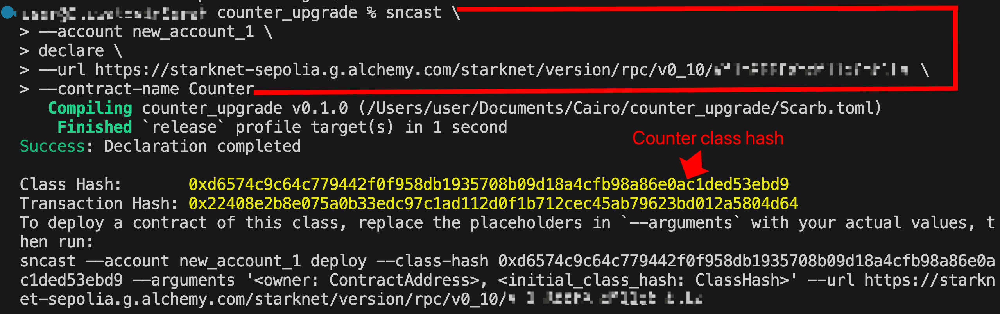

**Deploy the Counter contract**

Since the `Counter` constructor expects the initial class hash as an argument to track upgrades, we pass it the class hash from the declaration step above, along with the owner address. Run the following command to deploy, replacing the placeholders with their concrete values:

```rust
sncast \
--account <YOUR_ACCOUNT_NAME> \
deploy \
--class-hash <COUNTER_CLASS_HASH> \
--arguments '<OWNER_ADDRESS>, <COUNTER_CLASS_HASH>' \
--url https://starknet-sepolia.g.alchemy.com/starknet/version/rpc/v0_10/<YOUR_API_KEY>
```

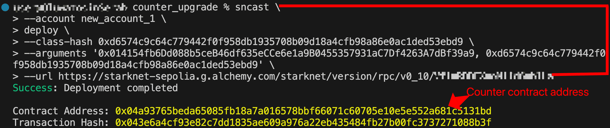

After deployment, the `count` should be 1 since we initialized it to 1 in the constructor. We can verify this by calling `get_count` through Voyager's read contract interface, which returns 1.

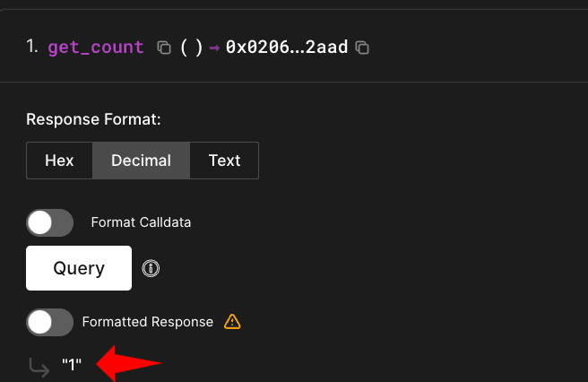

To upgrade the `Counter` contract, we need a new class hash. We get this by declaring a second contract called `Greeter`.

### Creating the Greeter Contract

The  `Greeter` contract will set and retrieve greeting messages, track the greeting count, and include upgrade functionality. We're using a structurally different contract rather than a newer `Counter` version to demonstrate three things:

1. How storage is preserved across upgrades
2. How field name collisions behave
3. When exactly the new implementation takes effect after calling `replace_class_syscall`

Each of these is covered in the sections that follow.

Create a `src/greeter.cairo` file in the same `counter_upgrade` project and add the following code to it:

```rust
use starknet::{ClassHash, ContractAddress};

#[starknet::interface]
pub trait IGreeter<TContractState> {
    fn set_greeting(ref self: TContractState, message: ByteArray);
    fn get_greeting(self: @TContractState) -> ByteArray;
    fn get_greeting_count(self: @TContractState) -> u32;
    fn upgrade(ref self: TContractState, new_class_hash: ClassHash);
    fn get_owner(self: @TContractState) -> ContractAddress;
}

#[starknet::contract]
mod Greeter {
    use starknet::storage::{StoragePointerReadAccess, StoragePointerWriteAccess};
    use starknet::syscalls::replace_class_syscall;
    use starknet::SyscallResultTrait;
    use starknet::{ClassHash, ContractAddress, get_caller_address};

    #[storage]
    struct Storage {
        greeting: ByteArray,
        greeting_count: u32,
        owner: ContractAddress,
    }

    #[event]
    #[derive(Drop, starknet::Event)]
    enum Event {
        ContractUpgraded: ContractUpgraded,
    }

    #[derive(Drop, starknet::Event)]
    struct ContractUpgraded {
        new_class_hash: ClassHash,
    }

    #[constructor]
    fn constructor(ref self: ContractState, owner: ContractAddress) {
        self.owner.write(owner);   // Set the contract owner
    }

    #[abi(embed_v0)]
    impl GreeterImpl of super::IGreeter<ContractState> {

        // Updates the greeting message and increments the usage counter
        fn set_greeting(ref self: ContractState, message: ByteArray) {
            self.greeting.write(message);

            let current_count = self.greeting_count.read();
            let new_count = current_count + 1;
            self.greeting_count.write(new_count);
        }

        // Returns the current greeting message
        fn get_greeting(self: @ContractState) -> ByteArray {
            self.greeting.read()
        }

			  // Returns how many times the greeting has been updated
        fn get_greeting_count(self: @ContractState) -> u32 {
            self.greeting_count.read()
        }

        // Upgrades the contract to use a new implementation
        fn upgrade(ref self: ContractState, new_class_hash: ClassHash) {
            let caller = get_caller_address();
            assert(caller == self.owner.read(), 'Only owner can upgrade');

            replace_class_syscall(new_class_hash).unwrap_syscall();

            self.emit(ContractUpgraded { new_class_hash });
        }

        // Returns the contract owner's address
        fn get_owner(self: @ContractState) -> ContractAddress {
            self.owner.read()
        }
    }
}
```

Then add `mod greeter;` to `src/lib.cairo`, so we have the following in the `lib.cairo`:

```
mod counter;
mod greeter;
```

Declare the `Greeter` contract to get the class hash for upgrading the `Counter` contract:

```rust
sncast \
--account <YOUR_ACCOUNT_NAME> \
declare \
--url https://starknet-sepolia.g.alchemy.com/starknet/version/rpc/v0_10/<YOUR_API_KEY> \
--contract-name Greeter
```

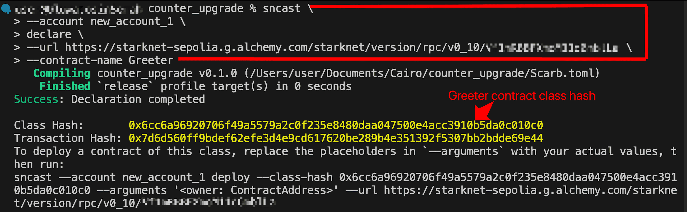

Using the address set as the owner during the `Counter` deployment, call the `upgrade` function on Voyager's “Write Contract” tab with the `Greeter`'s class hash as the argument and the transaction should succeed:

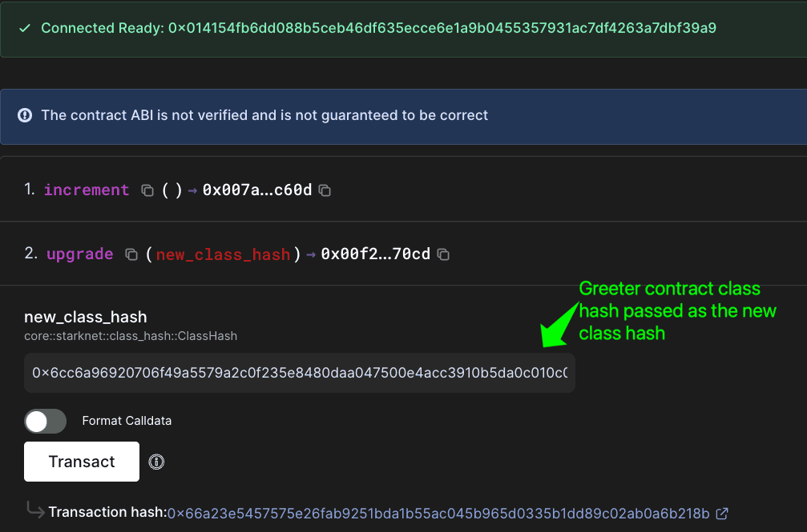

### Contract Storage Before and After Upgrade

Before the upgrade, the `Counter` contract had this state:

- count = `1`
- owner = `0x014154fb6Dd088b5ceB46df635eCCe6e1a9B0455357931aC7Df4263A7dBf39a9`
- current_class_hash = `0xd6574c9c64c779442f0f958db1935708b09d18a4cfb98a86e0ac1ded53ebd9`

After upgrading, the contract keeps all its stored data while executing code from the `Greeter` class hash:

- count = `1`
- owner = `0x014154fb6Dd088b5ceB46df635eCCe6e1a9B0455357931aC7Df4263A7dBf39a9`
- current_class_hash = `0x6cc6a96920706f49a5579a2c0f235e8480daa047500e4acc3910b5da0c010c0`
- greeting = `0`
- greeting_count = `0`

Notice that both contracts have an `owner` field that maps to the same storage location (computed from `sn_keccak("owner")`).

We can verify this using [Voyager's storage query interface](https://sepolia.voyager.online/contract/0x04a93765beda65085fb18a7a016578bbf66071c60705e10e5e552a681c5131bd#readStorage). Voyager's current interface only lets you query one storage slot at a time.

To query all slots at once, click "View old version of this page" at the top of the contract page, and select "Struct" from the query type dropdown.

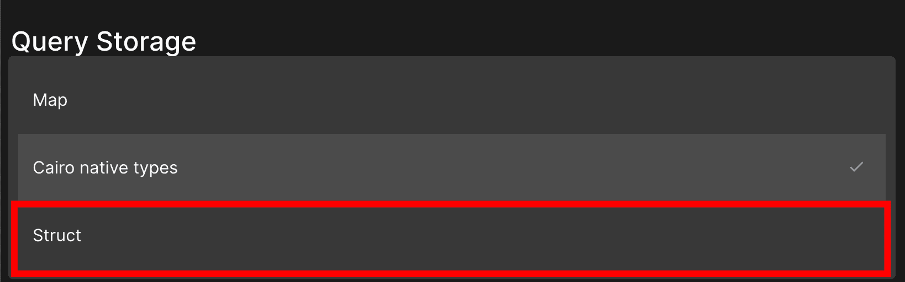

Then paste the following struct into the input field. Note that this struct combines the storage variables from both the `Counter` and `Greeter` class implementations:

```rust
#[storage]
struct Storage {
    count: u32,
    owner: ContractAddress,
    current_class_hash: ClassHash,
    greeting: ByteArray,
    owner: ContractAddress,
}
```

Click “Query Struct Data” to see how the same storage is interpreted through the contract's structure:

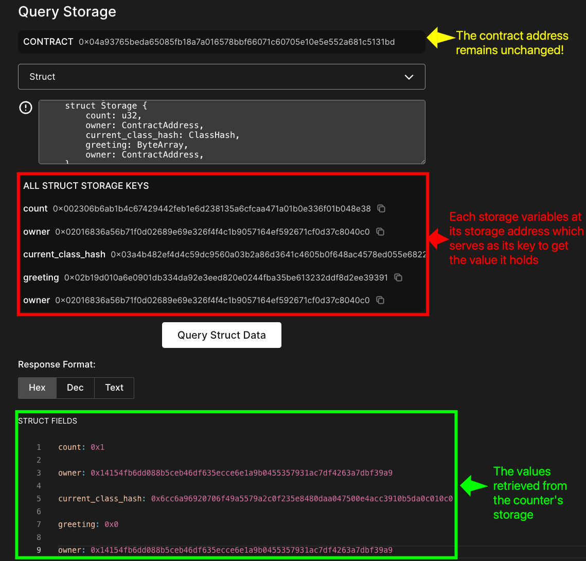

**Note that the new class hash applies to subsequent calls only after the current function `upgrade` call ends**.

Consider this example code that shows exactly when the upgrade takes effect within the upgrade function:

```rust
fn upgrade(ref self: ContractState, new_class_hash: ClassHash) {
    let count_before = self.count.read();           // count_before = 1

    replace_class_syscall(new_class_hash).unwrap(); // Syscall succeeds

    // But this STILL uses the OLD implementation!
    self.increment();                               // count goes from 1 to 2 (old logic)

    let count_after = self.count.read();            // count_after = 2
}
```

- **While the `upgrade` call is executing**: `count_before = 1`, then after `self.increment()` using old logic, `count_after = 2`
- **After the upgrade function completes**: subsequent calls to the contract execute code from the new class hash

This means `replace_class_syscall` registers the new class hash but the current call continues to execute code from the old class. If you need to execute code from the new class within the same transaction, combine `replace_class_syscall` with `call_contract_syscall`.

## Using `replace_class_syscall` with `call_contract_syscall` for Upgrades

When upgrading, `replace_class_syscall` is always called first to register the new class. If you then need to immediately invoke the new implementation within the same function, you need to follow it with `call_contract_syscall`.

Any `call_contract_syscall` invocations to the same contract after `replace_class_syscall` will execute using the new implementation, even though direct function calls within the upgrade function itself still runs under the old implementation.

Here's the same upgrade function rewritten to use `call_contract_syscall` instead of `self.increment()`:

```rust
fn upgrade(ref self: ContractState, new_class_hash: ClassHash) {
    let count_before = self.count.read(); // count_before = 1

    replace_class_syscall(new_class_hash).unwrap(); // Registers the new class

    let increment_selector = selector!("increment");
    call_contract_syscall(          // Immediately executes using the NEW implementation
        get_contract_address(),
        increment_selector,         // Dispatches the increment call
        array![].span()
    ).unwrap();

    let count_after = self.count.read(); // count_after = 1 (new increment does nothing)
}
```

Unlike `self.increment()` which continues to use the old implementation for the duration of the upgrade function, `call_contract_syscall` dispatches the increment call to the new class. Since `replace_class_syscall` has already updated the contract to point to that new class, `call_contract_syscall` executes the new implementation. This is why `count_after` remains 1 instead of incrementing to 2.

Let's verify both upgrade approaches on-chain with an updated `Counter` contract that implements them as separate functions.

### Version 1: Standard `replace_class_syscall`

We'll test whether the upgrade takes effect immediately by checking the count before and after calling `increment()` within the same function.

Start by updating the `ContractUpgraded` event in the `Counter` to include count tracking:

```rust
#[derive(Drop, starknet::Event)]
struct ContractUpgraded {
    old_class_hash: ClassHash,
    new_class_hash: ClassHash,
    count_before: u32, //ADD THIS
    count_after: u32,  //ADD THIS
}
```

Replace the `upgrade` function with `upgrade_standard`:

```rust
fn upgrade_standard(ref self: ContractState, new_class_hash: ClassHash) {
    let caller = get_caller_address();
    assert(caller == self.owner.read(), 'Only owner can upgrade');

    // Check count before upgrade
    let count_before = self.count.read();
    let old_class_hash = self.current_class_hash.read();

    replace_class_syscall(new_class_hash).unwrap_syscall();
    self.current_class_hash.write(new_class_hash);

    // Test: Does this use old or new implementation?
    self.increment();

    // Check count after increment
    let count_after = self.count.read();

    self.emit(ContractUpgraded {
        old_class_hash,
        new_class_hash,
        count_before,
        count_after
    });
}
```

Then, update the interface to reflect the `upgrade_standard` function:

```rust
#[starknet::interface]
pub trait ICounter<TContractState> {
    fn get_count(self: @TContractState) -> u32;
    fn increment(ref self: TContractState);
    fn upgrade_standard(ref self: TContractState, new_class_hash: ClassHash); //ADD THIS
}
```

Here's the full updated `Counter` contract with the `upgrade_standard` function:

```rust
use starknet::ClassHash;

#[starknet::interface]
pub trait ICounter<TContractState> {
    fn get_count(self: @TContractState) -> u32;
    fn increment(ref self: TContractState);
    fn upgrade_standard(ref self: TContractState, new_class_hash: ClassHash);
}

#[starknet::contract]
mod Counter {
    use starknet::storage::{StoragePointerReadAccess, StoragePointerWriteAccess};
    use starknet::syscalls::replace_class_syscall;
    use starknet::{ClassHash, ContractAddress, SyscallResultTrait, get_caller_address};

    #[storage]
    struct Storage {
        count: u32,
        owner: ContractAddress,
        current_class_hash: ClassHash,
    }

    #[event]
    #[derive(Drop, starknet::Event)]
    enum Event {
        ContractUpgraded: ContractUpgraded
    }

    #[derive(Drop, starknet::Event)]
    struct ContractUpgraded {
        old_class_hash: ClassHash,
        new_class_hash: ClassHash,
        count_before: u32,
        count_after: u32,
    }

    #[constructor]
    fn constructor(ref self: ContractState, owner: ContractAddress, initial_class_hash: ClassHash) {
        self.count.write(1); // Initialize counter to 1
        self.owner.write(owner); // Sets the contract owner
        self.current_class_hash.write(initial_class_hash); // to track the class hashes
    }

    #[abi(embed_v0)]
    impl CounterImpl of super::ICounter<ContractState> {
        // returns the current counter value
        fn get_count(self: @ContractState) -> u32 {
            self.count.read()
        }

        // increments the counter by 1
        fn increment(ref self: ContractState) {
            let current = self.count.read();
            self.count.write(current + 1);
        }

        fn upgrade_standard(ref self: ContractState, new_class_hash: ClassHash) {
            let caller = get_caller_address();
            assert(caller == self.owner.read(), 'Only owner can upgrade');

            // Check count before upgrade
            let count_before = self.count.read();
            let old_class_hash = self.current_class_hash.read();

            replace_class_syscall(new_class_hash).unwrap_syscall();
            self.current_class_hash.write(new_class_hash);

            // Test: Does this use old or new implementation?
            self.increment();

            // Check count after increment
            let count_after = self.count.read();

            self
                .emit(
                    ContractUpgraded { old_class_hash, new_class_hash, count_before, count_after },
                );
        }
    }
}
```

Redeclare and deploy the updated `Counter` contract, then call `upgrade_standard` with the `Greeter`'s class hash through Voyager's Write Contract tab.

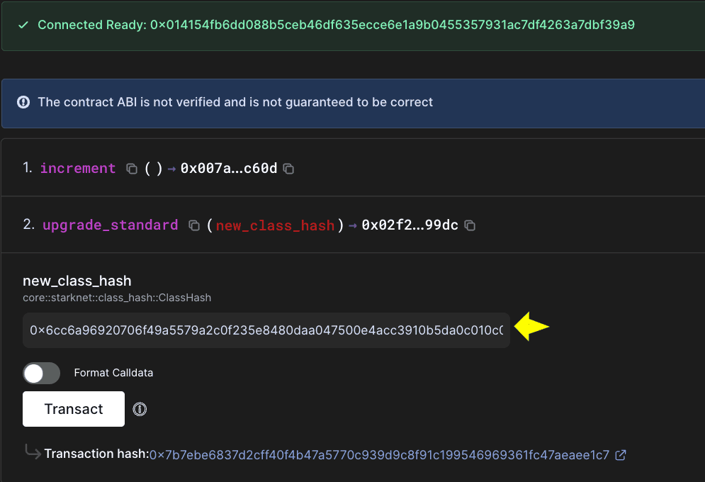

The [emitted](https://sepolia.voyager.online/event/7179868_3_0) `ContractUpgraded` event shows the count increased from 1 to 2, confirming that the old implementation's `increment()` function was used during the upgrade function execution:

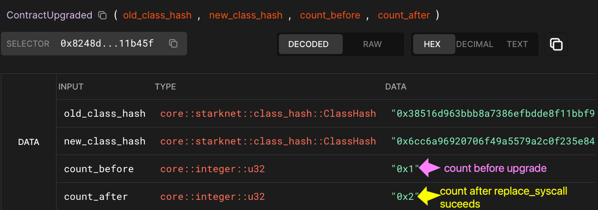

### Version 2: Using `call_contract_syscall` within the upgrade function

Now let's create an upgrade version that uses `call_contract_syscall` to confirm if we can immediately access the new implementation within the same transaction.

Replace the `upgrade_standard` function with the following `upgrade_with_call` implementation that uses `call_contract_syscall`:

```rust
fn upgrade_with_call(ref self: ContractState, new_class_hash: ClassHash) {
    let caller = get_caller_address();
    assert(caller == self.owner.read(), 'Only owner can upgrade');

    // Check count before upgrade
    let count_before = self.count.read();
    let old_class_hash = self.current_class_hash.read();

    replace_class_syscall(new_class_hash).unwrap_syscall();
    self.current_class_hash.write(new_class_hash);

    // Test: Call increment using call_contract_syscall to see if new implementation is used
    let increment_selector = selector!("increment");
    call_contract_syscall(get_contract_address(), increment_selector, array![].span())
        .unwrap_syscall();

    // Check count after increment
    let count_after = self.count.read();

    self
        .emit(
            ContractUpgraded { old_class_hash, new_class_hash, count_before, count_after },
        );
}
```

Import `call_contract_syscall` from the starknet syscalls module and `get_contract_address` from starknet. The complete contract with the updates becomes:

```rust
use starknet::ClassHash;

#[starknet::interface]
pub trait ICounter<TContractState> {
    fn get_count(self: @TContractState) -> u32;
    fn increment(ref self: TContractState);
    fn upgrade_with_call(ref self: TContractState, new_class_hash: ClassHash);
}

#[starknet::contract]
mod Counter {
    use starknet::storage::{StoragePointerReadAccess, StoragePointerWriteAccess};
    use starknet::syscalls::{call_contract_syscall, replace_class_syscall};
    use starknet::{
        ClassHash, ContractAddress, SyscallResultTrait, get_caller_address, get_contract_address,
    };

    #[storage]
    struct Storage {
        count: u32,
        owner: ContractAddress,
        current_class_hash: ClassHash,
    }

    #[event]
    #[derive(Drop, starknet::Event)]
    enum Event {
        ContractUpgraded: ContractUpgraded,
    }

    #[derive(Drop, starknet::Event)]
    struct ContractUpgraded {
        old_class_hash: ClassHash,
        new_class_hash: ClassHash,
        count_before: u32,
        count_after: u32,
    }

    #[constructor]
    fn constructor(ref self: ContractState, owner: ContractAddress, initial_class_hash: ClassHash) {
        self.count.write(1); // Initialize counter to 1
        self.owner.write(owner); // Sets the contract owner
        self.current_class_hash.write(initial_class_hash); // to track the class hashes
    }

    #[abi(embed_v0)]
    impl CounterImpl of super::ICounter<ContractState> {
        // returns the current counter value
        fn get_count(self: @ContractState) -> u32 {
            self.count.read()
        }

        // increments the counter by 1
        fn increment(ref self: ContractState) {
            let current = self.count.read();
            self.count.write(current + 1);
        }

        fn upgrade_with_call(ref self: ContractState, new_class_hash: ClassHash) {
            let caller = get_caller_address();
            assert(caller == self.owner.read(), 'Only owner can upgrade');

            // Check count before upgrade
            let count_before = self.count.read();
            let old_class_hash = self.current_class_hash.read();

            replace_class_syscall(new_class_hash).unwrap_syscall();
            self.current_class_hash.write(new_class_hash);

            // Test: Call increment using call_contract_syscall to see if new implementation is used
            let increment_selector = selector!("increment");
            call_contract_syscall(get_contract_address(), increment_selector, array![].span())
                .unwrap_syscall();

            // Check count after increment
            let count_after = self.count.read();

            self
                .emit(
                    ContractUpgraded { old_class_hash, new_class_hash, count_before, count_after },
                );
        }
    }
}

```

Redeclare and deploy the newly updated `Counter` contract, then attempt to upgrade to the `Greeter` using the original `Greeter` class hash. The transaction should fail:

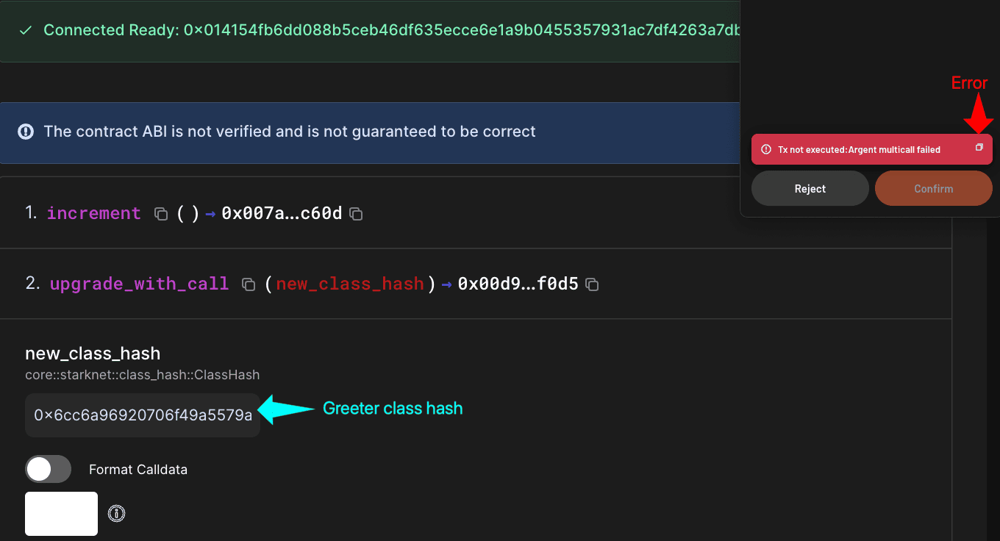

With the error:

```
Transaction execution has failed: 0: Error in the called contract (contract addre
ss: 0x014154fb6dd088b5ceb46df635ecce6e1a9b0455357931ac7df4263a7dbf39a9, class has
h: 0x036078334509b514626504edc9fb252328d1a240e4e948bef8d0c08dff45927f, selector:
0x015d40a3d6ca2ac30f4031e42be28da9b056fef9bb7357ac5e85627ee876e5ad): Execution fa
iled. Failure reason:(0x617267656e742f6d756c746963616c6c2d6661696c6564 ('argent/m
ulticall-failed'), 0x0 (''), 0x454e545259504f494e545f4e4f545f464f554e44 ('ENTRYPO
INT_NOT_FOUND'), 0x454e545259504f494e545f4641494c4544 ('ENTRYPOINT_FAILED'), 0x45
4e545259504f494e545f4641494c4544 ('ENTRYPOINT_FAILED')).
```

This happens because the `Greeter` contract doesn't have an `increment` function, so `call_contract_syscall` cannot find the entry point after the upgrade. This means the target contract must implement any function that `call_contract_syscall` invokes after the upgrade.

To solve this, we add an empty `increment` function to the `Greeter` contract:

```rust
#[starknet::interface]
pub trait IGreeter<TContractState> {
    fn set_greeting(ref self: TContractState, message: ByteArray);
    fn get_greeting(self: @TContractState) -> ByteArray;
    fn get_greeting_count(self: @TContractState) -> u32;
    fn upgrade(ref self: TContractState, new_class_hash: ClassHash);
    fn get_owner(self: @TContractState) -> ContractAddress;

    //NEWLY ADDED
    fn increment(ref self: TContractState); // Added for testing
}
```

And implement it as an empty function:

```rust
fn increment(ref self: ContractState) {
    // This function does nothing - just for demonstration
    // In a real scenario, this might have different logic than the Counter's increment
}
```

So we have the updated `Greeter` contract:

```rust
use starknet::{ClassHash, ContractAddress};

#[starknet::interface]
pub trait IGreeter<TContractState> {
    fn set_greeting(ref self: TContractState, message: ByteArray);
    fn get_greeting(self: @TContractState) -> ByteArray;
    fn get_greeting_count(self: @TContractState) -> u32;
    fn upgrade(ref self: TContractState, new_class_hash: ClassHash);
    fn get_owner(self: @TContractState) -> ContractAddress;

    // Empty increment function for testing call_contract_syscall
    fn increment(self: @TContractState); // NEWLY ADDED
}

#[starknet::contract]
mod Greeter {
    use starknet::storage::{StoragePointerReadAccess, StoragePointerWriteAccess};
    use starknet::syscalls::replace_class_syscall;
    use starknet::{ClassHash, ContractAddress, SyscallResultTrait, get_caller_address};

    #[storage]
    struct Storage {
        greeting: ByteArray,
        greeting_count: u32,
        owner: ContractAddress,
    }

    #[event]
    #[derive(Drop, starknet::Event)]
    enum Event {
        ContractUpgraded: ContractUpgraded,
    }

    #[derive(Drop, starknet::Event)]
    struct ContractUpgraded {
        new_class_hash: ClassHash,
    }

    #[constructor]
    fn constructor(ref self: ContractState, owner: ContractAddress) {
        self.owner.write(owner);
    }

    #[abi(embed_v0)]
    impl GreeterImpl of super::IGreeter<ContractState> {
        fn set_greeting(ref self: ContractState, message: ByteArray) {
            self.greeting.write(message);

            let current_count = self.greeting_count.read();
            let new_count = current_count + 1;
            self.greeting_count.write(new_count);
        }

        fn get_greeting(self: @ContractState) -> ByteArray {
            self.greeting.read()
        }

        fn get_greeting_count(self: @ContractState) -> u32 {
            self.greeting_count.read()
        }

        fn upgrade(ref self: ContractState, new_class_hash: ClassHash) {
            let caller = get_caller_address();
            assert(caller == self.owner.read(), 'Only owner can upgrade');

            replace_class_syscall(new_class_hash).unwrap_syscall();

            self.emit(ContractUpgraded { new_class_hash });
        }

        fn get_owner(self: @ContractState) -> ContractAddress {
            self.owner.read()
        }

        // NEWLY ADDED
        fn increment(self: @ContractState) { // This function does nothing - just for demonstration
        // In a real scenario, this might have different logic than the Counter's increment
        }
    }
}

```

Redeclare the updated `Greeter` contract to get its new class hash, then call `upgrade_with_call` with that class hash through Voyager's Write Contract tab:

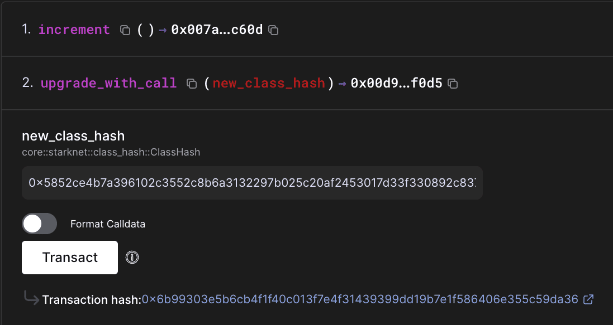

The [ContractUpgraded event](https://sepolia.voyager.online/event/7181794_1_0) shows:

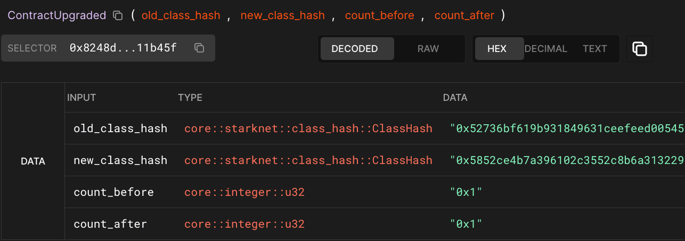

The count remained unchanged (1 before and after) because the `Greeter`'s empty `increment` function doesn't modify the storage. This proves that:

1. **`call_contract_syscall` executed the new implementation:** If it had used the old `Counter` logic, the count would have increased to 2
2. **The upgrade was immediately effective for the syscall:** The empty `Greeter` function ran, not the `Counter`'s increment logic

To summarize, any direct function calls within the upgrade function always run under the old implementation, regardless of where they appear relative to `replace_class_syscall`. `call_contract_syscall` is the only way to execute the new implementation within the same transaction.

### Storage Compatibility Consideration

Since both contracts have variables with the same names (like `owner`), they read from and write to the same storage addresses computed from those variable names. Any writes from the new implementation will affect the same storage addresses, potentially causing data loss or corruption if not carefully managed.

### OpenZeppelin Upgrade Components

OpenZeppelin contracts for Cairo provides standardized upgrade components that handle common upgrade patterns. Their implementation includes both direct upgrade functionality and an upgrade-and-call pattern that combines `replace_class_syscall` with `call_contract_syscall`. The upgrade-and-call allows you to upgrade and immediately execute functions from the new implementation within the same transaction, similar to what we demonstrated earlier with manual `call_contract_syscall` usage.

## Conclusion

Starknet's approach to contract upgrades is fundamentally different from Ethereum's proxy patterns. With `replace_class_syscall`, we get direct code replacement while keeping the same address and preserving all storage data.

Remember that upgrades preserve all storage data; the same contract now uses the new implementation's code to access storage, so variables with matching names between the old and new implementations access the same storage addresses. The timing matters too: upgrades take effect after the current function completes, though `call_contract_syscall` can immediately access the upgraded implementation.